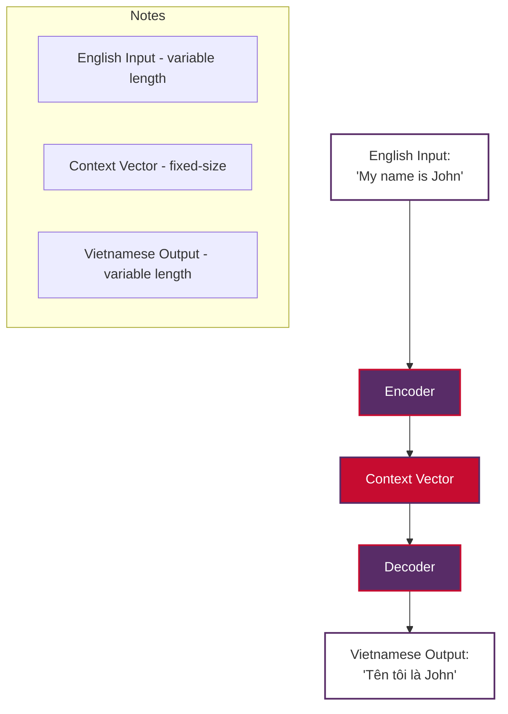

# NLP Learning Journey - GitHub Copilot Instructions

**Always reference these instructions first and fallback to search or bash commands only when you encounter unexpected information that does not match the info here.**

This repository is a comprehensive Natural Language Processing (NLP) learning resource containing documentation, example notebooks, and code implementations. It's designed as an educational repository for learning NLP concepts from fundamentals to advanced topics.

**Language Focus**: This repository prioritizes Vietnamese/English examples for machine translation and cross-lingual NLP tasks, providing practical examples for Southeast Asian language processing.

## Working Effectively

### Bootstrap the Environment
Execute these commands in order to set up a fully functional development environment:

1. **Verify Python version** (should be Python 3.8+):
   ```bash
   python --version
   ```

2. **Install all dependencies** - NEVER CANCEL: Takes 5-8 minutes. Set timeout to 600+ seconds:
   ```bash
   pip install -r requirements.txt
   ```

3. **Download spaCy English model** - NEVER CANCEL: Takes 1-2 minutes. Set timeout to 300+ seconds:
   ```bash
   python -m spacy download en_core_web_sm
   ```

4. **Download NLTK datasets** - NEVER CANCEL: Takes 1-2 minutes. Set timeout to 300+ seconds:
   ```bash
   python -c "import nltk; nltk.download('punkt'); nltk.download('punkt_tab'); nltk.download('stopwords'); nltk.download('wordnet'); nltk.download('omw-1.4')"
   ```

5. **Verify installation** (should complete in under 10 seconds):
   ```bash
   python -c "
   import nltk, spacy, pandas as pd, numpy as np, sklearn
   nlp = spacy.load('en_core_web_sm')
   from nltk.tokenize import word_tokenize
   print('All libraries installed and working correctly!')
   "
   ```

### Core Libraries and Dependencies
The repository uses these essential libraries:
- **NLTK**: Natural language processing toolkit
- **spaCy**: Industrial-strength NLP library  
- **Transformers**: Hugging Face transformer models (requires internet for model downloads)
- **PyTorch & TensorFlow**: Deep learning frameworks
- **scikit-learn**: Machine learning algorithms
- **Pandas & NumPy**: Data manipulation and analysis
- **Matplotlib, Seaborn, Plotly**: Data visualization
- **Jupyter**: Interactive notebook environment

### Running Jupyter Notebooks
- **Start Jupyter Lab**:
  ```bash
  jupyter lab
  ```
- **Start Jupyter Notebook**:
  ```bash
  jupyter notebook
  ```
- **Convert notebook to script**:
  ```bash
  jupyter nbconvert --to script examples/notebook_name.ipynb
  ```

**IMPORTANT**: Some notebooks (like tokenization.ipynb) require internet access to download pre-trained models from Hugging Face. In offline environments, these cells will fail with network errors - this is expected behavior.

### Runtime Environment Detection
All Jupyter notebooks in this repository include automatic runtime environment detection to ensure compatibility across Google Colab, Kaggle, and local environments. Use this pattern in new notebooks:

```python
# Environment Detection and Setup
import sys
import subprocess

# Detect the runtime environment
IS_COLAB = "google.colab" in sys.modules
IS_KAGGLE = "kaggle_secrets" in sys.modules
IS_LOCAL = not (IS_COLAB or IS_KAGGLE)

print(f"Environment detected:")
print(f"  - Local: {IS_LOCAL}")
print(f"  - Google Colab: {IS_COLAB}")
print(f"  - Kaggle: {IS_KAGGLE}")

# Platform-specific system setup
if IS_COLAB:
    print("\nSetting up Google Colab environment...")
    !apt update -qq
    !apt install -y -qq libpq-dev
elif IS_KAGGLE:
    print("\nSetting up Kaggle environment...")
    # Kaggle usually has most packages pre-installed
else:
    print("\nSetting up local environment...")

# Install required packages for this notebook
required_packages = [
    "nltk",
    "spacy",
    "pandas",
    "matplotlib",
    "seaborn"
]

print("\nInstalling required packages...")
for package in required_packages:
    if IS_COLAB or IS_KAGGLE:
        !pip install -q {package}
    else:
        subprocess.run([sys.executable, "-m", "pip", "install", "-q", package], 
                      capture_output=True)
    print(f"✓ {package}")
```

**Key Benefits:**
- **Automatic Detection**: No manual configuration needed
- **Platform Optimization**: Different installation methods for each platform
- **Error Prevention**: Prevents common environment-specific issues
- **Consistent Experience**: Same notebook works across all platforms

## Validation Scenarios

### Always Test These Scenarios After Making Changes:

1. **Basic Library Import Test** (should complete in 2-3 seconds):
   ```bash
   python -c "
   import nltk, spacy, transformers, torch, tensorflow as tf, sklearn
   import pandas as pd, numpy as np, matplotlib.pyplot as plt
   print('Core imports successful!')
   "
   ```

2. **spaCy Functionality Test** (should complete in 2-3 seconds):
   ```bash
   python -c "
   import spacy
   nlp = spacy.load('en_core_web_sm')
   doc = nlp('Hello world! This is a test.')
   print([token.text for token in doc])
   "
   ```

3. **NLTK Functionality Test** (should complete in 2-3 seconds):
   ```bash
   python -c "
   from nltk.tokenize import word_tokenize
   tokens = word_tokenize('Hello world!')
   print(tokens)
   "
   ```

4. **Vietnamese/English Text Processing Test** (should complete in 2-3 seconds):
   ```bash
   python -c "
   # Test Vietnamese/English text processing
   import nltk
   from nltk.tokenize import word_tokenize
   
   # English text
   english_text = 'My name is John.'
   english_tokens = word_tokenize(english_text)
   print('English tokens:', english_tokens)
   
   # Vietnamese text 
   vietnamese_text = 'Tên tôi là John.'
   vietnamese_tokens = word_tokenize(vietnamese_text)
   print('Vietnamese tokens:', vietnamese_tokens)
   
   print('Vietnamese/English processing working!')
   "
   ```

5. **Data Science Libraries Test** (should complete in 2-3 seconds):
   ```bash
   python -c "
   import pandas as pd, numpy as np
   from sklearn.feature_extraction.text import TfidfVectorizer
   df = pd.DataFrame({'text': ['hello', 'world']})
   vectorizer = TfidfVectorizer()
   tfidf = vectorizer.fit_transform(df['text'])
   print('Data science libraries working!')
   "
   ```

6. **Vietnamese/English Translation Test** (should complete in 2-3 seconds):
   ```bash
   python -c "
   # Test Vietnamese/English translation examples
   translation_pairs = [
       ('My name is', 'Tên tôi là'),
       ('Hello', 'Xin chào'),
       ('Thank you', 'Cảm ơn'),
       ('How are you?', 'Bạn khỏe không?'),
       ('I love programming', 'Tôi yêu lập trình')
   ]
   
   print('Vietnamese/English Translation Examples:')
   for english, vietnamese in translation_pairs:
       print(f'  English: {english:20} → Vietnamese: {vietnamese}')
   
   print('Translation examples working!')
   "
   ```

7. **Runtime Environment Detection Test** (should complete in under 1 second):
   ```bash
   python -c "
   import sys
   
   # Test the runtime environment detection pattern
   IS_COLAB = 'google.colab' in sys.modules
   IS_KAGGLE = 'kaggle_secrets' in sys.modules  
   IS_LOCAL = not (IS_COLAB or IS_KAGGLE)
   
   print('Runtime environment detection:')
   print(f'  - Local: {IS_LOCAL}')
   print(f'  - Google Colab: {IS_COLAB}')
   print(f'  - Kaggle: {IS_KAGGLE}')
   
   # Verify exactly one environment is detected
   detected_count = sum([IS_LOCAL, IS_COLAB, IS_KAGGLE])
   assert detected_count == 1, f'Expected exactly 1 environment, got {detected_count}'
   print('✓ Environment detection working correctly!')
   "
   ```

**Manual Validation Requirement**: After any significant changes, run all seven validation tests to ensure the environment remains functional.

## Repository Structure and Navigation

### Key Directories:
- **`docs/`**: Documentation and learning notes (currently contains `python-libraries.md`)
- **`examples/`**: 9 Jupyter notebooks with practical NLP examples:
  - `ner.ipynb` - Named Entity Recognition
  - `normalization.ipynb` - Text normalization
  - `pos-tagging.ipynb` - Part-of-speech tagging  
  - `sentiment-analysis.ipynb` - Sentiment analysis
  - `text-classification.ipynb` - Text classification
  - `text-generation.ipynb` - Text generation
  - `text-summarization.ipynb` - Text summarization
  - `text-translation.ipynb` - Text translation
  - `tokenization.ipynb` - Tokenization techniques

### Important Files:
- **`requirements.txt`**: All Python dependencies (30 packages)
- **`README.md`**: Comprehensive repository documentation
- **`LICENSE.md`**: MIT license

## Common Tasks and Workflows

### For Documentation Changes:
- Edit markdown files in `docs/` directory
- No build or test steps required for documentation-only changes

### For Notebook Development:
1. **Create new notebook**:
   ```bash
   jupyter lab
   # Create new notebook in examples/ directory
   ```

2. **Test notebook execution** (may take 30+ seconds for complex notebooks):
   ```bash
   jupyter nbconvert --execute examples/your_notebook.ipynb --to notebook --inplace
   ```

3. **Convert to different formats**:
   ```bash
   jupyter nbconvert examples/your_notebook.ipynb --to html
   jupyter nbconvert examples/your_notebook.ipynb --to pdf  # requires LaTeX
   ```

**Notebook Development Standards:**
- **Always include runtime environment detection** as the first code cell
- **Use platform-specific package installation** methods shown in the Runtime Environment Detection section
- **Test on multiple environments** when possible (local, Colab, Kaggle)
- **Handle network dependencies gracefully** - wrap model downloads in try-catch blocks
- **Include clear error messages** for missing dependencies or network issues

### For Code Development:
1. Always run the validation scenarios after changes
2. Use virtual environments for isolation:
   ```bash
   python -m venv nlp_env
   source nlp_env/bin/activate  # Linux/Mac
   # nlp_env\Scripts\activate  # Windows
   pip install -r requirements.txt
   ```

## Troubleshooting Common Issues

### Network-Related Errors:
- **Hugging Face model downloads fail**: Expected in offline environments. Use local models or skip those cells.
- **NLTK download errors**: Re-run the NLTK download command from bootstrap steps.

### Environment Issues:
- **Import errors**: Re-run the complete bootstrap sequence
- **spaCy model not found**: Run `python -m spacy download en_core_web_sm`
- **NLTK data missing**: Run the NLTK download command from bootstrap steps
- **Runtime environment detection fails**: Verify the detection pattern is implemented correctly
- **Package installation errors**: Check if using correct installation method for detected environment
- **Mixed environment detection**: Ensure only one of IS_LOCAL, IS_COLAB, IS_KAGGLE is True

### Vietnamese Text Processing Issues:
- **Vietnamese character encoding**: Ensure UTF-8 encoding when working with Vietnamese text
- **Vietnamese tokenization**: Use proper Vietnamese tokenizers or multilingual models
- **Vietnamese diacritics**: Verify Vietnamese text displays correctly: "Tên tôi là" should show all accents
- **Cross-lingual models**: Some models may require specific language codes ('vi' for Vietnamese, 'en' for English)

### Performance Expectations:
- **Environment setup**: 5-8 minutes total
- **Individual notebook execution**: 30 seconds to 2 minutes (without network downloads)
- **Library imports**: 2-3 seconds
- **Simple NLP operations**: Under 1 second

## Development Best Practices

### Before Making Changes:
1. Always run the complete bootstrap sequence in a fresh environment
2. Execute all validation scenarios
3. Test at least one example notebook end-to-end

### After Making Changes:
1. Run all validation scenarios to ensure nothing broke
2. If adding new dependencies, update `requirements.txt`
3. If creating new notebooks, ensure they follow the existing structure and include proper documentation

### Code Quality:
- No formal linting or testing infrastructure exists
- Follow Python PEP 8 style guidelines
- Include comprehensive docstrings and comments in notebooks
- Ensure all cells in notebooks can execute successfully (except for network-dependent cells in offline environments)
- **Always include runtime environment detection** in new notebooks
- **Use platform-specific installation methods** to ensure compatibility across Colab, Kaggle, and local environments
- **Test notebooks on multiple platforms** when possible to ensure cross-platform compatibility

## Limitations and Known Issues

1. **Internet Dependency**: Some transformers functionality requires internet access for model downloads
2. **No CI/CD**: Repository has no automated testing or continuous integration
3. **No Formal Testing**: No unit tests or automated validation beyond manual scenarios
4. **Resource Intensive**: Some deep learning operations may require significant memory/CPU

## Quick Reference Commands

```bash
# Complete setup (run in order, NEVER CANCEL any step)
pip install -r requirements.txt                    # 5-8 minutes
python -m spacy download en_core_web_sm            # 1-2 minutes  
python -c "import nltk; nltk.download('punkt'); nltk.download('punkt_tab'); nltk.download('stopwords'); nltk.download('wordnet'); nltk.download('omw-1.4')"  # 1-2 minutes

# Quick validation (run all to verify environment)
python -c "import nltk, spacy, transformers, torch, tensorflow, sklearn, pandas, numpy, matplotlib; print('All imports OK')"
python -c "import spacy; nlp = spacy.load('en_core_web_sm'); print('spaCy OK')"
python -c "from nltk.tokenize import word_tokenize; print('NLTK OK')"
python -c "from sklearn.feature_extraction.text import TfidfVectorizer; print('sklearn OK')"
python -c "import sys; IS_COLAB = 'google.colab' in sys.modules; IS_KAGGLE = 'kaggle_secrets' in sys.modules; IS_LOCAL = not (IS_COLAB or IS_KAGGLE); assert sum([IS_LOCAL, IS_COLAB, IS_KAGGLE]) == 1; print('Environment detection OK')"

# Test Vietnamese/English processing
python -c "
# Vietnamese/English translation examples
pairs = [('My name is', 'Tên tôi là'), ('Hello', 'Xin chào'), ('Thank you', 'Cảm ơn')]
for en, vi in pairs: print(f'{en} → {vi}')
print('Vietnamese/English examples OK')
"

# Start development environment
jupyter lab                                        # Interactive development
```

## Documentation Standards

### Mermaid Diagrams

**ALWAYS use Mermaid diagrams instead of plaintext diagrams for visual representations.**

**Prohibited - DO NOT use plaintext diagrams:**
```
Input Sequence → [Encoder] → Context Vector → [Decoder] → Output Sequence
    (variable)                  (fixed-size)                (variable)
```

**Required - Use Mermaid with proper styling:**


**Mermaid Styling Guidelines:**
- Use the specified color palette: Purple (#582C67), White (#FFFFFF), Red (#C60C30)
- Apply gradients between these colors for visual variety
- Use stroke styling for emphasis (stroke-width, stroke colors)
- Include contextual notes using subgraphs when helpful
- Use descriptive node labels that clearly explain the concept
- Maintain readability with appropriate text color contrast

### LaTeX Mathematical Notation

**For inline LaTeX expressions, use single dollar signs:**
```markdown
Correct: `$h_t$: Hidden state at time step t`
Correct: The probability `$P(y_t | x_1, ..., x_t)$` represents...
Wrong: `$$h_t$$: Hidden state at time step t`
```

**For complex or standalone formulas, use double dollar signs in separate paragraphs:**
```markdown
The forward pass equations are defined as:

$$ f_t = \sigma(W_f \cdot [h_{t-1}, x_t] + b_f) $$

$$ \alpha_t(i) = P(x_1, x_2, ..., x_t, q_t = s_i | \lambda) $$

$$ f(r) = \frac{k}{r^\alpha} $$
```

**LaTeX Best Practices:**
- Use inline math (`$...$`) for variables, short expressions, and mathematical terms within sentences
- Use block math (`$$...$$`) for complex formulas, equations, and mathematical expressions that deserve emphasis
- Always put block formulas in separate paragraphs for better readability
- Include text explanations before or after complex formulas to provide context
- Use consistent notation throughout the repository

**Example of proper mathematical documentation:**
```markdown
The LSTM cell uses three gates to control information flow. The forget gate `$f_t$` determines what information to discard:

$$ f_t = \sigma(W_f \cdot [h_{t-1}, x_t] + b_f) $$

Where `$\sigma$` is the sigmoid function, `$W_f$` is the weight matrix, and `$b_f$` is the bias vector.

For machine translation tasks like English-Vietnamese translation, the probability of generating Vietnamese word `$v_t$` given English context can be expressed as:

$$ P(v_t | \text{English context}) = \text{softmax}(W_v \cdot h_t + b_v) $$

Example: P("tôi" | "I") represents the probability of generating Vietnamese "tôi" given English "I".
```

### Visual Documentation Requirements

1. **No Plaintext Diagrams**: Always use Mermaid for flowcharts, architecture diagrams, and process flows
2. **Color Coding**: Use consistent colors to represent similar concepts across diagrams
3. **Mathematical Precision**: Use LaTeX for all mathematical expressions and formulas
4. **Contextual Notes**: Include explanatory text around diagrams and formulas
5. **Accessibility**: Ensure diagrams and formulas have accompanying text descriptions

### Vietnamese/English Examples in Documentation

**When documenting machine translation or cross-lingual NLP tasks, prioritize Vietnamese/English examples:**

**Preferred Examples:**
- **Basic Translation**: English: "My name is" → Vietnamese: "Tên tôi là"
- **Common Phrases**: English: "Hello" → Vietnamese: "Xin chào"
- **Greetings**: English: "How are you?" → Vietnamese: "Bạn khỏe không?"
- **Polite Expressions**: English: "Thank you" → Vietnamese: "Cảm ơn"
- **Technical Terms**: English: "Machine learning" → Vietnamese: "Học máy"

**Use Vietnamese/English examples for:**
- Translation model demonstrations
- Cross-lingual embedding examples
- Tokenization comparisons
- Named entity recognition across languages
- Sentiment analysis in multiple languages

**Example Documentation Pattern:**
```markdown
## Translation Example: English ↔ Vietnamese

Consider the translation pair:
- **English**: "I love programming"
- **Vietnamese**: "Tôi yêu lập trình"

The encoder processes the English tokens `["I", "love", "programming"]` while the decoder generates Vietnamese tokens `["Tôi", "yêu", "lập", "trình"]`.
```

These standards apply to all Markdown files in the repository, including documentation in `docs/`, README files, and example notebooks.

## Vietnamese/English Examples for NLP Tasks

**ALWAYS prioritize Vietnamese/English examples when creating documentation, tutorials, or example code, especially for machine translation tasks.**

### Common Vietnamese/English Translation Pairs

Use these translation pairs as standard examples throughout the repository:

```python
# Basic Greetings and Introductions
VIETNAMESE_ENGLISH_PAIRS = [
    # Basic phrases as requested in the issue
    ("My name is", "Tên tôi là"),
    ("Hello", "Xin chào"),
    ("Thank you", "Cảm ơn"),
    ("How are you?", "Bạn khỏe không?"),
    ("Goodbye", "Tạm biệt"),
    
    # Common expressions
    ("I love programming", "Tôi yêu lập trình"),
    ("Machine learning", "Học máy"),
    ("Natural language processing", "Xử lý ngôn ngữ tự nhiên"),
    ("Artificial intelligence", "Trí tuệ nhân tạo"),
    ("Good morning", "Chào buổi sáng"),
    
    # Everyday conversations
    ("What is your name?", "Tên bạn là gì?"),
    ("I am a student", "Tôi là sinh viên"),
    ("Where are you from?", "Bạn đến từ đâu?"),
    ("I am from Vietnam", "Tôi đến từ Việt Nam"),
    ("Nice to meet you", "Rất vui được gặp bạn"),
    
    # Technical terms
    ("Deep learning", "Học sâu"),
    ("Neural network", "Mạng nơ-ron"),
    ("Computer science", "Khoa học máy tính"),
    ("Software development", "Phát triển phần mềm"),
    ("Data analysis", "Phân tích dữ liệu")
]
```

### Usage Guidelines

**For translation examples:**
- English: "My name is" → Vietnamese: "Tên tôi là" (as specified in the issue)
- Always show both directions: English→Vietnamese and Vietnamese→English
- Include proper Vietnamese diacritical marks (ă, â, ê, ô, ơ, ư, á, à, ả, ã, ạ, etc.)

**For tokenization examples:**
```python
# English tokenization
english_text = "My name is John."
english_tokens = ["My", "name", "is", "John", "."]

# Vietnamese tokenization  
vietnamese_text = "Tên tôi là John."
vietnamese_tokens = ["Tên", "tôi", "là", "John", "."]
```

**For NER examples:**
```python
# English NER
english_text = "My name is John and I live in Vietnam."
english_entities = [("John", "PERSON"), ("Vietnam", "GPE")]

# Vietnamese NER
vietnamese_text = "Tên tôi là John và tôi sống ở Việt Nam."
vietnamese_entities = [("John", "PERSON"), ("Việt Nam", "GPE")]
```

**For sentiment analysis examples:**
```python
# Positive sentiment
english_positive = "I love this product!"
vietnamese_positive = "Tôi yêu sản phẩm này!"

# Negative sentiment  
english_negative = "This is terrible."
vietnamese_negative = "Điều này thật tệ."
```

### Code Templates

**Standard translation function template:**
```python
def translate_english_to_vietnamese(english_text: str) -> str:
    """
    Translate English text to Vietnamese.
    
    Example:
        >>> translate_english_to_vietnamese("My name is")
        "Tên tôi là"
    """
    # Implementation here
    pass

def translate_vietnamese_to_english(vietnamese_text: str) -> str:
    """
    Translate Vietnamese text to English.
    
    Example:
        >>> translate_vietnamese_to_english("Tên tôi là")
        "My name is"
    """
    # Implementation here
    pass
```

**Standard bilingual dataset template:**
```python
def create_vietnamese_english_dataset():
    """Create a bilingual dataset for Vietnamese-English translation."""
    return [
        {"english": "My name is", "vietnamese": "Tên tôi là"},
        {"english": "Hello", "vietnamese": "Xin chào"},
        {"english": "Thank you", "vietnamese": "Cảm ơn"},
        # Add more pairs as needed
    ]
```

Remember: This is an educational repository focused on learning NLP concepts. Always prioritize working examples and clear documentation over complex tooling or optimization.