# BERT: Bidirectional Encoder Representations from Transformers

BERT represents a revolutionary breakthrough in Natural Language Processing, fundamentally changing how we approach language understanding tasks. Introduced by Google AI Language in 2018, BERT's bidirectional training methodology and transfer learning capabilities have set new standards for NLP applications and inspired countless subsequent models.

> **Note on Examples**: Some code examples require internet connection to download pre-trained BERT models from Hugging Face. These are clearly marked. For offline usage, you can download models locally first or use the provided implementation examples that work without internet connection.

## Table of Contents

1. [Basic Definition and Core Concepts](#basic-definition-and-core-concepts)
2. [Architecture Overview](#architecture-overview)
3. [How BERT is Relevant to NLP](#how-bert-is-relevant-to-nlp)
4. [Training Methodology](#training-methodology)
5. [Bidirectional Context Understanding](#bidirectional-context-understanding)
6. [Practical Implementation Examples](#practical-implementation-examples)
7. [BERT vs Other Models](#bert-vs-other-models)
8. [BERT Variants and Improvements](#bert-variants-and-improvements)
9. [Real-World Applications](#real-world-applications)
10. [Performance and Limitations](#performance-and-limitations)
11. [Best Practices](#best-practices)
12. [Future Directions](#future-directions)

## Basic Definition and Core Concepts

**BERT (Bidirectional Encoder Representations from Transformers)** is a transformer-based machine learning technique for natural language processing developed by Google. BERT's key innovation lies in its ability to process text bidirectionally, meaning it considers both left and right context simultaneously when understanding the meaning of words.

### Core Innovation

BERT's revolutionary approach stems from three fundamental innovations:

**Bidirectional Training**
- Unlike traditional left-to-right language models, BERT reads text in both directions
- Captures richer contextual representations by considering full sentence context
- Enables deeper understanding of word relationships and dependencies

**Transfer Learning for NLP**
- Pre-trained on massive text corpora (Wikipedia + BookCorpus)
- Fine-tuned for specific downstream tasks with minimal additional training
- Democratized access to state-of-the-art NLP capabilities

**Task-Agnostic Architecture**
- Single model architecture adaptable to various NLP tasks
- Unified approach to classification, sequence labeling, and question answering
- Eliminates need for task-specific architectural modifications

### Mathematical Foundation

BERT's core mathematical operations are based on the transformer's self-attention mechanism:

**Self-Attention Computation:**
$$ \text{Attention}(Q, K, V) = \text{softmax}\left(\frac{QK^T}{\sqrt{d_k}}\right)V $$

**Multi-Head Attention:**
$$ \text{MultiHead}(Q, K, V) = \text{Concat}(\text{head}_1, ..., \text{head}_h)W^O $$

Where each head is computed as:
$$ \text{head}_i = \text{Attention}(QW_i^Q, KW_i^K, VW_i^V) $$

## Architecture Overview

BERT's architecture is built on the encoder portion of the transformer model, creating a stack of bidirectional transformer encoders.

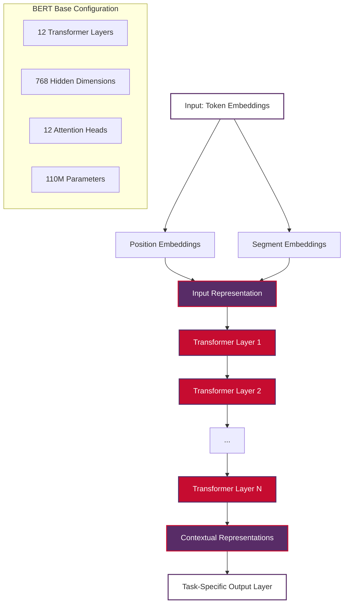

### Architecture Components

**Input Representation**
- **Token Embeddings**: WordPiece tokenization with 30,000 vocabulary
- **Position Embeddings**: Learned positional encodings (up to 512 tokens)
- **Segment Embeddings**: Distinguish between sentence A and B in pair tasks

**Transformer Encoder Stack**
- Multiple identical transformer encoder layers
- Each layer contains multi-head self-attention and feed-forward networks
- Residual connections and layer normalization throughout

**Configuration Variants**
- **BERT-Base**: 12 layers, 768 hidden size, 12 attention heads, 110M parameters
- **BERT-Large**: 24 layers, 1024 hidden size, 16 attention heads, 340M parameters

## How BERT is Relevant to NLP

BERT's relevance to NLP extends far beyond its technical innovations, fundamentally transforming how we approach language understanding tasks.

### Revolutionary Impact on NLP

**Paradigm Shift in Language Understanding**
- **Before BERT**: Task-specific architectures with limited transfer learning
- **With BERT**: Universal language representations adaptable to any NLP task
- **Result**: Democratized access to state-of-the-art language understanding

**Performance Breakthroughs**
- Achieved new state-of-the-art results on 11 NLP tasks upon release
- GLUE benchmark score improvement from 68.9 to 80.4
- Enabled human-level performance on reading comprehension tasks

### Key Relevance Areas

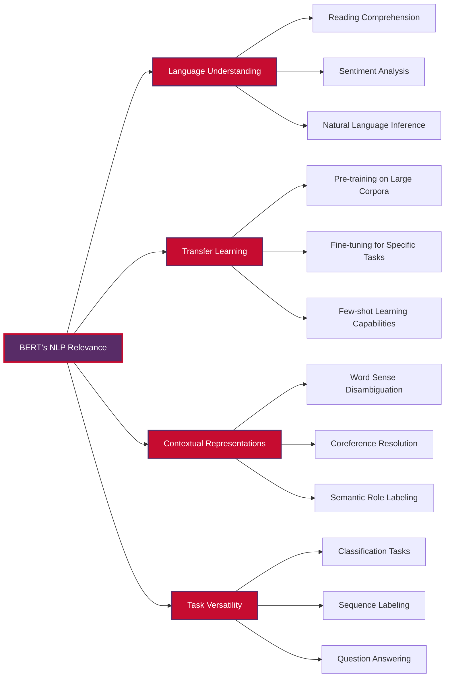

**1. Universal Language Understanding**
- Single model architecture handles diverse NLP tasks
- Eliminates need for task-specific feature engineering
- Provides consistent performance across different domains

**2. Contextual Word Representations**
- Words have different meanings based on context
- BERT captures these nuances through bidirectional processing
- Enables better disambiguation and understanding

**3. Transfer Learning Revolution**
- Massive pre-training followed by task-specific fine-tuning
- Reduces training time and data requirements
- Makes advanced NLP accessible to smaller organizations

## Training Methodology

BERT's training methodology consists of two distinct phases that work together to create powerful language representations.

### Phase 1: Pre-training

BERT is pre-trained on two self-supervised tasks that teach it to understand language without requiring labeled data:

#### Masked Language Modeling (MLM)

The core innovation of BERT's training methodology:

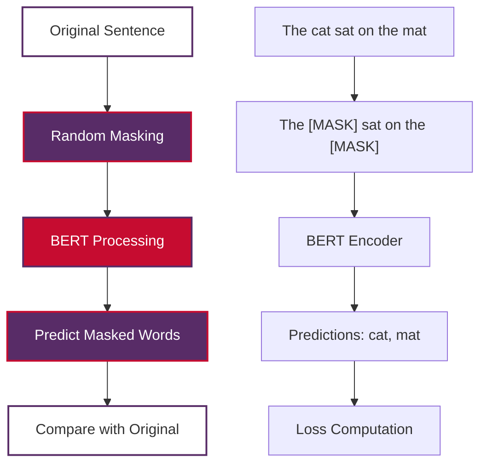

**MLM Process:**
1. **Random Masking**: 15% of tokens are randomly selected
   - 80% replaced with [MASK] token
   - 10% replaced with random word
   - 10% kept unchanged
2. **Bidirectional Processing**: Model sees context from both directions
3. **Prediction**: Model predicts original masked words
4. **Loss Computation**: Cross-entropy loss on predictions

**Mathematical Formulation:**
$$ L_{MLM} = -\sum_{i \in \mathcal{M}} \log P(x_i | x_{\setminus \mathcal{M}}) $$

Where `$\mathcal{M}$` is the set of masked positions.

#### Next Sentence Prediction (NSP)

Teaches BERT to understand relationships between sentences:

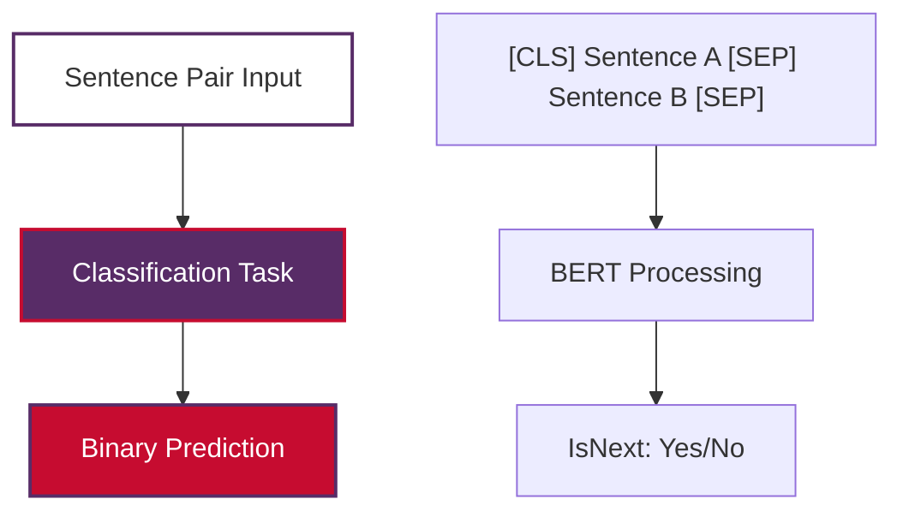

**NSP Process:**
1. **Sentence Pair Construction**: 50% consecutive sentences, 50% random pairs
2. **Special Token Usage**: [CLS] for classification, [SEP] for separation
3. **Binary Classification**: Predict if sentences are consecutive
4. **Loss Computation**: Binary cross-entropy loss

### Phase 2: Fine-tuning

Task-specific adaptation of pre-trained BERT:

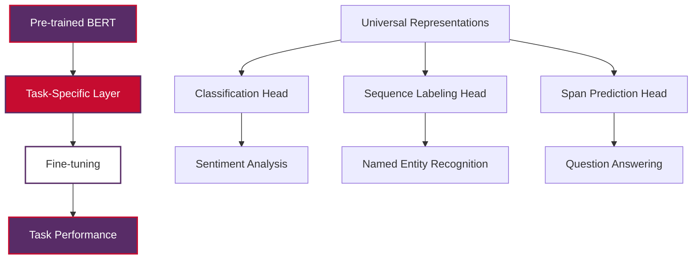

## Bidirectional Context Understanding

BERT's bidirectional nature is its most significant advancement over previous models, enabling unprecedented language understanding capabilities.

### Traditional vs. Bidirectional Processing

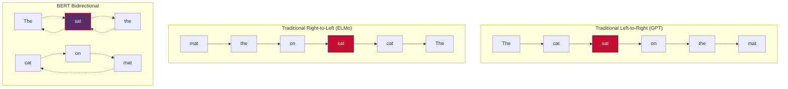

### Advantages of Bidirectional Processing

**Enhanced Context Understanding**
- Each word sees complete sentence context
- Better disambiguation of polysemous words
- Improved understanding of complex grammatical structures

**Mathematical Representation**
For a word at position `$i$`, traditional models compute:
$$ h_i = f(h_{i-1}, x_i) \quad \text{(left-to-right)} $$

BERT computes:
$$ h_i = f(x_1, x_2, ..., x_n) \quad \text{(bidirectional)} $$

**Practical Benefits**
- Better performance on tasks requiring full sentence understanding
- Improved handling of long-range dependencies
- More accurate word sense disambiguation

## Practical Implementation Examples

### Basic BERT Usage for Text Classification

```python
from transformers import BertTokenizer, BertForSequenceClassification
from transformers import pipeline
import torch

def basic_bert_classification():
    """
    Demonstrate basic BERT usage for sentiment analysis.
    
    Note: This example requires internet connection to download the model.
    For offline usage, download models locally first.
    """
    
    # Method 1: Using pipeline (simplest approach)
    classifier = pipeline(
        "sentiment-analysis", 
        model="bert-base-uncased",
        return_all_scores=True
    )
    
    texts = [
        "BERT is an amazing breakthrough in NLP!",
        "I'm not sure about this approach.",
        "This movie was terrible and boring."
    ]
    
    results = classifier(texts)
    
    print("Pipeline Results:")
    for text, result in zip(texts, results):
        print(f"\nText: {text}")
        for score in result:
            print(f"  {score['label']}: {score['score']:.4f}")
    
    return results

def manual_bert_classification():
    """
    Manual BERT implementation for more control.
    
    Note: This requires internet connection for model download.
    """
    
    # Load pre-trained model and tokenizer
    model_name = "bert-base-uncased"
    tokenizer = BertTokenizer.from_pretrained(model_name)
    model = BertForSequenceClassification.from_pretrained(
        model_name,
        num_labels=2  # For binary classification
    )
    
    def classify_text(text):
        # Tokenize and encode
        inputs = tokenizer(
            text,
            return_tensors="pt",
            max_length=512,
            truncation=True,
            padding=True
        )
        
        # Get model predictions
        with torch.no_grad():
            outputs = model(**inputs)
        
        # Get probabilities
        probabilities = torch.nn.functional.softmax(outputs.logits, dim=-1)
        
        return probabilities
    
    # Example usage
    text = "BERT revolutionized natural language processing"
    probs = classify_text(text)
    print(f"Classification probabilities: {probs}")
    
    return probs

# Example usage (commented out to avoid network dependency)
# results = basic_bert_classification()
# probs = manual_bert_classification()
```

### BERT for Token Classification (Named Entity Recognition)

```python
from transformers import AutoTokenizer, AutoModelForTokenClassification
import torch

class BERTTokenClassifier:
    """
    BERT-based token classifier for NER and similar tasks.
    
    Note: Requires internet connection for model download.
    For production use, download models locally.
    """
    
    def __init__(self, model_name="dbmdz/bert-large-cased-finetuned-conll03-english"):
        self.tokenizer = AutoTokenizer.from_pretrained(model_name)
        self.model = AutoModelForTokenClassification.from_pretrained(model_name)
        
        # Get label list
        self.labels = list(self.model.config.id2label.values())
    
    def predict(self, text):
        # Tokenize input
        inputs = self.tokenizer(
            text,
            return_tensors="pt",
            truncation=True,
            is_split_into_words=False,
            return_offsets_mapping=True
        )
        
        # Get predictions
        with torch.no_grad():
            outputs = self.model(**inputs)
        
        # Get predicted labels
        predictions = torch.argmax(outputs.logits, dim=2)
        
        # Convert to readable format
        tokens = self.tokenizer.convert_ids_to_tokens(inputs["input_ids"][0])
        predicted_labels = [self.labels[pred] for pred in predictions[0]]
        
        # Align tokens with predictions
        results = []
        for token, label in zip(tokens, predicted_labels):
            if token not in ['[CLS]', '[SEP]', '[PAD]']:
                results.append((token, label))
        
        return results
    
    def extract_entities(self, text):
        predictions = self.predict(text)
        entities = []
        current_entity = []
        current_label = None
        
        for token, label in predictions:
            if label.startswith('B-'):  # Beginning of entity
                if current_entity:
                    entities.append((
                        self.tokenizer.convert_tokens_to_string(current_entity),
                        current_label
                    ))
                current_entity = [token]
                current_label = label[2:]  # Remove B- prefix
            elif label.startswith('I-') and current_label == label[2:]:  # Inside entity
                current_entity.append(token)
            else:  # Outside entity
                if current_entity:
                    entities.append((
                        self.tokenizer.convert_tokens_to_string(current_entity),
                        current_label
                    ))
                    current_entity = []
                    current_label = None
        
        # Don't forget the last entity
        if current_entity:
            entities.append((
                self.tokenizer.convert_tokens_to_string(current_entity),
                current_label
            ))
        
        return entities

# Example usage (commented out to avoid network dependency)
"""
# Initialize classifier
ner_classifier = BERTTokenClassifier()

# Example text
text = "Albert Einstein was born in Germany and later moved to Princeton."

# Get token predictions
predictions = ner_classifier.predict(text)
print("Token predictions:")
for token, label in predictions:
    print(f"  {token}: {label}")

# Extract entities
entities = ner_classifier.extract_entities(text)
print("\nExtracted entities:")
for entity, label in entities:
    print(f"  {entity}: {label}")
"""
```

### Offline BERT Implementation Examples

For environments without internet access:

```python
import numpy as np
import torch
import torch.nn as nn

class SimpleBERTAttention:
    """
    Simplified BERT attention mechanism for educational purposes.
    This works offline without requiring pre-trained models.
    """
    
    def __init__(self, hidden_size=768, num_heads=12):
        self.hidden_size = hidden_size
        self.num_heads = num_heads
        self.head_size = hidden_size // num_heads
    
    def scaled_dot_product_attention(self, Q, K, V, mask=None):
        """
        Compute scaled dot-product attention.
        
        Args:
            Q, K, V: Query, Key, Value matrices
            mask: Optional attention mask
        """
        # Compute attention scores
        scores = np.matmul(Q, K.transpose(-2, -1)) / np.sqrt(self.head_size)
        
        # Apply mask if provided
        if mask is not None:
            scores = np.where(mask == 0, -np.inf, scores)
        
        # Apply softmax
        attention_weights = self.softmax(scores)
        
        # Apply attention to values
        output = np.matmul(attention_weights, V)
        
        return output, attention_weights
    
    def softmax(self, x):
        """Numerically stable softmax."""
        exp_x = np.exp(x - np.max(x, axis=-1, keepdims=True))
        return exp_x / np.sum(exp_x, axis=-1, keepdims=True)
    
    def multi_head_attention(self, input_embeddings):
        """
        Simplified multi-head attention computation.
        
        Args:
            input_embeddings: Shape (batch_size, seq_len, hidden_size)
        """
        batch_size, seq_len, hidden_size = input_embeddings.shape
        
        # Initialize random weight matrices (in practice, these are learned)
        W_Q = np.random.normal(0, 0.02, (hidden_size, hidden_size))
        W_K = np.random.normal(0, 0.02, (hidden_size, hidden_size))
        W_V = np.random.normal(0, 0.02, (hidden_size, hidden_size))
        
        # Compute Q, K, V
        Q = np.matmul(input_embeddings, W_Q)
        K = np.matmul(input_embeddings, W_K)
        V = np.matmul(input_embeddings, W_V)
        
        # Reshape for multi-head attention
        Q = Q.reshape(batch_size, seq_len, self.num_heads, self.head_size)
        K = K.reshape(batch_size, seq_len, self.num_heads, self.head_size)
        V = V.reshape(batch_size, seq_len, self.num_heads, self.head_size)
        
        # Transpose for attention computation
        Q = Q.transpose(0, 2, 1, 3)  # (batch, heads, seq_len, head_size)
        K = K.transpose(0, 2, 1, 3)
        V = V.transpose(0, 2, 1, 3)
        
        # Compute attention for each head
        attention_outputs = []
        attention_weights_all = []
        
        for head in range(self.num_heads):
            output, weights = self.scaled_dot_product_attention(
                Q[:, head], K[:, head], V[:, head]
            )
            attention_outputs.append(output)
            attention_weights_all.append(weights)
        
        # Concatenate heads
        concat_output = np.concatenate(attention_outputs, axis=-1)
        
        return concat_output, attention_weights_all

class OfflineBERTDemo:
    """
    Demonstrate BERT concepts without requiring internet connection.
    """
    
    def __init__(self, vocab_size=30000, hidden_size=768, max_length=512):
        self.vocab_size = vocab_size
        self.hidden_size = hidden_size
        self.max_length = max_length
        
        # Initialize embedding matrices (random for demo)
        self.token_embeddings = np.random.normal(
            0, 0.02, (vocab_size, hidden_size)
        )
        self.position_embeddings = np.random.normal(
            0, 0.02, (max_length, hidden_size)
        )
        self.segment_embeddings = np.random.normal(
            0, 0.02, (2, hidden_size)  # For sentence A and B
        )
        
        self.attention = SimpleBERTAttention(hidden_size)
    
    def create_input_embeddings(self, token_ids, segment_ids):
        """
        Create BERT-style input embeddings.
        
        Args:
            token_ids: List of token IDs
            segment_ids: List of segment IDs (0 or 1)
        """
        seq_len = len(token_ids)
        
        # Get embeddings
        token_emb = self.token_embeddings[token_ids]
        pos_emb = self.position_embeddings[:seq_len]
        seg_emb = self.segment_embeddings[segment_ids]
        
        # Sum all embeddings (BERT's approach)
        input_embeddings = token_emb + pos_emb + seg_emb
        
        return input_embeddings
    
    def demonstrate_bidirectional_context(self):
        """
        Demonstrate how BERT processes bidirectional context.
        """
        print("BERT Bidirectional Context Demonstration")
        print("=" * 50)
        
        # Example sentence: "The bank by the river"
        # "bank" can mean financial institution or riverbank
        
        sentence1_tokens = ["the", "bank", "lends", "money"]
        sentence2_tokens = ["the", "bank", "by", "river"]
        
        print("Sentence 1: 'The bank lends money'")
        print("Sentence 2: 'The bank by river'")
        print("\nIn traditional left-to-right processing:")
        print("- At 'bank', only 'the' is visible")
        print("- Context is limited")
        
        print("\nIn BERT's bidirectional processing:")
        print("- At 'bank', full sentence context is visible")
        print("- 'lends money' suggests financial institution")
        print("- 'by river' suggests riverbank")
        print("- Better disambiguation possible")
        
        # Simulate attention patterns
        vocab = {"the": 0, "bank": 1, "lends": 2, "money": 3, "by": 4, "river": 5, "[PAD]": 6}
        
        # Create token IDs for both sentences
        sent1_ids = [vocab[token] for token in sentence1_tokens]
        sent2_ids = [vocab[token] for token in sentence2_tokens]
        
        # Pad to same length
        max_len = max(len(sent1_ids), len(sent2_ids))
        sent1_ids.extend([vocab["[PAD]"]] * (max_len - len(sent1_ids)))
        sent2_ids.extend([vocab["[PAD]"]] * (max_len - len(sent2_ids)))
        
        # Create embeddings
        emb1 = self.create_input_embeddings(sent1_ids, [0] * len(sent1_ids))
        emb2 = self.create_input_embeddings(sent2_ids, [0] * len(sent2_ids))
        
        # Add batch dimension
        emb1 = emb1[np.newaxis, ...]
        emb2 = emb2[np.newaxis, ...]
        
        # Compute attention
        output1, weights1 = self.attention.multi_head_attention(emb1)
        output2, weights2 = self.attention.multi_head_attention(emb2)
        
        print(f"\nProcessed representations shape: {output1.shape}")
        print("Each word now has bidirectional context information!")
        
        return output1, output2, weights1, weights2

# Example usage
demo = OfflineBERTDemo()
results = demo.demonstrate_bidirectional_context()
```

## BERT vs Other Models

Understanding BERT's position in the NLP landscape requires comparing it with other significant models:

### Model Comparison Matrix

| Model | Architecture | Training | Strengths | Best Use Cases |
|-------|-------------|----------|-----------|----------------|
| **BERT** | Encoder-only | Bidirectional MLM + NSP | Understanding tasks | Classification, NER, QA |
| **GPT** | Decoder-only | Autoregressive LM | Text generation | Creative writing, completion |
| **T5** | Encoder-Decoder | Text-to-text | Versatility | Translation, summarization |
| **RoBERTa** | Encoder-only | Optimized MLM | Robust training | Similar to BERT, better performance |
| **ELECTRA** | Encoder-only | Replaced token detection | Sample efficiency | Resource-constrained scenarios |

### Detailed Comparisons

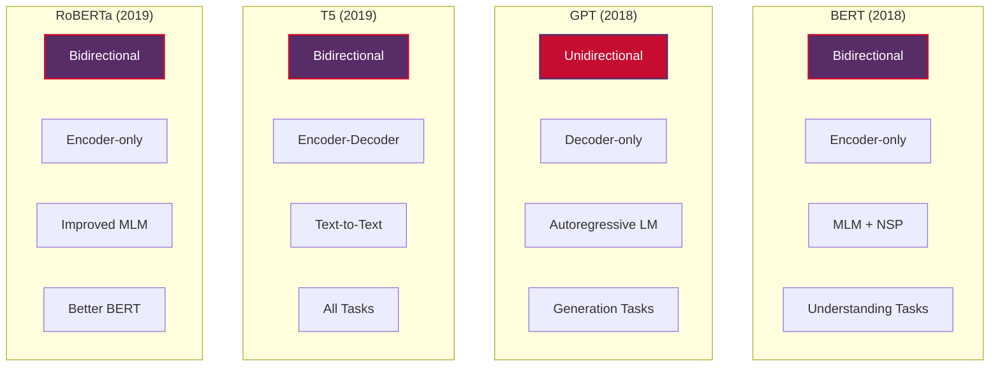

**BERT vs GPT:**
- **Processing Direction**: BERT (bidirectional) vs GPT (left-to-right)
- **Task Focus**: BERT (understanding) vs GPT (generation)
- **Architecture**: BERT (encoder) vs GPT (decoder)

**BERT vs T5:**
- **Task Formulation**: BERT (task-specific heads) vs T5 (text-to-text)
- **Flexibility**: T5 more versatile, BERT more specialized
- **Performance**: Task-dependent, both achieve state-of-the-art

**BERT vs RoBERTa:**
- **Training**: RoBERTa removes NSP, optimizes hyperparameters
- **Data**: RoBERTa uses more data and longer training
- **Performance**: RoBERTa generally outperforms BERT

## BERT Variants and Improvements

The success of BERT has inspired numerous variants and improvements, each addressing specific limitations or use cases:

### Major BERT Variants

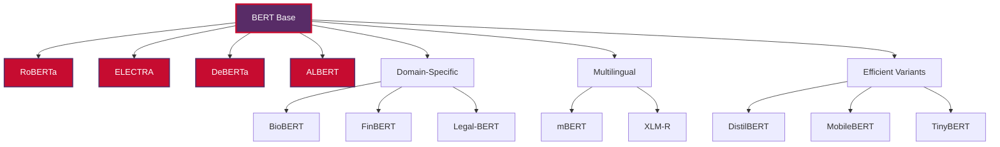

### Performance Improvements

**RoBERTa (Robustly Optimized BERT Pretraining Approach)**
- Removes Next Sentence Prediction (NSP)
- Trains with larger batch sizes and learning rates
- Uses more training data and longer sequences
- Achieves better performance on most downstream tasks

**DeBERTa (Decoding-enhanced BERT with Disentangled Attention)**
- Disentangled attention mechanism
- Enhanced mask decoder
- Improved handling of relative positions
- State-of-the-art performance on SuperGLUE

**ELECTRA (Efficiently Learning an Encoder that Classifies Token Replacements Accurately)**
- Uses replaced token detection instead of masked language modeling
- More sample-efficient training
- Smaller models achieve comparable performance to larger BERT models

### Efficiency Improvements

**DistilBERT**
- 40% smaller than BERT-base
- Retains 97% of BERT's performance
- 60% faster inference
- Knowledge distillation from teacher BERT model

**ALBERT (A Lite BERT)**
- Parameter sharing across layers
- Factorized embedding parameterization
- Achieves better performance with fewer parameters
- Addresses memory limitations of large models

### Domain-Specific Variants

**BioBERT**
- Pre-trained on biomedical texts (PubMed abstracts and PMC articles)
- Better performance on biomedical NLP tasks
- Understands medical terminology and concepts

**FinBERT**
- Specialized for financial domain
- Pre-trained on financial news and reports
- Excellent for financial sentiment analysis and document classification

## Real-World Applications

BERT's versatility has led to widespread adoption across numerous industries and applications:

### Industry Applications

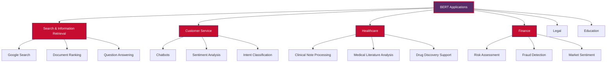

### Specific Use Cases

**1. Search Enhancement (Google)**
- BERT processes 1 in 10 English search queries on Google
- Improves understanding of conversational queries
- Better handles prepositions and context in search

**2. Content Moderation**
- Automatically detect harmful or inappropriate content
- Understand context and nuance in user-generated content
- Scale moderation efforts across platforms

**3. Document Classification and Routing**
- Automatically categorize incoming documents
- Route customer inquiries to appropriate departments
- Legal document analysis and categorization

**4. Conversational AI**
- Power chatbots with better natural language understanding
- Improve intent recognition and entity extraction
- Enable more natural human-computer interaction

### Implementation Example: Customer Service Automation

```python
class CustomerServiceBERT:
    """
    Example implementation of BERT for customer service automation.
    
    Note: This is a conceptual example. Production implementation
    would require proper training data and model fine-tuning.
    """
    
    def __init__(self):
        # In practice, load fine-tuned models for specific tasks
        self.intent_classifier = None  # BERT model for intent classification
        self.sentiment_analyzer = None  # BERT model for sentiment analysis
        self.entity_extractor = None   # BERT model for entity extraction
    
    def analyze_customer_message(self, message):
        """
        Analyze customer message for intent, sentiment, and entities.
        
        Args:
            message: Customer message text
            
        Returns:
            dict: Analysis results
        """
        
        # Intent classification
        intent = self.classify_intent(message)
        
        # Sentiment analysis
        sentiment = self.analyze_sentiment(message)
        
        # Entity extraction
        entities = self.extract_entities(message)
        
        # Determine routing and priority
        routing = self.determine_routing(intent, sentiment)
        priority = self.assess_priority(sentiment, entities)
        
        return {
            'intent': intent,
            'sentiment': sentiment,
            'entities': entities,
            'routing': routing,
            'priority': priority,
            'suggested_response': self.generate_response_template(intent)
        }
    
    def classify_intent(self, message):
        """Classify customer intent using BERT."""
        # Simplified intent classification
        intents = {
            'billing': ['bill', 'charge', 'payment', 'invoice'],
            'technical': ['broken', 'error', 'bug', 'not working'],
            'return': ['return', 'refund', 'exchange'],
            'general': ['question', 'help', 'information']
        }
        
        message_lower = message.lower()
        for intent, keywords in intents.items():
            if any(keyword in message_lower for keyword in keywords):
                return intent
        return 'general'
    
    def analyze_sentiment(self, message):
        """Analyze sentiment using BERT."""
        # Simplified sentiment analysis
        negative_words = ['angry', 'terrible', 'awful', 'hate', 'frustrated']
        positive_words = ['great', 'love', 'excellent', 'amazing', 'satisfied']
        
        message_lower = message.lower()
        if any(word in message_lower for word in negative_words):
            return 'negative'
        elif any(word in message_lower for word in positive_words):
            return 'positive'
        return 'neutral'
    
    def extract_entities(self, message):
        """Extract entities like order numbers, product names."""
        # Simplified entity extraction
        import re
        
        entities = {}
        
        # Extract order numbers (pattern: ORDER123456)
        order_pattern = r'ORDER\d+'
        orders = re.findall(order_pattern, message.upper())
        if orders:
            entities['order_numbers'] = orders
        
        # Extract email addresses
        email_pattern = r'\b[A-Za-z0-9._%+-]+@[A-Za-z0-9.-]+\.[A-Z|a-z]{2,}\b'
        emails = re.findall(email_pattern, message)
        if emails:
            entities['emails'] = emails
        
        return entities
    
    def determine_routing(self, intent, sentiment):
        """Determine where to route the customer inquiry."""
        if sentiment == 'negative' and intent in ['billing', 'technical']:
            return 'priority_support'
        elif intent == 'technical':
            return 'technical_support'
        elif intent == 'billing':
            return 'billing_department'
        elif intent == 'return':
            return 'returns_department'
        else:
            return 'general_support'
    
    def assess_priority(self, sentiment, entities):
        """Assess priority level of customer inquiry."""
        if sentiment == 'negative':
            return 'high'
        elif 'order_numbers' in entities:
            return 'medium'
        else:
            return 'normal'
    
    def generate_response_template(self, intent):
        """Generate response template based on intent."""
        templates = {
            'billing': "Thank you for contacting us about your billing inquiry. Our billing team will review your account and respond within 24 hours.",
            'technical': "We apologize for the technical issue you're experiencing. Our technical support team will investigate and provide a solution.",
            'return': "We've received your return request. Please find the return process information below.",
            'general': "Thank you for your inquiry. Our customer service team will respond to your question shortly."
        }
        return templates.get(intent, templates['general'])

# Example usage
customer_service = CustomerServiceBERT()

# Example customer messages
messages = [
    "I'm having trouble with ORDER123456 and I'm really frustrated!",
    "The app keeps crashing when I try to log in",
    "I love this product! Can you tell me when new features will be available?",
    "I need to return my recent purchase, it doesn't fit properly"
]

print("Customer Service Analysis Results:")
print("=" * 50)

for i, message in enumerate(messages, 1):
    print(f"\nMessage {i}: {message}")
    analysis = customer_service.analyze_customer_message(message)
    
    print(f"Intent: {analysis['intent']}")
    print(f"Sentiment: {analysis['sentiment']}")
    print(f"Entities: {analysis['entities']}")
    print(f"Routing: {analysis['routing']}")
    print(f"Priority: {analysis['priority']}")
    print(f"Template: {analysis['suggested_response']}")
```

## Performance and Limitations

While BERT represents a significant breakthrough, understanding its limitations is crucial for effective application:

### Performance Characteristics

**Strengths:**
- Excellent performance on understanding tasks
- Strong transfer learning capabilities
- Robust across diverse domains and languages
- Well-suited for tasks requiring bidirectional context

**Computational Requirements:**
- BERT-Base: 110M parameters, ~400MB model size
- BERT-Large: 340M parameters, ~1.3GB model size
- Significant memory and compute requirements for training
- Moderate inference time compared to simpler models

### Known Limitations

```mermaid
graph TD
    A[BERT Limitations] --> B[Computational Cost]
    A --> C[Sequence Length]
    A --> D[Generation Tasks]
    A --> E[Training Data Bias]
    
    B --> B1[Large Memory Requirements]
    B --> B2[Slow Training]
    B --> B3[Expensive Inference]
    
    C --> C1[512 Token Limit]
    C --> C2[Quadratic Attention Complexity]
    C --> C3[Long Document Challenges]
    
    D --> D1[Not Designed for Generation]
    D --> D2[No Autoregressive Capability]
    D --> D3[Limited Creative Applications]
    
    E --> E1[Inherits Training Data Biases]
    E --> E2[May Reflect Societal Biases]
    E --> E3[Requires Careful Evaluation]

    style A fill:#582C67,stroke:#C60C30,color:#FFFFFF,stroke-width:3px
    style B fill:#C60C30,stroke:#582C67,color:#FFFFFF,stroke-width:2px
    style C fill:#C60C30,stroke:#582C67,color:#FFFFFF,stroke-width:2px
    style D fill:#C60C30,stroke:#582C67,color:#FFFFFF,stroke-width:2px
    style E fill:#C60C30,stroke:#582C67,color:#FFFFFF,stroke-width:2px
```

**1. Computational Limitations**
- High memory requirements for training and inference
- Quadratic complexity with respect to sequence length
- Expensive to train from scratch

**2. Sequence Length Constraints**
- Maximum sequence length of 512 tokens
- Difficulty processing very long documents
- Need for document chunking strategies

**3. Task Limitations**
- Not designed for text generation tasks
- Requires task-specific fine-tuning for optimal performance
- May struggle with tasks requiring reasoning over long sequences

**4. Bias and Fairness Concerns**
- Inherits biases present in training data
- May exhibit gender, racial, or cultural biases
- Requires careful evaluation and mitigation strategies

### Mitigation Strategies

**For Computational Limitations:**
- Use distilled models (DistilBERT, TinyBERT)
- Implement model compression techniques
- Leverage efficient inference frameworks

**For Sequence Length:**
- Document chunking with overlap
- Hierarchical processing approaches
- Use models with longer context (Longformer, BigBird)

**For Bias:**
- Diverse and representative training data
- Bias detection and measurement
- Fairness-aware fine-tuning techniques

## Best Practices

Successful BERT implementation requires following established best practices:

### Model Selection

**Choosing the Right BERT Variant:**
1. **Task Type**: Understanding vs generation requirements
2. **Domain**: General vs domain-specific models
3. **Resources**: Computational constraints and requirements
4. **Language**: Monolingual vs multilingual needs

**Selection Matrix:**
- **General NLP**: BERT-base or RoBERTa
- **Resource-constrained**: DistilBERT or ALBERT
- **Domain-specific**: BioBERT, FinBERT, Legal-BERT
- **Multilingual**: mBERT or XLM-RoBERTa
- **Long documents**: Longformer or BigBird

### Fine-tuning Guidelines

```python
class BERTFineTuningBestPractices:
    """
    Demonstrates best practices for BERT fine-tuning.
    """
    
    def __init__(self):
        self.best_practices = {
            'learning_rate': 'Use lower learning rates (2e-5 to 5e-5)',
            'batch_size': 'Start with 16-32, adjust based on memory',
            'epochs': 'Usually 2-4 epochs sufficient',
            'warmup': 'Use linear warmup for first 10% of steps',
            'gradient_clipping': 'Clip gradients to prevent instability'
        }
    
    def get_recommended_hyperparameters(self, task_type, dataset_size):
        """
        Get recommended hyperparameters based on task and data size.
        """
        if task_type == 'classification':
            if dataset_size < 1000:
                return {
                    'learning_rate': 5e-5,
                    'batch_size': 8,
                    'epochs': 3,
                    'warmup_steps': 100
                }
            elif dataset_size < 10000:
                return {
                    'learning_rate': 3e-5,
                    'batch_size': 16,
                    'epochs': 3,
                    'warmup_steps': 500
                }
            else:
                return {
                    'learning_rate': 2e-5,
                    'batch_size': 32,
                    'epochs': 2,
                    'warmup_steps': 1000
                }
        
        elif task_type == 'token_classification':
            return {
                'learning_rate': 5e-5,
                'batch_size': 16,
                'epochs': 3,
                'warmup_steps': 500
            }
        
        else:  # question_answering
            return {
                'learning_rate': 3e-5,
                'batch_size': 12,
                'epochs': 2,
                'warmup_steps': 1000
            }
    
    def preprocessing_checklist(self):
        """
        Checklist for data preprocessing.
        """
        return [
            "✓ Text cleaning and normalization",
            "✓ Proper tokenization with BERT tokenizer",
            "✓ Handle sequences longer than 512 tokens",
            "✓ Appropriate padding and attention masks",
            "✓ Train/validation/test split (70/15/15 or 80/10/10)",
            "✓ Class balance analysis for classification tasks",
            "✓ Special token handling ([CLS], [SEP], [PAD])"
        ]
    
    def training_checklist(self):
        """
        Checklist for training process.
        """
        return [
            "✓ Set appropriate learning rate (2e-5 to 5e-5)",
            "✓ Use warmup for learning rate scheduling",
            "✓ Monitor training and validation loss",
            "✓ Implement early stopping to prevent overfitting",
            "✓ Save model checkpoints regularly",
            "✓ Use gradient clipping (max_grad_norm=1.0)",
            "✓ Evaluate on validation set each epoch"
        ]
    
    def evaluation_checklist(self):
        """
        Checklist for model evaluation.
        """
        return [
            "✓ Use appropriate metrics for task type",
            "✓ Test on held-out test set",
            "✓ Analyze performance across different classes/categories",
            "✓ Check for bias and fairness issues",
            "✓ Validate performance on edge cases",
            "✓ Compare with baseline models",
            "✓ Statistical significance testing if applicable"
        ]

# Example usage
best_practices = BERTFineTuningBestPractices()

# Get recommendations for a classification task with medium dataset
params = best_practices.get_recommended_hyperparameters('classification', 5000)
print("Recommended hyperparameters:")
for param, value in params.items():
    print(f"  {param}: {value}")

print("\nPreprocessing checklist:")
for item in best_practices.preprocessing_checklist():
    print(f"  {item}")
```

### Production Deployment

**Optimization Strategies:**
1. **Model Compression**: Quantization, pruning, distillation
2. **Efficient Inference**: ONNX conversion, TensorRT optimization
3. **Caching**: Cache embeddings for frequently processed text
4. **Batch Processing**: Process multiple examples together
5. **Hardware Acceleration**: GPU/TPU utilization

**Monitoring and Maintenance:**
- Monitor model performance degradation over time
- Implement A/B testing for model updates
- Track inference latency and throughput
- Regular retraining with new data
- Bias monitoring and fairness evaluation

## Future Directions

BERT's impact continues to evolve as the field advances:

### Emerging Trends

```mermaid
graph TD
    A[BERT's Future] --> B[Efficiency Improvements]
    A --> C[Longer Context]
    A --> D[Multimodal Integration]
    A --> E[Specialized Applications]
    
    B --> B1[Sparse Attention]
    B --> B2[Linear Transformers]
    B --> B3[Mobile Optimization]
    
    C --> C1[Longformer Extensions]
    C --> C2[Hierarchical Processing]
    C --> C3[Memory-Efficient Attention]
    
    D --> D1[Vision-Language Models]
    D --> D2[Audio-Text Integration]
    D --> D3[Cross-Modal Understanding]
    
    E --> E1[Scientific Literature]
    E --> E2[Code Understanding]
    E --> E3[Domain Adaptation]

    style A fill:#582C67,stroke:#C60C30,color:#FFFFFF,stroke-width:3px
    style B fill:#C60C30,stroke:#582C67,color:#FFFFFF,stroke-width:2px
    style C fill:#C60C30,stroke:#582C67,color:#FFFFFF,stroke-width:2px
    style D fill:#C60C30,stroke:#582C67,color:#FFFFFF,stroke-width:2px
    style E fill:#C60C30,stroke:#582C67,color:#FFFFFF,stroke-width:2px
```

**1. Efficiency and Scale**
- Development of more efficient architectures
- Better training algorithms and techniques
- Reduced computational requirements
- Improved model compression methods

**2. Context Length Extensions**
- Models that can handle much longer sequences
- Efficient attention mechanisms for long documents
- Hierarchical and sparse attention patterns

**3. Multimodal Capabilities**
- Integration with vision and audio modalities
- Cross-modal understanding and reasoning
- Unified multimodal architectures

**4. Specialized Domains**
- More sophisticated domain adaptation techniques
- Better handling of specialized vocabularies
- Improved few-shot learning capabilities

### Research Directions

**Theoretical Understanding**
- Better understanding of what BERT learns
- Interpretability and explainability research
- Analysis of attention patterns and representations

**Practical Improvements**
- Reduced bias and improved fairness
- Better handling of out-of-distribution data
- Improved robustness and reliability

**New Applications**
- Scientific literature processing
- Legal document analysis
- Educational content understanding
- Healthcare applications

---

## Conclusion

BERT represents a watershed moment in Natural Language Processing, fundamentally changing how we approach language understanding tasks. Its bidirectional training methodology, transfer learning capabilities, and versatile architecture have not only achieved breakthrough performance across numerous NLP benchmarks but also democratized access to advanced language understanding capabilities.

**Key Takeaways:**

1. **Revolutionary Approach**: BERT's bidirectional context processing provides superior language understanding compared to traditional unidirectional models

2. **Transfer Learning Power**: Pre-training on large corpora followed by task-specific fine-tuning enables excellent performance with limited labeled data

3. **Broad Applicability**: From search engines to customer service automation, BERT's applications span virtually every industry dealing with text data

4. **Continuous Evolution**: The BERT family continues to grow with variants addressing specific limitations and use cases

5. **Foundation for Future**: BERT established architectural and training principles that continue to influence modern NLP research

As we move forward, BERT's influence extends beyond its direct applications. It has established the transformer-based, pre-training paradigm that underlies many subsequent breakthroughs in artificial intelligence, including large language models like GPT-3, ChatGPT, and beyond. Understanding BERT is therefore essential not just for current NLP applications, but for grasping the fundamental principles driving the ongoing AI revolution.

Whether you're implementing a simple text classifier or building sophisticated language understanding systems, BERT's principles of bidirectional context, transfer learning, and attention-based processing provide the foundation for state-of-the-art natural language processing capabilities.