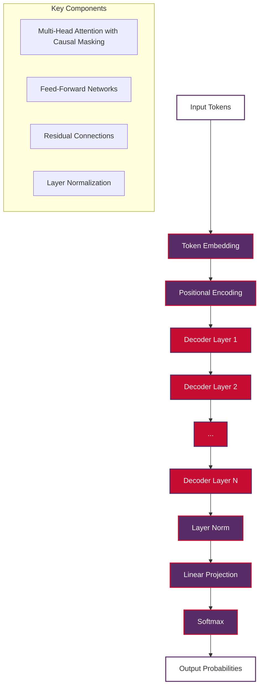
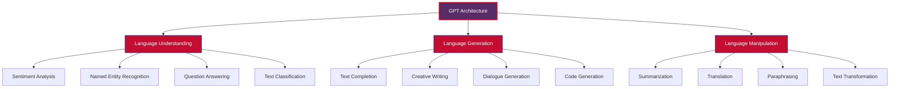
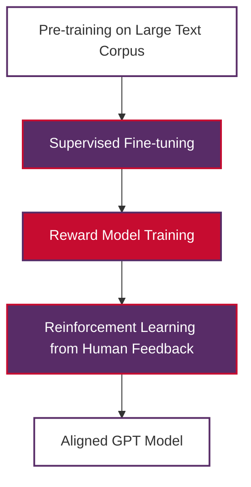

# GPT (Generative Pre-trained Transformer) in Natural Language Processing

This document provides a comprehensive explanation of GPT (Generative Pre-trained Transformer), its architecture, evolution, and profound impact on Natural Language Processing. GPT represents one of the most significant breakthroughs in AI and has revolutionized how we approach text generation, language understanding, and human-AI interaction.

> **Note on Examples**: Some code examples require internet connection to download pre-trained models from Hugging Face. These are clearly marked. For offline usage, you can download models locally first or use the provided implementation examples that work without internet connection.

## Table of Contents

1. [What is GPT?](#what-is-gpt)
2. [Architecture and Technical Foundation](#architecture-and-technical-foundation)
3. [How GPT Works](#how-gpt-works)
4. [Evolution of GPT Models](#evolution-of-gpt-models)
5. [GPT's Relevance to NLP](#gpts-relevance-to-nlp)
6. [Key Capabilities and Applications](#key-capabilities-and-applications)
7. [Training Process and Methodology](#training-process-and-methodology)
8. [Implementation Examples](#implementation-examples)
9. [Advantages and Limitations](#advantages-and-limitations)
10. [Impact on NLP Field](#impact-on-nlp-field)
11. [Future Directions](#future-directions)
12. [Practical Considerations](#practical-considerations)

## What is GPT?

**GPT (Generative Pre-trained Transformer)** is a family of large language models developed by OpenAI that uses the transformer architecture to generate human-like text. GPT models are **autoregressive language models** that predict the next word in a sequence based on the preceding context.

### Core Definition

GPT is fundamentally a **decoder-only transformer architecture** trained to predict the next token in a sequence through **unsupervised learning** on vast amounts of text data. This simple yet powerful approach enables GPT to:

- Generate coherent, contextually relevant text
- Understand and respond to prompts
- Perform various NLP tasks without explicit training
- Exhibit emergent capabilities through scale

### Key Characteristics

- **Autoregressive Generation**: Predicts one token at a time, left-to-right
- **Transformer-Based**: Built on the attention mechanism
- **Pre-trained**: Trained on large corpora before fine-tuning
- **Generative**: Primarily designed for text generation tasks
- **Few-shot Learning**: Can perform tasks with minimal examples

## Architecture and Technical Foundation

### Transformer Decoder Architecture

GPT uses only the **decoder portion** of the original transformer architecture, modified for causal (left-to-right) language modeling.



### Core Components

**1. Causal Self-Attention**

GPT uses **masked self-attention** to ensure that predictions for position $i$ can only depend on positions less than $i$:

$$ \text{Attention}(Q, K, V) = \text{softmax}\left(\frac{QK^T + M}{\sqrt{d_k}}\right)V $$

Where:
- $Q$ is the query matrix
- $K$ is the key matrix  
- $V$ is the value matrix
- $M$ is a causal mask that sets future positions to negative infinity
- $d_k$ is the dimension of the key vectors

**2. Multi-Head Attention**

Multiple attention heads allow the model to attend to different types of relationships:

$$ \text{MultiHead}(Q, K, V) = \text{Concat}(\text{head}_1, ..., \text{head}_h)W^O $$

Where:
- $\text{head}_i$ represents the $i$-th attention head
- $h$ is the number of attention heads
- $W^O$ is the output projection matrix
- $\text{Concat}$ concatenates the outputs from all heads

**3. Feed-Forward Networks**

Position-wise feed-forward networks process each position independently:

$$ \text{FFN}(x) = \max(0, xW_1 + b_1)W_2 + b_2 $$

Where:
- $x$ is the input vector
- $W_1$ and $W_2$ are weight matrices
- $b_1$ and $b_2$ are bias vectors
- $\max(0, \cdot)$ is the ReLU activation function

**4. Residual Connections and Layer Normalization**

Each component includes residual connections and layer normalization for stable training:

$$ \text{LayerNorm}(x + \text{Sublayer}(x)) $$

Where:
- $x$ is the input to the sublayer
- $\text{Sublayer}(x)$ represents either the attention or feed-forward sublayer
- The addition $x + \text{Sublayer}(x)$ implements the residual connection
- $\text{LayerNorm}$ normalizes the combined output

## How GPT Works

### Autoregressive Generation Process

GPT generates text through an autoregressive process where each token is predicted based on all previous tokens in the sequence.

```mermaid
graph LR
    A[Input: "The cat"] --> B[Predict: "sat"]
    B --> C[Input: "The cat sat"] --> D[Predict: "on"]
    D --> E[Input: "The cat sat on"] --> F[Predict: "the"]
    F --> G[Input: "The cat sat on the"] --> H[Predict: "mat"]

    style A fill:#FFFFFF,stroke:#582C67,color:#333,stroke-width:2px
    style B fill:#C60C30,stroke:#582C67,color:#FFFFFF,stroke-width:2px
    style C fill:#FFFFFF,stroke:#582C67,color:#333,stroke-width:2px
    style D fill:#C60C30,stroke:#582C67,color:#FFFFFF,stroke-width:2px
    style E fill:#FFFFFF,stroke:#582C67,color:#333,stroke-width:2px
    style F fill:#C60C30,stroke:#582C67,color:#FFFFFF,stroke-width:2px
    style G fill:#FFFFFF,stroke:#582C67,color:#333,stroke-width:2px
    style H fill:#C60C30,stroke:#582C67,color:#FFFFFF,stroke-width:2px
```

### Training Objective

GPT is trained using **next-token prediction** with cross-entropy loss:

$$ L = -\sum_{i=1}^{n} \log P(w_i | w_1, w_2, ..., w_{i-1}) $$

Where $P(w_i | w_1, ..., w_{i-1})$ is the probability of the $i$-th token given all previous tokens.

### Inference Process

During inference, GPT uses various **decoding strategies**:

**1. Greedy Decoding**: Select the most probable token at each step
**2. Beam Search**: Maintain multiple candidate sequences
**3. Top-k Sampling**: Sample from the k most probable tokens
**4. Nucleus (Top-p) Sampling**: Sample from tokens with cumulative probability p

## Evolution of GPT Models

### GPT-1 (2018)
- **Parameters**: 117M
- **Training Data**: BookCorpus (4.5GB)
- **Innovation**: Demonstrated unsupervised pre-training effectiveness
- **Context Length**: 512 tokens

### GPT-2 (2019)
- **Parameters**: 124M, 355M, 774M, 1.5B
- **Training Data**: WebText (40GB)
- **Innovation**: Showed scaling benefits, zero-shot task performance
- **Context Length**: 1024 tokens
- **Impact**: Initially withheld due to safety concerns

### GPT-3 (2020)
- **Parameters**: 175B
- **Training Data**: Common Crawl, WebText2, Books1&2, Wikipedia (570GB)
- **Innovation**: Few-shot learning, emergent capabilities
- **Context Length**: 2048 tokens
- **Impact**: Widespread commercial adoption

### GPT-4 (2023)
- **Parameters**: Estimated 1.7T (multimodal)
- **Innovation**: Multimodal capabilities, improved reasoning
- **Context Length**: 8K-32K tokens
- **Impact**: Professional-grade performance across domains

## GPT's Relevance to NLP

### Revolutionary Impact on NLP

GPT has fundamentally transformed Natural Language Processing in several key ways:

**1. Paradigm Shift from Task-Specific to General-Purpose Models**

Traditional NLP required separate models for each task:
```
Sentiment Analysis Model + NER Model + QA Model + Translation Model
```

GPT provides a unified approach:
```
Single GPT Model → Multiple NLP Tasks
```

**2. From Supervised to Unsupervised Learning**

- **Before GPT**: Heavy reliance on labeled datasets
- **With GPT**: Self-supervised learning on raw text enables powerful capabilities

**3. From Rule-Based to Learning-Based Systems**

GPT learns language patterns implicitly rather than through explicit programming of linguistic rules.

### Core NLP Capabilities

**Language Understanding:**
- Semantic comprehension
- Context awareness
- Implicit reasoning
- Knowledge retrieval

**Language Generation:**
- Coherent text production
- Style adaptation
- Creative writing
- Code generation

**Language Manipulation:**
- Text summarization
- Translation
- Paraphrasing
- Format conversion

### Relationship to Traditional NLP Tasks



## Key Capabilities and Applications

### Text Generation Applications

**1. Content Creation**
- Article writing and blogging
- Marketing copy and advertisements
- Creative writing and storytelling
- Technical documentation

**2. Code Generation**
- Programming assistance
- Code completion and debugging
- Documentation generation
- Algorithm explanation

**3. Conversational AI**
- Chatbots and virtual assistants
- Customer service automation
- Educational tutoring systems
- Personal productivity tools

### NLP Task Performance

**1. Language Understanding Tasks**
- Reading comprehension
- Sentiment analysis
- Intent recognition
- Entity extraction

**2. Language Generation Tasks**
- Text summarization
- Machine translation
- Question answering
- Dialogue generation

**3. Few-Shot Learning**
- Rapid adaptation to new tasks
- In-context learning from examples
- Zero-shot generalization

## Training Process and Methodology

### Pre-training Phase

**1. Data Collection and Preprocessing**
```python
# Conceptual data preprocessing pipeline
def preprocess_training_data(raw_text):
    """
    Preprocess text data for GPT training
    """
    # Tokenization
    tokens = tokenizer.encode(raw_text)
    
    # Sequence chunking
    sequences = chunk_sequences(tokens, max_length=context_length)
    
    # Data cleaning and filtering
    clean_sequences = filter_and_clean(sequences)
    
    return clean_sequences
```

**2. Training Objective**

The model learns to minimize the negative log-likelihood of the training data:

$$ \mathcal{L} = -\frac{1}{N}\sum_{i=1}^{N} \sum_{t=1}^{T} \log P(w_t^{(i)} | w_{<t}^{(i)}) $$

Where $N$ is the number of sequences and $T$ is the sequence length.

### Fine-tuning and Alignment

**1. Supervised Fine-tuning (SFT)**
- Training on human-written examples
- Improving instruction following
- Task-specific optimization

**2. Reinforcement Learning from Human Feedback (RLHF)**
- Human preference learning
- Safety and alignment improvements
- Reducing harmful outputs



## Implementation Examples

### Basic Text Generation with GPT-2

```python
from transformers import GPT2LMHeadModel, GPT2Tokenizer, pipeline

def basic_text_generation():
    """
    Demonstrate basic text generation using GPT-2.
    
    Note: This example requires internet connection to download the model.
    """
    
    # Load pre-trained GPT-2 model and tokenizer
    model_name = "gpt2"
    tokenizer = GPT2Tokenizer.from_pretrained(model_name)
    model = GPT2LMHeadModel.from_pretrained(model_name)
    
    # Set up generation pipeline
    generator = pipeline(
        "text-generation",
        model=model,
        tokenizer=tokenizer,
        pad_token_id=tokenizer.eos_token_id
    )
    
    # Generate text
    prompt = "The future of artificial intelligence"
    
    generated_texts = generator(
        prompt,
        max_length=100,
        num_return_sequences=2,
        temperature=0.7,
        do_sample=True,
        top_p=0.9
    )
    
    print(f"Prompt: {prompt}\n")
    for i, result in enumerate(generated_texts, 1):
        print(f"Generation {i}:")
        print(result['generated_text'])
        print("-" * 50)

# Run the example (when you have internet connection)
# basic_text_generation()
```

### Advanced GPT Usage with Custom Prompting

```python
from transformers import AutoTokenizer, AutoModelForCausalLM
import torch

def advanced_gpt_prompting():
    """
    Demonstrate advanced prompting techniques with GPT.
    
    Note: This example requires internet connection to download the model.
    """
    
    # Load model and tokenizer
    model_name = "gpt2-medium"  # or "gpt2-large" for better performance
    tokenizer = AutoTokenizer.from_pretrained(model_name)
    model = AutoModelForCausalLM.from_pretrained(model_name)
    
    # Set pad token
    tokenizer.pad_token = tokenizer.eos_token
    
    def generate_with_prompt(prompt, max_length=150, temperature=0.8):
        """Generate text with specific parameters"""
        
        # Encode the prompt
        input_ids = tokenizer.encode(prompt, return_tensors='pt')
        
        # Generate text
        with torch.no_grad():
            output = model.generate(
                input_ids,
                max_length=max_length,
                temperature=temperature,
                do_sample=True,
                top_p=0.9,
                top_k=50,
                pad_token_id=tokenizer.eos_token_id,
                no_repeat_ngram_size=2
            )
        
        # Decode and return
        generated_text = tokenizer.decode(output[0], skip_special_tokens=True)
        return generated_text
    
    # Few-shot learning example - English sentiment analysis
    few_shot_prompt = """
    Task: Classify the sentiment of the following sentences as positive, negative, or neutral.
    
    Sentence: "I love this product!"
    Sentiment: Positive
    
    Sentence: "This is terrible."
    Sentiment: Negative
    
    Sentence: "The weather is okay."
    Sentiment: Neutral
    
    Sentence: "This movie was amazing!"
    Sentiment:"""
    
    result = generate_with_prompt(few_shot_prompt, max_length=200)
    print("Few-shot Classification Result:")
    print(result)
    print("\n" + "="*50 + "\n")
    
    # Cross-lingual few-shot learning example - Vietnamese/English translation
    translation_prompt = """
    Task: Translate between Vietnamese and English.
    
    English: "My name is"
    Vietnamese: "Tên tôi là"
    
    English: "Hello"
    Vietnamese: "Xin chào"
    
    English: "Thank you"
    Vietnamese: "Cảm ơn"
    
    English: "How are you?"
    Vietnamese:"""
    
    translation_result = generate_with_prompt(translation_prompt, max_length=250)
    print("Cross-lingual Translation Result:")
    print(translation_result)
    print("\n" + "="*50 + "\n")
    
    # Creative writing example
    creative_prompt = "Write a short story about a robot learning to paint:"
    
    story = generate_with_prompt(creative_prompt, max_length=300, temperature=1.0)
    print("Creative Writing Result:")
    print(story)

# Run the example (when you have internet connection)
# advanced_gpt_prompting()
```

### GPT for NLP Task Implementation

```python
def gpt_nlp_tasks():
    """
    Demonstrate how GPT can be used for various NLP tasks.
    
    Note: This example requires internet connection to download the model.
    """
    
    from transformers import pipeline
    
    # Initialize GPT pipeline
    generator = pipeline("text-generation", model="gpt2")
    
    def gpt_sentiment_analysis(text):
        """Use GPT for sentiment analysis through prompting"""
        prompt = f"Analyze the sentiment of this text as positive, negative, or neutral:\n\nText: \"{text}\"\nSentiment:"
        
        result = generator(prompt, max_length=len(prompt.split()) + 5, 
                          temperature=0.1, do_sample=True)
        return result[0]['generated_text'][len(prompt):].strip()
    
    def gpt_summarization(text):
        """Use GPT for text summarization"""
        prompt = f"Summarize the following text in one sentence:\n\nText: {text}\n\nSummary:"
        
        result = generator(prompt, max_length=len(prompt.split()) + 20, 
                          temperature=0.7, do_sample=True)
        return result[0]['generated_text'][len(prompt):].strip()
    
    def gpt_question_answering(context, question):
        """Use GPT for question answering"""
        prompt = f"Context: {context}\n\nQuestion: {question}\n\nAnswer:"
        
        result = generator(prompt, max_length=len(prompt.split()) + 15,
                          temperature=0.3, do_sample=True)
        return result[0]['generated_text'][len(prompt):].strip()
    
    def gpt_translation(text, source_lang="English", target_lang="Vietnamese"):
        """Use GPT for Vietnamese/English translation"""
        prompt = f"Translate this {source_lang} text to {target_lang}:\n\n{source_lang}: {text}\n{target_lang}:"
        
        result = generator(prompt, max_length=len(prompt.split()) + 10,
                          temperature=0.3, do_sample=True)
        return result[0]['generated_text'][len(prompt):].strip()
    
    # Example usage
    sample_text = "The weather today is absolutely beautiful with clear skies and warm sunshine."
    
    print("Sentiment Analysis:")
    print(gpt_sentiment_analysis(sample_text))
    print("\nSummarization:")
    print(gpt_summarization(sample_text))
    print("\nQuestion Answering:")
    print(gpt_question_answering(sample_text, "How is the weather?"))
    
    # Vietnamese/English translation examples
    print("\nVietnamese/English Translation:")
    print("English → Vietnamese:", gpt_translation("My name is", "English", "Vietnamese"))
    print("Vietnamese → English:", gpt_translation("Tên tôi là", "Vietnamese", "English"))

# Run the example (when you have internet connection)
# gpt_nlp_tasks()
```

## Advantages and Limitations

### Advantages

**1. Versatility and Generalization**
- Single model for multiple tasks
- Strong few-shot and zero-shot capabilities
- Adaptable to new domains and tasks

**2. Human-like Text Generation**
- Coherent and contextually appropriate output
- Creative and diverse text generation
- Natural conversational abilities

**3. Scale Benefits**
- Performance improves with model size
- Emergent capabilities at larger scales
- Handles complex reasoning tasks

**4. No Task-Specific Training Required**
- Works out-of-the-box for many applications
- Reduces need for labeled datasets
- Faster deployment for new use cases

### Limitations

**1. Computational Requirements**
- High memory and processing demands
- Expensive training and inference costs
- Limited accessibility for smaller organizations

**2. Hallucination and Factual Accuracy**
- May generate plausible but incorrect information
- Lacks real-time knowledge updates
- Difficulty distinguishing facts from fiction

**3. Bias and Safety Concerns**
- Can perpetuate training data biases
- Potential for generating harmful content
- Requires careful alignment and monitoring

**4. Context Length Limitations**
- Fixed maximum context window
- Cannot process very long documents in single pass
- May lose important information beyond context limit

**5. Lack of True Understanding**
- Pattern matching rather than genuine comprehension
- No grounding in real-world experience
- Limited reasoning capabilities compared to humans

## Impact on NLP Field

### Research and Development Impact

**1. Paradigm Shift**
- From task-specific to general-purpose models
- From small-scale to large-scale architectures
- From supervised to self-supervised learning

**2. Research Directions**
- Scaling laws and emergent properties
- Alignment and safety research
- Efficient training and inference methods

**3. Democratization of NLP**
- Reduced barrier to entry for NLP applications
- API-based access to powerful models
- Simplified development workflows

### Industry Transformation

**1. Commercial Applications**
- Content generation and marketing
- Customer service automation
- Software development assistance
- Educational technology

**2. New Business Models**
- AI-as-a-Service platforms
- Conversational AI products
- Automated content creation tools
- Personalized recommendation systems

**3. Workflow Integration**
- Writing and editing assistance
- Code generation and debugging
- Research and information synthesis
- Creative collaboration tools

## Future Directions

### Technical Improvements

**1. Efficiency and Accessibility**
- Model compression and quantization
- Efficient fine-tuning methods
- Edge deployment capabilities
- Reduced computational requirements

**2. Capability Enhancement**
- Longer context windows
- Improved reasoning abilities
- Better factual accuracy
- Multimodal integration

**3. Safety and Alignment**
- Advanced RLHF techniques
- Constitutional AI approaches
- Interpretability improvements
- Bias mitigation strategies

### Emerging Applications

**1. Scientific Research**
- Literature review and synthesis
- Hypothesis generation
- Experimental design assistance
- Data analysis and interpretation

**2. Education and Training**
- Personalized tutoring systems
- Adaptive learning platforms
- Content generation for curricula
- Language learning assistance

**3. Creative Industries**
- Collaborative writing tools
- Game narrative generation
- Marketing content creation
- Art and design assistance

## Practical Considerations

### Implementation Guidelines

**1. Choosing the Right Model**
- Consider task requirements and constraints
- Balance performance with computational costs
- Evaluate licensing and usage restrictions
- Plan for scaling and maintenance

**2. Prompt Engineering**
- Design effective prompts for specific tasks
- Use few-shot examples when appropriate
- Implement prompt templates and chains
- Monitor and iterate on prompt performance

**3. Safety and Ethics**
- Implement content filtering and moderation
- Monitor for bias and harmful outputs
- Establish clear usage guidelines
- Regular model evaluation and updates

### Best Practices

**1. Development Workflow**
```python
# Recommended GPT development workflow
def gpt_development_workflow():
    """
    Best practices for GPT-based application development
    """
    
    # 1. Define clear objectives and success metrics
    objectives = {
        'primary_task': 'text_generation',
        'quality_metrics': ['coherence', 'relevance', 'factuality'],
        'performance_targets': {'response_time': '<2s', 'accuracy': '>85%'}
    }
    
    # 2. Start with prompt engineering
    prompt_templates = {
        'base_template': "Task: {task}\nInput: {input}\nOutput:",
        'few_shot_template': "Examples:\n{examples}\n\nTask: {task}\nInput: {input}\nOutput:"
    }
    
    # 3. Implement evaluation framework
    def evaluate_output(generated_text, expected_output=None):
        metrics = {}
        # Implement relevant metrics (BLEU, ROUGE, custom scores)
        return metrics
    
    # 4. Iterative improvement process
    def improve_model():
        # A. Analyze failure cases
        # B. Refine prompts
        # C. Consider fine-tuning
        # D. Implement safety measures
        pass
    
    return objectives, prompt_templates, evaluate_output, improve_model
```

**2. Performance Optimization**
- Cache frequently used prompts and responses
- Implement batching for multiple requests
- Use appropriate sampling parameters
- Monitor and optimize inference costs

**3. Quality Assurance**
- Implement automated testing pipelines
- Regular human evaluation of outputs
- A/B testing for prompt variations
- Continuous monitoring of model performance

## Conclusion

GPT represents a revolutionary advancement in Natural Language Processing that has fundamentally changed how we approach language understanding and generation. Its impact extends far beyond academic research, transforming industries and creating new possibilities for human-AI interaction.

### Key Takeaways

1. **Architectural Innovation**: GPT's decoder-only transformer architecture with causal masking enables powerful autoregressive language modeling

2. **Scale Benefits**: Larger models demonstrate emergent capabilities and improved performance across diverse tasks

3. **Paradigm Shift**: From task-specific models to general-purpose language understanding and generation

4. **Practical Impact**: Widespread adoption across industries for content creation, automation, and assistance

5. **Future Potential**: Ongoing research in efficiency, safety, and capability enhancement promises continued advancement

### Relevance to NLP Learning

Understanding GPT is crucial for anyone working in Natural Language Processing because:

- **Foundation Knowledge**: GPT builds on fundamental NLP concepts like tokenization, language modeling, and attention mechanisms
- **Current State-of-the-Art**: GPT-based models dominate many NLP benchmarks and applications
- **Industry Standard**: Many commercial NLP applications now leverage GPT or similar architectures
- **Research Direction**: Current NLP research heavily focuses on large language models inspired by GPT

### Final Thoughts

GPT has not only advanced the technical capabilities of NLP systems but has also democratized access to powerful language technologies. As the field continues to evolve, understanding GPT's principles, capabilities, and limitations will remain essential for researchers, developers, and practitioners working with natural language processing.

The journey from traditional rule-based NLP systems to GPT's neural language modeling represents one of the most significant progressions in artificial intelligence, and its influence will continue to shape the future of human-computer interaction and language technology.

## References and Further Reading

### Key Papers
- Radford, A., et al. (2018). "Improving Language Understanding by Generative Pre-Training" (GPT-1)
- Radford, A., et al. (2019). "Language Models are Unsupervised Multitask Learners" (GPT-2)
- Brown, T., et al. (2020). "Language Models are Few-Shot Learners" (GPT-3)
- OpenAI (2023). "GPT-4 Technical Report"

### Related Documentation
- **[Transformers](./transformer.md)**: Understanding the underlying architecture
- **[Large Language Models](./LLM.md)**: Broader context of LLMs and their applications
- **[Transfer Learning](./transfer-learning.md)**: Pre-training and fine-tuning concepts
- **[Attention Mechanisms](./attention.md)**: Core attention concepts used in GPT

### Practical Resources
- Hugging Face Transformers Library Documentation
- OpenAI API Documentation and Guides
- Papers with Code: Language Modeling benchmarks and implementations

---

*This documentation provides a comprehensive overview of GPT in the context of Natural Language Processing. For hands-on practice, explore the example notebooks in the `examples/` directory, particularly those focusing on text generation and transformer models.*