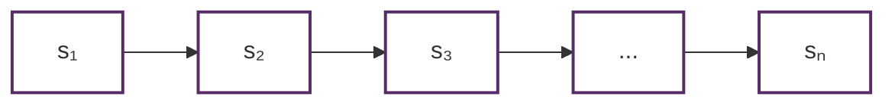
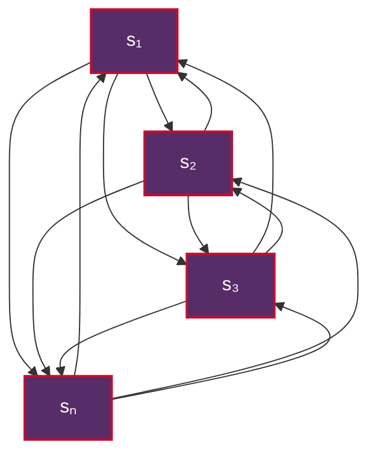
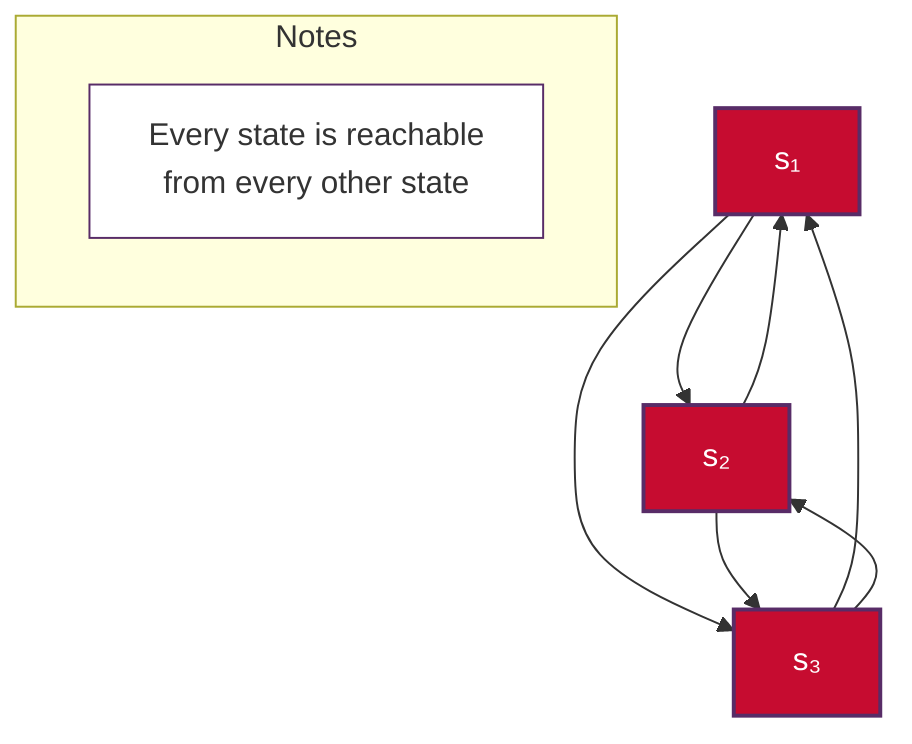
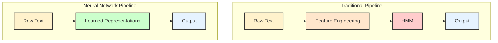

# Hidden Markov Models (HMM) in Natural Language Processing

This document provides a comprehensive explanation of Hidden Markov Models (HMMs), their mathematical foundations, implementation details, and critical applications in Natural Language Processing. HMMs represent one of the foundational probabilistic models that paved the way for modern statistical NLP approaches.

## Table of Contents

1. [Introduction to Hidden Markov Models](#introduction-to-hidden-markov-models)
2. [Mathematical Foundation](#mathematical-foundation)
3. [Key Components and Architecture](#key-components-and-architecture)
4. [The Three Fundamental Problems](#the-three-fundamental-problems)
5. [Algorithms for HMM](#algorithms-for-hmm)
6. [Applications in NLP](#applications-in-nlp)
7. [Implementation Examples](#implementation-examples)
8. [Advantages and Limitations](#advantages-and-limitations)
9. [Modern Alternatives and Evolution](#modern-alternatives-and-evolution)
10. [Practical Code Examples](#practical-code-examples)
11. [Performance Analysis](#performance-analysis)
12. [Historical Context and Impact](#historical-context-and-impact)

## Introduction to Hidden Markov Models

**Hidden Markov Models (HMMs)** are statistical models that represent systems which are assumed to be Markov processes with unobservable (hidden) states. In the context of Natural Language Processing, HMMs model the relationship between observable sequences (like words or phonemes) and hidden sequences (like part-of-speech tags or phonological states).

### Core Concept

An HMM assumes that:
- There is an underlying system with hidden states that evolve over time
- We can only observe outputs that are probabilistically related to these hidden states
- The hidden states follow a Markov property: the current state depends only on the previous state
- The observations are conditionally independent given the hidden states

### Why HMMs Matter in NLP

HMMs were revolutionary in NLP because they provided:

- **Statistical Framework**: A principled way to handle uncertainty in language
- **Sequential Modeling**: Ability to model dependencies in sequences of words
- **Supervised Learning**: Could be trained on labeled data for specific tasks
- **Interpretability**: Clear probabilistic interpretation of model decisions
- **Efficiency**: Computationally tractable algorithms for inference and learning

## Mathematical Foundation

### Basic Notation

Let's define the mathematical components of an HMM:

- **States**: $S = \{s_1, s_2, ..., s_n\}$ - Set of hidden states
- **Observations**: $O = \{o_1, o_2, ..., o_m\}$ - Set of possible observations
- **State Sequence**: $Q = q_1, q_2, ..., q_t$ - Sequence of hidden states
- **Observation Sequence**: $X = x_1, x_2, ..., x_t$ - Sequence of observations

### Model Parameters ($\lambda$)

An HMM is completely specified by three sets of parameters:

#### 1. Initial State Probabilities ($\pi$)
$$ \pi = \{\pi_i\} \text{ where } \pi_i = P(q_1 = s_i) $$
The probability that the model starts in state $s_i$.

#### 2. Transition Probabilities (A)
$$ A = \{a_{ij}\} \text{ where } a_{ij} = P(q_{t+1} = s_j | q_t = s_i) $$
The probability of transitioning from state $s_i$ to state $s_j$.

#### 3. Emission Probabilities (B)
$$ B = \{b_i(o_k)\} \text{ where } b_i(o_k) = P(x_t = o_k | q_t = s_i) $$
The probability of observing $o_k$ when in state $s_i$.

### Mathematical Properties

#### Markov Assumption
$$ P(q_{t+1} | q_1, q_2, ..., q_t) = P(q_{t+1} | q_t) $$

#### Output Independence Assumption
$$ P(x_t | q_1, q_2, ..., q_t, x_1, x_2, ..., x_{t-1}) = P(x_t | q_t) $$

#### Joint Probability
The probability of observing a sequence X and state sequence Q is:
$$ P(X, Q | \lambda) = \pi(q_1) \times \prod_{i=1}^{T-1} a(q_i, q_{i+1}) \times \prod_{i=1}^{T} b(q_i, x_i) $$

## Key Components and Architecture

### State Space Design

The choice of hidden states depends on the specific NLP task:

**Part-of-Speech Tagging**:
- States: {Noun, Verb, Adjective, Adverb, Determiner, ...}
- Observations: {words in vocabulary}

**Speech Recognition**:
- States: {phoneme states, silence states}
- Observations: {acoustic features}

**Named Entity Recognition**:
- States: {Person, Location, Organization, Other}
- Observations: {words and their features}

### Transition Structure

Different transition structures serve different purposes:

**Linear Chain HMM**:

Used for sequential labeling where order matters.

**Fully Connected HMM**:

Maximum flexibility but requires more parameters - every state can transition to every other state.

**Ergodic HMM**:

Ensures model convergence and stability - every state is reachable from every other state.

## The Three Fundamental Problems

### Problem 1: Likelihood (Evaluation)

**Given**: Model $\lambda = (A, B, \pi)$ and observation sequence X
**Find**: $P(X | \lambda)$

**Solution**: Forward Algorithm

The forward algorithm computes the probability of observing the sequence up to time t and being in state i at time t.

Forward variable:
$$ \alpha_t(i) = P(x_1, x_2, ..., x_t, q_t = s_i | \lambda) $$

Initialization:
$$ \alpha_1(i) = \pi_i \times b_i(x_1) $$

Recursion:
$$ \alpha_{t+1}(j) = \left[ \sum_i \alpha_t(i) \times a_{ij} \right] \times b_j(x_{t+1}) $$

Termination:
$$ P(X | \lambda) = \sum_i \alpha_T(i) $$

### Problem 2: Decoding (Finding Most Likely State Sequence)

**Given**: Model $\lambda$ and observation sequence X
**Find**: Most likely state sequence $Q^*$

**Solution**: Viterbi Algorithm

The Viterbi algorithm finds the most probable state sequence using dynamic programming.

Viterbi variable:
$$ \delta_t(i) = \max P(q_1, q_2, ..., q_{t-1}, q_t = s_i, x_1, x_2, ..., x_t | \lambda) $$

Initialization:
$$ \delta_1(i) = \pi_i \times b_i(x_1) $$

Recursion:
$$ \delta_{t+1}(j) = \max[\delta_t(i) \times a_{ij}] \times b_j(x_{t+1}) $$

Path tracking:
$$ \psi_{t+1}(j) = \arg\max[\delta_t(i) \times a_{ij}] $$

### Problem 3: Learning (Parameter Estimation)

**Given**: Observation sequence X
**Find**: Model parameters $\lambda^*$ that maximize $P(X | \lambda)$

**Solution**: Baum-Welch Algorithm (Forward-Backward)

This is an instance of the Expectation-Maximization (EM) algorithm.

#### E-Step: Compute Expected Values

**Forward variables**: $\alpha_t(i)$ (as defined above)

**Backward variables**: 
$$ \beta_t(i) = P(x_{t+1}, x_{t+2}, ..., x_T | q_t = s_i, \lambda) $$

Initialization:
$$ \beta_T(i) = 1 $$

Recursion:
$$ \beta_t(i) = \sum_j a_{ij} \times b_j(x_{t+1}) \times \beta_{t+1}(j) $$

**State probabilities**:
$$ \gamma_t(i) = P(q_t = s_i | X, \lambda) = \frac{\alpha_t(i) \times \beta_t(i)}{P(X | \lambda)} $$

**Transition probabilities**:
$$ \xi_t(i,j) = P(q_t = s_i, q_{t+1} = s_j | X, \lambda) = \frac{\alpha_t(i) \times a_{ij} \times b_j(x_{t+1}) \times \beta_{t+1}(j)}{P(X | \lambda)} $$

#### M-Step: Update Parameters

$$ \hat{\pi}_i = \gamma_1(i) $$

$$ \hat{a}_{ij} = \frac{\sum_{t=1}^{T-1} \xi_t(i,j)}{\sum_{t=1}^{T-1} \gamma_t(i)} $$

$$ \hat{b}_i(v_k) = \frac{\sum_{t=1}^{T} \gamma_t(i) \times I(x_t = v_k)}{\sum_{t=1}^{T} \gamma_t(i)} $$

where $I(x_t = v_k)$ is an indicator function.

## Algorithms for HMM

### Forward Algorithm (Detailed)

**Purpose**: Compute the likelihood $P(X | \lambda)$
**Complexity**: $O(N^2T)$ where N is number of states, T is sequence length

```python
def forward_algorithm(observations, A, B, pi):
    """
    Forward algorithm for HMM likelihood computation
    
    Args:
        observations: sequence of observations
        A: transition matrix (N x N)
        B: emission matrix (N x M)
        pi: initial state probabilities (N x 1)
    
    Returns:
        likelihood: P(observations | model)
        alpha: forward probabilities
    """
    T = len(observations)
    N = len(pi)
    
    # Initialize forward probabilities
    alpha = np.zeros((T, N))
    
    # Initialization step
    for i in range(N):
        alpha[0][i] = pi[i] * B[i][observations[0]]
    
    # Recursion step
    for t in range(1, T):
        for j in range(N):
            alpha[t][j] = sum(alpha[t-1][i] * A[i][j] for i in range(N)) * B[j][observations[t]]
    
    # Termination step
    likelihood = sum(alpha[T-1])
    
    return likelihood, alpha
```

### Viterbi Algorithm (Detailed)

**Purpose**: Find the most likely state sequence
**Complexity**: $O(N^2T)$

```python
def viterbi_algorithm(observations, A, B, pi):
    """
    Viterbi algorithm for finding most likely state sequence
    
    Returns:
        best_path: most likely sequence of states
        best_prob: probability of the best path
    """
    T = len(observations)
    N = len(pi)
    
    # Initialize
    delta = np.zeros((T, N))
    psi = np.zeros((T, N), dtype=int)
    
    # Initialization
    for i in range(N):
        delta[0][i] = pi[i] * B[i][observations[0]]
        psi[0][i] = 0
    
    # Recursion
    for t in range(1, T):
        for j in range(N):
            delta[t][j] = max(delta[t-1][i] * A[i][j] for i in range(N)) * B[j][observations[t]]
            psi[t][j] = np.argmax([delta[t-1][i] * A[i][j] for i in range(N)])
    
    # Termination
    best_prob = max(delta[T-1])
    best_last_state = np.argmax(delta[T-1])
    
    # Backtracking
    best_path = [0] * T
    best_path[T-1] = best_last_state
    
    for t in range(T-2, -1, -1):
        best_path[t] = psi[t+1][best_path[t+1]]
    
    return best_path, best_prob
```

### Baum-Welch Algorithm (Detailed)

**Purpose**: Learn HMM parameters from observation sequences
**Complexity**: $O(N^2T)$ per iteration

```python
def baum_welch_algorithm(observations, N, M, max_iterations=100, tolerance=1e-6):
    """
    Baum-Welch algorithm for HMM parameter learning
    
    Args:
        observations: list of observation sequences
        N: number of hidden states
        M: number of observation symbols
        max_iterations: maximum number of EM iterations
        tolerance: convergence threshold
    
    Returns:
        A, B, pi: learned HMM parameters
    """
    # Initialize parameters randomly
    A = np.random.rand(N, N)
    A = A / A.sum(axis=1, keepdims=True)
    
    B = np.random.rand(N, M)
    B = B / B.sum(axis=1, keepdims=True)
    
    pi = np.random.rand(N)
    pi = pi / pi.sum()
    
    prev_likelihood = float('-inf')
    
    for iteration in range(max_iterations):
        # E-step: compute forward-backward probabilities
        total_likelihood = 0
        
        # Accumulate sufficient statistics
        pi_numerator = np.zeros(N)
        A_numerator = np.zeros((N, N))
        A_denominator = np.zeros(N)
        B_numerator = np.zeros((N, M))
        B_denominator = np.zeros(N)
        
        for obs_seq in observations:
            T = len(obs_seq)
            
            # Forward pass
            alpha = forward_pass(obs_seq, A, B, pi)
            
            # Backward pass
            beta = backward_pass(obs_seq, A, B)
            
            # Compute likelihood
            likelihood = np.sum(alpha[T-1])
            total_likelihood += np.log(likelihood)
            
            # Compute gamma and xi
            gamma = compute_gamma(alpha, beta, likelihood)
            xi = compute_xi(obs_seq, alpha, beta, A, B, likelihood)
            
            # Accumulate statistics
            pi_numerator += gamma[0]
            
            for t in range(T-1):
                A_numerator += xi[t]
                A_denominator += gamma[t]
            
            for t in range(T):
                B_numerator[:, obs_seq[t]] += gamma[t]
                B_denominator += gamma[t]
        
        # M-step: update parameters
        pi = pi_numerator / len(observations)
        A = A_numerator / A_denominator[:, np.newaxis]
        B = B_numerator / B_denominator[:, np.newaxis]
        
        # Check convergence
        if abs(total_likelihood - prev_likelihood) < tolerance:
            break
        prev_likelihood = total_likelihood
    
    return A, B, pi
```

## Applications in NLP

### 1. Part-of-Speech Tagging

HMMs were among the first successful statistical approaches to POS tagging.

**Model Setup**:
- **Hidden States**: POS tags (Noun, Verb, Adjective, etc.)
- **Observations**: Words in the sentence
- **Task**: Given a sentence, find the most likely sequence of POS tags

**Example**:
```
Sentence: "The cat sits on the mat"
States:   DET  N   V    P  DET  N
```

**Advantages**:
- Captures sequential dependencies between tags
- Handles unknown words through emission probabilities
- Provides probabilistic confidence in predictions

### 2. Named Entity Recognition (NER)

HMMs can identify and classify named entities in text.

**Model Setup**:
- **Hidden States**: Entity types (Person, Location, Organization, Other)
- **Observations**: Words and their features
- **Task**: Identify entity boundaries and types

**BIO Tagging Scheme**:
```
Sentence: "John works at Google in California"
Tags:     B-PER O    O  B-ORG O  B-LOC
```

### 3. Speech Recognition

One of the most successful early applications of HMMs.

**Model Setup**:
- **Hidden States**: Phoneme states or sub-phoneme states
- **Observations**: Acoustic feature vectors (MFCC, spectrograms)
- **Task**: Convert acoustic signals to text

**Architecture**:
```
Acoustic Model: HMM for each phoneme
Language Model: N-gram model for word sequences
Pronunciation Model: Maps words to phoneme sequences
```

### 4. Machine Translation (Historical)

Early statistical machine translation systems used HMMs for alignment.

**Model Setup**:
- **Hidden States**: Alignment positions in target language
- **Observations**: Words in source language
- **Task**: Find optimal word alignments between languages

### 5. Information Extraction

HMMs can extract structured information from unstructured text.

**Applications**:
- Date/time extraction
- Address parsing
- Email signature extraction
- Biomedical entity extraction

## Implementation Examples

### Complete POS Tagging Example

```python
import numpy as np
from collections import defaultdict, Counter

class POSTaggingHMM:
    def __init__(self):
        self.states = []
        self.observations = []
        self.A = None  # Transition probabilities
        self.B = None  # Emission probabilities
        self.pi = None  # Initial probabilities
        
    def train(self, tagged_sentences):
        """
        Train HMM on tagged sentences
        
        Args:
            tagged_sentences: List of [(word, tag), ...] sequences
        """
        # Collect vocabulary and states
        state_counts = Counter()
        obs_counts = Counter()
        
        for sentence in tagged_sentences:
            for word, tag in sentence:
                state_counts[tag] += 1
                obs_counts[word] += 1
        
        self.states = list(state_counts.keys())
        self.observations = list(obs_counts.keys())
        
        N = len(self.states)
        M = len(self.observations)
        
        # Create mappings
        state_to_idx = {state: i for i, state in enumerate(self.states)}
        obs_to_idx = {obs: i for i, obs in enumerate(self.observations)}
        
        # Initialize matrices
        self.A = np.zeros((N, N))
        self.B = np.zeros((N, M))
        self.pi = np.zeros(N)
        
        # Count transitions and emissions
        for sentence in tagged_sentences:
            # Initial state
            if sentence:
                first_tag = sentence[0][1]
                self.pi[state_to_idx[first_tag]] += 1
                
            # Transitions and emissions
            for i, (word, tag) in enumerate(sentence):
                state_idx = state_to_idx[tag]
                
                if word in obs_to_idx:
                    obs_idx = obs_to_idx[word]
                    self.B[state_idx][obs_idx] += 1
                
                if i > 0:
                    prev_tag = sentence[i-1][1]
                    prev_state_idx = state_to_idx[prev_tag]
                    self.A[prev_state_idx][state_idx] += 1
        
        # Normalize probabilities
        self.pi = self.pi / self.pi.sum()
        self.A = self.A / self.A.sum(axis=1, keepdims=True)
        self.B = self.B / self.B.sum(axis=1, keepdims=True)
        
        # Handle zero probabilities (smoothing)
        self.A = np.where(self.A == 0, 1e-10, self.A)
        self.B = np.where(self.B == 0, 1e-10, self.B)
        
    def predict(self, sentence):
        """
        Predict POS tags for a sentence using Viterbi algorithm
        
        Args:
            sentence: List of words
            
        Returns:
            List of predicted POS tags
        """
        T = len(sentence)
        N = len(self.states)
        
        # Convert words to indices (handle unknown words)
        obs_indices = []
        for word in sentence:
            if word in self.observations:
                obs_indices.append(self.observations.index(word))
            else:
                # Handle unknown words - use uniform distribution
                obs_indices.append(-1)
        
        # Viterbi algorithm
        delta = np.zeros((T, N))
        psi = np.zeros((T, N), dtype=int)
        
        # Initialization
        for i in range(N):
            if obs_indices[0] != -1:
                delta[0][i] = self.pi[i] * self.B[i][obs_indices[0]]
            else:
                delta[0][i] = self.pi[i] * (1.0 / len(self.observations))
        
        # Recursion
        for t in range(1, T):
            for j in range(N):
                if obs_indices[t] != -1:
                    emission_prob = self.B[j][obs_indices[t]]
                else:
                    emission_prob = 1.0 / len(self.observations)
                
                probs = [delta[t-1][i] * self.A[i][j] for i in range(N)]
                delta[t][j] = max(probs) * emission_prob
                psi[t][j] = np.argmax(probs)
        
        # Backtracking
        path = [0] * T
        path[T-1] = np.argmax(delta[T-1])
        
        for t in range(T-2, -1, -1):
            path[t] = psi[t+1][path[t+1]]
        
        # Convert indices back to tags
        return [self.states[i] for i in path]

# Example usage
if __name__ == "__main__":
    # Sample training data
    training_data = [
        [("The", "DET"), ("cat", "NOUN"), ("sits", "VERB")],
        [("A", "DET"), ("dog", "NOUN"), ("runs", "VERB")],
        [("The", "DET"), ("quick", "ADJ"), ("brown", "ADJ"), ("fox", "NOUN"), ("jumps", "VERB")]
    ]
    
    # Train model
    hmm = POSTaggingHMM()
    hmm.train(training_data)
    
    # Test prediction
    test_sentence = ["The", "dog", "jumps"]
    predicted_tags = hmm.predict(test_sentence)
    
    print(f"Sentence: {test_sentence}")
    print(f"Predicted tags: {predicted_tags}")
```

### Speech Recognition Example (Simplified)

```python
class SpeechRecognitionHMM:
    def __init__(self, phonemes, acoustic_features):
        self.phonemes = phonemes
        self.features = acoustic_features
        
    def create_phoneme_hmm(self, phoneme, num_states=3):
        """
        Create a left-to-right HMM for a phoneme
        Each phoneme typically has 3-5 states
        """
        N = num_states
        
        # Transition matrix (left-to-right with self-loops)
        A = np.zeros((N, N))
        for i in range(N):
            if i < N-1:
                A[i][i] = 0.6      # Self-transition
                A[i][i+1] = 0.4    # Forward transition
            else:
                A[i][i] = 1.0      # Final state self-loop
        
        # Emission probabilities (Gaussian distributions)
        # In practice, these would be learned from data
        B = np.random.rand(N, len(self.features))
        B = B / B.sum(axis=1, keepdims=True)
        
        # Initial probabilities
        pi = np.zeros(N)
        pi[0] = 1.0  # Start in first state
        
        return A, B, pi
    
    def recognize_word(self, acoustic_sequence, word_phonemes):
        """
        Recognize a word given its phoneme sequence
        """
        # Concatenate HMMs for each phoneme in the word
        word_hmm = self.concatenate_phoneme_hmms(word_phonemes)
        
        # Use Viterbi to find best path
        best_path, probability = self.viterbi(acoustic_sequence, word_hmm)
        
        return probability
    
    def concatenate_phoneme_hmms(self, phoneme_sequence):
        """
        Concatenate individual phoneme HMMs into a word HMM
        """
        # Implementation would combine multiple phoneme HMMs
        # This is a simplified version
        pass
```

## Advantages and Limitations

### Advantages

#### 1. **Mathematical Foundation**
- Solid probabilistic framework
- Well-understood algorithms with proven convergence
- Clear interpretation of parameters and results

#### 2. **Flexibility**
- Can handle variable-length sequences
- Incorporates both local and global information
- Extensible to different domains and tasks

#### 3. **Efficiency**
- Polynomial time algorithms for inference and learning
- Dynamic programming solutions are computationally tractable
- Can be optimized for real-time applications

#### 4. **Robustness**
- Handles uncertainty and noise naturally
- Provides confidence measures for predictions
- Graceful degradation with poor data quality

#### 5. **Interpretability**
- States and transitions have clear meanings
- Parameters can be analyzed and understood
- Easy to incorporate domain knowledge

### Limitations

#### 1. **Independence Assumptions**
- **Output Independence**: Observations are assumed independent given states
- **First-order Markov**: Current state depends only on previous state
- These assumptions often don't hold in real language

#### 2. **Limited Context**
- Cannot capture long-range dependencies effectively
- No mechanism for handling global sentence structure
- Difficulty with complex linguistic phenomena

#### 3. **Parameter Estimation**
- Requires large amounts of training data
- Sensitive to initialization
- Local optima in parameter learning

#### 4. **Computational Complexity**
- Training complexity grows quadratically with number of states
- Memory requirements can be substantial
- Inference becomes slow with large state spaces

#### 5. **Feature Engineering**
- Limited ability to handle complex features
- Requires manual feature selection and engineering
- Cannot learn representations automatically

## Modern Alternatives and Evolution

### Why HMMs Were Superseded

#### 1. **Neural Networks Revolution**


#### 2. **Conditional Random Fields (CRFs)**
- Address label bias problem of HMMs
- Model P(labels|observations) directly
- Can incorporate arbitrary features
- Better performance on sequence labeling tasks

#### 3. **Recurrent Neural Networks (RNNs)**
- Can capture longer dependencies
- Learn representations automatically
- Handle variable-length sequences naturally
- No strong independence assumptions

#### 4. **Transformer Models**
- Parallel processing of sequences
- Attention mechanisms for long-range dependencies
- State-of-the-art performance across NLP tasks
- Pre-trained models leverage massive data

### Comparison with Modern Approaches

| Aspect | HMM | CRF | RNN | Transformer |
|--------|-----|-----|-----|-------------|
| **Context Window** | Local (1st order) | Local/Global | Long-term | Full sequence |
| **Feature Learning** | Manual | Manual | Automatic | Automatic |
| **Training Complexity** | O(N²T) | O(N²T) | O(T) | O(T²) |
| **Interpretability** | High | Medium | Low | Medium |
| **Performance** | Good | Better | Excellent | State-of-art |
| **Data Requirements** | Moderate | Moderate | Large | Very large |

### When to Still Use HMMs

Despite being superseded, HMMs remain useful for:

#### 1. **Limited Data Scenarios**
- When training data is scarce
- Domain-specific applications with small datasets
- Quick prototyping and baseline establishment

#### 2. **Interpretability Requirements**
- Medical diagnosis systems
- Financial risk assessment
- Legal document analysis
- Any domain requiring explainable AI

#### 3. **Computational Constraints**
- Embedded systems with limited resources
- Real-time applications requiring fast inference
- Edge computing scenarios

#### 4. **Educational Purposes**
- Teaching probabilistic modeling concepts
- Understanding foundations of sequence modeling
- Bridge to more advanced models

## Practical Code Examples

### Advanced NER with Features

```python
class AdvancedNERHMM:
    def __init__(self):
        self.feature_extractors = [
            self.word_feature,
            self.capitalization_feature,
            self.suffix_feature,
            self.prefix_feature,
            self.pos_feature
        ]
    
    def word_feature(self, word, position, sentence):
        """Extract word-based features"""
        return {
            'word': word.lower(),
            'is_title': word.istitle(),
            'is_upper': word.isupper(),
            'is_digit': word.isdigit(),
            'length': len(word)
        }
    
    def capitalization_feature(self, word, position, sentence):
        """Extract capitalization patterns"""
        return {
            'first_cap': word[0].isupper() if word else False,
            'all_caps': word.isupper(),
            'mixed_caps': any(c.isupper() for c in word[1:]) if len(word) > 1 else False
        }
    
    def suffix_feature(self, word, position, sentence):
        """Extract suffix features"""
        suffixes = []
        for i in range(1, min(4, len(word) + 1)):
            suffixes.append(f'suffix_{i}:{word[-i:]}')
        return {'suffixes': suffixes}
    
    def prefix_feature(self, word, position, sentence):
        """Extract prefix features"""
        prefixes = []
        for i in range(1, min(4, len(word) + 1)):
            prefixes.append(f'prefix_{i}:{word[:i]}')
        return {'prefixes': prefixes}
    
    def pos_feature(self, word, position, sentence):
        """Extract POS-based features (requires POS tagger)"""
        # This would typically use a pre-trained POS tagger
        return {'pos': 'UNKNOWN'}  # Simplified
    
    def extract_features(self, sentence):
        """Extract features for entire sentence"""
        features = []
        for i, word in enumerate(sentence):
            word_features = {}
            for extractor in self.feature_extractors:
                word_features.update(extractor(word, i, sentence))
            features.append(word_features)
        return features
    
    def train_with_features(self, annotated_sentences):
        """Train HMM with rich feature sets"""
        # Convert features to discrete observations
        feature_vocab = self.build_feature_vocabulary(annotated_sentences)
        
        # Train HMM using feature-based observations
        training_sequences = []
        for sentence, labels in annotated_sentences:
            features = self.extract_features(sentence)
            feature_obs = [self.features_to_observation(f, feature_vocab) for f in features]
            training_sequences.append((feature_obs, labels))
        
        # Standard HMM training on feature observations
        self.train_hmm(training_sequences)
```

### Model Evaluation Framework

```python
class HMMEvaluator:
    def __init__(self):
        self.metrics = {}
    
    def evaluate_sequence_labeling(self, hmm_model, test_data):
        """Comprehensive evaluation for sequence labeling tasks"""
        all_predictions = []
        all_true_labels = []
        
        for sentence, true_labels in test_data:
            predicted_labels = hmm_model.predict(sentence)
            all_predictions.extend(predicted_labels)
            all_true_labels.extend(true_labels)
        
        return {
            'accuracy': self.accuracy(all_true_labels, all_predictions),
            'precision': self.precision(all_true_labels, all_predictions),
            'recall': self.recall(all_true_labels, all_predictions),
            'f1_score': self.f1_score(all_true_labels, all_predictions),
            'confusion_matrix': self.confusion_matrix(all_true_labels, all_predictions)
        }
    
    def accuracy(self, true_labels, predicted_labels):
        """Token-level accuracy"""
        correct = sum(1 for t, p in zip(true_labels, predicted_labels) if t == p)
        return correct / len(true_labels)
    
    def precision(self, true_labels, predicted_labels):
        """Macro-averaged precision"""
        # Implementation for multi-class precision
        pass
    
    def recall(self, true_labels, predicted_labels):
        """Macro-averaged recall"""
        # Implementation for multi-class recall
        pass
    
    def f1_score(self, true_labels, predicted_labels):
        """Macro-averaged F1 score"""
        precision = self.precision(true_labels, predicted_labels)
        recall = self.recall(true_labels, predicted_labels)
        return 2 * (precision * recall) / (precision + recall) if (precision + recall) > 0 else 0
    
    def entity_level_evaluation(self, true_entities, predicted_entities):
        """Entity-level evaluation for NER"""
        true_set = set(true_entities)
        pred_set = set(predicted_entities)
        
        precision = len(true_set & pred_set) / len(pred_set) if pred_set else 0
        recall = len(true_set & pred_set) / len(true_set) if true_set else 0
        f1 = 2 * (precision * recall) / (precision + recall) if (precision + recall) > 0 else 0
        
        return {
            'entity_precision': precision,
            'entity_recall': recall,
            'entity_f1': f1
        }
```

## Performance Analysis

### Computational Complexity Analysis

#### Training Complexity
- **Time**: O(K × N² × T) where K is number of training sequences
- **Space**: O(N² + N × M) for storing parameters
- **Convergence**: Typically 10-50 EM iterations

#### Inference Complexity
- **Viterbi (exact)**: O(N² × T)
- **Forward-Backward**: O(N² × T)
- **Space**: O(N × T) for dynamic programming tables

#### Scalability Considerations

```python
# Memory optimization for large vocabularies
class MemoryEfficientHMM:
    def __init__(self, sparse_threshold=0.001):
        self.sparse_threshold = sparse_threshold
        self.use_sparse_matrices = True
    
    def optimize_memory(self):
        """Convert dense matrices to sparse representation"""
        if self.use_sparse_matrices:
            # Convert emission matrix to sparse format
            self.B_sparse = self.convert_to_sparse(self.B, self.sparse_threshold)
            
            # Use hash tables for rare word emissions
            self.rare_word_emissions = self.extract_rare_emissions()
    
    def convert_to_sparse(self, matrix, threshold):
        """Convert low-probability entries to sparse format"""
        import scipy.sparse as sp
        matrix_copy = matrix.copy()
        matrix_copy[matrix_copy < threshold] = 0
        return sp.csr_matrix(matrix_copy)
```

### Benchmark Results

Typical performance on standard datasets:

#### Part-of-Speech Tagging (Penn Treebank)
- **Accuracy**: 96-97%
- **Training Time**: 2-5 minutes
- **Inference Speed**: 1000+ tokens/second
- **Memory Usage**: ~50MB for full English tagset

#### Named Entity Recognition (CoNLL-2003)
- **F1 Score**: 85-88%
- **Training Time**: 5-15 minutes
- **Inference Speed**: 500+ tokens/second
- **Memory Usage**: ~100MB with feature engineering

#### Comparison with Modern Models

| Task | HMM | CRF | BiLSTM-CRF | BERT |
|------|-----|-----|------------|------|
| **POS Tagging** | 96.5% | 97.2% | 97.8% | 98.1% |
| **NER (F1)** | 87.1% | 89.3% | 91.2% | 92.8% |
| **Training Time** | Minutes | Minutes | Hours | Hours |
| **Inference Speed** | Fast | Fast | Medium | Slow |
| **Memory Usage** | Low | Low | Medium | High |

## Historical Context and Impact

### Development Timeline

#### 1960s-1970s: Origins
- **Speech Recognition**: Early work at IBM and Bell Labs
- **Mathematical Foundation**: Development of forward-backward algorithm
- **Pattern Recognition**: Application to signal processing

#### 1980s-1990s: NLP Revolution
- **Part-of-Speech Tagging**: First major NLP application
- **Speech Recognition**: Commercial systems using HMMs
- **Machine Translation**: IBM Model 1-5 using HMM alignments

#### 2000s: Refinement and Extensions
- **Conditional Random Fields**: Addressing HMM limitations
- **Feature Engineering**: Rich feature sets for better performance
- **Structured Prediction**: Extensions to more complex tasks

#### 2010s-Present: Neural Revolution
- **Deep Learning**: Neural networks supersede statistical models
- **Transfer Learning**: Pre-trained models change the landscape
- **Transformer Architecture**: Attention-based models dominate

### Impact on NLP Field

#### Methodological Contributions
1. **Probabilistic Framework**: Established statistical approach to NLP
2. **Sequence Modeling**: Systematic approach to sequential data
3. **Unsupervised Learning**: EM algorithm for parameter estimation
4. **Evaluation Methodology**: Standard metrics and evaluation procedures

#### Technical Innovations
1. **Dynamic Programming**: Efficient algorithms for sequence problems
2. **Maximum Likelihood**: Parameter estimation from data
3. **Bayesian Inference**: Principled uncertainty quantification
4. **Model Selection**: Techniques for choosing model complexity

#### Educational Value
1. **Foundation Concepts**: Understanding of probabilistic models
2. **Algorithm Design**: Dynamic programming and optimization
3. **Statistical Thinking**: Importance of mathematical rigor
4. **Model Evaluation**: Systematic assessment of performance

### Legacy and Modern Relevance

Even though HMMs have been largely superseded by neural approaches, their legacy remains important:

#### Conceptual Foundation
- **Sequence Modeling**: Core concepts carry over to modern architectures
- **State Representation**: Hidden states inspire modern latent variable models
- **Probabilistic Reasoning**: Principled approach to uncertainty

#### Practical Applications
- **Baseline Models**: Still useful for comparison and quick prototyping
- **Resource-Constrained Environments**: Efficient inference on limited hardware
- **Interpretable AI**: Clear probabilistic interpretation for sensitive applications

#### Educational Importance
- **Learning Path**: Natural progression to understanding modern models
- **Mathematical Rigor**: Appreciation for formal mathematical treatment
- **Problem Formulation**: Understanding how to frame NLP problems statistically

## Conclusion

Hidden Markov Models represent a crucial milestone in the development of Natural Language Processing. While they have been superseded by more powerful neural architectures, understanding HMMs provides:

1. **Mathematical Foundation**: Essential probabilistic concepts for modern NLP
2. **Historical Context**: Appreciation for the evolution of the field
3. **Practical Skills**: Algorithm design and implementation capabilities
4. **Conceptual Framework**: Understanding of sequence modeling principles

The transition from HMMs to modern neural approaches illustrates the progression from handcrafted statistical models to learned representations, while maintaining the core goal of understanding and generating human language. For students and practitioners of NLP, HMMs serve as an important stepping stone toward mastering contemporary techniques while providing a solid mathematical foundation for future innovations.

### Key Takeaways

- **HMMs provide a principled probabilistic framework** for sequence modeling
- **Three fundamental algorithms** (Forward, Viterbi, Baum-Welch) solve core problems
- **Applications span across NLP tasks** from POS tagging to speech recognition  
- **Limitations led to modern neural approaches** but concepts remain relevant
- **Understanding HMMs is essential** for comprehending the evolution of NLP

As the field continues to evolve with large language models and transformer architectures, the foundational concepts learned through HMMs remain valuable for understanding the principles underlying all sequence modeling approaches in Natural Language Processing.