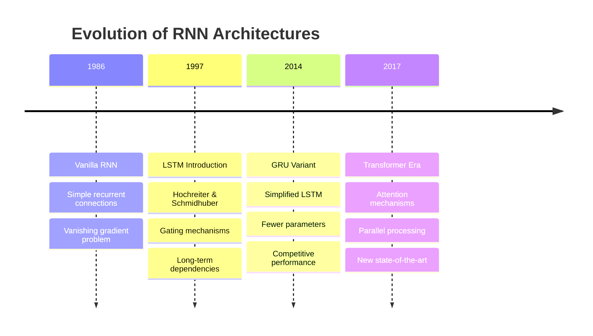

# Long Short-Term Memory (LSTM) Networks in Natural Language Processing

This document provides a comprehensive explanation of Long Short-Term Memory (LSTM) networks, their role in Recurrent Neural Networks (RNNs), and their applications in Natural Language Processing with practical implementation examples.

## Table of Contents

1. [What is LSTM (Long Short-Term Memory)](#what-is-lstm-long-short-term-memory)
2. [Usage in RNN](#usage-in-rnn)
3. [Usage in NLP](#usage-in-nlp)
4. [Sample Code in Python using PyTorch](#sample-code-in-python-using-pytorch)
5. [Advanced LSTM Architectures](#advanced-lstm-architectures)
6. [Performance Considerations](#performance-considerations)
7. [Comparison with Other Architectures](#comparison-with-other-architectures)
8. [Best Practices](#best-practices)
9. [Resources and Further Reading](#resources-and-further-reading)

## What is LSTM (Long Short-Term Memory)

**Long Short-Term Memory (LSTM)** is a specialized type of Recurrent Neural Network (RNN) architecture designed to address the vanishing gradient problem that plagues traditional RNNs. Introduced by Hochreiter and Schmidhuber in 1997, LSTMs can learn long-term dependencies in sequential data through a sophisticated gating mechanism.

### Core Architecture

The LSTM cell state flows through the network with minimal linear interactions, allowing information to flow unchanged. Three gates control the flow of information:

```mermaid
graph TD
    A[Input x_t] --> B[Forget Gate]
    A --> C[Input Gate]
    A --> D[Candidate Values]
    A --> E[Output Gate]
    
    F[Previous Cell State C_{t-1}] --> B
    F --> G[Point-wise Multiplication]
    
    B --> G
    C --> H[Point-wise Multiplication]
    D --> H
    
    G --> I[Point-wise Addition]
    H --> I
    
    I --> J[New Cell State C_t]
    J --> K[tanh]
    E --> L[Point-wise Multiplication]
    K --> L
    
    L --> M[Hidden State h_t]
    
    style B fill:#ffcccc,stroke:#333,stroke-width:2px
    style C fill:#ccffcc,stroke:#333,stroke-width:2px
    style E fill:#ccccff,stroke:#333,stroke-width:2px
    style J fill:#ffffcc,stroke:#333,stroke-width:2px
    
    subgraph Gates
        gate1[Forget Gate - Decides what to discard]
        gate2[Input Gate - Decides what to store]
        gate3[Output Gate - Controls output]
    end
```

### Mathematical Foundation

The LSTM operates through four key equations:

**Forget Gate**: Decides what information to discard from the cell state
$$ f_t = \sigma(W_f \cdot [h_{t-1}, x_t] + b_f) $$

**Input Gate**: Decides which values to update and creates candidate values
$$ i_t = \sigma(W_i \cdot [h_{t-1}, x_t] + b_i) $$
$$ \tilde{C}_t = \tanh(W_C \cdot [h_{t-1}, x_t] + b_C) $$

**Cell State Update**: Combines forget and input operations
$$ C_t = f_t \odot C_{t-1} + i_t \odot \tilde{C}_t $$

**Output Gate**: Controls what parts of the cell state to output
$$ o_t = \sigma(W_o \cdot [h_{t-1}, x_t] + b_o) $$
$$ h_t = o_t \odot \tanh(C_t) $$

Where:
- $\sigma$ is the sigmoid function
- $W$ are weight matrices
- $b$ are bias vectors
- $\odot$ denotes element-wise multiplication

### Key Advantages

1. **Long-term Memory**: Can remember information for extended periods
2. **Gradient Flow**: Addresses vanishing gradient problem through constant error carousel
3. **Selective Memory**: Gates allow selective retention and forgetting of information
4. **Versatility**: Effective across various sequence modeling tasks

## Usage in RNN

LSTMs represent a significant evolution in RNN architecture, addressing fundamental limitations of vanilla RNNs:

### Historical Context



### Comparison with Vanilla RNN

| Aspect | Vanilla RNN | LSTM |
|--------|-------------|------|
| **Memory** | Short-term only | Long and short-term |
| **Gradient Flow** | Vanishing gradients | Stable gradient flow |
| **Parameters** | Fewer | More (3x gates) |
| **Training Time** | Faster | Slower |
| **Performance** | Limited sequences | Long sequences |
| **Complexity** | Simple | Complex gating |

### LSTM Cell State Flow

The key innovation of LSTMs is the cell state $C_t$, which acts as a "conveyor belt" carrying information through time:

```mermaid
graph LR
    A[C_{t-1}] --> B[Forget Gate]
    B --> C[×]
    D[Input Gate] --> E[×]
    F[Candidate Values] --> E
    C --> G[+]
    E --> G
    G --> H[C_t]
    
    style A fill:#ffffcc,stroke:#333
    style H fill:#ffffcc,stroke:#333
    style B fill:#ffcccc,stroke:#333
    style D fill:#ccffcc,stroke:#333
    style F fill:#ccccff,stroke:#333
```

## Usage in NLP

LSTMs have been fundamental in numerous NLP applications before the transformer era and remain relevant for many tasks:

### Primary NLP Applications

#### 1. Language Modeling
Predicting the next word in a sequence:
- **Use Case**: Text generation, auto-completion
- **Architecture**: Character-level or word-level LSTM
- **Output**: Probability distribution over vocabulary

#### 2. Machine Translation
Sequence-to-sequence translation:
- **Architecture**: Encoder-decoder with attention
- **Encoder**: LSTM processes source language
- **Decoder**: LSTM generates target language

#### 3. Sentiment Analysis
Analyzing emotional tone in text:
- **Input**: Variable-length text sequences
- **Output**: Sentiment classification (positive/negative/neutral)
- **Advantage**: Captures contextual sentiment changes

#### 4. Named Entity Recognition (NER)
Identifying entities in text:
- **Architecture**: Bidirectional LSTM + CRF
- **Output**: Sequence labeling (B-PER, I-LOC, etc.)
- **Benefit**: Considers both past and future context

#### 5. Text Summarization
Generating concise summaries:
- **Architecture**: Encoder-decoder with attention
- **Challenge**: Maintaining coherence and key information
- **Application**: News articles, document summarization

### LSTM Advantages in NLP

1. **Sequential Processing**: Natural fit for text sequences
2. **Variable Length**: Handles texts of different lengths
3. **Context Preservation**: Maintains long-range dependencies
4. **Bidirectional Processing**: Can process text in both directions
5. **Hierarchical Learning**: Can learn different levels of abstraction

## Sample Code in Python using PyTorch

Here are practical examples of LSTM implementation using PyTorch:

### LSTM with Return States (as requested)

```python
import torch
import torch.nn as nn
import torch.nn.functional as F

class LSTMWithStates(nn.Module):
    """
    Example showing PyTorch LSTM with return_state functionality.
    This is useful for encoder-decoder architectures.
    """
    def __init__(self, vocab_size, embedding_dim=128, hidden_dim=512, max_length=50):
        super(LSTMWithStates, self).__init__()
        self.embedding_dim = embedding_dim
        self.hidden_dim = hidden_dim
        self.max_length = max_length
        
        # Embedding layer
        self.embedding = nn.Embedding(vocab_size, embedding_dim)
        
        # LSTM layer with 512 units (equivalent to Keras example)
        self.lstm = nn.LSTM(embedding_dim, hidden_dim, batch_first=True)
        
        # Output layer for classification
        self.fc = nn.Linear(hidden_dim, 1)
        self.sigmoid = nn.Sigmoid()
        
    def forward(self, x):
        # Embedding
        embedded = self.embedding(x)
        
        # LSTM forward pass - returns output and (hidden, cell) states
        lstm_out, (hidden_state, cell_state) = self.lstm(embedded)
        
        # Use the final hidden state for classification
        # hidden_state shape: (num_layers, batch, hidden_dim)
        final_hidden = hidden_state[-1]  # Get last layer's hidden state
        
        # Classification layer
        output = self.sigmoid(self.fc(final_hidden))
        
        return output, hidden_state, cell_state

# Example usage
vocab_size = 10000
model = LSTMWithStates(vocab_size)
print("LSTM with return states created successfully!")

# Example forward pass
batch_size = 32
seq_length = 50
dummy_input = torch.randint(0, vocab_size, (batch_size, seq_length))
output, hidden_state, cell_state = model(dummy_input)
print(f"Output shape: {output.shape}")
print(f"Hidden state shape: {hidden_state.shape}")
print(f"Cell state shape: {cell_state.shape}")
```

### Basic LSTM for Text Classification

```python
import torch
import torch.nn as nn
import torch.optim as optim
from torch.utils.data import DataLoader, TensorDataset
import numpy as np

class SimpleLSTMClassifier(nn.Module):
    """
    Basic LSTM for text classification with Vietnamese/English examples.
    """
    def __init__(self, vocab_size, embedding_dim=128, hidden_dim=64, num_classes=2, max_length=100):
        super(SimpleLSTMClassifier, self).__init__()
        self.embedding_dim = embedding_dim
        self.hidden_dim = hidden_dim
        self.max_length = max_length
        
        # Layers
        self.embedding = nn.Embedding(vocab_size, embedding_dim)
        self.lstm = nn.LSTM(embedding_dim, hidden_dim, batch_first=True)
        self.dropout = nn.Dropout(0.3)
        self.fc = nn.Linear(hidden_dim, num_classes)
        
    def forward(self, x):
        # Embedding
        embedded = self.embedding(x)
        
        # LSTM
        lstm_out, (hidden, cell) = self.lstm(embedded)
        
        # Use the last time step output
        last_output = lstm_out[:, -1, :]
        
        # Dropout and classification
        dropped = self.dropout(last_output)
        output = self.fc(dropped)
        
        return output

def train_lstm_classifier(model, train_loader, val_loader, epochs=10):
    """
    Training function for LSTM classifier.
    """
    criterion = nn.CrossEntropyLoss()
    optimizer = optim.Adam(model.parameters(), lr=0.001)
    
    model.train()
    
    for epoch in range(epochs):
        total_loss = 0
        for batch_idx, (data, target) in enumerate(train_loader):
            optimizer.zero_grad()
            output = model(data)
            loss = criterion(output, target)
            loss.backward()
            optimizer.step()
            total_loss += loss.item()
        
        # Validation
        model.eval()
        val_loss = 0
        correct = 0
        with torch.no_grad():
            for data, target in val_loader:
                output = model(data)
                val_loss += criterion(output, target).item()
                pred = output.argmax(dim=1, keepdim=True)
                correct += pred.eq(target.view_as(pred)).sum().item()
        
        val_accuracy = correct / len(val_loader.dataset)
        print(f'Epoch {epoch}: Train Loss: {total_loss/len(train_loader):.4f}, '
              f'Val Loss: {val_loss/len(val_loader):.4f}, Val Acc: {val_accuracy:.4f}')
        
        model.train()

# Example usage with Vietnamese/English sentiment data
vocab_size = 10000
model = SimpleLSTMClassifier(vocab_size)

# Example data (Vietnamese/English sentiment examples)
# English: "I love this!" → Positive (1)
# Vietnamese: "Tôi yêu điều này!" → Positive (1)
# English: "This is terrible." → Negative (0)
# Vietnamese: "Điều này thật tệ." → Negative (0)

# Dummy data for demonstration
train_data = torch.randint(0, vocab_size, (1000, 50))
train_labels = torch.randint(0, 2, (1000,))
val_data = torch.randint(0, vocab_size, (200, 50))
val_labels = torch.randint(0, 2, (200,))

train_dataset = TensorDataset(train_data, train_labels)
val_dataset = TensorDataset(val_data, val_labels)
train_loader = DataLoader(train_dataset, batch_size=32, shuffle=True)
val_loader = DataLoader(val_dataset, batch_size=32)

print("Training LSTM classifier...")
train_lstm_classifier(model, train_loader, val_loader, epochs=5)
### Advanced LSTM for Sequence-to-Sequence Tasks

```python
import torch
import torch.nn as nn
import torch.nn.functional as F

class Seq2SeqLSTM(nn.Module):
    """
    LSTM encoder-decoder model for sequence-to-sequence tasks.
    Perfect for Vietnamese/English translation tasks.
    """
    def __init__(self, src_vocab_size, tgt_vocab_size, embedding_dim=256, 
                 hidden_dim=512, max_length=50):
        super(Seq2SeqLSTM, self).__init__()
        self.src_vocab_size = src_vocab_size
        self.tgt_vocab_size = tgt_vocab_size
        self.embedding_dim = embedding_dim
        self.hidden_dim = hidden_dim
        self.max_length = max_length
        
        # Encoder components
        self.encoder_embedding = nn.Embedding(src_vocab_size, embedding_dim)
        self.encoder_lstm = nn.LSTM(embedding_dim, hidden_dim, batch_first=True)
        
        # Decoder components
        self.decoder_embedding = nn.Embedding(tgt_vocab_size, embedding_dim)
        self.decoder_lstm = nn.LSTM(embedding_dim, hidden_dim, batch_first=True)
        self.decoder_output = nn.Linear(hidden_dim, tgt_vocab_size)
        
    def encode(self, src_seq):
        """Encode source sequence."""
        embedded = self.encoder_embedding(src_seq)
        outputs, (hidden, cell) = self.encoder_lstm(embedded)
        return hidden, cell
        
    def decode(self, tgt_seq, encoder_hidden, encoder_cell):
        """Decode target sequence."""
        embedded = self.decoder_embedding(tgt_seq)
        outputs, (hidden, cell) = self.decoder_lstm(embedded, (encoder_hidden, encoder_cell))
        outputs = self.decoder_output(outputs)
        return outputs
        
    def forward(self, src_seq, tgt_seq):
        """Forward pass for training."""
        # Encode
        encoder_hidden, encoder_cell = self.encode(src_seq)
        
        # Decode
        decoder_outputs = self.decode(tgt_seq, encoder_hidden, encoder_cell)
        
        return decoder_outputs

# Example usage for Vietnamese/English translation
src_vocab_size = 10000  # English vocabulary
tgt_vocab_size = 8000   # Vietnamese vocabulary

seq2seq_model = Seq2SeqLSTM(src_vocab_size, tgt_vocab_size)

# Example translation pairs:
# English: "My name is John" → Vietnamese: "Tên tôi là John"
# English: "Hello" → Vietnamese: "Xin chào"
# English: "Thank you" → Vietnamese: "Cảm ơn"

# Dummy data for demonstration
batch_size = 16
src_seq = torch.randint(0, src_vocab_size, (batch_size, 20))  # English
tgt_seq = torch.randint(0, tgt_vocab_size, (batch_size, 20))  # Vietnamese

# Forward pass
outputs = seq2seq_model(src_seq, tgt_seq)
print(f"Seq2seq output shape: {outputs.shape}")
print("Vietnamese/English translation model created successfully!")
```

## Advanced LSTM Architectures

### Bidirectional LSTM for Named Entity Recognition

```python
import torch
import torch.nn as nn

class BiLSTMNER(nn.Module):
    """
    Bidirectional LSTM model for Named Entity Recognition.
    Perfect for Vietnamese/English NER tasks.
    """
    def __init__(self, vocab_size, tag_size, embedding_dim=100, 
                 hidden_dim=128, max_length=50):
        super(BiLSTMNER, self).__init__()
        self.embedding_dim = embedding_dim
        self.hidden_dim = hidden_dim
        self.tag_size = tag_size
        
        # Layers
        self.embedding = nn.Embedding(vocab_size, embedding_dim)
        self.bilstm = nn.LSTM(embedding_dim, hidden_dim, bidirectional=True, batch_first=True)
        self.dropout = nn.Dropout(0.3)
        
        # Output layer - bidirectional doubles hidden_dim
        self.tag_classifier = nn.Linear(hidden_dim * 2, tag_size)
        
    def forward(self, x):
        # Embedding
        embedded = self.embedding(x)
        
        # Bidirectional LSTM
        lstm_out, _ = self.bilstm(embedded)
        
        # Dropout
        dropped = self.dropout(lstm_out)
        
        # Token-level classification
        tag_scores = self.tag_classifier(dropped)
        
        return tag_scores

# Example usage for Vietnamese/English NER
vocab_size = 10000
tag_size = 9  # IOB2 format: B-PER, I-PER, B-ORG, I-ORG, B-LOC, I-LOC, B-MISC, I-MISC, O
ner_model = BiLSTMNER(vocab_size, tag_size)

# Example NER tasks:
# English: "John lives in Vietnam" → [B-PER, O, O, B-LOC]
# Vietnamese: "John sống ở Việt Nam" → [B-PER, O, O, B-LOC, I-LOC]

print("Bidirectional LSTM NER model created successfully!")
```

### LSTM with Attention Mechanism

```python
import torch
import torch.nn as nn
import torch.nn.functional as F

class AttentionMechanism(nn.Module):
    """Simple attention mechanism for LSTM."""
    def __init__(self, hidden_dim):
        super(AttentionMechanism, self).__init__()
        self.attention = nn.Linear(hidden_dim, 1)
        
    def forward(self, lstm_outputs):
        # lstm_outputs shape: (batch, seq_len, hidden_dim)
        attention_weights = F.softmax(self.attention(lstm_outputs), dim=1)
        
        # Weighted sum
        attended_output = torch.sum(attention_weights * lstm_outputs, dim=1)
        
        return attended_output, attention_weights

class LSTMWithAttention(nn.Module):
    """LSTM model with attention mechanism."""
    def __init__(self, vocab_size, embedding_dim=256, hidden_dim=512, num_classes=2):
        super(LSTMWithAttention, self).__init__()
        
        # Layers
        self.embedding = nn.Embedding(vocab_size, embedding_dim)
        self.bilstm = nn.LSTM(embedding_dim, hidden_dim, bidirectional=True, batch_first=True)
        self.attention = AttentionMechanism(hidden_dim * 2)  # Bidirectional
        self.dropout = nn.Dropout(0.3)
        self.fc1 = nn.Linear(hidden_dim * 2, 256)
        self.fc2 = nn.Linear(256, 128)
        self.output = nn.Linear(128, num_classes)
        
    def forward(self, x):
        # Embedding
        embedded = self.embedding(x)
        
        # Bidirectional LSTM
        lstm_out, _ = self.bilstm(embedded)
        
        # Attention
        attended_out, attention_weights = self.attention(lstm_out)
        
        # Classification layers
        x = F.relu(self.fc1(attended_out))
        x = self.dropout(x)
        x = F.relu(self.fc2(x))
        x = self.dropout(x)
        output = self.output(x)
        
        return output, attention_weights

# Example usage
vocab_size = 15000
attention_model = LSTMWithAttention(vocab_size)
print("LSTM with Attention model created successfully!")
```

## Performance Considerations

### Memory Optimization
- **Gradient Clipping**: Prevents exploding gradients
- **Batch Size**: Balance between memory and convergence
- **Sequence Length**: Truncate very long sequences

### Training Efficiency
- **Learning Rate Scheduling**: Adaptive learning rates
- **Early Stopping**: Prevent overfitting
- **Mixed Precision**: Faster training with reduced memory

### Vietnamese/English Specific Considerations
- **Character-level vs Word-level**: Vietnamese benefits from subword tokenization
- **Cross-lingual Embeddings**: Leverage multilingual models
- **Language-specific Preprocessing**: Handle Vietnamese diacritics properly

## Comparison with Other Architectures

### LSTM vs Transformer
- **LSTM**: Better for sequential processing, memory efficient
- **Transformer**: Better for parallel processing, captures long-range dependencies

### When to Use LSTM
- Sequential data with temporal dependencies
- Memory-constrained environments
- Real-time processing requirements

### When to Use Alternatives
- **Transformer**: Long sequences, parallel processing
- **CNN**: Local patterns, faster training
- **GRU**: Simpler architecture, faster training

## Best Practices

### Model Design
1. **Start Simple**: Begin with basic LSTM, add complexity gradually
2. **Bidirectional**: Use for tasks requiring full context
3. **Attention**: Add for longer sequences
4. **Regularization**: Dropout, weight decay

### Training
1. **Data Preprocessing**: Proper tokenization and padding
2. **Gradient Clipping**: Clip gradients to prevent exploding
3. **Learning Rate**: Start with 0.001, use scheduling
4. **Batch Size**: 32-128 for most tasks

### Evaluation
1. **Cross-validation**: Multiple splits for robust evaluation
2. **Metrics**: Choose appropriate metrics for task
3. **Error Analysis**: Analyze failure cases
4. **Language-specific**: Consider language-specific evaluation

## Resources and Further Reading

### Documentation
- **PyTorch LSTM**: https://pytorch.org/docs/stable/generated/torch.nn.LSTM.html
- **Understanding LSTMs**: http://colah.github.io/posts/2015-08-Understanding-LSTMs/

### Practical Tutorials
- **Text Classification with LSTM**: PyTorch tutorials
- **Language Modeling**: PyTorch examples
- **Sequence-to-Sequence Models**: PyTorch NMT tutorial

### Advanced Topics
- **LSTM Variants**: Exploring different gating mechanisms
- **Attention Mechanisms**: Improving LSTM performance
- **Transformer Comparison**: Understanding when to use each architecture

This comprehensive guide provides both theoretical understanding and practical PyTorch implementation knowledge for using LSTMs effectively in NLP applications.