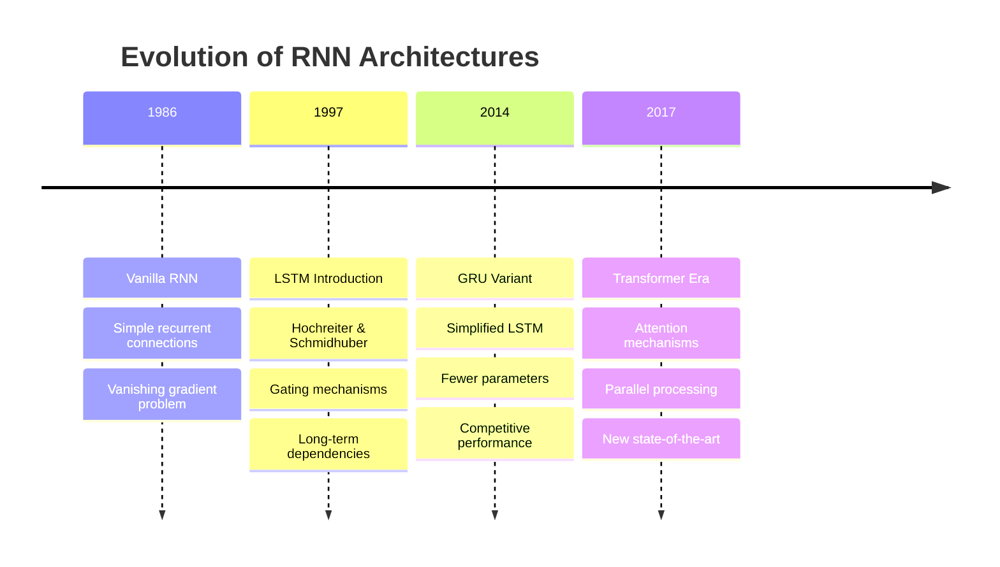

# Long Short-Term Memory (LSTM) Networks in Natural Language Processing

This document provides a comprehensive explanation of Long Short-Term Memory (LSTM) networks, their role in Recurrent Neural Networks (RNNs), and their applications in Natural Language Processing with practical implementation examples.

## Table of Contents

1. [What is LSTM (Long Short-Term Memory)](#what-is-lstm-long-short-term-memory)
2. [Usage in RNN](#usage-in-rnn)
3. [Usage in NLP](#usage-in-nlp)
4. [Sample Code in Python using Keras](#sample-code-in-python-using-keras)
5. [Advanced LSTM Architectures](#advanced-lstm-architectures)
6. [Performance Considerations](#performance-considerations)
7. [Comparison with Other Architectures](#comparison-with-other-architectures)
8. [Best Practices](#best-practices)
9. [Resources and Further Reading](#resources-and-further-reading)

## What is LSTM (Long Short-Term Memory)

**Long Short-Term Memory (LSTM)** is a specialized type of Recurrent Neural Network (RNN) architecture designed to address the vanishing gradient problem that plagues traditional RNNs. Introduced by Hochreiter and Schmidhuber in 1997, LSTMs can learn long-term dependencies in sequential data through a sophisticated gating mechanism.

### Core Architecture

The LSTM cell state flows through the network with minimal linear interactions, allowing information to flow unchanged. Three gates control the flow of information:

```mermaid
graph TD
    A[Input x_t] --> B[Forget Gate]
    A --> C[Input Gate]
    A --> D[Candidate Values]
    A --> E[Output Gate]
    
    F[Previous Cell State C_{t-1}] --> B
    F --> G[Point-wise Multiplication]
    
    B --> G
    C --> H[Point-wise Multiplication]
    D --> H
    
    G --> I[Point-wise Addition]
    H --> I
    
    I --> J[New Cell State C_t]
    J --> K[tanh]
    E --> L[Point-wise Multiplication]
    K --> L
    
    L --> M[Hidden State h_t]
    
    style B fill:#ffcccc,stroke:#333,stroke-width:2px
    style C fill:#ccffcc,stroke:#333,stroke-width:2px
    style E fill:#ccccff,stroke:#333,stroke-width:2px
    style J fill:#ffffcc,stroke:#333,stroke-width:2px
    
    subgraph Gates
        gate1[Forget Gate - Decides what to discard]
        gate2[Input Gate - Decides what to store]
        gate3[Output Gate - Controls output]
    end
```

### Mathematical Foundation

The LSTM operates through four key equations:

**Forget Gate**: Decides what information to discard from the cell state
$$ f_t = \sigma(W_f \cdot [h_{t-1}, x_t] + b_f) $$

**Input Gate**: Decides which values to update and creates candidate values
$$ i_t = \sigma(W_i \cdot [h_{t-1}, x_t] + b_i) $$
$$ \tilde{C}_t = \tanh(W_C \cdot [h_{t-1}, x_t] + b_C) $$

**Cell State Update**: Combines forget and input operations
$$ C_t = f_t * C_{t-1} + i_t * \tilde{C}_t $$

**Output Gate**: Controls what parts of the cell state to output
$$ o_t = \sigma(W_o \cdot [h_{t-1}, x_t] + b_o) $$
$$ h_t = o_t * \tanh(C_t) $$

Where:
- `$\sigma$` is the sigmoid function
- `$W$` are weight matrices
- `$b$` are bias vectors
- `$*$` denotes element-wise multiplication

### Key Advantages

1. **Long-term Memory**: Can remember information for extended periods
2. **Gradient Flow**: Addresses vanishing gradient problem through constant error carousel
3. **Selective Memory**: Gates allow selective retention and forgetting of information
4. **Versatility**: Effective across various sequence modeling tasks

## Usage in RNN

LSTMs represent a significant evolution in RNN architecture, addressing fundamental limitations of vanilla RNNs:

### Historical Context



### Comparison with Vanilla RNN

| Aspect | Vanilla RNN | LSTM |
|--------|-------------|------|
| **Memory** | Short-term only | Long and short-term |
| **Gradient Flow** | Vanishing gradients | Stable gradient flow |
| **Parameters** | Fewer | More (3x gates) |
| **Training Time** | Faster | Slower |
| **Performance** | Limited sequences | Long sequences |
| **Complexity** | Simple | Complex gating |

### LSTM Cell State Flow

The key innovation of LSTMs is the cell state `$C_t$`, which acts as a "conveyor belt" carrying information through time:

```mermaid
graph LR
    A[C_{t-1}] --> B[Forget Gate]
    B --> C[×]
    D[Input Gate] --> E[×]
    F[Candidate Values] --> E
    C --> G[+]
    E --> G
    G --> H[C_t]
    
    style A fill:#ffffcc,stroke:#333
    style H fill:#ffffcc,stroke:#333
    style B fill:#ffcccc,stroke:#333
    style D fill:#ccffcc,stroke:#333
    style F fill:#ccccff,stroke:#333
```

## Usage in NLP

LSTMs have been fundamental in numerous NLP applications before the transformer era and remain relevant for many tasks:

### Primary NLP Applications

#### 1. Language Modeling
Predicting the next word in a sequence:
- **Use Case**: Text generation, auto-completion
- **Architecture**: Character-level or word-level LSTM
- **Output**: Probability distribution over vocabulary

#### 2. Machine Translation
Sequence-to-sequence translation:
- **Architecture**: Encoder-decoder with attention
- **Encoder**: LSTM processes source language
- **Decoder**: LSTM generates target language

#### 3. Sentiment Analysis
Analyzing emotional tone in text:
- **Input**: Variable-length text sequences
- **Output**: Sentiment classification (positive/negative/neutral)
- **Advantage**: Captures contextual sentiment changes

#### 4. Named Entity Recognition (NER)
Identifying entities in text:
- **Architecture**: Bidirectional LSTM + CRF
- **Output**: Sequence labeling (B-PER, I-LOC, etc.)
- **Benefit**: Considers both past and future context

#### 5. Text Summarization
Generating concise summaries:
- **Architecture**: Encoder-decoder with attention
- **Challenge**: Maintaining coherence and key information
- **Application**: News articles, document summarization

### LSTM Advantages in NLP

1. **Sequential Processing**: Natural fit for text sequences
2. **Variable Length**: Handles texts of different lengths
3. **Context Preservation**: Maintains long-range dependencies
4. **Bidirectional Processing**: Can process text in both directions
5. **Hierarchical Learning**: Can learn different levels of abstraction

## Sample Code in Python using Keras

Here are practical examples of LSTM implementation using Keras/TensorFlow:

### LSTM with Return States (as requested)

```python
from tensorflow.keras.layers import Input, LSTM, Dense, Embedding
from tensorflow.keras.models import Model

def create_lstm_with_states(vocab_size, embedding_dim=128, max_length=50):
    """
    Example showing keras.layers.LSTM(512, return_state=True) usage.
    This is useful for encoder-decoder architectures.
    """
    # Input layer
    inputs = Input(shape=(max_length,))
    
    # Embedding layer
    embedded = Embedding(vocab_size, embedding_dim)(inputs)
    
    # LSTM with return_state=True as specifically requested
    lstm_out, hidden_state, cell_state = LSTM(512, return_state=True)(embedded)
    
    # Use the hidden state for classification
    outputs = Dense(1, activation='sigmoid')(hidden_state)
    
    model = Model(inputs=inputs, outputs=outputs)
    model.compile(
        optimizer='adam',
        loss='binary_crossentropy',
        metrics=['accuracy']
    )
    
    return model

# Example usage
vocab_size = 10000
state_model = create_lstm_with_states(vocab_size)
print("LSTM with return_state=True created successfully!")
```

### Basic LSTM for Text Classification

```python
import tensorflow as tf
from tensorflow.keras.models import Sequential
from tensorflow.keras.layers import LSTM, Dense, Embedding, Dropout
from tensorflow.keras.preprocessing.text import Tokenizer
from tensorflow.keras.preprocessing.sequence import pad_sequences
import numpy as np

def create_simple_lstm_classifier(vocab_size, embedding_dim=128, max_length=100):
    """
    Create a simple LSTM model for text classification.
    
    Args:
        vocab_size: Size of vocabulary
        embedding_dim: Dimension of word embeddings
        max_length: Maximum sequence length
    
    Returns:
        Compiled Keras model
    """
    model = Sequential([
        # Embedding layer to convert words to dense vectors
        Embedding(vocab_size, embedding_dim),
        
        # LSTM layer with 512 units (example of keras.layers.LSTM usage)
        LSTM(512, dropout=0.3, recurrent_dropout=0.3),
        
        # Dropout for regularization
        Dropout(0.5),
        
        # Dense layer for classification
        Dense(64, activation='relu'),
        Dropout(0.3),
        
        # Output layer (binary classification)
        Dense(1, activation='sigmoid')
    ])
    
    model.compile(
        optimizer='adam',
        loss='binary_crossentropy',
        metrics=['accuracy']
    )
    
    return model

# Example usage
vocab_size = 10000
model = create_simple_lstm_classifier(vocab_size)
print(model.summary())
```

### Advanced LSTM for Sequence-to-Sequence Tasks

```python
from tensorflow.keras.layers import Input, LSTM, Dense, Embedding
from tensorflow.keras.models import Model

def create_seq2seq_lstm(src_vocab_size, tgt_vocab_size, embedding_dim=256, 
                       hidden_dim=512, max_length=50):
    """
    Create an LSTM encoder-decoder model for sequence-to-sequence tasks.
    
    Args:
        src_vocab_size: Source vocabulary size
        tgt_vocab_size: Target vocabulary size
        embedding_dim: Embedding dimension
        hidden_dim: LSTM hidden dimension
        max_length: Maximum sequence length
    
    Returns:
        Tuple of (training_model, encoder_model, decoder_model)
    """
    
    # Encoder
    encoder_inputs = Input(shape=(max_length,))
    encoder_embedding = Embedding(src_vocab_size, embedding_dim)(encoder_inputs)
    
    # LSTM with return_state=True to get final states
    encoder_lstm = LSTM(hidden_dim, return_state=True)
    encoder_outputs, state_h, state_c = encoder_lstm(encoder_embedding)
    encoder_states = [state_h, state_c]
    
    # Decoder
    decoder_inputs = Input(shape=(max_length,))
    decoder_embedding = Embedding(tgt_vocab_size, embedding_dim)
    decoder_embedding_layer = decoder_embedding(decoder_inputs)
    
    # LSTM for decoder with return_sequences=True and return_state=True
    decoder_lstm = LSTM(hidden_dim, return_sequences=True, return_state=True)
    decoder_outputs, _, _ = decoder_lstm(decoder_embedding_layer, 
                                        initial_state=encoder_states)
    
    # Dense layer for output vocabulary
    decoder_dense = Dense(tgt_vocab_size, activation='softmax')
    decoder_outputs = decoder_dense(decoder_outputs)
    
    # Training model
    training_model = Model([encoder_inputs, decoder_inputs], decoder_outputs)
    training_model.compile(
        optimizer='adam',
        loss='categorical_crossentropy',
        metrics=['accuracy']
    )
    
    # Inference models
    encoder_model = Model(encoder_inputs, encoder_states)
    
    decoder_state_input_h = Input(shape=(hidden_dim,))
    decoder_state_input_c = Input(shape=(hidden_dim,))
    decoder_states_inputs = [decoder_state_input_h, decoder_state_input_c]
    
    decoder_embedding_inf = decoder_embedding(decoder_inputs)
    decoder_outputs_inf, state_h_inf, state_c_inf = decoder_lstm(
        decoder_embedding_inf, initial_state=decoder_states_inputs)
    decoder_states_inf = [state_h_inf, state_c_inf]
    decoder_outputs_inf = decoder_dense(decoder_outputs_inf)
    
    decoder_model = Model([decoder_inputs] + decoder_states_inputs,
                         [decoder_outputs_inf] + decoder_states_inf)
    
    return training_model, encoder_model, decoder_model

# Example usage
src_vocab, tgt_vocab = 5000, 5000
train_model, enc_model, dec_model = create_seq2seq_lstm(src_vocab, tgt_vocab)
print("Encoder-Decoder LSTM created successfully!")
```

### Bidirectional LSTM for NER

```python
from tensorflow.keras.layers import Bidirectional, TimeDistributed

def create_bilstm_ner_model(vocab_size, tag_size, embedding_dim=100, 
                           hidden_dim=128, max_length=50):
    """
    Create a Bidirectional LSTM model for Named Entity Recognition.
    
    Args:
        vocab_size: Vocabulary size
        tag_size: Number of NER tags
        embedding_dim: Embedding dimension
        hidden_dim: LSTM hidden dimension
        max_length: Maximum sequence length
    
    Returns:
        Compiled Keras model for NER
    """
    model = Sequential([
        # Embedding layer
        Embedding(vocab_size, embedding_dim, input_length=max_length, 
                 mask_zero=True),
        
        # Bidirectional LSTM layers
        Bidirectional(LSTM(hidden_dim, return_sequences=True, dropout=0.3)),
        Bidirectional(LSTM(hidden_dim // 2, return_sequences=True, dropout=0.3)),
        
        # Dropout for regularization
        Dropout(0.4),
        
        # TimeDistributed Dense layer for sequence labeling
        TimeDistributed(Dense(64, activation='relu')),
        Dropout(0.3),
        
        # Output layer for tag prediction
        TimeDistributed(Dense(tag_size, activation='softmax'))
    ])
    
    model.compile(
        optimizer='adam',
        loss='categorical_crossentropy',
        metrics=['accuracy']
    )
    
    return model

# Example usage for NER
vocab_size = 15000
tag_size = 10  # Number of NER tags (B-PER, I-PER, B-LOC, etc.)
ner_model = create_bilstm_ner_model(vocab_size, tag_size)
print(ner_model.summary())
```

### LSTM with Attention Mechanism

```python
from tensorflow.keras.layers import Attention, Concatenate

def create_lstm_with_attention(vocab_size, max_length=100, embedding_dim=128, 
                              hidden_dim=256):
    """
    Create an LSTM model with attention mechanism.
    
    Args:
        vocab_size: Vocabulary size
        max_length: Maximum sequence length
        embedding_dim: Embedding dimension
        hidden_dim: LSTM hidden dimension
    
    Returns:
        Compiled Keras model with attention
    """
    # Input
    inputs = Input(shape=(max_length,))
    
    # Embedding
    embedding = Embedding(vocab_size, embedding_dim)(inputs)
    
    # Bidirectional LSTM with return_sequences=True for attention
    lstm_out = Bidirectional(LSTM(hidden_dim, return_sequences=True, 
                                 dropout=0.3))(embedding)
    
    # Attention mechanism
    attention = Attention()([lstm_out, lstm_out])
    
    # Concatenate LSTM output with attention
    concat = Concatenate()([lstm_out, attention])
    
    # Global max pooling to get fixed-size representation
    pooling = tf.keras.layers.GlobalMaxPooling1D()(concat)
    
    # Dense layers
    dense1 = Dense(128, activation='relu')(pooling)
    dropout1 = Dropout(0.5)(dense1)
    dense2 = Dense(64, activation='relu')(dropout1)
    dropout2 = Dropout(0.3)(dense2)
    
    # Output layer
    outputs = Dense(1, activation='sigmoid')(dropout2)
    
    model = Model(inputs=inputs, outputs=outputs)
    model.compile(
        optimizer='adam',
        loss='binary_crossentropy',
        metrics=['accuracy']
    )
    
    return model

# Example usage
attention_model = create_lstm_with_attention(vocab_size=10000)
print("LSTM with Attention model created!")
```

### Text Generation with LSTM

```python
def create_text_generation_lstm(vocab_size, sequence_length=40, embedding_dim=256, 
                               hidden_dim=512):
    """
    Create an LSTM model for text generation.
    
    Args:
        vocab_size: Vocabulary size
        sequence_length: Length of input sequences
        embedding_dim: Embedding dimension
        hidden_dim: LSTM hidden dimension
    
    Returns:
        Compiled model for text generation
    """
    model = Sequential([
        # Embedding layer
        Embedding(vocab_size, embedding_dim, input_length=sequence_length),
        
        # Multiple LSTM layers
        LSTM(hidden_dim, return_sequences=True, dropout=0.3),
        LSTM(hidden_dim, return_sequences=True, dropout=0.3),
        LSTM(hidden_dim, dropout=0.3),
        
        # Dense layers
        Dense(hidden_dim, activation='relu'),
        Dropout(0.5),
        Dense(vocab_size, activation='softmax')
    ])
    
    model.compile(
        optimizer='adam',
        loss='categorical_crossentropy',
        metrics=['accuracy']
    )
    
    return model

def generate_text(model, tokenizer, seed_text, num_words=50, max_sequence_len=40):
    """
    Generate text using trained LSTM model.
    
    Args:
        model: Trained LSTM model
        tokenizer: Fitted tokenizer
        seed_text: Starting text
        num_words: Number of words to generate
        max_sequence_len: Maximum sequence length
    
    Returns:
        Generated text string
    """
    for _ in range(num_words):
        # Convert text to sequence
        token_list = tokenizer.texts_to_sequences([seed_text])[0]
        token_list = pad_sequences([token_list], maxlen=max_sequence_len-1, 
                                  padding='pre')
        
        # Predict next word
        predicted_probs = model.predict(token_list, verbose=0)
        predicted_id = np.argmax(predicted_probs, axis=-1)[0]
        
        # Convert back to word
        output_word = ""
        for word, index in tokenizer.word_index.items():
            if index == predicted_id:
                output_word = word
                break
        
        seed_text += " " + output_word
    
    return seed_text

# Example usage
text_gen_model = create_text_generation_lstm(vocab_size=5000)
print("Text generation LSTM model created!")
```

## Advanced LSTM Architectures

### Stacked LSTMs

Multiple LSTM layers can be stacked for increased model capacity:

```python
def create_stacked_lstm(vocab_size, num_layers=3, hidden_dim=256):
    """Create a stacked LSTM architecture."""
    model = Sequential()
    model.add(Embedding(vocab_size, 128))
    
    # Add multiple LSTM layers
    for i in range(num_layers):
        return_sequences = i < num_layers - 1  # All but last layer return sequences
        model.add(LSTM(hidden_dim, return_sequences=return_sequences, 
                      dropout=0.3, recurrent_dropout=0.3))
    
    model.add(Dense(1, activation='sigmoid'))
    return model
```

### LSTM Variants

1. **Peephole Connections**: Allow gates to look at cell state
2. **Coupled Gates**: Tie forget and input gates together
3. **GRU**: Simplified version with reset and update gates
4. **ConvLSTM**: Combines CNN and LSTM for spatial-temporal data

## Performance Considerations

### Training Efficiency

```python
# Use mixed precision for faster training
from tensorflow.keras.mixed_precision import experimental as mixed_precision

policy = mixed_precision.Policy('mixed_float16')
mixed_precision.set_policy(policy)

# Use gradient clipping to prevent exploding gradients
from tensorflow.keras.optimizers import Adam

optimizer = Adam(learning_rate=0.001, clipnorm=1.0)
```

### Memory Optimization

```python
# Use stateful LSTMs for very long sequences
def create_stateful_lstm(vocab_size, batch_size, hidden_dim=256):
    """Create stateful LSTM for long sequences."""
    model = Sequential([
        Embedding(vocab_size, 128, batch_input_shape=(batch_size, None)),
        LSTM(hidden_dim, stateful=True, return_sequences=True),
        Dense(vocab_size, activation='softmax')
    ])
    return model
```

## Comparison with Other Architectures

| Architecture | Training Speed | Inference Speed | Long Dependencies | Parallelization |
|-------------|---------------|-----------------|------------------|-----------------|
| **LSTM** | Slow | Slow | Good | Poor |
| **GRU** | Moderate | Moderate | Good | Poor |
| **Transformer** | Fast | Fast | Excellent | Excellent |
| **CNN** | Fast | Very Fast | Poor | Excellent |

### When to Use LSTMs

**Choose LSTMs when:**
- Working with sequential data where order matters
- Need to model long-term dependencies (but not extremely long)
- Have limited computational resources compared to Transformers
- Working with streaming data or real-time applications
- Fine-grained control over memory mechanisms is needed

**Consider alternatives when:**
- Dealing with very long sequences (>1000 tokens) → Transformers
- Need maximum parallelization → Transformers or CNNs
- Working with limited training data → Simpler models
- Computational efficiency is critical → GRU or 1D CNN

## Best Practices

### 1. Data Preparation
```python
# Proper sequence padding and truncation
sequences = pad_sequences(sequences, maxlen=max_length, 
                         padding='post', truncating='post')

# Use appropriate batch sizes
batch_size = 32  # Good balance for most tasks
```

### 2. Model Architecture
```python
# Use dropout for regularization
LSTM(units, dropout=0.3, recurrent_dropout=0.3)

# Consider bidirectional processing
Bidirectional(LSTM(units, return_sequences=True))
```

### 3. Training Optimization
```python
# Use learning rate scheduling
from tensorflow.keras.callbacks import ReduceLROnPlateau

lr_scheduler = ReduceLROnPlateau(
    monitor='val_loss', factor=0.5, patience=3, min_lr=1e-7
)

# Early stopping to prevent overfitting
from tensorflow.keras.callbacks import EarlyStopping

early_stopping = EarlyStopping(
    monitor='val_loss', patience=5, restore_best_weights=True
)
```

### 4. Hyperparameter Tuning
- **Hidden Dimension**: Start with 128-512, scale with data complexity
- **Number of Layers**: 1-3 layers for most tasks
- **Dropout Rate**: 0.2-0.5 depending on overfitting
- **Learning Rate**: 0.001-0.01, use scheduling
- **Batch Size**: 16-128, balance between stability and speed

## Resources and Further Reading

### Foundational Papers
1. **Hochreiter, S., & Schmidhuber, J. (1997)**. "Long short-term memory." *Neural Computation*, 9(8), 1735-1780.
2. **Graves, A. (2013)**. "Generating sequences with recurrent neural networks." *arXiv preprint*.
3. **Sutskever, I., et al. (2014)**. "Sequence to sequence learning with neural networks." *NIPS 2014*.

### Implementation Resources
- **Keras Documentation**: https://keras.io/api/layers/recurrent_layers/lstm/
- **TensorFlow LSTM Guide**: https://www.tensorflow.org/guide/keras/rnn
- **Understanding LSTMs**: http://colah.github.io/posts/2015-08-Understanding-LSTMs/

### Practical Tutorials
- **Text Classification with LSTM**: TensorFlow tutorials
- **Language Modeling**: Keras examples
- **Sequence-to-Sequence Models**: TensorFlow NMT tutorial

### Advanced Topics
- **LSTM Variants**: Exploring different gating mechanisms
- **Attention Mechanisms**: Improving LSTM performance
- **Transformer Comparison**: Understanding when to use each architecture

This comprehensive guide provides both theoretical understanding and practical implementation knowledge for using LSTMs effectively in NLP applications.