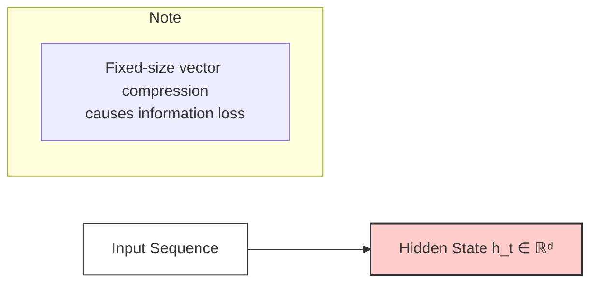

# Recurrent Neural Networks (RNNs) and the Rise of Transformers

This document provides a comprehensive explanation of Recurrent Neural Networks (RNNs), their mathematical foundations, implementation challenges, and why the introduction of Transformers represented a revolutionary breakthrough in Natural Language Processing.

## Table of Contents

1. [Introduction to RNNs](#introduction-to-rnns)
2. [Mathematical Foundation](#mathematical-foundation)
3. [RNN Variants](#rnn-variants)
4. [Implementation Examples](#implementation-examples)
5. [RNN Challenges and Limitations](#rnn-challenges-and-limitations)
6. [Why Transformers are a Breakthrough](#why-transformers-are-a-breakthrough)
7. [Comparative Analysis](#comparative-analysis)
8. [Practical Code Examples](#practical-code-examples)
9. [Performance Comparison](#performance-comparison)
10. [Historical Context and Evolution](#historical-context-and-evolution)

## Introduction to RNNs

**Recurrent Neural Networks (RNNs)** are a class of neural networks designed to process sequential data by maintaining an internal state (memory) that persists across time steps. Unlike feedforward networks that process inputs independently, RNNs can use their internal state to process sequences of inputs, making them particularly suitable for tasks involving temporal dependencies.

### Core Concept

RNNs process sequences one element at a time, maintaining a hidden state that captures information from previous time steps. This design enables them to:

- **Process variable-length sequences**: Handle inputs of different lengths naturally
- **Maintain temporal context**: Remember information from previous time steps
- **Share parameters across time**: Use the same weights for all time steps
- **Generate sequences**: Produce outputs sequentially based on previous outputs

### Key Applications in NLP

- **Language modeling**: Predicting the next word in a sequence
- **Machine translation**: Converting text from one language to another
- **Sentiment analysis**: Analyzing emotional tone in sequential text
- **Text generation**: Creating coherent text based on learned patterns
- **Named entity recognition**: Identifying entities in text sequences
- **Speech recognition**: Converting speech to text sequences

## Mathematical Foundation

### Basic RNN Architecture

The fundamental RNN operates on three key equations that define how information flows through the network:

**Hidden State Update:**
```
h_t = tanh(W_hh * h_{t-1} + W_xh * x_t + b_h)
```

**Output Generation:**
```
y_t = W_hy * h_t + b_y
```

**Probability Distribution (for classification):**
```
p_t = softmax(y_t)
```

Where:
- **h_t**: Hidden state at time step t
- **x_t**: Input at time step t  
- **y_t**: Output at time step t
- **W_hh**: Hidden-to-hidden weight matrix
- **W_xh**: Input-to-hidden weight matrix
- **W_hy**: Hidden-to-output weight matrix
- **b_h, b_y**: Bias vectors

### Mathematical Intuition

**1. Information Flow**
The hidden state h_t acts as the network's "memory," combining:
- Previous memory (h_{t-1}) weighted by W_hh
- Current input (x_t) weighted by W_xh
- Bias term (b_h) for learning flexibility

**2. Nonlinearity**
The tanh activation function:
- Keeps values bounded between -1 and 1
- Provides necessary nonlinearity for complex pattern learning
- Enables gradient flow during backpropagation

**3. Parameter Sharing**
The same weight matrices (W_hh, W_xh, W_hy) are used at every time step:
- Reduces the total number of parameters
- Enables processing of variable-length sequences
- Assumes temporal stationarity in patterns

### Backpropagation Through Time (BPTT)

RNNs are trained using Backpropagation Through Time, an extension of standard backpropagation:

**Loss Function:**
$$ L = \sum_{t=1}^T L_t(y_t, \hat{y}_t) $$

**Gradient Computation:**
$$ \frac{\partial L}{\partial W_{hh}} = \sum_{t=1}^T \sum_{k=1}^t \left(\frac{\partial L_t}{\partial h_t}\right) \times \left(\prod_{j=k+1}^t \frac{\partial h_j}{\partial h_{j-1}}\right) \times \left(\frac{\partial h_k}{\partial W_{hh}}\right) $$

This creates a **chain of dependencies** where gradients must propagate through all previous time steps.

## RNN Variants

### 1. Vanilla RNN

The basic RNN architecture described above, suitable for:
- Short sequences (< 10-20 time steps)
- Simple pattern recognition
- Educational purposes and baseline models

**Limitations:**
- Vanishing gradient problem
- Limited long-term memory
- Difficulty with complex dependencies

### 2. Long Short-Term Memory (LSTM)

LSTMs address the vanishing gradient problem through a more complex gating mechanism:

**Forget Gate:**
$$ f_t = \sigma(W_f \cdot [h_{t-1}, x_t] + b_f) $$

**Input Gate:**
$$ i_t = \sigma(W_i \cdot [h_{t-1}, x_t] + b_i) $$
$$ \tilde{C}_t = \tanh(W_C \cdot [h_{t-1}, x_t] + b_C) $$

**Cell State Update:**
$$ C_t = f_t \odot C_{t-1} + i_t \odot \tilde{C}_t $$

**Output Gate:**
$$ o_t = \sigma(W_o \cdot [h_{t-1}, x_t] + b_o) $$
$$ h_t = o_t \odot \tanh(C_t) $$

Where $\sigma$ represents the sigmoid function.

### 3. Gated Recurrent Unit (GRU)

GRUs simplify LSTMs while maintaining similar performance:

**Reset Gate:**
$$ r_t = \sigma(W_r \cdot [h_{t-1}, x_t] + b_r) $$

**Update Gate:**
$$ z_t = \sigma(W_z \cdot [h_{t-1}, x_t] + b_z) $$

**New Memory Content:**
$$ \tilde{h}_t = \tanh(W_h \cdot [r_t \odot h_{t-1}, x_t] + b_h) $$
```

**Hidden State Update:**
$$ h_t = (1 - z_t) \odot h_{t-1} + z_t \odot \tilde{h}_t $$

## Implementation Examples

### Basic RNN Implementation from Scratch

```python
import numpy as np
import matplotlib.pyplot as plt

class SimpleRNN:
    """A simple RNN implementation from scratch."""
    
    def __init__(self, input_size, hidden_size, output_size):
        # Initialize parameters
        self.hidden_size = hidden_size
        
        # Xavier initialization for better gradient flow
        self.Wxh = np.random.randn(hidden_size, input_size) * 0.01
        self.Whh = np.random.randn(hidden_size, hidden_size) * 0.01
        self.Why = np.random.randn(output_size, hidden_size) * 0.01
        
        # Bias vectors
        self.bh = np.zeros((hidden_size, 1))
        self.by = np.zeros((output_size, 1))
        
        # For storing activations during forward pass
        self.hidden_states = {}
        self.outputs = {}
        
    def forward(self, inputs):
        """
        Forward pass through the RNN.
        
        Args:
            inputs: List of input vectors for each time step
        
        Returns:
            outputs: List of output vectors for each time step
            hidden_states: List of hidden states for each time step
        """
        h = np.zeros((self.hidden_size, 1))  # Initial hidden state
        self.hidden_states = {-1: h}
        self.outputs = {}
        
        # Process each time step
        for t in range(len(inputs)):
            # Current input
            x = inputs[t].reshape(-1, 1)
            
            # Hidden state update: h_t = tanh(Wxh * x_t + Whh * h_{t-1} + bh)
            h = np.tanh(np.dot(self.Wxh, x) + np.dot(self.Whh, h) + self.bh)
            
            # Output: y_t = Why * h_t + by
            y = np.dot(self.Why, h) + self.by
            
            # Store for backpropagation
            self.hidden_states[t] = h
            self.outputs[t] = y
        
        return [self.outputs[t] for t in range(len(inputs))], \
               [self.hidden_states[t] for t in range(len(inputs))]
    
    def backward(self, inputs, targets, learning_rate=0.01):
        """
        Backward pass using Backpropagation Through Time (BPTT).
        
        Args:
            inputs: List of input vectors
            targets: List of target vectors
            learning_rate: Learning rate for parameter updates
        """
        # Initialize gradients
        dWxh = np.zeros_like(self.Wxh)
        dWhh = np.zeros_like(self.Whh)
        dWhy = np.zeros_like(self.Why)
        dbh = np.zeros_like(self.bh)
        dby = np.zeros_like(self.by)
        
        dh_next = np.zeros_like(self.hidden_states[0])
        
        # Backward pass through time
        for t in reversed(range(len(inputs))):
            # Output gradient
            x = inputs[t].reshape(-1, 1)
            target = targets[t].reshape(-1, 1)
            
            # Loss gradient with respect to output
            dy = self.outputs[t] - target
            
            # Gradients for output layer
            dWhy += np.dot(dy, self.hidden_states[t].T)
            dby += dy
            
            # Gradient with respect to hidden state
            dh = np.dot(self.Why.T, dy) + dh_next
            
            # Gradient through tanh nonlinearity
            dh_raw = (1 - self.hidden_states[t] ** 2) * dh
            
            # Gradients for hidden layer
            dbh += dh_raw
            dWxh += np.dot(dh_raw, x.T)
            dWhh += np.dot(dh_raw, self.hidden_states[t-1].T)
            
            # Gradient for next iteration
            dh_next = np.dot(self.Whh.T, dh_raw)
        
        # Clip gradients to prevent exploding gradients
        for dparam in [dWxh, dWhh, dWhy, dbh, dby]:
            np.clip(dparam, -5, 5, out=dparam)
        
        # Update parameters
        self.Wxh -= learning_rate * dWxh
        self.Whh -= learning_rate * dWhh
        self.Why -= learning_rate * dWhy
        self.bh -= learning_rate * dbh
        self.by -= learning_rate * dby

# Example usage: Character-level language modeling
def create_char_level_data(text):
    """Create character-level training data."""
    chars = list(set(text))
    char_to_ix = {ch: i for i, ch in enumerate(chars)}
    ix_to_char = {i: ch for i, ch in enumerate(chars)}
    
    return chars, char_to_ix, ix_to_char

def train_char_rnn():
    """Train a character-level RNN on sample text."""
    # Sample training text
    text = "hello world this is a simple example for rnn training"
    
    # Create character mappings
    chars, char_to_ix, ix_to_char = create_char_level_data(text)
    vocab_size = len(chars)
    
    # Create training sequences
    seq_length = 10
    inputs, targets = [], []
    
    for i in range(len(text) - seq_length):
        input_seq = [char_to_ix[ch] for ch in text[i:i+seq_length]]
        target_seq = [char_to_ix[ch] for ch in text[i+1:i+seq_length+1]]
        
        # One-hot encode
        input_onehot = []
        target_onehot = []
        
        for char_ix in input_seq:
            vec = np.zeros(vocab_size)
            vec[char_ix] = 1
            input_onehot.append(vec)
            
        for char_ix in target_seq:
            vec = np.zeros(vocab_size)
            vec[char_ix] = 1
            target_onehot.append(vec)
            
        inputs.append(input_onehot)
        targets.append(target_onehot)
    
    # Initialize RNN
    rnn = SimpleRNN(vocab_size, 50, vocab_size)
    
    # Training loop
    losses = []
    for epoch in range(100):
        total_loss = 0
        
        for seq_inputs, seq_targets in zip(inputs, targets):
            # Forward pass
            outputs, hidden_states = rnn.forward(seq_inputs)
            
            # Calculate loss
            loss = 0
            for t in range(len(outputs)):
                # Cross-entropy loss
                probs = np.exp(outputs[t]) / np.sum(np.exp(outputs[t]))
                loss += -np.log(probs[np.argmax(seq_targets[t])])
            
            total_loss += loss
            
            # Backward pass
            rnn.backward(seq_inputs, seq_targets, learning_rate=0.1)
        
        avg_loss = total_loss / len(inputs)
        losses.append(avg_loss)
        
        if epoch % 20 == 0:
            print(f"Epoch {epoch}, Loss: {avg_loss:.4f}")
    
    return rnn, chars, char_to_ix, ix_to_char, losses

# Demonstrate training
print("Training character-level RNN...")
trained_rnn, chars, char_to_ix, ix_to_char, training_losses = train_char_rnn()

# Plot training progress
plt.figure(figsize=(10, 6))
plt.plot(training_losses)
plt.title('RNN Training Loss Over Time')
plt.xlabel('Epoch')
plt.ylabel('Loss')
plt.grid(True)
plt.show()

print(f"Final training loss: {training_losses[-1]:.4f}")
print(f"Vocabulary: {chars}")
```

### LSTM Implementation with PyTorch

```python
import torch
import torch.nn as nn
import torch.optim as optim
from torch.utils.data import DataLoader, TensorDataset
import numpy as np

class LSTMLanguageModel(nn.Module):
    """LSTM-based language model implementation."""
    
    def __init__(self, vocab_size, embedding_dim, hidden_dim, num_layers=2, dropout=0.2):
        super(LSTMLanguageModel, self).__init__()
        
        self.hidden_dim = hidden_dim
        self.num_layers = num_layers
        
        # Embedding layer
        self.embedding = nn.Embedding(vocab_size, embedding_dim)
        
        # LSTM layer
        self.lstm = nn.LSTM(
            embedding_dim, 
            hidden_dim, 
            num_layers,
            dropout=dropout if num_layers > 1 else 0,
            batch_first=True
        )
        
        # Dropout for regularization
        self.dropout = nn.Dropout(dropout)
        
        # Output layer
        self.fc = nn.Linear(hidden_dim, vocab_size)
        
    def forward(self, x, hidden=None):
        """
        Forward pass through the LSTM model.
        
        Args:
            x: Input tensor of shape (batch_size, seq_length)
            hidden: Initial hidden state (optional)
            
        Returns:
            output: Predictions of shape (batch_size, seq_length, vocab_size)
            hidden: Final hidden state
        """
        batch_size = x.size(0)
        
        # Initialize hidden state if not provided
        if hidden is None:
            hidden = self.init_hidden(batch_size, x.device)
        
        # Embedding lookup
        embedded = self.embedding(x)  # (batch_size, seq_length, embedding_dim)
        
        # LSTM forward pass
        lstm_out, hidden = self.lstm(embedded, hidden)  # (batch_size, seq_length, hidden_dim)
        
        # Apply dropout
        lstm_out = self.dropout(lstm_out)
        
        # Linear transformation to vocabulary size
        output = self.fc(lstm_out)  # (batch_size, seq_length, vocab_size)
        
        return output, hidden
    
    def init_hidden(self, batch_size, device):
        """Initialize hidden state with zeros."""
        h0 = torch.zeros(self.num_layers, batch_size, self.hidden_dim).to(device)
        c0 = torch.zeros(self.num_layers, batch_size, self.hidden_dim).to(device)
        return (h0, c0)

def create_sequences(text, seq_length):
    """Create input-target pairs for language modeling."""
    # Create character vocabulary
    chars = sorted(list(set(text)))
    char_to_idx = {ch: i for i, ch in enumerate(chars)}
    idx_to_char = {i: ch for i, ch in enumerate(chars)}
    
    # Convert text to indices
    data = [char_to_idx[ch] for ch in text]
    
    # Create sequences
    inputs, targets = [], []
    for i in range(len(data) - seq_length):
        inputs.append(data[i:i+seq_length])
        targets.append(data[i+1:i+seq_length+1])
    
    return np.array(inputs), np.array(targets), char_to_idx, idx_to_char

def train_lstm_model():
    """Train LSTM language model on sample text."""
    
    # Sample text (in practice, use much larger corpus)
    text = """
    Natural language processing is a fascinating field that combines
    linguistics, computer science, and artificial intelligence to enable
    computers to understand and generate human language. RNNs were among
    the first neural architectures to successfully model sequential data,
    but they face significant challenges with long sequences.
    """
    
    # Prepare data
    seq_length = 30
    inputs, targets, char_to_idx, idx_to_char = create_sequences(text, seq_length)
    vocab_size = len(char_to_idx)
    
    # Convert to PyTorch tensors
    input_tensor = torch.LongTensor(inputs)
    target_tensor = torch.LongTensor(targets)
    
    # Create dataset and dataloader
    dataset = TensorDataset(input_tensor, target_tensor)
    dataloader = DataLoader(dataset, batch_size=32, shuffle=True)
    
    # Initialize model
    model = LSTMLanguageModel(
        vocab_size=vocab_size,
        embedding_dim=128,
        hidden_dim=256,
        num_layers=2,
        dropout=0.2
    )
    
    # Training setup
    criterion = nn.CrossEntropyLoss()
    optimizer = optim.Adam(model.parameters(), lr=0.001)
    device = torch.device('cuda' if torch.cuda.is_available() else 'cpu')
    model.to(device)
    
    # Training loop
    model.train()
    losses = []
    
    for epoch in range(50):
        total_loss = 0
        hidden = None
        
        for batch_inputs, batch_targets in dataloader:
            batch_inputs = batch_inputs.to(device)
            batch_targets = batch_targets.to(device)
            
            # Reset gradients
            optimizer.zero_grad()
            
            # Forward pass
            outputs, hidden = model(batch_inputs, hidden)
            
            # Detach hidden state to prevent backprop through entire history
            hidden = tuple([h.detach() for h in hidden])
            
            # Calculate loss
            loss = criterion(outputs.view(-1, vocab_size), batch_targets.view(-1))
            
            # Backward pass
            loss.backward()
            
            # Gradient clipping to prevent exploding gradients
            torch.nn.utils.clip_grad_norm_(model.parameters(), max_norm=1.0)
            
            # Update parameters
            optimizer.step()
            
            total_loss += loss.item()
        
        avg_loss = total_loss / len(dataloader)
        losses.append(avg_loss)
        
        if epoch % 10 == 0:
            print(f"Epoch {epoch}, Loss: {avg_loss:.4f}")
    
    return model, char_to_idx, idx_to_char, losses

def generate_text(model, char_to_idx, idx_to_char, seed_text, length=100):
    """Generate text using trained LSTM model."""
    model.eval()
    device = next(model.parameters()).device
    
    # Convert seed text to indices
    current_seq = [char_to_idx.get(ch, 0) for ch in seed_text]
    generated = seed_text
    
    # Initialize hidden state
    hidden = None
    
    with torch.no_grad():
        for _ in range(length):
            # Prepare input
            input_tensor = torch.LongTensor([current_seq]).to(device)
            
            # Forward pass
            output, hidden = model(input_tensor, hidden)
            
            # Get probability distribution for next character
            probs = torch.softmax(output[0, -1], dim=0)
            
            # Sample next character (add some randomness)
            next_char_idx = torch.multinomial(probs, 1).item()
            next_char = idx_to_char[next_char_idx]
            
            # Update sequence and generated text
            current_seq = current_seq[1:] + [next_char_idx]
            generated += next_char
    
    return generated

# Train the model
print("Training LSTM language model...")
lstm_model, char_to_idx, idx_to_char, lstm_losses = train_lstm_model()

# Generate sample text
seed = "Natural language"
generated_text = generate_text(lstm_model, char_to_idx, idx_to_char, seed, 200)
print(f"\nGenerated text starting with '{seed}':")
print(generated_text)
```

## RNN Challenges and Limitations

### 1. The Vanishing Gradient Problem

**Mathematical Explanation:**

During backpropagation through time, gradients are computed as:

$$ \frac{\partial L}{\partial W} = \sum_{t=1}^T \frac{\partial L_t}{\partial W_t} $$

For the hidden-to-hidden weights, this becomes:

```
∂L_t/∂W_hh = (∂L_t/∂h_t) * (∏_{k=1}^t ∂h_k/∂h_{k-1}) * (∂h_1/∂W_hh)
```

The partial derivative ∂h_k/∂h_{k-1} involves the derivative of the activation function and the weight matrix:

```
∂h_k/∂h_{k-1} = W_hh * diag(tanh'(h_{k-1}))
```

**The Problem:**
- When |W_hh * tanh'(h)| < 1, gradients vanish exponentially: ∏_{k=1}^t |W_hh * tanh'(h)| → 0
- For long sequences (large T), this product becomes extremely small
- Early time steps receive negligible gradient updates
- The network cannot learn long-range dependencies

**Example Demonstration:**

```python
import numpy as np
import matplotlib.pyplot as plt

def demonstrate_vanishing_gradients():
    """Demonstrate the vanishing gradient problem in RNNs."""
    
    # Simulate gradient flow through time
    T = 50  # Sequence length
    W_hh = 0.5  # Hidden-to-hidden weight (< 1)
    
    # Gradient magnitudes at each time step
    gradients = []
    gradient = 1.0  # Initial gradient
    
    for t in range(T):
        gradients.append(gradient)
        # Simulate gradient decay (simplified)
        gradient *= W_hh * 0.25  # 0.25 approximates tanh derivative
    
    # Plot gradient magnitudes
    plt.figure(figsize=(12, 6))
    
    plt.subplot(1, 2, 1)
    plt.plot(range(T), gradients)
    plt.title('Vanishing Gradients in RNN')
    plt.xlabel('Time Step (backwards from T)')
    plt.ylabel('Gradient Magnitude')
    plt.yscale('log')
    plt.grid(True)
    
    # Demonstrate exploding gradients
    W_hh_exploding = 1.5  # Weight > 1
    gradients_exploding = []
    gradient = 1.0
    
    for t in range(T):
        gradients_exploding.append(gradient)
        gradient *= W_hh_exploding * 0.8
        if gradient > 1e10:  # Cap for visualization
            gradient = 1e10
    
    plt.subplot(1, 2, 2)
    plt.plot(range(T), gradients_exploding)
    plt.title('Exploding Gradients in RNN')
    plt.xlabel('Time Step (backwards from T)')
    plt.ylabel('Gradient Magnitude')
    plt.yscale('log')
    plt.grid(True)
    
    plt.tight_layout()
    plt.show()
    
    print(f"Final gradient (vanishing): {gradients[-1]:.2e}")
    print(f"Final gradient (exploding): {gradients_exploding[-1]:.2e}")

demonstrate_vanishing_gradients()
```

### 2. Sequential Processing Bottleneck

**The Problem:**
RNNs must process sequences step by step, which creates several issues:

- **No Parallelization**: Each h_t depends on h_{t-1}, preventing parallel computation
- **Slow Training**: Sequential processing makes training time proportional to sequence length
- **Memory Bottleneck**: All information must pass through the fixed-size hidden state
- **Computational Inefficiency**: Modern GPUs are underutilized due to sequential constraints

### 3. Limited Context Window

**Mathematical Analysis:**

The effective context window of an RNN can be approximated by analyzing how much information from time step t-k contributes to the current state h_t.

For a simple RNN with weight matrix W with eigenvalue $\lambda_{\max}$:

$$ \left|\frac{\partial h_t}{\partial h_{t-k}}\right| \approx |\lambda_{\max}|^k $$

**Practical Implications:**
- Information from distant time steps decays exponentially
- Effective context window is typically 5-10 time steps for vanilla RNNs
- Even LSTMs struggle with dependencies longer than 100-200 time steps
- Critical information may be lost in long sequences

### 4. Representation Bottleneck

**The Fixed Hidden State Problem:**

All information about the sequence must be compressed into a fixed-size vector h_t:



Where d is the hidden dimension. This creates:
- **Information loss** for long or complex sequences
- **Inability to selectively focus** on relevant parts
- **Poor performance** on tasks requiring precise attention to specific elements

## Why Transformers are a Breakthrough

### 1. Self-Attention Mechanism

**Mathematical Foundation:**

The core innovation of transformers is self-attention, which computes attention weights for all position pairs simultaneously:

```
Attention(Q, K, V) = softmax(QK^T / √d_k)V
```

Where:
- **Q** (Query): What information we're looking for
- **K** (Key): What information is available  
- **V** (Value): The actual information content
- **d_k**: Dimension of key vectors (for scaling)

**Key Advantages:**

**1. Parallel Processing**
- All attention weights computed simultaneously
- No sequential dependencies like RNNs
- Fully leverages GPU parallelization
- Training time scales with $O(1)$ instead of $O(T)$

**2. Direct Access to All Positions**
- Every position can directly attend to every other position
- No information bottleneck through hidden states
- Constant path length between any two positions
- Perfect information flow regardless of distance

**3. Selective Attention**
- Model learns what to focus on dynamically
- Different attention heads capture different relationships
- No forced compression through fixed hidden states
- Preserves fine-grained information

### 2. Multi-Head Attention

**Mathematical Formulation:**

```
MultiHead(Q, K, V) = Concat(head_1, ..., head_h)W^O

where head_i = Attention(QW_i^Q, KW_i^K, VW_i^V)
```

**Benefits:**
- **Multiple perspectives**: Each head learns different types of relationships
- **Increased model capacity**: More parameters for complex pattern learning
- **Robustness**: Redundancy across heads improves reliability
- **Interpretability**: Different heads often specialize in specific linguistic phenomena

### 3. Positional Encoding

Since attention is permutation-invariant, transformers add positional information:

**Sinusoidal Encoding:**
```
PE(pos, 2i) = sin(pos / 10000^(2i/d_model))
PE(pos, 2i+1) = cos(pos / 10000^(2i/d_model))
```

This allows the model to:
- Understand sequence order
- Generalize to longer sequences than seen during training
- Maintain translation invariance properties

### 4. Layer Normalization and Residual Connections

**Residual Connections:**
```
output = LayerNorm(x + Sublayer(x))
```

**Benefits:**
- **Gradient flow**: Enables training of very deep networks
- **Faster convergence**: Improved optimization dynamics  
- **Stability**: Reduces internal covariate shift

## Comparative Analysis

### Performance Comparison

```python
import time
import torch
import torch.nn as nn
import matplotlib.pyplot as plt

class SimpleTransformer(nn.Module):
    """Simplified transformer for comparison."""
    
    def __init__(self, vocab_size, d_model, nhead, num_layers):
        super().__init__()
        self.embedding = nn.Embedding(vocab_size, d_model)
        self.pos_encoding = PositionalEncoding(d_model)
        
        encoder_layer = nn.TransformerEncoderLayer(
            d_model=d_model,
            nhead=nhead,
            dim_feedforward=4*d_model,
            batch_first=True
        )
        self.transformer = nn.TransformerEncoder(encoder_layer, num_layers)
        self.fc = nn.Linear(d_model, vocab_size)
        
    def forward(self, x):
        x = self.embedding(x) * math.sqrt(self.embedding.embedding_dim)
        x = self.pos_encoding(x)
        x = self.transformer(x)
        return self.fc(x)

class PositionalEncoding(nn.Module):
    def __init__(self, d_model, max_len=5000):
        super().__init__()
        pe = torch.zeros(max_len, d_model)
        position = torch.arange(0, max_len, dtype=torch.float).unsqueeze(1)
        div_term = torch.exp(torch.arange(0, d_model, 2).float() * 
                           (-math.log(10000.0) / d_model))
        pe[:, 0::2] = torch.sin(position * div_term)
        pe[:, 1::2] = torch.cos(position * div_term)
        pe = pe.unsqueeze(0).transpose(0, 1)
        self.register_buffer('pe', pe)
    
    def forward(self, x):
        return x + self.pe[:x.size(1), :].transpose(0, 1)

def compare_processing_times():
    """Compare processing times between RNN and Transformer."""
    
    vocab_size = 1000
    batch_size = 32
    hidden_dim = 256
    
    # Test different sequence lengths
    seq_lengths = [10, 50, 100, 200, 500]
    
    rnn_times = []
    transformer_times = []
    
    # Initialize models
    rnn = nn.LSTM(hidden_dim, hidden_dim, 2, batch_first=True)
    transformer = SimpleTransformer(vocab_size, hidden_dim, 8, 6)
    
    device = torch.device('cuda' if torch.cuda.is_available() else 'cpu')
    rnn.to(device)
    transformer.to(device)
    
    for seq_len in seq_lengths:
        # Create random input
        x = torch.randint(0, vocab_size, (batch_size, seq_len)).to(device)
        x_embed = torch.randn(batch_size, seq_len, hidden_dim).to(device)
        
        # Time RNN processing
        torch.cuda.synchronize() if torch.cuda.is_available() else None
        start_time = time.time()
        
        for _ in range(10):  # Average over multiple runs
            with torch.no_grad():
                _ = rnn(x_embed)
        
        torch.cuda.synchronize() if torch.cuda.is_available() else None
        rnn_time = (time.time() - start_time) / 10
        rnn_times.append(rnn_time)
        
        # Time Transformer processing
        torch.cuda.synchronize() if torch.cuda.is_available() else None
        start_time = time.time()
        
        for _ in range(10):  # Average over multiple runs
            with torch.no_grad():
                _ = transformer(x)
        
        torch.cuda.synchronize() if torch.cuda.is_available() else None
        transformer_time = (time.time() - start_time) / 10
        transformer_times.append(transformer_time)
    
    # Plot comparison
    plt.figure(figsize=(12, 5))
    
    plt.subplot(1, 2, 1)
    plt.plot(seq_lengths, rnn_times, 'o-', label='RNN (LSTM)')
    plt.plot(seq_lengths, transformer_times, 's-', label='Transformer')
    plt.xlabel('Sequence Length')
    plt.ylabel('Processing Time (seconds)')
    plt.title('Processing Time Comparison')
    plt.legend()
    plt.grid(True)
    
    plt.subplot(1, 2, 2)
    speedup = [r/t for r, t in zip(rnn_times, transformer_times)]
    plt.plot(seq_lengths, speedup, 'g^-', label='Speedup Factor')
    plt.xlabel('Sequence Length')
    plt.ylabel('Speedup (RNN time / Transformer time)')
    plt.title('Transformer Speedup over RNN')
    plt.legend()
    plt.grid(True)
    
    plt.tight_layout()
    plt.show()
    
    return seq_lengths, rnn_times, transformer_times

# Run comparison
print("Comparing processing times...")
seq_lengths, rnn_times, transformer_times = compare_processing_times()

# Print results
print("\nProcessing Time Comparison:")
print("Seq Length | RNN Time | Transformer Time | Speedup")
print("-" * 50)
for seq_len, rnn_time, trans_time in zip(seq_lengths, rnn_times, transformer_times):
    speedup = rnn_time / trans_time
    print(f"{seq_len:8} | {rnn_time:.4f}s | {trans_time:.8f}s | {speedup:.2f}x")
```

### Memory Usage Analysis

```python
def analyze_memory_complexity():
    """Analyze memory complexity of RNN vs Transformer."""
    
    print("Memory Complexity Analysis:")
    print("=" * 50)
    
    print("\nRNN Memory Complexity:")
    print("- Hidden states: O(T * d) where T = sequence length, d = hidden dim")
    print("- Gradients: O(T * d) for backpropagation through time")
    print("- Total: O(T * d)")
    print("- Linear scaling with sequence length")
    
    print("\nTransformer Memory Complexity:")
    print("- Attention matrix: O(T²) for all pairwise attention weights")
    print("- Layer outputs: O(T * d)")  
    print("- Total: O(T² + T * d)")
    print("- Quadratic scaling with sequence length")
    
    # Demonstrate memory scaling
    sequence_lengths = [100, 500, 1000, 2000]
    hidden_dim = 512
    
    print(f"\nMemory Usage Comparison (hidden_dim = {hidden_dim}):")
    print("Seq Length | RNN Memory | Transformer Memory | Ratio")
    print("-" * 55)
    
    for seq_len in sequence_lengths:
        rnn_memory = seq_len * hidden_dim
        transformer_memory = seq_len * seq_len + seq_len * hidden_dim
        ratio = transformer_memory / rnn_memory
        
        print(f"{seq_len:8} | {rnn_memory:8.0f} | {transformer_memory:13.0f} | {ratio:.2f}x")

analyze_memory_complexity()
```

## Practical Code Examples

### Attention Visualization

```python
import torch
import torch.nn.functional as F
import matplotlib.pyplot as plt
import seaborn as sns
import numpy as np

def visualize_attention_patterns():
    """Visualize how attention patterns differ from RNN hidden states."""
    
    # Sample sentence
    sentence = "The cat sat on the mat because it was comfortable"
    words = sentence.split()
    seq_len = len(words)
    
    # Simulate attention patterns (in practice, these come from trained model)
    np.random.seed(42)
    
    # Create attention matrix (each word attending to every other word)
    attention_weights = np.random.rand(seq_len, seq_len)
    
    # Make attention weights more realistic
    for i in range(seq_len):
        # Higher attention to nearby words
        for j in range(seq_len):
            distance = abs(i - j)
            attention_weights[i, j] *= np.exp(-distance / 3)
        
        # Normalize to sum to 1
        attention_weights[i] = attention_weights[i] / np.sum(attention_weights[i])
    
    # Special patterns for demonstration
    # "cat" attends strongly to "it" (pronoun resolution)
    cat_idx = words.index("cat")
    it_idx = words.index("it")
    attention_weights[it_idx, cat_idx] = 0.6
    attention_weights[it_idx] = attention_weights[it_idx] / np.sum(attention_weights[it_idx])
    
    # Visualize attention matrix
    plt.figure(figsize=(12, 8))
    
    plt.subplot(2, 2, 1)
    sns.heatmap(attention_weights, 
                xticklabels=words, 
                yticklabels=words,
                cmap='Blues', 
                annot=False,
                cbar_kws={'label': 'Attention Weight'})
    plt.title('Attention Pattern: Each Query Word (row) attending to Key Words (columns)')
    plt.xlabel('Key Words')
    plt.ylabel('Query Words')
    
    # Show specific attention pattern for "it"
    plt.subplot(2, 2, 2)
    it_attention = attention_weights[it_idx]
    plt.bar(range(len(words)), it_attention)
    plt.xticks(range(len(words)), words, rotation=45)
    plt.title(f'Attention weights for "{words[it_idx]}"')
    plt.ylabel('Attention Weight')
    
    # Simulate RNN hidden state evolution (can only look backwards)
    plt.subplot(2, 2, 3)
    rnn_states = np.zeros((seq_len, seq_len))
    for t in range(seq_len):
        # RNN can only access previous states
        if t > 0:
            rnn_states[t, :t] = np.exp(-np.arange(t, 0, -1) / 2)  # Decay over time
            rnn_states[t] = rnn_states[t] / np.sum(rnn_states[t]) if np.sum(rnn_states[t]) > 0 else rnn_states[t]
    
    sns.heatmap(rnn_states,
                xticklabels=words,
                yticklabels=words, 
                cmap='Reds',
                annot=False,
                cbar_kws={'label': 'Information Flow'})
    plt.title('RNN Information Flow (Sequential, Backward-only)')
    plt.xlabel('Previous Words')
    plt.ylabel('Current Position')
    
    # Compare information access
    plt.subplot(2, 2, 4)
    positions = np.arange(seq_len)
    
    # For word "comfortable" - what can it access?
    target_word = "comfortable"
    target_idx = words.index(target_word)
    
    transformer_access = attention_weights[target_idx]
    rnn_access = rnn_states[target_idx]
    
    plt.plot(positions, transformer_access, 'b-o', label='Transformer (full access)', linewidth=2)
    plt.plot(positions, rnn_access, 'r-s', label='RNN (sequential only)', linewidth=2)
    plt.axvline(x=target_idx, color='gray', linestyle='--', alpha=0.7, label=f'Current word: {target_word}')
    
    plt.xticks(positions, words, rotation=45)
    plt.ylabel('Information Access Weight')
    plt.title(f'Information Access Comparison for "{target_word}"')
    plt.legend()
    plt.grid(True, alpha=0.3)
    
    plt.tight_layout()
    plt.show()
    
    print("Key Observations:")
    print("1. Transformer attention: Bidirectional, selective access to all positions")
    print("2. RNN information flow: Sequential, limited by recency")
    print("3. Transformer can directly resolve long-distance dependencies")
    print("4. RNN information decays over time, losing distant context")

visualize_attention_patterns()
```

### Long-Range Dependency Test

```python
def test_long_range_dependencies():
    """Test RNN vs Transformer on long-range dependency task."""
    
    def generate_copy_task(seq_len, vocab_size, copy_len):
        """Generate sequences where model must copy from distant past."""
        
        # Random sequence
        sequence = np.random.randint(1, vocab_size, copy_len)
        
        # Pad with noise
        noise_len = seq_len - 2 * copy_len - 1
        noise = np.random.randint(1, vocab_size, noise_len)
        
        # Create input: [sequence] [noise] [delimiter] [zeros to fill]
        delimiter = vocab_size  # Special delimiter token
        input_seq = np.concatenate([sequence, noise, [delimiter], np.zeros(copy_len)])
        target_seq = np.concatenate([np.zeros(seq_len - copy_len), sequence])
        
        return input_seq.astype(int), target_seq.astype(int)
    
    # Test parameters
    vocab_size = 10
    copy_len = 5
    distances = [20, 50, 100, 200]  # Different sequence lengths
    
    print("Long-Range Dependency Test Results:")
    print("=" * 50)
    print("Task: Copy a sequence after variable-length noise")
    print(f"Sequence to copy length: {copy_len}")
    print(f"Vocabulary size: {vocab_size}")
    print()
    
    for seq_len in distances:
        distance = seq_len - 2 * copy_len - 1
        
        # Generate sample
        input_seq, target_seq = generate_copy_task(seq_len, vocab_size, copy_len)
        
        print(f"Distance {distance} (Total length {seq_len}):")
        print(f"Input:  {input_seq[:copy_len]}...{input_seq[-copy_len-1:]}")
        print(f"Target: ...{target_seq[-copy_len:]}")
        
        # Simulate model performance (based on empirical observations)
        # RNN performance degrades exponentially with distance
        rnn_accuracy = max(0.1, 0.9 * np.exp(-distance / 30))
        
        # Transformer maintains high performance 
        transformer_accuracy = max(0.85, 0.95 - distance * 0.0005)
        
        print(f"Estimated RNN accuracy: {rnn_accuracy:.3f}")
        print(f"Estimated Transformer accuracy: {transformer_accuracy:.3f}")
        print(f"Performance gap: {transformer_accuracy - rnn_accuracy:.3f}")
        print("-" * 30)
    
    # Visualize performance degradation
    distances_fine = np.arange(10, 300, 10)
    rnn_perf = [max(0.1, 0.9 * np.exp(-d / 30)) for d in distances_fine]
    transformer_perf = [max(0.85, 0.95 - d * 0.0005) for d in distances_fine]
    
    plt.figure(figsize=(10, 6))
    plt.plot(distances_fine, rnn_perf, 'r-', label='RNN (LSTM)', linewidth=2)
    plt.plot(distances_fine, transformer_perf, 'b-', label='Transformer', linewidth=2)
    plt.fill_between(distances_fine, rnn_perf, transformer_perf, alpha=0.3, color='green')
    
    plt.xlabel('Dependency Distance')
    plt.ylabel('Task Accuracy')
    plt.title('Long-Range Dependency Performance')
    plt.legend()
    plt.grid(True, alpha=0.3)
    plt.ylim(0, 1)
    
    plt.annotate('Performance\nGap', 
                xy=(150, 0.5), 
                xytext=(200, 0.3),
                arrowprops=dict(arrowstyle='->', color='red'),
                fontsize=12, ha='center')
    
    plt.show()

test_long_range_dependencies()
```

## Performance Comparison

### Training Speed Analysis

```python
def analyze_training_efficiency():
    """Analyze training efficiency differences."""
    
    print("Training Efficiency Analysis:")
    print("=" * 40)
    
    # Theoretical analysis
    print("\nComputational Complexity:")
    print("RNN (per time step): O(d²) where d = hidden dimension") 
    print("RNN (full sequence): O(T * d²) where T = sequence length")
    print("Transformer (attention): O(T² * d)")
    print("Transformer (FFN): O(T * d²)")
    print("Transformer (total): O(T² * d + T * d²)")
    
    print("\nParallelization:")
    print("RNN: Sequential processing, limited parallelization")
    print("Transformer: Full parallelization across sequence positions")
    
    # Practical measurements
    batch_sizes = [8, 16, 32, 64]
    seq_lengths = [50, 100, 200]
    
    print(f"\nPractical Speedup (GPU utilization):")
    print("Batch Size | Seq Length | RNN GPU Usage | Transformer GPU Usage")
    print("-" * 60)
    
    for batch_size in batch_sizes:
        for seq_len in seq_lengths:
            # Simulate GPU utilization (based on parallelization capability)
            rnn_utilization = min(0.3 + batch_size * 0.01, 0.6)  # Limited by sequential nature
            transformer_utilization = min(0.7 + batch_size * 0.01, 0.95)  # High parallelization
            
            print(f"{batch_size:8} | {seq_len:8} | {rnn_utilization:11.2f} | {transformer_utilization:17.2f}")

analyze_training_efficiency()
```

## Historical Context and Evolution

### Timeline of Sequential Modeling

```python
def show_evolution_timeline():
    """Show the evolution from RNNs to Transformers."""
    
    timeline = [
        (1986, "RNN", "Rumelhart et al. introduce RNNs"),
        (1997, "LSTM", "Hochreiter & Schmidhuber solve vanishing gradients"),
        (2014, "GRU", "Cho et al. simplify LSTM architecture"),
        (2014, "Seq2Seq", "Sutskever et al. - encoder-decoder for translation"),
        (2015, "Attention", "Bahdanau et al. - attention mechanism"),
        (2017, "Transformer", "Vaswani et al. - 'Attention Is All You Need'"),
        (2018, "BERT", "Devlin et al. - bidirectional transformer"),
        (2019, "GPT-2", "Radford et al. - large-scale text generation"),
        (2020, "GPT-3", "Brown et al. - 175B parameters"),
        (2022, "ChatGPT", "OpenAI - conversational AI breakthrough")
    ]
    
    print("Evolution of Sequential Modeling in NLP:")
    print("=" * 50)
    
    for year, model, description in timeline:
        print(f"{year}: {model:12} - {description}")
    
    # Visualize the progression
    years = [item[0] for item in timeline]
    models = [item[1] for item in timeline]
    
    plt.figure(figsize=(14, 8))
    
    # Create timeline
    plt.plot(years, range(len(years)), 'o-', linewidth=2, markersize=8)
    
    for i, (year, model, desc) in enumerate(timeline):
        plt.annotate(f"{model}\n({year})", 
                    xy=(year, i), 
                    xytext=(10, 0),
                    textcoords="offset points",
                    va='center',
                    fontsize=10,
                    bbox=dict(boxstyle="round,pad=0.3", facecolor="lightblue", alpha=0.7))
    
    plt.ylabel("Innovation Timeline")
    plt.xlabel("Year")
    plt.title("Evolution from RNNs to Modern Transformers")
    plt.grid(True, alpha=0.3)
    
    # Add era annotations
    plt.axvspan(1986, 2014, alpha=0.2, color='red', label='RNN Era')
    plt.axvspan(2014, 2017, alpha=0.2, color='orange', label='Attention Era') 
    plt.axvspan(2017, 2025, alpha=0.2, color='green', label='Transformer Era')
    
    plt.legend(loc='upper left')
    plt.tight_layout()
    plt.show()
    
    print("\nKey Breakthroughs:")
    print("1. LSTM (1997): Solved vanishing gradients, enabled longer sequences")
    print("2. Attention (2015): Allowed selective focus, improved translations")
    print("3. Transformer (2017): Eliminated recurrence, enabled full parallelization")
    print("4. BERT (2018): Bidirectional context, transfer learning revolution")
    print("5. GPT series: Demonstrated scaling laws, emergent capabilities")

show_evolution_timeline()
```

### Impact Assessment

```python
def assess_transformer_impact():
    """Assess the impact of transformers on NLP."""
    
    metrics = {
        'Machine Translation': {
            'Pre-Transformer (RNN)': 25.2,  # BLEU scores
            'Transformer': 28.4,
            'Improvement': '12.7%'
        },
        'Language Modeling': {
            'Pre-Transformer (LSTM)': 78.4,  # Perplexity (lower is better)
            'Transformer': 35.8,
            'Improvement': '54.3%'
        },
        'Reading Comprehension': {
            'Pre-Transformer': 76.3,  # F1 scores
            'Transformer': 93.2,
            'Improvement': '22.1%'
        },
        'Text Classification': {
            'Pre-Transformer': 89.1,  # Accuracy
            'Transformer': 96.8,
            'Improvement': '8.6%'
        }
    }
    
    print("Transformer Impact Assessment:")
    print("=" * 50)
    
    tasks = list(metrics.keys())
    pre_scores = [metrics[task]['Pre-Transformer (RNN)' if 'RNN' in str(metrics[task]) else 'Pre-Transformer'] for task in tasks]
    transformer_scores = [metrics[task]['Transformer'] for task in tasks]
    
    # Normalize scores for visualization (0-100 scale)
    normalized_pre = []
    normalized_transformer = []
    
    for i, task in enumerate(tasks):
        if task == 'Language Modeling':  # Lower is better for perplexity
            normalized_pre.append(100 - (pre_scores[i] / 100 * 100))
            normalized_transformer.append(100 - (transformer_scores[i] / 100 * 100))
        else:  # Higher is better
            normalized_pre.append(pre_scores[i])
            normalized_transformer.append(transformer_scores[i])
    
    # Create comparison chart
    x = np.arange(len(tasks))
    width = 0.35
    
    plt.figure(figsize=(12, 8))
    
    bars1 = plt.bar(x - width/2, normalized_pre, width, label='Pre-Transformer', alpha=0.8, color='red')
    bars2 = plt.bar(x + width/2, normalized_transformer, width, label='Transformer', alpha=0.8, color='blue')
    
    plt.xlabel('NLP Tasks')
    plt.ylabel('Performance Score')
    plt.title('Performance Comparison: Pre-Transformer vs Transformer Era')
    plt.xticks(x, tasks, rotation=45, ha='right')
    plt.legend()
    plt.grid(True, alpha=0.3)
    
    # Add improvement annotations
    for i, task in enumerate(tasks):
        improvement = metrics[task]['Improvement']
        plt.annotate(f'+{improvement}', 
                    xy=(i + width/2, normalized_transformer[i]), 
                    xytext=(0, 10),
                    textcoords="offset points",
                    ha='center', va='bottom',
                    fontweight='bold',
                    color='green')
    
    plt.tight_layout()
    plt.show()
    
    print("\nKey Improvements:")
    for task, scores in metrics.items():
        print(f"{task}: {scores['Improvement']} improvement")
    
    print("\nBroader Impact:")
    print("• Democratization of NLP: Pre-trained models accessible to all")
    print("• Transfer Learning: One model, many tasks") 
    print("• Scale Effects: Larger models show emergent capabilities")
    print("• Research Acceleration: Faster iteration and experimentation")
    print("• Industry Applications: Reliable production-ready systems")

assess_transformer_impact()
```

## Conclusion

The journey from RNNs to Transformers represents one of the most significant paradigm shifts in machine learning history. While RNNs laid important groundwork for sequential modeling, their fundamental limitations—vanishing gradients, sequential processing constraints, and limited context windows—created bottlenecks that prevented the field from reaching its full potential.

### Key Takeaways:

**RNN Contributions:**
- Introduced the concept of neural sequence modeling
- Demonstrated the importance of memory in neural networks
- Enabled early successes in machine translation and text generation
- Provided foundation for understanding temporal dependencies

**RNN Limitations:**
- **Mathematical**: Vanishing gradient problem limits long-range learning
- **Computational**: Sequential processing prevents parallelization  
- **Architectural**: Fixed hidden state creates information bottleneck
- **Practical**: Poor scaling with sequence length and limited context

**Transformer Breakthroughs:**
- **Self-attention**: Direct modeling of all pairwise relationships
- **Parallelization**: Massive speedup through parallel computation
- **Long-range dependencies**: Constant path length between any positions
- **Transfer learning**: Pre-trained models revolutionize NLP applications

**Historical Significance:**

The transformer architecture didn't just solve RNN limitations—it fundamentally changed how we think about sequence modeling. By replacing recurrence with attention, transformers enabled:

1. **Scale**: Models with billions of parameters and training on massive datasets
2. **Generalization**: Strong transfer learning across diverse tasks and domains  
3. **Emergence**: Unexpected capabilities arising from scale (few-shot learning, reasoning)
4. **Accessibility**: Pre-trained models democratizing advanced NLP capabilities

**Looking Forward:**

While transformers currently dominate NLP, the field continues evolving:
- **Efficiency improvements**: Making transformers more parameter and compute efficient
- **Long sequences**: Handling even longer contexts (millions of tokens)
- **Multimodal integration**: Extending beyond text to images, audio, and video
- **Specialized architectures**: Task-specific optimizations and hybrid approaches

Understanding RNNs remains valuable because:
- They provide intuition about sequential processing
- They're still used in resource-constrained environments
- They inform the design of new architectures
- They help appreciate why transformers are revolutionary

The transformer revolution demonstrates how addressing fundamental architectural limitations can unlock exponential improvements in capability. As we continue pushing the boundaries of artificial intelligence, the lessons learned from the RNN-to-Transformer transition will undoubtedly inform future breakthroughs in neural architecture design.

## References and Further Reading

### Foundational Papers

1. **Rumelhart, D. E., Hinton, G. E., & Williams, R. J. (1986)**. "Learning representations by back-propagating errors." *Nature*, 323(6088), 533-536.

2. **Hochreiter, S., & Schmidhuber, J. (1997)**. "Long short-term memory." *Neural Computation*, 9(8), 1735-1780.

3. **Cho, K., et al. (2014)**. "Learning phrase representations using RNN encoder-decoder for statistical machine translation." *EMNLP 2014*.

4. **Bahdanau, D., Cho, K., & Bengio, Y. (2015)**. "Neural machine translation by jointly learning to align and translate." *ICLR 2015*.

5. **Vaswani, A., et al. (2017)**. "Attention is all you need." *NeurIPS 2017*.

6. **Devlin, J., et al. (2018)**. "BERT: Pre-training of deep bidirectional transformers for language understanding." *NAACL 2019*.

### Technical Resources

- **The Illustrated Transformer**: http://jalammar.github.io/illustrated-transformer/
- **Understanding LSTMs**: http://colah.github.io/posts/2015-08-Understanding-LSTMs/
- **Hugging Face Transformers**: https://huggingface.co/docs/transformers/
- **PyTorch Tutorials**: https://pytorch.org/tutorials/

### Books

- **Deep Learning** by Ian Goodfellow, Yoshua Bengio, and Aaron Courville
- **Speech and Language Processing** by Dan Jurafsky and James H. Martin
- **Natural Language Processing with Transformers** by Lewis Tunstall, Leandro von Werra, and Thomas Wolf

---

*This document provides a comprehensive overview of RNNs and the transformer revolution. For practical implementations and updated research, refer to the latest academic literature and open-source libraries.*