# Attention Mechanism in Natural Language Processing

The **Attention Mechanism** is arguably the most important concept to grasp before understanding Transformers and modern NLP. Attention allows a model to weigh the importance of different parts of the input when producing an output, fundamentally changing how neural networks process sequential data.

> **Note on Examples**: Code examples in this document work offline. For examples requiring pre-trained models, alternative local implementations are provided that demonstrate the core concepts without internet dependency.

## Table of Contents

1. [What is Attention?](#what-is-attention)
2. [Motivation and Intuition](#motivation-and-intuition)
3. [Mathematical Foundation](#mathematical-foundation)
4. [Types of Attention](#types-of-attention)
5. [Luong Attention](#luong-attention)
6. [Scaled Dot-Product Attention](#scaled-dot-product-attention)
7. [Multi-Head Attention](#multi-head-attention)
8. [Self-Attention](#self-attention)
9. [Implementation from Scratch](#implementation-from-scratch)
10. [Practical Examples](#practical-examples)
11. [Attention Visualization](#attention-visualization)
12. [Connection to Transformers](#connection-to-transformers)
13. [Best Practices](#best-practices)

## What is Attention?

**Attention** is a mechanism that allows neural networks to focus on relevant parts of the input when making predictions. Instead of processing information sequentially or using fixed-size representations, attention enables dynamic selection and weighting of input features.

### Core Idea

Think of attention like human reading comprehension:
- When answering a question about a text, you don't re-read the entire text with equal focus
- You **attend** to the parts most relevant to the question
- Different questions make you focus on different parts of the same text

### Mathematical Intuition

At its core, attention computes a **weighted average** of values, where the weights determine how much attention to pay to each input element:

$$ \text{output} = \sum_i \alpha_i \cdot v_i $$

Where:
- $\alpha_i$ = attention weight for element i (sums to 1)
- $v_i$ = value vector for element i
- The output is a weighted combination of all values

## Motivation and Intuition

### The Problem with Fixed Representations

Traditional sequence models (RNNs, LSTMs) suffer from several limitations:

1. **Information Bottleneck**: All input information must be compressed into a fixed-size hidden state
2. **Sequential Processing**: Cannot process inputs in parallel
3. **Long-Range Dependencies**: Difficulty maintaining information over long sequences
4. **Alignment Problem**: Hard to know which parts of input are relevant for each output

### How Attention Solves These Problems

Attention addresses these issues by:

1. **Dynamic Representations**: Each output position can access all input positions
2. **Parallel Processing**: All attention weights can be computed simultaneously
3. **Direct Connections**: Every output position directly connected to every input position
4. **Explicit Alignment**: Attention weights show exactly which inputs influence each output

### Real-World Analogy

Consider translating: "The cat sat on the mat" → "Le chat s'est assis sur le tapis"

Without attention:
- The model must remember "cat" while processing "sat", "on", "the", "mat"
- Information about "cat" might be lost by the time we need to generate "chat"

With attention:
- When generating "chat", the model can directly look back at "cat"
- When generating "tapis", it can focus on "mat"
- No information loss through fixed representations

## Mathematical Foundation

### Basic Attention Formula

The fundamental attention mechanism computes:

$$ \text{Attention}(Q, K, V) = \text{softmax}(\text{score}(Q, K)) \cdot V $$

Where:
- **Q (Query)**: What we're looking for (size: [seq_len_q, d_model])
- **K (Key)**: What's available to match against (size: [seq_len_k, d_model])  
- **V (Value)**: The actual content/information (size: [seq_len_v, d_model])
- **score(Q, K)**: Compatibility function between queries and keys

### Step-by-Step Mathematical Process

**Step 1: Compute Compatibility Scores**
$$ e_{ij} = \text{score}(q_i, k_j) $$
This measures how well query i matches key j.

**Step 2: Normalize with Softmax**
$$ \alpha_{ij} = \text{softmax}(e_{ij}) = \frac{\exp(e_{ij})}{\sum_k \exp(e_{ik})} $$
This ensures attention weights sum to 1: $\sum_j \alpha_{ij} = 1$

**Step 3: Compute Weighted Sum**
$$ o_i = \sum_j \alpha_{ij} \cdot v_j $$
This produces the output for position i as a weighted combination of all values.

### Common Scoring Functions

**1. Dot Product**
$$ \text{score}(q_i, k_j) = q_i^T \cdot k_j $$

**2. Scaled Dot Product**
$$ \text{score}(q_i, k_j) = \frac{q_i^T \cdot k_j}{\sqrt{d_k}} $$

**3. Additive (Bahdanau)**
$$ \text{score}(q_i, k_j) = v^T \cdot \tanh(W_q \cdot q_i + W_k \cdot k_j) $$

**4. Multiplicative (Luong)**
$$ \text{score}(q_i, k_j) = q_i^T \cdot W \cdot k_j $$

## Types of Attention

### 1. Self-Attention
- Query, Key, and Value all come from the same input sequence
- Allows each position to attend to all positions in the same sequence
- Used in: BERT, GPT, Transformer encoder/decoder

### 2. Cross-Attention (Encoder-Decoder Attention)
- Query comes from decoder, Key and Value from encoder
- Allows decoder to attend to encoder representations
- Used in: Machine translation, sequence-to-sequence tasks

### 3. Masked Attention
- Prevents attention to future positions (causal masking)
- Essential for autoregressive generation
- Used in: GPT, Transformer decoder

### 4. Multi-Head Attention
- Runs multiple attention mechanisms in parallel
- Each head learns different types of relationships
- Outputs are concatenated and projected

## Luong Attention

**Luong attention**, also known as **multiplicative attention**, is a streamlined attention mechanism proposed by Minh-Thang Luong et al. in 2015. It simplifies the attention computation while maintaining effectiveness, making it computationally efficient and widely adopted in neural machine translation.

### Key Characteristics

**Simplicity and Efficiency**
- Uses dot product as the core similarity measure
- Avoids complex feed-forward networks for scoring
- Computationally faster than additive attention mechanisms

**Direct Alignment**
- Computes alignment scores through matrix multiplication
- Current decoder hidden state directly computes attention weights
- Immediate application to final prediction without intermediate steps

### Mathematical Foundation

The Luong attention mechanism computes attention using three main variants:

**1. Dot Product (Basic)**
$$ \text{score}(h_t, \bar{h}_s) = h_t^T \bar{h}_s $$

**2. General (Multiplicative)**
$$ \text{score}(h_t, \bar{h}_s) = h_t^T W_a \bar{h}_s $$

**3. Concat (Alternative)**
$$ \text{score}(h_t, \bar{h}_s) = v_a^T \tanh(W_a[h_t; \bar{h}_s]) $$

Where:
- $h_t$: Current decoder hidden state at time step t
- $\bar{h}_s$: Encoder hidden state at position s
- $W_a$: Learned attention weight matrix
- $v_a$: Learned parameter vector

### Attention Computation Process

```mermaid
graph TD
    A["Decoder State h_t<br/>'Tôi'"] --> B[Matrix Multiplication<br/>h_t^T · W_a · h̄_s]
    C["Encoder States<br/>['My', 'name', 'is']"] --> B
    B --> D[Alignment Scores<br/>e_t]
    D --> E[Softmax<br/>α_t = softmax(e_t)]
    E --> F[Context Vector<br/>c_t = Σ α_ts · h̄_s]
    F --> G[Final Output<br/>ỹ_t = tanh(W_c[h_t; c_t])]

    style A fill:#FFFFFF,stroke:#582C67,color:#333,stroke-width:2px
    style B fill:#582C67,stroke:#C60C30,color:#FFFFFF,stroke-width:2px
    style C fill:#FFFFFF,stroke:#582C67,color:#333,stroke-width:2px
    style D fill:#C60C30,stroke:#582C67,color:#FFFFFF,stroke-width:2px
    style E fill:#582C67,stroke:#C60C30,color:#FFFFFF,stroke-width:2px
    style F fill:#C60C30,stroke:#582C67,color:#FFFFFF,stroke-width:2px
    style G fill:#FFFFFF,stroke:#582C67,color:#333,stroke-width:2px
```

### NLP Applications and Relevance

**Neural Machine Translation**
- Enables direct alignment between source and target sequences
- Essential for English ↔ Vietnamese translation tasks
- Provides interpretable attention weights showing word-to-word correspondences

**Sequence-to-Sequence Tasks**
- Text summarization: attending to relevant source sentences
- Question answering: focusing on pertinent passage segments
- Dialogue systems: maintaining context across conversation turns

### Vietnamese/English Translation Example

Consider translating "My name is John" → "Tên tôi là John":

```python
def luong_attention_translation_example():
    """Demonstrate Luong attention in English-Vietnamese translation"""
    
    # Source: English words and their encoder states
    english_words = ["My", "name", "is", "John"]
    vietnamese_words = ["Tên", "tôi", "là", "John"]
    
    # When generating Vietnamese "tôi" (position 1)
    print("Generating Vietnamese 'tôi' using Luong attention:")
    print(f"English source: {english_words}")
    print(f"Vietnamese target: {vietnamese_words}")
    print()
    
    # Simulated encoder states and decoder state
    encoder_states = np.random.normal(0, 1, (4, 6))  # 4 English words, 6-dim
    decoder_state = np.random.normal(0, 1, 6)        # Current decoder state
    
    # Luong attention computation
    # Using "general" variant: score = h_t^T * W_a * h_s
    W_a = np.random.normal(0, 0.1, (6, 6))  # Attention weight matrix
    
    alignment_scores = []
    for i, eng_word in enumerate(english_words):
        # score(h_t, h_s) = h_t^T * W_a * h_s
        score = decoder_state.T @ W_a @ encoder_states[i]
        alignment_scores.append(score)
        print(f"Alignment with '{eng_word}': {score:.3f}")
    
    # Softmax normalization
    alignment_scores = np.array(alignment_scores)
    attention_weights = np.exp(alignment_scores) / np.sum(np.exp(alignment_scores))
    
    print(f"\nAttention weights for 'tôi':")
    for eng_word, weight in zip(english_words, attention_weights):
        print(f"  {eng_word:>6}: {weight:.3f}")
    
    # Context vector computation
    context_vector = np.sum(attention_weights.reshape(-1, 1) * encoder_states, axis=0)
    print(f"\nContext vector shape: {context_vector.shape}")
    print("✓ Successfully computed attention for Vietnamese generation")

# Example output shows highest attention to "name" when generating "tôi"
```

### Comparison with Bahdanau Attention

| Aspect | Luong Attention | Bahdanau Attention |
|--------|----------------|-------------------|
| **Computation** | $h_t^T W_a \bar{h}_s$ | $v_a^T \tanh(W_a h_t + U_a \bar{h}_s)$ |
| **Complexity** | Simpler matrix multiplication | Additional feed-forward layer |
| **Speed** | Faster computation | Slower due to non-linearity |
| **Performance** | Often better empirical results | Good but generally outperformed |
| **Usage State** | Current decoder state $h_t$ | Previous decoder state $h_{t-1}$ |

### Why Luong Attention Succeeded

1. **Computational Efficiency**: Direct matrix operations are hardware-optimized
2. **Empirical Performance**: Consistently outperformed concatenative approaches
3. **Simplicity**: Easier to implement and debug
4. **Scalability**: Better suited for large-scale neural machine translation

**Impact on Modern NLP**: Luong attention's principles influenced the development of transformer attention mechanisms, proving that simpler, well-designed attention can be more effective than complex alternatives.

## Scaled Dot-Product Attention

The most widely used attention mechanism, fundamental to Transformers.

### Mathematical Definition

$$ \text{Attention}(Q, K, V) = \text{softmax}\left(\frac{QK^T}{\sqrt{d_k}}\right) V $$

### Why Scaling?

The scaling factor $\sqrt{d_k}$ is crucial:
- Dot products grow with dimensionality
- Large dot products push softmax into saturation regions
- Scaling keeps gradients stable and attention weights distributed

### Mathematical Derivation

For vectors with dimension $d_k$ where components are i.i.d. with mean 0 and variance 1:
- $\text{E}[q^T k] = 0$ (expected value is zero)
- $\text{Var}(q^T k) = d_k$ (variance grows with dimension)
- Standard deviation: $\sigma = \sqrt{d_k}$

Dividing by $\sqrt{d_k}$ normalizes the variance to 1, keeping attention weights in a reasonable range.

### Implementation

```python
import numpy as np

def scaled_dot_product_attention(Q, K, V, mask=None):
    """
    Compute scaled dot-product attention.
    
    Args:
        Q: Query matrix [batch_size, seq_len_q, d_k]
        K: Key matrix [batch_size, seq_len_k, d_k]  
        V: Value matrix [batch_size, seq_len_v, d_v]
        mask: Optional mask [batch_size, seq_len_q, seq_len_k]
    
    Returns:
        output: Attended output [batch_size, seq_len_q, d_v]
        attention_weights: [batch_size, seq_len_q, seq_len_k]
    """
    # Step 1: Compute dot products
    d_k = Q.shape[-1]
    scores = np.matmul(Q, np.transpose(K, (0, 2, 1)))  # [batch, seq_q, seq_k]
    
    # Step 2: Scale by sqrt(d_k)
    scores = scores / np.sqrt(d_k)
    
    # Step 3: Apply mask (if provided)
    if mask is not None:
        scores = np.where(mask == 0, -1e9, scores)
    
    # Step 4: Apply softmax
    attention_weights = softmax(scores, axis=-1)
    
    # Step 5: Apply attention to values
    output = np.matmul(attention_weights, V)
    
    return output, attention_weights

def softmax(x, axis=-1):
    """Numerically stable softmax"""
    exp_x = np.exp(x - np.max(x, axis=axis, keepdims=True))
    return exp_x / np.sum(exp_x, axis=axis, keepdims=True)
```

## Multi-Head Attention

Multi-head attention runs multiple attention mechanisms in parallel, allowing the model to attend to information from different representation subspaces.

### Mathematical Definition

$$ \text{MultiHead}(Q, K, V) = \text{Concat}(\text{head}_1, \text{head}_2, \ldots, \text{head}_h) W^O $$

where $\text{head}_i = \text{Attention}(Q W^Q_i, K W^K_i, V W^V_i)$

### Parameters

- $h$: Number of attention heads
- $W^Q_i, W^K_i, W^V_i$: Projection matrices for head $i$
- $W^O$: Output projection matrix
- $d_{\text{model}}$: Model dimension
- $d_k = d_v = d_{\text{model}} / h$: Dimension per head

### Benefits

1. **Different Perspectives**: Each head can focus on different types of relationships
2. **Increased Capacity**: More parameters without increasing computational cost per head
3. **Redundancy**: If one head fails, others can compensate
4. **Specialization**: Heads can specialize in different linguistic phenomena

### Implementation

```python
class MultiHeadAttention:
    def __init__(self, d_model, num_heads):
        self.d_model = d_model
        self.num_heads = num_heads
        self.d_k = d_model // num_heads
        
        # Initialize projection matrices
        self.W_q = np.random.normal(0, 0.02, (d_model, d_model))
        self.W_k = np.random.normal(0, 0.02, (d_model, d_model))
        self.W_v = np.random.normal(0, 0.02, (d_model, d_model))
        self.W_o = np.random.normal(0, 0.02, (d_model, d_model))
    
    def forward(self, Q, K, V, mask=None):
        batch_size, seq_len = Q.shape[0], Q.shape[1]
        
        # 1. Project to multiple heads
        Q_proj = np.matmul(Q, self.W_q)  # [batch, seq_len, d_model]
        K_proj = np.matmul(K, self.W_k)
        V_proj = np.matmul(V, self.W_v)
        
        # 2. Reshape to separate heads
        Q_heads = Q_proj.reshape(batch_size, seq_len, self.num_heads, self.d_k)
        K_heads = K_proj.reshape(batch_size, seq_len, self.num_heads, self.d_k)
        V_heads = V_proj.reshape(batch_size, seq_len, self.num_heads, self.d_k)
        
        # 3. Transpose for attention computation
        Q_heads = Q_heads.transpose(0, 2, 1, 3)  # [batch, heads, seq_len, d_k]
        K_heads = K_heads.transpose(0, 2, 1, 3)
        V_heads = V_heads.transpose(0, 2, 1, 3)
        
        # 4. Apply scaled dot-product attention to each head
        attended_values = []
        attention_weights = []
        
        for i in range(self.num_heads):
            output, weights = scaled_dot_product_attention(
                Q_heads[:, i], K_heads[:, i], V_heads[:, i], mask
            )
            attended_values.append(output)
            attention_weights.append(weights)
        
        # 5. Concatenate heads
        attended = np.stack(attended_values, axis=1)  # [batch, heads, seq_len, d_k]
        attended = attended.transpose(0, 2, 1, 3)     # [batch, seq_len, heads, d_k]
        attended = attended.reshape(batch_size, seq_len, self.d_model)
        
        # 6. Final projection
        output = np.matmul(attended, self.W_o)
        
        return output, attention_weights
```

## Self-Attention

Self-attention is a special case where Query, Key, and Value all come from the same input sequence.

### Mathematical Formulation

For input sequence $X = [x_1, x_2, \ldots, x_n]$:

$$ Q = X \cdot W^Q $$
$$ K = X \cdot W^K $$
$$ V = X \cdot W^V $$

$$ \text{SelfAttention}(X) = \text{Attention}(Q, K, V) $$

### Key Properties

1. **Position Independence**: Each position can attend to any other position
2. **Permutation Equivariance**: Output changes predictably with input permutation
3. **Long-Range Dependencies**: Direct connections between distant positions
4. **Computational Efficiency**: $O(n^2 d)$ complexity vs $O(n^3)$ for RNNs

### Implementation Example

```python
def self_attention_example():
    """Demonstrate self-attention on a simple sequence"""
    # Example: "The cat sat"
    vocab = {"the": 0, "cat": 1, "sat": 2, "on": 3, "mat": 4}
    sentence = ["the", "cat", "sat"]
    
    # Simple word embeddings (normally learned)
    d_model = 4
    embeddings = {
        "the": np.array([0.1, 0.2, 0.3, 0.4]),
        "cat": np.array([0.5, 0.6, 0.7, 0.8]), 
        "sat": np.array([0.9, 1.0, 1.1, 1.2])
    }
    
    # Create input matrix
    X = np.array([embeddings[word] for word in sentence])
    print("Input embeddings shape:", X.shape)
    print("Input embeddings:\n", X)
    
    # Simple projection matrices (normally learned)
    np.random.seed(42)
    W_q = np.random.normal(0, 0.1, (d_model, d_model))
    W_k = np.random.normal(0, 0.1, (d_model, d_model))
    W_v = np.random.normal(0, 0.1, (d_model, d_model))
    
    # Compute Q, K, V
    Q = np.matmul(X, W_q)
    K = np.matmul(X, W_k)
    V = np.matmul(X, W_v)
    
    print("\nQuery matrix shape:", Q.shape)
    print("Key matrix shape:", K.shape)
    print("Value matrix shape:", V.shape)
    
    # Apply self-attention
    output, attention_weights = scaled_dot_product_attention(
        Q.reshape(1, 3, d_model),  # Add batch dimension
        K.reshape(1, 3, d_model),
        V.reshape(1, 3, d_model)
    )
    
    print("\nAttention weights (how much each word attends to each word):")
    print("Rows: queries (the, cat, sat)")
    print("Cols: keys (the, cat, sat)")
    print(attention_weights[0].round(3))
    
    print("\nOutput after self-attention:")
    print(output[0].round(3))
    
    return output, attention_weights

# Run the example
if __name__ == "__main__":
    output, weights = self_attention_example()
```

## Implementation from Scratch

Here's a complete implementation of attention mechanisms from scratch:

```python
import numpy as np
import matplotlib.pyplot as plt

class AttentionMechanism:
    """Complete attention implementation with various types"""
    
    def __init__(self, d_model, num_heads=8, dropout_rate=0.1):
        self.d_model = d_model
        self.num_heads = num_heads
        self.d_k = d_model // num_heads
        self.dropout_rate = dropout_rate
        
        # Initialize weight matrices
        self._init_weights()
    
    def _init_weights(self):
        """Initialize projection matrices using Xavier initialization"""
        scale = np.sqrt(2.0 / self.d_model)
        
        self.W_q = np.random.normal(0, scale, (self.d_model, self.d_model))
        self.W_k = np.random.normal(0, scale, (self.d_model, self.d_model))
        self.W_v = np.random.normal(0, scale, (self.d_model, self.d_model))
        self.W_o = np.random.normal(0, scale, (self.d_model, self.d_model))
    
    def scaled_dot_product_attention(self, Q, K, V, mask=None, return_attention=True):
        """
        Implement scaled dot-product attention
        
        Args:
            Q: Query tensor [batch_size, seq_len_q, d_k]
            K: Key tensor [batch_size, seq_len_k, d_k]
            V: Value tensor [batch_size, seq_len_v, d_v]
            mask: Attention mask [batch_size, seq_len_q, seq_len_k]
            return_attention: Whether to return attention weights
        
        Returns:
            output: [batch_size, seq_len_q, d_v]
            attention_weights: [batch_size, seq_len_q, seq_len_k] (if return_attention=True)
        """
        # Compute attention scores
        d_k = Q.shape[-1]
        scores = np.matmul(Q, np.transpose(K, (0, 2, 1))) / np.sqrt(d_k)
        
        # Apply mask if provided (set masked positions to large negative value)
        if mask is not None:
            scores = np.where(mask == 0, -1e9, scores)
        
        # Apply softmax to get attention weights
        attention_weights = self._softmax(scores)
        
        # Apply dropout (for training)
        if self.dropout_rate > 0:
            attention_weights = self._dropout(attention_weights)
        
        # Apply attention weights to values
        output = np.matmul(attention_weights, V)
        
        if return_attention:
            return output, attention_weights
        return output
    
    def multi_head_attention(self, Q, K, V, mask=None):
        """
        Implement multi-head attention
        
        Args:
            Q, K, V: Input tensors [batch_size, seq_len, d_model]
            mask: Attention mask
        
        Returns:
            output: [batch_size, seq_len, d_model]
            attention_weights: List of attention weights for each head
        """
        batch_size, seq_len, _ = Q.shape
        
        # 1. Linear projections
        Q_proj = np.matmul(Q, self.W_q)
        K_proj = np.matmul(K, self.W_k)
        V_proj = np.matmul(V, self.W_v)
        
        # 2. Reshape and transpose for multi-head processing
        Q_heads = self._split_heads(Q_proj, batch_size)
        K_heads = self._split_heads(K_proj, batch_size)
        V_heads = self._split_heads(V_proj, batch_size)
        
        # 3. Apply attention to each head
        attended_values = []
        attention_weights = []
        
        for i in range(self.num_heads):
            output, weights = self.scaled_dot_product_attention(
                Q_heads[:, i], K_heads[:, i], V_heads[:, i], mask
            )
            attended_values.append(output)
            attention_weights.append(weights)
        
        # 4. Concatenate heads
        concatenated = self._concatenate_heads(attended_values, batch_size)
        
        # 5. Final linear projection
        output = np.matmul(concatenated, self.W_o)
        
        return output, attention_weights
    
    def self_attention(self, X, mask=None):
        """Self-attention: Q, K, V all come from the same input"""
        return self.multi_head_attention(X, X, X, mask)
    
    def cross_attention(self, query_seq, key_value_seq, mask=None):
        """Cross-attention: Q from query_seq, K,V from key_value_seq"""
        return self.multi_head_attention(query_seq, key_value_seq, key_value_seq, mask)
    
    def _split_heads(self, x, batch_size):
        """Split the last dimension into (num_heads, d_k)"""
        seq_len = x.shape[1]
        x = x.reshape(batch_size, seq_len, self.num_heads, self.d_k)
        return x.transpose(0, 2, 1, 3)  # [batch, heads, seq_len, d_k]
    
    def _concatenate_heads(self, head_outputs, batch_size):
        """Concatenate attention heads"""
        # Stack and transpose back
        concat = np.stack(head_outputs, axis=1)  # [batch, heads, seq_len, d_k]
        concat = concat.transpose(0, 2, 1, 3)    # [batch, seq_len, heads, d_k]
        seq_len = concat.shape[1]
        return concat.reshape(batch_size, seq_len, self.d_model)
    
    def _softmax(self, x, axis=-1):
        """Numerically stable softmax"""
        exp_x = np.exp(x - np.max(x, axis=axis, keepdims=True))
        return exp_x / np.sum(exp_x, axis=axis, keepdims=True)
    
    def _dropout(self, x):
        """Simple dropout implementation (for demonstration)"""
        if self.dropout_rate > 0:
            mask = np.random.binomial(1, 1-self.dropout_rate, x.shape)
            return x * mask / (1 - self.dropout_rate)
        return x

def create_causal_mask(seq_len):
    """Create causal mask for autoregressive attention"""
    mask = np.tril(np.ones((seq_len, seq_len)))
    return mask.reshape(1, seq_len, seq_len)

def create_padding_mask(seq, pad_token=0):
    """Create padding mask to ignore padded positions"""
    mask = (seq != pad_token).astype(float)
    return mask.reshape(seq.shape[0], 1, seq.shape[1])
```

## Practical Examples

### Example 1: Translation Attention

```python
def translation_attention_example():
    """Demonstrate attention in translation context"""
    
    # English: "I love cats" -> French: "J'aime les chats"
    english_words = ["I", "love", "cats"]
    french_words = ["J'aime", "les", "chats"]
    
    # Simulated embeddings
    d_model = 6
    np.random.seed(42)
    
    # English embeddings (encoder output)
    english_emb = np.random.normal(0, 1, (1, 3, d_model))
    
    # French embeddings (decoder input)  
    french_emb = np.random.normal(0, 1, (1, 3, d_model))
    
    # Initialize attention mechanism
    attention = AttentionMechanism(d_model, num_heads=2)
    
    # Cross-attention: French words attend to English words
    output, attention_weights = attention.cross_attention(french_emb, english_emb)
    
    print("Translation Attention Example")
    print("="*40)
    print("English:", english_words)
    print("French:", french_words)
    print("\nAttention weights (French -> English):")
    
    # Average attention across heads
    avg_attention = np.mean(attention_weights, axis=0)[0]
    
    print("       ", " ".join(f"{w:>8}" for w in english_words))
    for i, french_word in enumerate(french_words):
        weights_str = " ".join(f"{avg_attention[i,j]:8.3f}" for j in range(3))
        print(f"{french_word:>7}: {weights_str}")
    
    return output, attention_weights

# Run translation example
translation_output, translation_weights = translation_attention_example()
```

### Example 2: Sentiment Analysis with Self-Attention

```python
def sentiment_analysis_example():
    """Demonstrate self-attention for sentiment analysis"""
    
    # Example sentence: "The movie was really great"
    sentence = ["The", "movie", "was", "really", "great"]
    
    # Create simple embeddings that encode sentiment information
    d_model = 8
    embeddings = {
        "The": np.array([0.1, 0.1, 0.0, 0.0, 0.1, 0.0, 0.0, 0.1]),      # neutral
        "movie": np.array([0.2, 0.3, 0.1, 0.1, 0.2, 0.1, 0.0, 0.1]),    # neutral/context
        "was": np.array([0.0, 0.1, 0.0, 0.0, 0.1, 0.0, 0.0, 0.0]),      # neutral
        "really": np.array([0.1, 0.2, 0.4, 0.3, 0.1, 0.2, 0.3, 0.2]),   # intensifier
        "great": np.array([0.1, 0.2, 0.8, 0.9, 0.2, 0.7, 0.8, 0.3])     # positive
    }
    
    # Create input matrix
    X = np.array([embeddings[word] for word in sentence]).reshape(1, 5, d_model)
    
    # Apply self-attention
    attention = AttentionMechanism(d_model, num_heads=2)
    output, attention_weights = attention.self_attention(X)
    
    print("\nSentiment Analysis with Self-Attention")
    print("="*45)
    print("Sentence:", " ".join(sentence))
    print("\nSelf-attention weights (each word attending to all words):")
    
    # Average across heads and batch
    avg_attention = np.mean(attention_weights, axis=0)[0]
    
    # Display attention matrix
    print("       ", " ".join(f"{w:>8}" for w in sentence))
    for i, word in enumerate(sentence):
        weights_str = " ".join(f"{avg_attention[i,j]:8.3f}" for j in range(5))
        print(f"{word:>7}: {weights_str}")
    
    # Analyze what each word attends to most
    print("\nAttention Analysis:")
    for i, word in enumerate(sentence):
        max_attention_idx = np.argmax(avg_attention[i])
        max_attention_word = sentence[max_attention_idx]
        max_attention_weight = avg_attention[i, max_attention_idx]
        print(f"{word:>7} attends most to '{max_attention_word}' ({max_attention_weight:.3f})")
    
    return output, attention_weights

# Run sentiment analysis example  
sentiment_output, sentiment_weights = sentiment_analysis_example()
```

### Example 3: Neural Machine Translation with Encoder-Decoder Architecture

Based on Figure 16-6, this example demonstrates a complete **Neural Machine Translation (NMT)** system using the powerful **Encoder-Decoder architecture** augmented with an **attention mechanism**. The goal is to translate a source sentence (like the French "I drink milk") into a target sentence (like "je bois du lait").

```mermaid
graph TB
    subgraph Encoder ["🔵 Encoder"]
        x0["x₍₀₎<br/>I"] --> h0["h₍₀₎"]
        x1["x₍₁₎<br/>drink"] --> h1["h₍₁₎"]
        x2["x₍₂₎<br/>milk"] --> h2["h₍₂₎"]
        
        h0 --> h1
        h1 --> h2
        
        style x0 fill:#E3F2FD,stroke:#1976D2,stroke-width:2px
        style x1 fill:#E3F2FD,stroke:#1976D2,stroke-width:2px
        style x2 fill:#E3F2FD,stroke:#1976D2,stroke-width:2px
        style h0 fill:#BBDEFB,stroke:#1976D2,stroke-width:2px
        style h1 fill:#BBDEFB,stroke:#1976D2,stroke-width:2px
        style h2 fill:#BBDEFB,stroke:#1976D2,stroke-width:2px
    end
    
    subgraph Decoder ["🟠 Decoder"]
        y0["y₍₀₎<br/>je"] --> d0["h'₍₀₎"]
        y1["y₍₁₎<br/>bois"] --> d1["h'₍₁₎"]
        y2["y₍₂₎<br/>du"] --> d2["h'₍₂₎"]
        
        d0 --> d1
        d1 --> d2
        
        d0 --> out0["y'₍₁₎<br/>bois"]
        d1 --> out1["y'₍₂₎<br/>du"]
        d2 --> out2["y'₍₃₎<br/>lait"]
        
        style y0 fill:#FFF3E0,stroke:#F57C00,stroke-width:2px
        style y1 fill:#FFF3E0,stroke:#F57C00,stroke-width:2px
        style y2 fill:#FFF3E0,stroke:#F57C00,stroke-width:2px
        style d0 fill:#FFE0B2,stroke:#F57C00,stroke-width:2px
        style d1 fill:#FFE0B2,stroke:#F57C00,stroke-width:2px
        style d2 fill:#FFE0B2,stroke:#F57C00,stroke-width:2px
        style out0 fill:#FFCC80,stroke:#F57C00,stroke-width:2px
        style out1 fill:#FFCC80,stroke:#F57C00,stroke-width:2px
        style out2 fill:#FFCC80,stroke:#F57C00,stroke-width:2px
    end
    
    subgraph AttentionModel ["🔴 Attention Model"]
        e30["e₍₃,₀₎"] --> softmax["Softmax"]
        e31["e₍₃,₁₎"] --> softmax
        e32["e₍₃,₂₎"] --> softmax
        
        softmax --> a30["α₍₃,₀₎"]
        softmax --> a31["α₍₃,₁₎"]
        softmax --> a32["α₍₃,₂₎"]
        
        a30 --> context["+<br/>Context Vector"]
        a31 --> context
        a32 --> context
        
        dense["TimeDistributed(Dense)"] --> e30
        dense --> e31
        dense --> e32
        
        style dense fill:#FFEBEE,stroke:#C62828,stroke-width:2px
        style softmax fill:#FFCDD2,stroke:#C62828,stroke-width:2px
        style context fill:#EF9A9A,stroke:#C62828,stroke-width:2px
        style e30 fill:#FFEBEE,stroke:#C62828,stroke-width:1px
        style e31 fill:#FFEBEE,stroke:#C62828,stroke-width:1px
        style e32 fill:#FFEBEE,stroke:#C62828,stroke-width:1px
        style a30 fill:#FFCDD2,stroke:#C62828,stroke-width:1px
        style a31 fill:#FFCDD2,stroke:#C62828,stroke-width:1px
        style a32 fill:#FFCDD2,stroke:#C62828,stroke-width:1px
    end
    
    %% Connections between components
    h0 -.-> dense
    h1 -.-> dense
    h2 -.-> dense
    d2 -.-> dense
    context -.-> d2
    
    %% Attention arrows
    h0 -.-> a30
    h1 -.-> a31
    h2 -.-> a32
```



#### The Encoder

The encoder (bottom-left) reads the input sequence and converts it into contextualized representations:

- **Input Sequence**: The source sentence "I drink milk" is fed word by word, with each word represented by vectors $x_{(0)}$, $x_{(1)}$, and $x_{(2)}$.
- **Recurrent Neural Network (RNN)**: The encoder uses an RNN to process the sequence. At each time step, the RNN takes the current word vector ($x_t$) and the previous hidden state ($h_{t-1}$) to compute a new hidden state ($h_t$).
- **Hidden States**: The output is a series of hidden states $h_{(0)}$, $h_{(1)}$, and $h_{(2)}$, each encoding information about the words up to that point.

#### The Decoder

The decoder (top-left) generates the target sequence word by word:

- **RNN**: The decoder also uses an RNN. At each time step, it takes the previous output word (e.g., $y_{(0)}$) and its previous hidden state to predict the next word in the sequence.
- **Initial State**: The decoder's initial hidden state is often initialized with the encoder's final hidden state, providing a starting summary of the source sentence.
- **Output Sequence**: The decoder generates the translated sentence "du lait" one word at a time, represented by vectors $y'$.

#### The Attention Model (The Crucial Part)

The attention mechanism (shown in the red box on the right) solves the key limitation of basic Encoder-Decoder models by allowing the decoder to "look back" at all encoder hidden states:

1. **Alignment Scores**: The decoder's current hidden state ($h_{(2)}$) is compared with **all** encoder hidden states ($h_{(0)}$, $h_{(1)}$, $h_{(2)}$) to compute **alignment scores** ($e_{(3,0)}$, $e_{(3,1)}$, $e_{(3,2)}$). These scores represent how well the current decoder state "aligns" with each encoder state.

2. **Softmax**: The alignment scores are passed through a **Softmax** function, normalizing them into **attention weights** ($\alpha_{(3,0)}$, $\alpha_{(3,1)}$, $\alpha_{(3,2)}$) that sum to 1. Higher attention weights indicate more relevance.

3. **Context Vector**: A new **context vector** is computed as a weighted sum of the encoder's hidden states, with weights being the attention weights. The most relevant parts of the encoder's output receive more weight.

4. **Prediction**: The decoder's RNN uses this context-aware vector to make informed predictions for the next word.

In this example, when generating "lait," the attention weights will likely be highest for the encoder state corresponding to "milk," enabling correct translation.

```python
def neural_machine_translation_example():
    """
    Demonstrate Neural Machine Translation using Encoder-Decoder with Attention
    Based on Figure 16-6: Neural machine translation using an Encoder–Decoder network with an attention model
    """
    
    # Source sentence: "I drink milk" -> Target: "je bois du lait"
    english_words = ["I", "drink", "milk"]
    french_words = ["je", "bois", "du", "lait"]
    
    # Simulated embeddings for demonstration
    d_model = 8
    np.random.seed(42)
    
    print("Neural Machine Translation with Encoder-Decoder Attention")
    print("=" * 60)
    print("Source (English):", " ".join(english_words))
    print("Target (French): ", " ".join(french_words))
    print()
    
    # Encoder: Process English sentence
    print("🔵 ENCODER PHASE:")
    print("Processing English words through RNN...")
    
    # Simulate encoder hidden states (normally computed by RNN)
    encoder_states = np.random.normal(0, 1, (len(english_words), d_model))
    
    for i, (word, state) in enumerate(zip(english_words, encoder_states)):
        print(f"  h₍{i}₎ for '{word}': {state[:4].round(3)}... (shape: {state.shape})")
    
    print()
    
    # Decoder: Generate French words one by one
    print("🟠 DECODER PHASE:")
    decoder_state = np.random.normal(0, 1, d_model)  # Initial decoder state
    
    # Simulate the attention process for generating "lait" (the 4th French word)
    print("Generating word 'lait' (position 3):")
    print()
    
    # Step 1: Compute alignment scores
    print("🔴 ATTENTION MECHANISM:")
    print("Step 1: Computing alignment scores e₍₃,ᵢ₎")
    
    alignment_scores = []
    for i, (eng_word, enc_state) in enumerate(zip(english_words, encoder_states)):
        # Simplified alignment scoring (normally uses learned weights)
        score = np.dot(decoder_state, enc_state)
        alignment_scores.append(score)
        print(f"  e₍₃,{i}₎ = decoder_state · h₍{i}₎ ('{eng_word}') = {score:.3f}")
    
    print()
    
    # Step 2: Apply softmax to get attention weights
    print("Step 2: Applying softmax to get attention weights α₍₃,ᵢ₎")
    alignment_scores = np.array(alignment_scores)
    attention_weights = np.exp(alignment_scores) / np.sum(np.exp(alignment_scores))
    
    for i, (eng_word, weight) in enumerate(zip(english_words, attention_weights)):
        print(f"  α₍₃,{i}₎ for '{eng_word}': {weight:.3f}")
    
    print()
    
    # Step 3: Compute context vector
    print("Step 3: Computing context vector as weighted sum")
    context_vector = np.sum(attention_weights.reshape(-1, 1) * encoder_states, axis=0)
    print(f"  Context vector: {context_vector[:4].round(3)}... (shape: {context_vector.shape})")
    
    print()
    
    # Step 4: Generate prediction
    print("Step 4: Using context vector for prediction")
    print("  The decoder RNN combines:")
    print("    - Previous decoder state")
    print("    - Context vector (attention-weighted encoder states)")
    print("    - Previous output word 'du'")
    print("  → Prediction: 'lait' ✓")
    
    print()
    
    # Attention interpretation
    print("🧠 ATTENTION INTERPRETATION:")
    max_attention_idx = np.argmax(attention_weights)
    max_english_word = english_words[max_attention_idx]
    max_weight = attention_weights[max_attention_idx]
    
    print(f"When generating 'lait', the model pays most attention to:")
    print(f"  '{max_english_word}' with weight {max_weight:.3f}")
    print()
    print("This makes sense because:")
    print("  'lait' (French) corresponds to 'milk' (English)")
    print("  The attention mechanism learned this alignment!")
    
    print()
    print("Attention weights visualization:")
    print("  French 'lait' attending to English words:")
    for eng_word, weight in zip(english_words, attention_weights):
        bar_length = int(weight * 20)  # Scale for visualization
        bar = "█" * bar_length + "░" * (20 - bar_length)
        print(f"    {eng_word:>6}: {bar} {weight:.3f}")
    
    return {
        'encoder_states': encoder_states,
        'attention_weights': attention_weights,
        'context_vector': context_vector,
        'alignment_scores': alignment_scores
    }

# Run the Neural Machine Translation example
nmt_results = neural_machine_translation_example()
```

This example demonstrates how the attention mechanism enables the decoder to dynamically focus on relevant parts of the input sequence, solving the information bottleneck problem of traditional sequence-to-sequence models. The attention weights provide interpretable insights into the model's translation decisions, showing exactly which source words influence each target word prediction.

## Attention Visualization

```python
import matplotlib.pyplot as plt
import seaborn as sns

def visualize_attention(attention_weights, input_words, output_words=None, title="Attention Weights"):
    """
    Visualize attention weights as a heatmap
    
    Args:
        attention_weights: 2D array [seq_len_out, seq_len_in]
        input_words: List of input words/tokens
        output_words: List of output words/tokens (if None, uses input_words)
        title: Plot title
    """
    if output_words is None:
        output_words = input_words
    
    # Create figure
    plt.figure(figsize=(10, 8))
    
    # Create heatmap
    sns.heatmap(
        attention_weights,
        xticklabels=input_words,
        yticklabels=output_words,
        annot=True,
        fmt='.3f',
        cmap='Blues',
        cbar_kws={'label': 'Attention Weight'}
    )
    
    plt.title(title, fontsize=14, fontweight='bold')
    plt.xlabel('Input Words (Keys)', fontsize=12)
    plt.ylabel('Output Words (Queries)', fontsize=12)
    plt.xticks(rotation=45)
    plt.yticks(rotation=0)
    plt.tight_layout()
    
    return plt.gcf()

def attention_visualization_example():
    """Create and visualize attention patterns"""
    
    # Example 1: Self-attention on a sentence
    sentence = ["The", "quick", "brown", "fox", "jumps"]
    d_model = 6
    
    # Create embeddings
    np.random.seed(42)
    X = np.random.normal(0, 1, (1, 5, d_model))
    
    # Apply attention
    attention = AttentionMechanism(d_model, num_heads=1)
    output, attention_weights = attention.self_attention(X)
    
    # Visualize first head
    avg_attention = attention_weights[0][0]  # [seq_len, seq_len]
    
    fig1 = visualize_attention(
        avg_attention,
        sentence,
        title="Self-Attention: How Each Word Attends to Others"
    )
    
    # Example 2: Cross-attention (translation)
    english = ["I", "love", "cats"]
    french = ["J'aime", "les", "chats"]
    
    # Simulate cross-attention weights
    np.random.seed(123)
    cross_attention = np.random.dirichlet([1, 1, 1], size=3)  # Each row sums to 1
    
    fig2 = visualize_attention(
        cross_attention,
        english,
        french,
        title="Cross-Attention: French Words Attending to English Words"
    )
    
    plt.show()
    
    return fig1, fig2

# Uncomment to run visualization
# attention_visualization_example()
```

## Connection to Transformers

Attention is the fundamental building block of Transformer architecture. Understanding how attention works is essential for grasping modern NLP models.

### Role in Transformers

**1. Self-Attention in Encoder**
- Each position attends to all positions in the input sequence
- Captures relationships and dependencies within the input
- Enables parallel processing of the entire sequence

**2. Cross-Attention in Decoder**
- Decoder positions attend to encoder representations
- Allows the decoder to focus on relevant parts of the input
- Essential for tasks like translation and summarization

**3. Masked Self-Attention in Decoder**
- Prevents attention to future positions during training
- Maintains autoregressive property for text generation
- Uses causal masking to ensure proper sequence modeling

### Key Innovations

**1. Parallelization**
- Unlike RNNs, all attention computations can be done in parallel
- Dramatically reduces training time
- Enables training on much larger datasets

**2. Long-Range Dependencies**
- Direct connections between all positions
- No information bottleneck like in RNNs
- Better modeling of syntax and semantics

**3. Interpretability**
- Attention weights provide insights into model behavior
- Can visualize what the model is "looking at"
- Helps with debugging and understanding

### Mathematical Connection

The complete Transformer attention mechanism:

$$ \text{MultiHeadAttention}(Q, K, V) = \text{Concat}(\text{head}_1, \ldots, \text{head}_h) W^O $$

where $\text{head}_i = \text{Attention}(Q W^Q_i, K W^K_i, V W^V_i)$ and 

$$ \text{Attention}(Q, K, V) = \text{softmax}\left(\frac{QK^T}{\sqrt{d_k}}\right) V $$

This is then combined with:
- **Position Encoding**: Adds positional information
- **Layer Normalization**: Stabilizes training
- **Feed-Forward Networks**: Adds non-linearity
- **Residual Connections**: Enables deep architectures

## Best Practices

### 1. Scaling and Numerical Stability

```python
def stable_attention(Q, K, V, temperature=1.0):
    """Numerically stable attention with temperature scaling"""
    d_k = Q.shape[-1]
    
    # Compute scores with scaling
    scores = np.matmul(Q, K.transpose(-2, -1)) / (np.sqrt(d_k) * temperature)
    
    # Numerical stability: subtract max before softmax
    scores_max = np.max(scores, axis=-1, keepdims=True)
    scores_stable = scores - scores_max
    
    # Apply softmax
    exp_scores = np.exp(scores_stable)
    attention_weights = exp_scores / np.sum(exp_scores, axis=-1, keepdims=True)
    
    return np.matmul(attention_weights, V), attention_weights
```

### 2. Efficient Implementation Tips

**Memory Optimization:**
- Use gradient checkpointing for very long sequences
- Implement sparse attention for extremely long sequences
- Consider using attention approximations (Linformer, Performer)

**Computational Optimization:**
- Batch matrix multiplications effectively
- Use optimized BLAS libraries
- Consider mixed precision training

### 3. Attention Patterns Analysis

```python
def analyze_attention_patterns(attention_weights, threshold=0.1):
    """Analyze attention patterns for insights"""
    patterns = {}
    
    # Self-attention (diagonal attention)
    diagonal_attention = np.diagonal(attention_weights).mean()
    patterns['self_attention'] = diagonal_attention
    
    # Local attention (neighboring positions)
    local_attention = 0
    for i in range(len(attention_weights)-1):
        local_attention += attention_weights[i, i+1] + attention_weights[i+1, i]
    patterns['local_attention'] = local_attention / (2 * (len(attention_weights)-1))
    
    # Sparse attention (percentage of weights above threshold)
    sparse_ratio = (attention_weights > threshold).mean()
    patterns['sparse_ratio'] = sparse_ratio
    
    # Attention entropy (how spread out the attention is)
    entropy = -np.sum(attention_weights * np.log(attention_weights + 1e-9), axis=-1).mean()
    patterns['entropy'] = entropy
    
    return patterns
```

### 4. Common Pitfalls and Solutions

**Problem: Attention Collapse**
- All attention weights become uniform
- Solution: Proper initialization, learning rate scheduling

**Problem: Attention Sparsity**
- Attention focuses on very few positions
- Solution: Temperature scaling, attention regularization

**Problem: Long Sequence Memory**
- Quadratic memory complexity $O(n^2)$
- Solution: Gradient checkpointing, sparse attention, local attention windows

```python
def gradient_checkpointing_attention(Q, K, V, checkpoint_segments=4):
    """Implement attention with gradient checkpointing for memory efficiency"""
    seq_len = Q.shape[1]
    segment_size = seq_len // checkpoint_segments
    
    outputs = []
    for i in range(checkpoint_segments):
        start_idx = i * segment_size
        end_idx = (i + 1) * segment_size if i < checkpoint_segments - 1 else seq_len
        
        # Process segment with full attention
        Q_segment = Q[:, start_idx:end_idx]
        output_segment, _ = scaled_dot_product_attention(Q_segment, K, V)
        outputs.append(output_segment)
    
    return np.concatenate(outputs, axis=1)
```

---

## Conclusion

The attention mechanism is indeed the cornerstone of modern NLP. By allowing models to dynamically focus on relevant information, attention has revolutionized how we approach language understanding and generation.

**Key Takeaways:**

1. **Dynamic Focus**: Attention enables models to selectively focus on relevant input parts
2. **Parallel Processing**: Unlike RNNs, attention allows parallel computation
3. **Long-Range Dependencies**: Direct connections between all sequence positions
4. **Mathematical Foundation**: Built on weighted averages and similarity functions
5. **Transformer Foundation**: Essential building block for BERT, GPT, and other models

**Next Steps:**
- Study Transformer architecture in detail
- Implement attention mechanisms in your own projects
- Explore different attention variants (sparse, local, linear)
- Practice visualizing and interpreting attention patterns

Understanding attention deeply will give you the foundation needed to work with and develop modern NLP systems effectively.