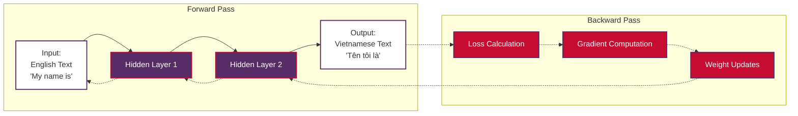
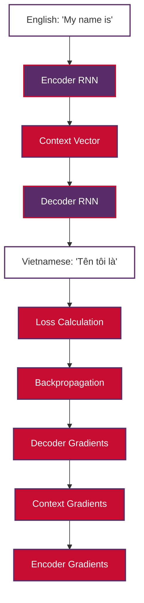

# Backpropagation in Natural Language Processing

**Backpropagation** is the fundamental algorithm that enables neural networks to learn from data by efficiently computing gradients and updating parameters. In Natural Language Processing (NLP), backpropagation is the backbone of modern deep learning systems, from simple feedforward networks to sophisticated transformer architectures like BERT and GPT.

> **Note on Examples**: Code examples in this document work offline and demonstrate backpropagation concepts without requiring internet connectivity or pre-trained models.

## Table of Contents

1. [What is Backpropagation?](#what-is-backpropagation)
2. [Mathematical Foundation](#mathematical-foundation)
3. [Why Backpropagation is Crucial for Understanding NLP](#why-backpropagation-is-crucial-for-understanding-nlp)
4. [Machine Learning Models Using Backpropagation](#machine-learning-models-using-backpropagation)
5. [Backpropagation in NLP Architectures](#backpropagation-in-nlp-architectures)
6. [Vietnamese/English Translation Example](#vietnameseenglish-translation-example)
7. [Implementation Examples](#implementation-examples)
8. [Common Challenges and Solutions](#common-challenges-and-solutions)
9. [Best Practices in NLP](#best-practices-in-nlp)
10. [Conclusion](#conclusion)

## What is Backpropagation?

**Backpropagation** (short for "backward propagation of errors") is an algorithm for training neural networks by computing the gradient of the loss function with respect to each parameter in the network. It works by applying the **chain rule** of calculus to efficiently compute gradients layer by layer, from the output back to the input.

### Core Concept

The algorithm consists of two main phases:

1. **Forward Pass**: Input data flows through the network to produce predictions
2. **Backward Pass**: Error signals propagate backward to compute gradients and update weights



### Historical Context

Backpropagation was popularized in the 1980s and became the foundation for training deep neural networks. In NLP, it enabled the transition from rule-based systems to data-driven approaches, powering everything from word embeddings to large language models.

## Mathematical Foundation

### Chain Rule Application

The mathematical foundation of backpropagation relies on the **chain rule** of calculus. For a neural network with layers $l_1, l_2, ..., l_n$, the gradient of the loss $L$ with respect to weights $W_i$ in layer $i$ is:

$$ \frac{\partial L}{\partial W_i} = \frac{\partial L}{\partial y} \cdot \frac{\partial y}{\partial l_n} \cdot \frac{\partial l_n}{\partial l_{n-1}} \cdot ... \cdot \frac{\partial l_{i+1}}{\partial l_i} \cdot \frac{\partial l_i}{\partial W_i} $$

### Forward Pass Mathematics

For a simple feedforward network:

**Layer Computation:**
$$ z^{(l)} = W^{(l)} a^{(l-1)} + b^{(l)} $$

**Activation Function:**
$$ a^{(l)} = f(z^{(l)}) $$

Where:
- $z^{(l)}$ is the pre-activation at layer $l$
- $a^{(l)}$ is the activation at layer $l$
- $W^{(l)}$ and $b^{(l)}$ are weights and biases
- $f$ is the activation function (ReLU, sigmoid, tanh, etc.)

### Backward Pass Mathematics

**Output Layer Gradient:**
$$ \delta^{(L)} = \frac{\partial L}{\partial a^{(L)}} \odot f'(z^{(L)}) $$

**Hidden Layer Gradient:**
$$ \delta^{(l)} = \left((W^{(l+1)})^T \delta^{(l+1)}\right) \odot f'(z^{(l)}) $$

**Weight and Bias Updates:**
$$ \frac{\partial L}{\partial W^{(l)}} = \delta^{(l)} (a^{(l-1)})^T $$

$$ \frac{\partial L}{\partial b^{(l)}} = \delta^{(l)} $$

### Gradient Descent Integration

Backpropagation computes gradients, which are then used by optimization algorithms like **gradient descent**:

$$ W^{(l)} := W^{(l)} - \alpha \frac{\partial L}{\partial W^{(l)}} $$

$$ b^{(l)} := b^{(l)} - \alpha \frac{\partial L}{\partial b^{(l)}} $$

Where $\alpha$ is the learning rate.

## Why Backpropagation is Crucial for Understanding NLP

### 1. Foundation of Modern NLP Systems

Backpropagation is essential for understanding NLP because:

- **Universal Learning Algorithm**: Nearly all modern NLP models rely on backpropagation for training
- **Scalability**: Enables training of large-scale models with millions/billions of parameters
- **Versatility**: Works across different architectures (RNNs, CNNs, Transformers)

### 2. Understanding Model Behavior

Knowledge of backpropagation helps in:

- **Debugging Training Issues**: Understanding why models fail to converge
- **Optimization Strategies**: Choosing appropriate learning rates and optimizers
- **Architecture Design**: Designing networks that facilitate gradient flow

### 3. Advanced NLP Concepts

Backpropagation understanding is crucial for:

- **Attention Mechanisms**: How attention weights are learned through backpropagation
- **Transfer Learning**: How pre-trained models fine-tune through selective backpropagation
- **Gradient-based Explanations**: Understanding model decisions through gradient analysis

## Machine Learning Models Using Backpropagation

### 1. Gradient Descent and Variants

**Standard Gradient Descent:**
- Uses backpropagation to compute full dataset gradients
- Updates: $\theta := \theta - \alpha \nabla_\theta L(\theta)$

**Stochastic Gradient Descent (SGD):**
```python
# Simplified SGD with backpropagation
for epoch in range(num_epochs):
    for batch in dataset:
        # Forward pass
        predictions = model(batch.inputs)
        loss = loss_function(predictions, batch.targets)
        
        # Backward pass (backpropagation)
        gradients = compute_gradients(loss)
        
        # Parameter update
        for param, grad in zip(model.parameters(), gradients):
            param -= learning_rate * grad
```

**Advanced Optimizers:**
- **Adam**: Combines momentum and adaptive learning rates
- **RMSprop**: Adaptive learning rate based on gradient history
- **AdaGrad**: Adaptive gradient algorithm for sparse features

### 2. Neural Network Architectures

**Feedforward Networks:**
```python
class SimpleNLP_Network:
    def __init__(self, vocab_size, hidden_size, output_size):
        self.W1 = np.random.randn(hidden_size, vocab_size) * 0.01
        self.b1 = np.zeros((hidden_size, 1))
        self.W2 = np.random.randn(output_size, hidden_size) * 0.01
        self.b2 = np.zeros((output_size, 1))
    
    def forward(self, X):
        # Forward pass
        self.z1 = np.dot(self.W1, X) + self.b1
        self.a1 = np.tanh(self.z1)  # Hidden layer activation
        self.z2 = np.dot(self.W2, self.a1) + self.b2
        self.a2 = self.softmax(self.z2)  # Output layer
        return self.a2
    
    def backward(self, X, Y, output):
        m = X.shape[1]  # Number of examples
        
        # Backward pass (backpropagation)
        dz2 = output - Y
        dW2 = (1/m) * np.dot(dz2, self.a1.T)
        db2 = (1/m) * np.sum(dz2, axis=1, keepdims=True)
        
        da1 = np.dot(self.W2.T, dz2)
        dz1 = da1 * (1 - np.power(self.a1, 2))  # tanh derivative
        dW1 = (1/m) * np.dot(dz1, X.T)
        db1 = (1/m) * np.sum(dz1, axis=1, keepdims=True)
        
        return dW1, db1, dW2, db2
```

**Recurrent Neural Networks (RNNs):**
- Use **Backpropagation Through Time (BPTT)**
- Gradients flow backward through sequential time steps
- Essential for language modeling and sequence-to-sequence tasks

**Convolutional Neural Networks (CNNs):**
- Apply backpropagation through convolutional and pooling layers
- Used for text classification and n-gram feature extraction

## Backpropagation in NLP Architectures

### 1. Word Embeddings

**Word2Vec and GloVe Training:**
- Backpropagation updates word vector representations
- Optimizes embeddings to capture semantic relationships

```python
def word2vec_backprop(center_word, context_words, negative_samples):
    """
    Simplified Word2Vec backpropagation example
    """
    # Forward pass: compute probabilities
    hidden = embedding_matrix[center_word]
    
    # Positive samples (context words)
    for context_word in context_words:
        score = np.dot(hidden, output_matrix[context_word])
        prob = sigmoid(score)
        
        # Backpropagation for positive sample
        error = 1 - prob  # Binary classification error
        hidden_grad = error * output_matrix[context_word]
        output_grad = error * hidden
        
        # Update gradients
        embedding_matrix[center_word] += learning_rate * hidden_grad
        output_matrix[context_word] += learning_rate * output_grad
```

### 2. Sequence-to-Sequence Models

**Encoder-Decoder Architecture:**


### 3. Attention Mechanisms

**Attention Weight Learning:**
The attention mechanism learns which parts of the input to focus on through backpropagation:

$$ \alpha_{ij} = \frac{\exp(e_{ij})}{\sum_{k=1}^{T_x} \exp(e_{ik})} $$

Where $e_{ij} = a(s_{i-1}, h_j)$ is the attention score, and gradients flow back through the attention function $a$.

### 4. Transformer Networks

**Self-Attention Backpropagation:**
In transformers, backpropagation flows through:
- Multi-head attention layers
- Feed-forward networks
- Layer normalization
- Residual connections

## Vietnamese/English Translation Example

Let's demonstrate backpropagation with a practical Vietnamese/English translation example:

### Training Data Setup

```python
# Vietnamese/English translation pairs
translation_pairs = [
    ("My name is", "Tên tôi là"),
    ("Hello", "Xin chào"),
    ("Thank you", "Cảm ơn"),
    ("How are you?", "Bạn khỏe không?"),
    ("I love programming", "Tôi yêu lập trình")
]

# Vocabulary creation
english_vocab = {"My": 0, "name": 1, "is": 2, "Hello": 3, "Thank": 4, 
                 "you": 5, "How": 6, "are": 7, "I": 8, "love": 9, "programming": 10}
vietnamese_vocab = {"Tên": 0, "tôi": 1, "là": 2, "Xin": 3, "chào": 4, 
                    "Cảm": 5, "ơn": 6, "Bạn": 7, "khỏe": 8, "không": 9, 
                    "yêu": 10, "lập": 11, "trình": 12}
```

### Simple Translation Model with Backpropagation

```python
import numpy as np

class SimpleTranslationModel:
    def __init__(self, english_vocab_size, vietnamese_vocab_size, hidden_size=64):
        # Initialize weights
        self.W_encoder = np.random.randn(hidden_size, english_vocab_size) * 0.1
        self.W_decoder = np.random.randn(vietnamese_vocab_size, hidden_size) * 0.1
        self.b_encoder = np.zeros((hidden_size, 1))
        self.b_decoder = np.zeros((vietnamese_vocab_size, 1))
        
    def forward(self, english_input):
        """
        Forward pass for English -> Vietnamese translation
        """
        # Encoder: English -> Hidden representation
        self.z_encoder = np.dot(self.W_encoder, english_input) + self.b_encoder
        self.hidden = np.tanh(self.z_encoder)
        
        # Decoder: Hidden -> Vietnamese
        self.z_decoder = np.dot(self.W_decoder, self.hidden) + self.b_decoder
        self.vietnamese_output = self.softmax(self.z_decoder)
        
        return self.vietnamese_output
    
    def backward(self, english_input, vietnamese_target, learning_rate=0.01):
        """
        Backpropagation for translation model
        """
        # Output layer gradients
        output_error = self.vietnamese_output - vietnamese_target
        dW_decoder = np.dot(output_error, self.hidden.T)
        db_decoder = np.sum(output_error, axis=1, keepdims=True)
        
        # Hidden layer gradients
        hidden_error = np.dot(self.W_decoder.T, output_error)
        hidden_error *= (1 - np.power(self.hidden, 2))  # tanh derivative
        
        # Encoder gradients
        dW_encoder = np.dot(hidden_error, english_input.T)
        db_encoder = np.sum(hidden_error, axis=1, keepdims=True)
        
        # Update parameters
        self.W_decoder -= learning_rate * dW_decoder
        self.b_decoder -= learning_rate * db_decoder
        self.W_encoder -= learning_rate * dW_encoder
        self.b_encoder -= learning_rate * db_encoder
    
    def softmax(self, x):
        exp_x = np.exp(x - np.max(x, axis=0, keepdims=True))
        return exp_x / np.sum(exp_x, axis=0, keepdims=True)
    
    def train_on_pair(self, english_text, vietnamese_text):
        """
        Train on a single translation pair
        """
        # Convert text to one-hot vectors (simplified)
        english_vector = self.text_to_vector(english_text, english_vocab)
        vietnamese_vector = self.text_to_vector(vietnamese_text, vietnamese_vocab)
        
        # Forward pass
        prediction = self.forward(english_vector)
        
        # Compute loss
        loss = -np.sum(vietnamese_vector * np.log(prediction + 1e-8))
        
        # Backward pass
        self.backward(english_vector, vietnamese_vector)
        
        return loss
    
    def text_to_vector(self, text, vocab):
        """Convert text to one-hot vector (simplified)"""
        vector = np.zeros((len(vocab), 1))
        for word in text.split():
            if word in vocab:
                vector[vocab[word]] = 1
        return vector

# Training example
model = SimpleTranslationModel(len(english_vocab), len(vietnamese_vocab))

print("Training Vietnamese/English Translation Model with Backpropagation:")
for epoch in range(100):
    total_loss = 0
    for english, vietnamese in translation_pairs:
        loss = model.train_on_pair(english, vietnamese)
        total_loss += loss
    
    if epoch % 20 == 0:
        print(f"Epoch {epoch}, Average Loss: {total_loss / len(translation_pairs):.4f}")
```

## Implementation Examples

### 1. Manual Backpropagation Implementation

```python
def manual_backpropagation_example():
    """
    Step-by-step backpropagation for educational purposes
    """
    # Simple network: input -> hidden -> output
    np.random.seed(42)
    
    # Initialize weights
    W1 = np.random.randn(3, 2) * 0.1  # Input to hidden
    b1 = np.zeros((3, 1))
    W2 = np.random.randn(1, 3) * 0.1  # Hidden to output
    b2 = np.zeros((1, 1))
    
    # Sample input and target
    X = np.array([[0.5], [0.8]])  # Input features
    y = np.array([[1.0]])          # Target output
    
    # Forward pass
    print("=== Forward Pass ===")
    z1 = np.dot(W1, X) + b1
    a1 = np.tanh(z1)  # Hidden activation
    print(f"Hidden layer output: {a1.flatten()}")
    
    z2 = np.dot(W2, a1) + b2
    a2 = 1 / (1 + np.exp(-z2))  # Sigmoid output
    print(f"Final output: {a2.flatten()}")
    
    # Compute loss
    loss = 0.5 * (a2 - y) ** 2
    print(f"Loss: {loss.flatten()}")
    
    # Backward pass
    print("\n=== Backward Pass ===")
    
    # Output layer gradients
    dL_da2 = a2 - y
    da2_dz2 = a2 * (1 - a2)  # Sigmoid derivative
    dL_dz2 = dL_da2 * da2_dz2
    print(f"Output gradient: {dL_dz2.flatten()}")
    
    dL_dW2 = np.dot(dL_dz2, a1.T)
    dL_db2 = dL_dz2
    
    # Hidden layer gradients
    dL_da1 = np.dot(W2.T, dL_dz2)
    da1_dz1 = 1 - a1 ** 2  # Tanh derivative
    dL_dz1 = dL_da1 * da1_dz1
    print(f"Hidden gradient: {dL_dz1.flatten()}")
    
    dL_dW1 = np.dot(dL_dz1, X.T)
    dL_db1 = dL_dz1
    
    # Display gradients
    print(f"\nWeight gradients:")
    print(f"dW2: {dL_dW2}")
    print(f"dW1: {dL_dW1}")
    
    return dL_dW1, dL_db1, dL_dW2, dL_db2

# Run the example
manual_backpropagation_example()
```

### 2. Backpropagation with PyTorch

```python
import torch
import torch.nn as nn
import torch.optim as optim

class NLPClassifier(nn.Module):
    def __init__(self, vocab_size, embed_dim, hidden_dim, output_dim):
        super(NLPClassifier, self).__init__()
        self.embedding = nn.Embedding(vocab_size, embed_dim)
        self.hidden = nn.Linear(embed_dim, hidden_dim)
        self.output = nn.Linear(hidden_dim, output_dim)
        self.dropout = nn.Dropout(0.5)
        
    def forward(self, x):
        # Forward pass
        embedded = self.embedding(x)
        pooled = torch.mean(embedded, dim=1)  # Average pooling
        hidden = torch.relu(self.hidden(pooled))
        hidden = self.dropout(hidden)
        output = self.output(hidden)
        return output

# Example usage with automatic backpropagation
def train_nlp_model():
    # Model setup
    model = NLPClassifier(vocab_size=1000, embed_dim=100, 
                         hidden_dim=64, output_dim=2)
    criterion = nn.CrossEntropyLoss()
    optimizer = optim.Adam(model.parameters(), lr=0.001)
    
    # Sample data (Vietnamese/English sentiment classification)
    # English: "I love this" -> Positive (1)
    # Vietnamese: "Tôi yêu điều này" -> Positive (1)
    sample_texts = torch.randint(0, 1000, (32, 10))  # Batch of tokenized text
    sample_labels = torch.randint(0, 2, (32,))       # Binary labels
    
    model.train()
    for epoch in range(10):
        # Zero gradients
        optimizer.zero_grad()
        
        # Forward pass
        outputs = model(sample_texts)
        loss = criterion(outputs, sample_labels)
        
        # Backward pass (automatic backpropagation)
        loss.backward()
        
        # Parameter update
        optimizer.step()
        
        if epoch % 2 == 0:
            print(f'Epoch {epoch}, Loss: {loss.item():.4f}')

# Demonstrate gradient computation
def show_gradients():
    model = NLPClassifier(vocab_size=100, embed_dim=10, 
                         hidden_dim=5, output_dim=2)
    sample_input = torch.randint(0, 100, (1, 5))
    sample_label = torch.tensor([1])
    
    # Forward pass
    output = model(sample_input)
    loss = nn.CrossEntropyLoss()(output, sample_label)
    
    # Backward pass
    loss.backward()
    
    # Display gradients
    print("Gradients computed by backpropagation:")
    for name, param in model.named_parameters():
        if param.grad is not None:
            print(f"{name}: {param.grad.norm():.6f}")

train_nlp_model()
show_gradients()
```

## Common Challenges and Solutions

### 1. Vanishing Gradient Problem

**Problem**: Gradients become exponentially small in deep networks, preventing learning in early layers.

**Solutions**:
- **ReLU Activation**: Helps maintain gradient flow
- **Residual Connections**: Allow gradients to skip layers
- **LSTM/GRU**: Gating mechanisms control gradient flow
- **Gradient Clipping**: Prevents extreme gradient values

```python
# Gradient clipping example
def clip_gradients(model, max_norm=1.0):
    """Clip gradients to prevent exploding gradients"""
    torch.nn.utils.clip_grad_norm_(model.parameters(), max_norm)
```

### 2. Exploding Gradient Problem

**Problem**: Gradients become exponentially large, causing unstable training.

**Solutions**:
- **Gradient Clipping**: Limit gradient magnitude
- **Proper Weight Initialization**: Xavier/He initialization
- **Learning Rate Scheduling**: Reduce learning rate over time

### 3. Backpropagation Through Time (BPTT) Issues

**Specific to Sequential NLP Models**:

```python
def truncated_bptt(model, sequence, max_length=50):
    """
    Truncated BPTT for long sequences
    """
    for i in range(0, len(sequence), max_length):
        chunk = sequence[i:i+max_length]
        
        # Detach hidden state to prevent full backpropagation
        if hasattr(model, 'hidden'):
            model.hidden = model.hidden.detach()
        
        # Forward and backward on chunk
        output = model(chunk)
        loss = compute_loss(output, targets[i:i+max_length])
        loss.backward()
```

## Best Practices in NLP

### 1. Learning Rate Selection

```python
# Learning rate scheduling for NLP models
def get_learning_rate_schedule():
    return {
        'warmup_steps': 4000,
        'initial_lr': 0.001,
        'decay_strategy': 'inverse_sqrt'
    }

def update_learning_rate(optimizer, step, schedule):
    """Update learning rate based on training step"""
    warmup_steps = schedule['warmup_steps']
    if step < warmup_steps:
        lr = schedule['initial_lr'] * (step / warmup_steps)
    else:
        lr = schedule['initial_lr'] * (warmup_steps / step) ** 0.5
    
    for param_group in optimizer.param_groups:
        param_group['lr'] = lr
```

### 2. Regularization Techniques

```python
# Dropout in NLP models
class RobustNLPModel(nn.Module):
    def __init__(self, vocab_size, hidden_dim):
        super().__init__()
        self.embedding = nn.Embedding(vocab_size, hidden_dim)
        self.dropout1 = nn.Dropout(0.3)  # Embedding dropout
        self.linear = nn.Linear(hidden_dim, hidden_dim)
        self.dropout2 = nn.Dropout(0.5)  # Hidden dropout
        self.output = nn.Linear(hidden_dim, vocab_size)
        
    def forward(self, x):
        x = self.embedding(x)
        x = self.dropout1(x)
        x = torch.relu(self.linear(x))
        x = self.dropout2(x)
        return self.output(x)
```

### 3. Monitoring Training Progress

```python
def monitor_training_health(model, loss_history, gradient_norms):
    """Monitor training health indicators"""
    
    # Check for loss plateaus
    recent_losses = loss_history[-10:]
    if len(recent_losses) == 10:
        loss_variation = np.std(recent_losses)
        if loss_variation < 0.001:
            print("Warning: Loss plateau detected")
    
    # Check gradient norms
    avg_grad_norm = np.mean(gradient_norms[-10:])
    if avg_grad_norm < 1e-6:
        print("Warning: Vanishing gradients detected")
    elif avg_grad_norm > 10:
        print("Warning: Exploding gradients detected")
    
    # Check parameter updates
    for name, param in model.named_parameters():
        if param.grad is not None:
            update_ratio = param.grad.norm() / param.norm()
            if update_ratio > 0.1:
                print(f"Large update ratio in {name}: {update_ratio:.4f}")
```

## Conclusion

Backpropagation is the cornerstone algorithm that enables modern NLP systems to learn from data. Understanding backpropagation is crucial for:

### Key Takeaways

1. **Fundamental Importance**: Backpropagation is the learning mechanism behind all modern NLP neural networks
2. **Mathematical Foundation**: Based on the chain rule of calculus, it efficiently computes gradients
3. **Universal Application**: Used in feedforward networks, RNNs, CNNs, and Transformers
4. **Practical Implementation**: Essential for debugging, optimization, and model improvement

### NLP-Specific Insights

- **Sequential Processing**: Backpropagation Through Time (BPTT) enables learning from sequential text data
- **Language Understanding**: Enables models to learn word embeddings, syntax, and semantics
- **Transfer Learning**: Foundation for pre-training and fine-tuning large language models
- **Attention Mechanisms**: Enables learning of dynamic attention weights in modern architectures

### Future Considerations

As NLP models continue to grow in size and complexity, understanding backpropagation becomes even more critical for:
- Efficient training strategies
- Gradient accumulation techniques
- Distributed training approaches
- Memory-efficient implementations

Whether you're working with simple text classifiers or state-of-the-art language models like GPT or BERT, a solid understanding of backpropagation will enhance your ability to develop, debug, and improve NLP systems.

---

*This document provides a comprehensive foundation for understanding backpropagation in the context of Natural Language Processing. For more advanced topics, see the related documentation on [RNN architectures](RNN.md), [attention mechanisms](attention.md), and [transformer models](transformer.md).*