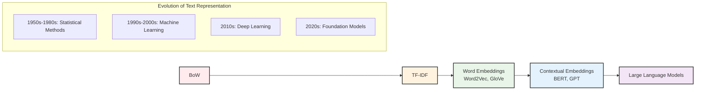

# Bag of Words (BoW)

A comprehensive guide to understanding the Bag of Words model, one of the fundamental text representation techniques in Natural Language Processing (NLP) and machine learning.

## Table of Contents

1. [Explanation](#explanation)
2. [The Algorithm](#the-algorithm)
3. [Use Cases](#use-cases)
4. [Example Code in Python](#example-code-in-python)
5. [Conclusion](#conclusion)

## Explanation

The **Bag of Words (BoW)** model is a fundamental text representation technique used in Natural Language Processing and machine learning. It's called "bag" of words because it treats text as an unordered collection of words, disregarding grammar, word order, and context while maintaining information about word frequency.

### Key Characteristics

**Simplicity**: BoW is one of the simplest and most intuitive text representation methods, making it an excellent starting point for text analysis tasks.

**Order Independence**: The model ignores the sequential order of words in the text. For example, "I love machine learning" and "learning machine love I" would have identical BoW representations.

**Frequency-Based**: BoW focuses on the frequency of word occurrences, which can be surprisingly effective for many text classification tasks.

**Document-Term Matrix**: The output is typically a matrix where each row represents a document and each column represents a unique word from the vocabulary.

### How It Works

1. **Vocabulary Creation**: First, a vocabulary is built from all unique words across all documents in the corpus.

2. **Vector Representation**: Each document is then represented as a vector where each dimension corresponds to a word in the vocabulary.

3. **Frequency Counting**: The value in each dimension represents how many times that particular word appears in the document.

### Example Transformation

Consider these two sentences:
- Document 1: "I love natural language processing"
- Document 2: "Natural language processing is fascinating"

**Vocabulary**: [I, love, natural, language, processing, is, fascinating]

**BoW Representations**:
- Document 1: [1, 1, 1, 1, 1, 0, 0]
- Document 2: [0, 0, 1, 1, 1, 1, 1]

### Advantages

- **Simplicity**: Easy to understand and implement
- **Effectiveness**: Surprisingly effective for many text classification tasks
- **Interpretability**: Results are easily interpretable
- **Foundation**: Serves as a stepping stone to more advanced techniques
- **Computational Efficiency**: Fast to compute and process

### Limitations

- **Loss of Context**: Ignores word order and semantic relationships
- **Sparsity**: Results in sparse matrices, especially with large vocabularies
- **High Dimensionality**: Vocabulary size can lead to very high-dimensional vectors
- **No Semantic Understanding**: Cannot capture synonyms or related concepts
- **Equal Weight Assumption**: All words are treated as equally important

## The Algorithm

The Bag of Words algorithm can be broken down into several clear steps:

### Step 1: Text Preprocessing

Before creating the BoW representation, text typically undergoes preprocessing:

```
Input: Raw text documents
↓
1. Convert to lowercase
2. Remove punctuation and special characters
3. Remove stop words (optional)
4. Apply stemming or lemmatization (optional)
↓
Output: Cleaned text documents
```

### Step 2: Vocabulary Construction

```
Algorithm: Build Vocabulary
Input: Collection of preprocessed documents D = {d1, d2, ..., dn}
Output: Vocabulary V = {w1, w2, ..., wm}

1. Initialize empty vocabulary V = {}
2. For each document d in D:
   a. Split document into words
   b. For each word w in document:
      - Add w to vocabulary V if not already present
3. Return sorted vocabulary V
```

### Step 3: Vector Creation

```
Algorithm: Create BoW Vector
Input: Document d, Vocabulary V
Output: BoW vector v of length |V|

1. Initialize vector v of size |V| with zeros
2. Split document d into words
3. For each word w in document:
   a. Find index i of word w in vocabulary V
   b. Increment v[i] by 1
4. Return vector v
```

### Step 4: Matrix Construction

```
Algorithm: Create BoW Matrix
Input: Document collection D, Vocabulary V
Output: BoW matrix M of size |D| × |V|

1. Initialize matrix M of size |D| × |V|
2. For i = 1 to |D|:
   a. Create BoW vector v_i for document d_i
   b. Set row i of matrix M to v_i
3. Return matrix M
```

### Mathematical Representation

For a corpus of n documents and vocabulary of m unique words:

- **Vocabulary**: V = {w₁, w₂, ..., wₘ}
- **Document**: dᵢ = {word₁, word₂, ..., wordₖ}
- **BoW Vector**: vᵢ = [count(w₁), count(w₂), ..., count(wₘ)]
- **BoW Matrix**: M = [v₁, v₂, ..., vₙ]ᵀ

Where count(wⱼ) represents the frequency of word wⱼ in document dᵢ.

### Complexity Analysis

- **Time Complexity**: O(n × k), where n is the number of documents and k is the average document length
- **Space Complexity**: O(m × n), where m is the vocabulary size and n is the number of documents

## Use Cases

The Bag of Words model finds applications across various domains and tasks in Natural Language Processing and machine learning:

### 1. Text Classification

**Spam Email Detection**
- Features: Email content represented as BoW vectors
- Task: Classify emails as spam or legitimate
- Advantage: Simple words like "lottery", "winner", "urgent" become strong indicators

**Sentiment Analysis**
- Features: Reviews or social media posts as BoW vectors
- Task: Classify sentiment as positive, negative, or neutral
- Example: Movie reviews, product feedback, social media sentiment

**Topic Classification**
- Features: News articles or documents as BoW vectors
- Task: Classify documents into categories (sports, politics, technology)
- Application: News aggregation, content organization

### 2. Information Retrieval

**Document Search**
- Use BoW to represent queries and documents
- Calculate similarity between query and document vectors
- Rank documents by relevance scores

**Recommendation Systems**
- Create user profiles based on BoW of consumed content
- Recommend similar content based on vector similarity
- Applications: News recommendation, content discovery

### 3. Text Mining and Analytics

**Keyword Extraction**
- Identify most frequent words across document collections
- Filter out common words to find domain-specific terms
- Applications: Market research, trend analysis

**Document Clustering**
- Group similar documents based on BoW vector similarity
- Discover hidden topics or themes in document collections
- Applications: Research organization, content categorization

### 4. Content Analysis

**Social Media Monitoring**
- Analyze brand mentions and discussions
- Track trending topics and conversations
- Measure public opinion and sentiment

**Market Research**
- Analyze customer feedback and reviews
- Identify common complaints or praise patterns
- Track competitor mentions and comparisons

### 5. Academic and Research Applications

**Literature Review**
- Analyze research paper abstracts and titles
- Identify research trends and popular topics
- Group related papers automatically

**Survey Analysis**
- Process open-ended survey responses
- Categorize feedback themes
- Quantify qualitative responses

### 6. Business Intelligence

**Customer Support**
- Categorize support tickets automatically
- Identify common issues and problems
- Route tickets to appropriate departments

**Risk Assessment**
- Analyze financial reports and news
- Identify risk factors and concerns
- Monitor regulatory compliance

### When to Use BoW

**Ideal Scenarios:**
- Simple text classification tasks
- When interpretability is important
- Limited computational resources
- Baseline model development
- Small to medium-sized datasets

**Consider Alternatives When:**
- Word order and context are crucial
- Working with very large vocabularies
- Need to capture semantic relationships
- Dealing with multilingual content
- Require advanced language understanding

## Example Code in Python

This section provides comprehensive Python examples demonstrating various aspects of the Bag of Words implementation using popular libraries.

### Basic Implementation with Scikit-learn

```python
import numpy as np
import pandas as pd
from sklearn.feature_extraction.text import CountVectorizer
from sklearn.model_selection import train_test_split
from sklearn.naive_bayes import MultinomialNB
from sklearn.metrics import accuracy_score, classification_report

# Sample dataset
documents = [
    "I love machine learning and natural language processing",
    "Machine learning is fascinating and powerful",
    "Natural language processing helps computers understand text",
    "Deep learning and neural networks are advanced topics",
    "Text mining and data analysis are important skills",
    "Python is great for machine learning projects",
    "Artificial intelligence is transforming the world",
    "Data science combines statistics and programming"
]

labels = [1, 1, 1, 1, 0, 1, 1, 0]  # 1 = ML/NLP related, 0 = General tech

# Create Bag of Words representation
vectorizer = CountVectorizer()
bow_matrix = vectorizer.fit_transform(documents)

# Display results
print("Vocabulary size:", len(vectorizer.vocabulary_))
print("Feature names:", vectorizer.get_feature_names_out()[:10])
print("BoW matrix shape:", bow_matrix.shape)
print("BoW matrix (first document):")
print(bow_matrix[0].toarray())
```

### Advanced BoW with Preprocessing

```python
import re
import nltk
from nltk.corpus import stopwords
from nltk.tokenize import word_tokenize
from nltk.stem import PorterStemmer
from sklearn.feature_extraction.text import CountVectorizer

# Download required NLTK data
nltk.download('punkt', quiet=True)
nltk.download('stopwords', quiet=True)

class AdvancedBoWProcessor:
    def __init__(self, remove_stopwords=True, use_stemming=True, min_df=1, max_df=1.0):
        self.remove_stopwords = remove_stopwords
        self.use_stemming = use_stemming
        self.stemmer = PorterStemmer() if use_stemming else None
        self.stop_words = set(stopwords.words('english')) if remove_stopwords else set()
        self.vectorizer = CountVectorizer(
            preprocessor=self.preprocess_text,
            min_df=min_df,
            max_df=max_df,
            token_pattern=r'\b\w+\b'
        )
    
    def preprocess_text(self, text):
        """Advanced text preprocessing"""
        # Convert to lowercase
        text = text.lower()
        
        # Remove special characters and digits
        text = re.sub(r'[^a-zA-Z\s]', '', text)
        
        # Tokenize
        tokens = word_tokenize(text)
        
        # Remove stopwords
        if self.remove_stopwords:
            tokens = [token for token in tokens if token not in self.stop_words]
        
        # Apply stemming
        if self.use_stemming and self.stemmer:
            tokens = [self.stemmer.stem(token) for token in tokens]
        
        # Join back to string for CountVectorizer
        return ' '.join(tokens)
    
    def fit_transform(self, documents):
        """Fit vectorizer and transform documents"""
        return self.vectorizer.fit_transform(documents)
    
    def transform(self, documents):
        """Transform new documents"""
        return self.vectorizer.transform(documents)
    
    def get_feature_names(self):
        """Get vocabulary features"""
        return self.vectorizer.get_feature_names_out()
    
    def get_vocabulary_size(self):
        """Get vocabulary size"""
        return len(self.vectorizer.vocabulary_)

# Example usage
sample_texts = [
    "The quick brown fox jumps over the lazy dog!",
    "Machine learning algorithms are powerful tools.",
    "Natural language processing enables text understanding.",
    "Data science combines programming and statistics."
]

# Create advanced BoW processor
bow_processor = AdvancedBoWProcessor(
    remove_stopwords=True,
    use_stemming=True,
    min_df=1,
    max_df=0.8
)

# Transform texts
bow_matrix = bow_processor.fit_transform(sample_texts)

print("Advanced BoW Processing Results:")
print(f"Vocabulary size: {bow_processor.get_vocabulary_size()}")
print(f"Feature names: {list(bow_processor.get_feature_names())}")
print(f"Matrix shape: {bow_matrix.shape}")
```

### Text Classification with BoW

```python
from sklearn.model_selection import train_test_split
from sklearn.naive_bayes import MultinomialNB
from sklearn.linear_model import LogisticRegression
from sklearn.svm import SVC
from sklearn.metrics import accuracy_score, classification_report, confusion_matrix
import matplotlib.pyplot as plt
import seaborn as sns

# Extended dataset for classification
texts = [
    # Positive sentiment
    "I love this product, it's amazing and works perfectly!",
    "Excellent service, highly recommended to everyone.",
    "Great quality and fast delivery, very satisfied.",
    "Outstanding performance, exceeded my expectations.",
    "Wonderful experience, will definitely buy again.",
    
    # Negative sentiment
    "Terrible product, waste of money and time.",
    "Poor quality, broke after just one day of use.",
    "Awful customer service, very disappointing experience.",
    "Completely useless, does not work as advertised.",
    "Worst purchase ever, would not recommend to anyone."
]

labels = [1, 1, 1, 1, 1, 0, 0, 0, 0, 0]  # 1 = Positive, 0 = Negative

# Create BoW representation
vectorizer = CountVectorizer(
    stop_words='english',
    max_features=1000,
    ngram_range=(1, 2)  # Include both unigrams and bigrams
)

X = vectorizer.fit_transform(texts)
y = np.array(labels)

# Split data
X_train, X_test, y_train, y_test = train_test_split(
    X, y, test_size=0.3, random_state=42, stratify=y
)

# Train multiple classifiers
classifiers = {
    'Naive Bayes': MultinomialNB(),
    'Logistic Regression': LogisticRegression(random_state=42),
    'SVM': SVC(random_state=42, probability=True)
}

results = {}

for name, clf in classifiers.items():
    # Train classifier
    clf.fit(X_train, y_train)
    
    # Make predictions
    y_pred = clf.predict(X_test)
    
    # Calculate accuracy
    accuracy = accuracy_score(y_test, y_pred)
    results[name] = accuracy
    
    print(f"\n{name} Results:")
    print(f"Accuracy: {accuracy:.3f}")
    print("\nClassification Report:")
    print(classification_report(y_test, y_pred, target_names=['Negative', 'Positive']))

# Display feature importance for Naive Bayes
nb_classifier = classifiers['Naive Bayes']
feature_names = vectorizer.get_feature_names_out()
feature_probs = nb_classifier.feature_log_prob_

# Get top features for each class
top_positive = np.argsort(feature_probs[1])[-10:][::-1]
top_negative = np.argsort(feature_probs[0])[-10:][::-1]

print("\nTop 10 features for Positive sentiment:")
for idx in top_positive:
    print(f"- {feature_names[idx]}: {feature_probs[1][idx]:.3f}")

print("\nTop 10 features for Negative sentiment:")
for idx in top_negative:
    print(f"- {feature_names[idx]}: {feature_probs[0][idx]:.3f}")
```

### Custom BoW Implementation from Scratch

```python
import re
from collections import Counter, defaultdict
from typing import List, Dict, Tuple

class CustomBagOfWords:
    """Custom implementation of Bag of Words from scratch"""
    
    def __init__(self, lowercase=True, remove_punctuation=True):
        self.lowercase = lowercase
        self.remove_punctuation = remove_punctuation
        self.vocabulary = {}
        self.vocab_size = 0
        
    def preprocess_text(self, text: str) -> str:
        """Preprocess individual text"""
        if self.lowercase:
            text = text.lower()
        
        if self.remove_punctuation:
            text = re.sub(r'[^\w\s]', ' ', text)
        
        # Remove extra whitespace
        text = re.sub(r'\s+', ' ', text).strip()
        
        return text
    
    def tokenize(self, text: str) -> List[str]:
        """Tokenize text into words"""
        processed_text = self.preprocess_text(text)
        return processed_text.split()
    
    def build_vocabulary(self, documents: List[str]) -> None:
        """Build vocabulary from document collection"""
        all_words = set()
        
        for doc in documents:
            words = self.tokenize(doc)
            all_words.update(words)
        
        # Create word to index mapping
        self.vocabulary = {word: idx for idx, word in enumerate(sorted(all_words))}
        self.vocab_size = len(self.vocabulary)
    
    def document_to_vector(self, document: str) -> List[int]:
        """Convert single document to BoW vector"""
        words = self.tokenize(document)
        word_counts = Counter(words)
        
        # Create vector
        vector = [0] * self.vocab_size
        for word, count in word_counts.items():
            if word in self.vocabulary:
                vector[self.vocabulary[word]] = count
        
        return vector
    
    def fit_transform(self, documents: List[str]) -> List[List[int]]:
        """Fit vocabulary and transform documents"""
        self.build_vocabulary(documents)
        return [self.document_to_vector(doc) for doc in documents]
    
    def transform(self, documents: List[str]) -> List[List[int]]:
        """Transform new documents using existing vocabulary"""
        if not self.vocabulary:
            raise ValueError("Vocabulary not built. Call fit_transform first.")
        
        return [self.document_to_vector(doc) for doc in documents]
    
    def get_feature_names(self) -> List[str]:
        """Get vocabulary words in order"""
        return [word for word, _ in sorted(self.vocabulary.items(), key=lambda x: x[1])]
    
    def get_vocabulary_info(self) -> Dict:
        """Get vocabulary statistics"""
        return {
            'vocabulary_size': self.vocab_size,
            'words': list(self.vocabulary.keys())
        }

# Example usage of custom implementation
custom_bow = CustomBagOfWords(lowercase=True, remove_punctuation=True)

sample_docs = [
    "Hello world! This is a sample document.",
    "This is another document with different words.",
    "Hello again! More words and text here."
]

# Fit and transform
bow_vectors = custom_bow.fit_transform(sample_docs)

print("Custom BoW Implementation Results:")
print(f"Vocabulary: {custom_bow.get_feature_names()}")
print(f"Vocabulary size: {custom_bow.vocab_size}")
print("\nDocument vectors:")
for i, vector in enumerate(bow_vectors):
    print(f"Document {i+1}: {vector}")

# Transform new document
new_doc = ["Hello world with new words!"]
new_vector = custom_bow.transform(new_doc)
print(f"\nNew document vector: {new_vector[0]}")
```

### Visualization and Analysis

```python
import matplotlib.pyplot as plt
import seaborn as sns
from wordcloud import WordCloud
from sklearn.decomposition import PCA
from sklearn.manifold import TSNE

def visualize_bow_results(documents, bow_matrix, vectorizer):
    """Visualize BoW results with various plots"""
    
    # 1. Vocabulary distribution
    word_frequencies = np.array(bow_matrix.sum(axis=0)).flatten()
    feature_names = vectorizer.get_feature_names_out()
    
    # Create word frequency DataFrame
    word_freq_df = pd.DataFrame({
        'word': feature_names,
        'frequency': word_frequencies
    }).sort_values('frequency', ascending=False)
    
    # Plot top 20 words
    plt.figure(figsize=(12, 6))
    plt.subplot(1, 2, 1)
    top_words = word_freq_df.head(20)
    plt.barh(range(len(top_words)), top_words['frequency'])
    plt.yticks(range(len(top_words)), top_words['word'])
    plt.xlabel('Frequency')
    plt.title('Top 20 Most Frequent Words')
    plt.gca().invert_yaxis()
    
    # 2. Document-term matrix heatmap
    plt.subplot(1, 2, 2)
    # Show only top 15 words for readability
    top_15_indices = word_freq_df.head(15).index
    subset_matrix = bow_matrix[:, top_15_indices].toarray()
    subset_words = word_freq_df.head(15)['word'].values
    
    sns.heatmap(subset_matrix, 
                xticklabels=subset_words,
                yticklabels=[f'Doc {i+1}' for i in range(len(documents))],
                annot=True, fmt='d', cmap='Blues')
    plt.title('Document-Term Matrix (Top 15 Words)')
    plt.xticks(rotation=45)
    
    plt.tight_layout()
    plt.show()
    
    # 3. Word cloud
    word_freq_dict = dict(zip(word_freq_df['word'], word_freq_df['frequency']))
    wordcloud = WordCloud(width=800, height=400, 
                         background_color='white').generate_from_frequencies(word_freq_dict)
    
    plt.figure(figsize=(10, 5))
    plt.imshow(wordcloud, interpolation='bilinear')
    plt.axis('off')
    plt.title('Word Cloud from BoW Vocabulary')
    plt.show()
    
    # 4. Document similarity heatmap
    from sklearn.metrics.pairwise import cosine_similarity
    
    doc_similarity = cosine_similarity(bow_matrix)
    
    plt.figure(figsize=(8, 6))
    sns.heatmap(doc_similarity, 
                xticklabels=[f'Doc {i+1}' for i in range(len(documents))],
                yticklabels=[f'Doc {i+1}' for i in range(len(documents))],
                annot=True, cmap='coolwarm', center=0)
    plt.title('Document Similarity Matrix (Cosine Similarity)')
    plt.show()

# Example usage (requires sample data)
sample_documents = [
    "Machine learning is a subset of artificial intelligence",
    "Natural language processing deals with text analysis",
    "Deep learning uses neural networks for complex tasks",
    "Data science combines statistics and programming",
    "Computer vision processes and analyzes images"
]

vectorizer = CountVectorizer(stop_words='english', max_features=50)
bow_matrix = vectorizer.fit_transform(sample_documents)

# Note: Uncomment the following line to run visualization
# (requires additional libraries: wordcloud)
# visualize_bow_results(sample_documents, bow_matrix, vectorizer)
```

### Performance Optimization Tips

```python
import time
from scipy.sparse import csr_matrix
from sklearn.feature_extraction.text import CountVectorizer

def benchmark_bow_performance():
    """Benchmark different BoW configurations"""
    
    # Generate larger dataset for benchmarking
    large_documents = [
        f"This is document number {i} with various words about "
        f"machine learning, natural language processing, and data science. "
        f"Document {i} contains unique information and repeated patterns."
        for i in range(1000)
    ]
    
    configurations = [
        {'name': 'Basic BoW', 'params': {}},
        {'name': 'With Stop Words', 'params': {'stop_words': 'english'}},
        {'name': 'Limited Features', 'params': {'max_features': 1000}},
        {'name': 'N-grams (1,2)', 'params': {'ngram_range': (1, 2)}},
        {'name': 'Min/Max DF', 'params': {'min_df': 2, 'max_df': 0.8}},
    ]
    
    results = []
    
    for config in configurations:
        vectorizer = CountVectorizer(**config['params'])
        
        start_time = time.time()
        bow_matrix = vectorizer.fit_transform(large_documents)
        end_time = time.time()
        
        results.append({
            'Configuration': config['name'],
            'Time (seconds)': round(end_time - start_time, 3),
            'Vocabulary Size': len(vectorizer.vocabulary_),
            'Matrix Shape': bow_matrix.shape,
            'Matrix Sparsity': round(1 - bow_matrix.nnz / (bow_matrix.shape[0] * bow_matrix.shape[1]), 3)
        })
    
    # Display results
    results_df = pd.DataFrame(results)
    print("BoW Performance Benchmark:")
    print(results_df.to_string(index=False))
    
    return results_df

# Uncomment to run benchmark
# benchmark_results = benchmark_bow_performance()
```

This comprehensive code collection demonstrates the versatility and practical applications of the Bag of Words model, from basic implementations to advanced preprocessing and visualization techniques.

## Conclusion

The Bag of Words model represents a fundamental stepping stone in the journey of Natural Language Processing and text analysis. Despite its apparent simplicity, BoW has proven to be remarkably effective across a wide range of applications and continues to serve as both a practical tool and an educational foundation for understanding text representation.

### Key Takeaways

**Foundational Importance**: BoW introduces essential concepts that underpin more advanced NLP techniques. Understanding how text can be converted into numerical representations is crucial for anyone working with language data and machine learning.

**Practical Effectiveness**: While sophisticated models like transformers and neural networks dominate modern NLP, BoW remains surprisingly competitive for many classification tasks, especially when combined with proper preprocessing and feature engineering.

**Interpretability**: One of BoW's greatest strengths is its interpretability. Unlike black-box models, BoW representations can be easily understood and explained, making it valuable for applications where transparency is important.

**Computational Efficiency**: BoW is computationally efficient and requires minimal resources compared to deep learning approaches, making it accessible for small-scale projects and resource-constrained environments.

### When to Choose BoW

**Ideal Scenarios:**
- Text classification with moderate complexity
- Baseline model development and comparison
- Projects requiring model interpretability
- Limited computational resources or training data
- Quick prototyping and proof-of-concept development

**Consider Advanced Alternatives When:**
- Context and word order are semantically important
- Working with complex language understanding tasks
- Need to capture nuanced meaning and relationships
- Have access to large datasets and computational resources

### Evolution and Modern Context

While BoW laid the groundwork for text representation, the field has evolved significantly:

**Historical Progression**: 


**Continued Relevance**: Despite these advances, BoW principles remain embedded in modern approaches. Many sophisticated models still use frequency-based features, and understanding BoW helps in comprehending these more complex systems.

**Hybrid Approaches**: Modern applications often combine BoW with other techniques, using it as one component in ensemble models or as a baseline for comparison.

### Best Practices for Implementation

1. **Preprocessing**: Invest time in proper text cleaning, stop word removal, and normalization
2. **Feature Selection**: Use techniques like TF-IDF weighting or minimum/maximum document frequency filtering
3. **Dimensionality Management**: Consider vocabulary size limits and feature selection methods
4. **Validation**: Always validate model performance on unseen data
5. **Baseline Establishment**: Use BoW as a baseline before implementing more complex models

### Looking Forward

As the NLP field continues to advance with large language models and transformer architectures, understanding fundamental techniques like BoW becomes even more valuable. These foundational concepts help practitioners:

- **Debug and Interpret** complex model behaviors
- **Design Better Features** for hybrid systems
- **Understand Limitations** of different approaches
- **Make Informed Decisions** about model selection
- **Communicate Results** effectively to stakeholders

### Final Recommendations

For learners and practitioners starting their NLP journey, mastering BoW provides:
- A solid foundation for understanding text representation
- Practical skills for immediate application
- Conceptual framework for learning advanced techniques
- Appreciation for the evolution of NLP methods

The Bag of Words model exemplifies how simple, well-understood techniques can provide significant value in real-world applications. While it may not capture the full complexity of human language, its simplicity, effectiveness, and interpretability ensure its continued relevance in the ever-evolving landscape of Natural Language Processing.

Whether you're building your first text classifier, establishing baselines for complex projects, or seeking to understand the foundations of text analysis, the Bag of Words model offers a perfect starting point for your journey into the fascinating world of Natural Language Processing.