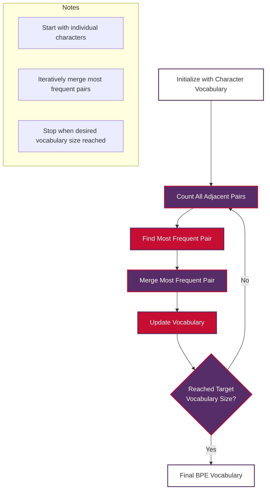
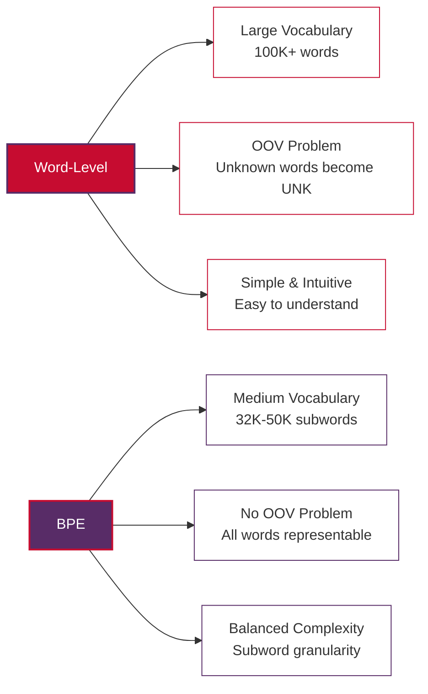

# Byte Pair Encoding (BPE)

A comprehensive guide to understanding Byte Pair Encoding, a subword tokenization algorithm that has become fundamental to modern Natural Language Processing and is used in models like GPT, RoBERTa, and many other transformer-based architectures.

## Table of Contents

1. [Basic Definition and Core Concepts](#basic-definition-and-core-concepts)
2. [The BPE Algorithm](#the-bpe-algorithm)
3. [Mathematical Foundation](#mathematical-foundation)
4. [Step-by-Step Example](#step-by-step-example)
5. [Implementation Examples](#implementation-examples)
6. [BPE in Modern NLP Models](#bpe-in-modern-nlp-models)
7. [Advantages and Disadvantages](#advantages-and-disadvantages)
8. [Comparison with Other Tokenization Methods](#comparison-with-other-tokenization-methods)
9. [Vietnamese/English BPE Examples](#vietnameseenglish-bpe-examples)
10. [Best Practices](#best-practices)
11. [Real-World Applications](#real-world-applications)
12. [Conclusion](#conclusion)

## Basic Definition and Core Concepts

**Byte Pair Encoding (BPE)** is a subword tokenization algorithm originally developed for data compression that has been adapted for Natural Language Processing. BPE works by iteratively merging the most frequent pairs of consecutive symbols (characters or subwords) in a corpus to create a vocabulary of subword units.

### Core Innovation

BPE addresses the fundamental trade-off in tokenization between vocabulary size and the ability to handle unknown words:

**Subword Tokenization**
- Operates at a granularity between characters and words
- Creates meaningful subword units that can represent both common words and rare/unseen words
- Balances expressiveness with computational efficiency

**Data-Driven Vocabulary**
- Learns vocabulary directly from training data
- Adapts to the specific characteristics of the target language and domain
- No predefined linguistic rules or word boundaries required

**Open Vocabulary**
- Can represent any word by breaking it into subword components
- Eliminates the out-of-vocabulary (OOV) problem completely
- Particularly effective for morphologically rich languages

### Key Characteristics

**Frequency-Based**: BPE prioritizes the most frequently occurring character pairs, ensuring that common patterns are captured efficiently.

**Greedy Algorithm**: At each step, BPE merges the most frequent pair, making locally optimal decisions that lead to globally reasonable vocabularies.

**Reversible**: The tokenization process can be reversed to reconstruct the original text exactly.

**Language Agnostic**: Works across different languages without requiring language-specific modifications.

## The BPE Algorithm

The BPE algorithm consists of two main phases: training (vocabulary learning) and encoding (text tokenization).

### Training Phase



### Encoding Phase

```mermaid
graph TD
    A[Input Text:<br>'My name is'] --> B[Initialize with Characters:<br>['M', 'y', ' ', 'n', 'a', 'm', 'e', ' ', 'i', 's']]
    B --> C[Apply BPE Merges<br>in Learned Order]
    C --> D[Final Subword Tokens:<br>['My', ' name', ' is']]

    style A fill:#FFFFFF,stroke:#582C67,color:#333,stroke-width:2px
    style B fill:#582C67,stroke:#C60C30,color:#FFFFFF,stroke-width:2px
    style C fill:#C60C30,stroke:#582C67,color:#FFFFFF,stroke-width:2px
    style D fill:#FFFFFF,stroke:#582C67,color:#333,stroke-width:2px

    subgraph Process
        sub1[Text → Characters → Subwords]
        sub2[Apply merges learned during training]
        sub3[Result: Sequence of subword tokens]
    end
```

## Mathematical Foundation

### Probability and Frequency

BPE's core operation is based on frequency counting and probability estimation. For a corpus $C$, the frequency of a character pair $(c_i, c_{i+1})$ is:

$$ f(c_i, c_{i+1}) = \sum_{w \in C} \sum_{j=1}^{|w|-1} \mathbf{1}[w_j = c_i \land w_{j+1} = c_{i+1}] $$

Where $\mathbf{1}[\cdot]$ is the indicator function and $w$ represents individual words in the corpus.

### Merge Operation

At each iteration $t$, BPE selects the pair with maximum frequency:

$$ (c^*_i, c^*_{i+1}) = \arg\max_{(c_i, c_{i+1})} f_t(c_i, c_{i+1}) $$

The merge operation creates a new symbol:

$$ s_{new} = c^*_i \oplus c^*_{i+1} $$

Where $\oplus$ represents concatenation.

### Vocabulary Growth

The vocabulary size grows according to:

$$ |V_t| = |V_0| + t $$

Where $|V_0|$ is the initial character vocabulary size and $t$ is the number of merge operations performed.

### Information-Theoretic Perspective

BPE can be viewed as a form of data compression that minimizes the expected code length. The optimal subword segmentation minimizes:

$$ L = -\sum_{s \in S} P(s) \log_2 P(s) $$

Where $S$ is the set of subword tokens and $P(s)$ is the probability of subword $s$.

## Step-by-Step Example

Let's walk through a complete BPE training example with Vietnamese/English text:

### Initial Corpus
```
Tên tôi là John
My name is John
Hello world
Xin chào thế giới
```

### Step 1: Initialize Character Vocabulary

```
Initial vocabulary: {T, ê, n, , t, ô, i, l, à, J, o, h, M, y, m, e, s, H, c, w, r, d, X, g, ớ, ế}
Word representations:
- "Tên": ['T', 'ê', 'n']
- "tôi": ['t', 'ô', 'i'] 
- "là": ['l', 'à']
- "John": ['J', 'o', 'h', 'n']
- "My": ['M', 'y']
- "name": ['n', 'a', 'm', 'e']
- "is": ['i', 's']
- "Hello": ['H', 'e', 'l', 'l', 'o']
- "world": ['w', 'o', 'r', 'l', 'd']
- "Xin": ['X', 'i', 'n']
- "chào": ['c', 'h', 'à', 'o']
- "thế": ['t', 'h', 'ế']
- "giới": ['g', 'i', 'ớ', 'i']
```

### Step 2: Count Adjacent Pairs

```
Pair frequencies:
('T', 'ê'): 1    ('ê', 'n'): 1    ('t', 'ô'): 1    ('ô', 'i'): 1
('l', 'à'): 1    ('J', 'o'): 1    ('o', 'h'): 1    ('h', 'n'): 1
('M', 'y'): 1    ('n', 'a'): 1    ('a', 'm'): 1    ('m', 'e'): 1
('i', 's'): 1    ('H', 'e'): 1    ('e', 'l'): 1    ('l', 'l'): 1
('l', 'o'): 2    ('w', 'o'): 1    ('o', 'r'): 1    ('r', 'l'): 1
('l', 'd'): 1    ('X', 'i'): 1    ('i', 'n'): 2    ('c', 'h'): 1
('h', 'à'): 1    ('à', 'o'): 1    ('t', 'h'): 1    ('h', 'ế'): 1
('g', 'i'): 1    ('i', 'ớ'): 1    ('ớ', 'i'): 1
```

### Step 3: Merge Most Frequent Pairs

Most frequent pairs: ('l', 'o') and ('i', 'n') both appear 2 times. Let's merge ('i', 'n') first:

```
Merge: ('i', 'n') → 'in'
Updated vocabulary: {T, ê, n, , t, ô, i, l, à, J, o, h, M, y, m, e, s, H, c, w, r, d, X, g, ớ, ế, in}
Updated words:
- "Xin": ['X', 'in']
- "giới": ['g', 'in', 'ớ', 'i']  (note: only merges adjacent pairs)
```

### Step 4: Continue Merging

Next iteration - merge ('l', 'o'):

```
Merge: ('l', 'o') → 'lo'
Updated vocabulary: {..., lo}
Updated words:
- "Hello": ['H', 'e', 'l', 'lo']
- "world": ['w', 'o', 'r', 'l', 'd']  (no change, 'l', 'o' not adjacent)
```

This process continues until the desired vocabulary size is reached.

## Implementation Examples

### Basic BPE Implementation from Scratch

```python
import re
from collections import defaultdict, Counter
from typing import Dict, List, Tuple, Set

class SimpleBPE:
    """
    A simplified implementation of Byte Pair Encoding for educational purposes.
    
    This implementation demonstrates the core BPE algorithm and works
    without requiring internet connectivity or external models.
    """
    
    def __init__(self, vocab_size: int = 1000):
        self.vocab_size = vocab_size
        self.word_freqs = Counter()
        self.vocab = set()
        self.merges = []
        self.bpe_codes = {}
        
    def _get_word_tokens(self, word: str) -> List[str]:
        """Convert word to list of characters with end-of-word marker."""
        return list(word) + ['</w>']
    
    def _get_pairs(self, word_tokens: List[str]) -> Set[Tuple[str, str]]:
        """Get all adjacent pairs in word tokens."""
        pairs = set()
        prev_char = word_tokens[0]
        for char in word_tokens[1:]:
            pairs.add((prev_char, char))
            prev_char = char
        return pairs
    
    def _get_stats(self, vocab: Dict[Tuple[str, ...], int]) -> Dict[Tuple[str, str], int]:
        """Count frequency of adjacent pairs across vocabulary."""
        pairs = defaultdict(int)
        for word, freq in vocab.items():
            word_pairs = self._get_pairs(list(word))
            for pair in word_pairs:
                pairs[pair] += freq
        return pairs
    
    def _merge_vocab(self, pair: Tuple[str, str], vocab: Dict[Tuple[str, ...], int]) -> Dict[Tuple[str, ...], int]:
        """Merge the most frequent pair in vocabulary."""
        new_vocab = {}
        bigram = re.escape(' '.join(pair))
        p = re.compile(r'(?<!\S)' + bigram + r'(?!\S)')
        
        for word in vocab:
            word_str = ' '.join(word)
            new_word_str = p.sub(''.join(pair), word_str)
            new_word = tuple(new_word_str.split())
            new_vocab[new_word] = vocab[word]
        
        return new_vocab
    
    def train(self, corpus: List[str]) -> None:
        """
        Train BPE on a corpus of text.
        
        Args:
            corpus: List of strings representing the training corpus
        """
        print("Training BPE model...")
        
        # Count word frequencies
        for text in corpus:
            words = text.lower().split()
            for word in words:
                self.word_freqs[word] += 1
        
        # Initialize vocabulary with character-level tokens
        vocab = {}
        for word, freq in self.word_freqs.items():
            word_tokens = tuple(self._get_word_tokens(word))
            vocab[word_tokens] = freq
            
        # Add all characters to vocabulary
        for word_tokens in vocab.keys():
            for token in word_tokens:
                self.vocab.add(token)
        
        print(f"Initial vocabulary size: {len(self.vocab)}")
        
        # Perform BPE merges
        num_merges = self.vocab_size - len(self.vocab)
        
        for i in range(num_merges):
            pairs = self._get_stats(vocab)
            if not pairs:
                break
                
            # Find most frequent pair
            best_pair = max(pairs, key=pairs.get)
            
            # Store merge operation
            self.merges.append(best_pair)
            self.bpe_codes[best_pair] = i
            
            # Merge vocabulary
            vocab = self._merge_vocab(best_pair, vocab)
            
            # Add new token to vocabulary
            new_token = ''.join(best_pair)
            self.vocab.add(new_token)
            
            if (i + 1) % 100 == 0:
                print(f"Completed {i + 1} merges, vocabulary size: {len(self.vocab)}")
        
        print(f"Training complete. Final vocabulary size: {len(self.vocab)}")
    
    def encode(self, text: str) -> List[str]:
        """
        Encode text using learned BPE.
        
        Args:
            text: Input text to encode
            
        Returns:
            List of BPE tokens
        """
        words = text.lower().split()
        encoded_words = []
        
        for word in words:
            word_tokens = self._get_word_tokens(word)
            
            # Apply merges in order
            for pair in self.merges:
                if len(word_tokens) == 1:
                    break
                    
                i = 0
                new_word_tokens = []
                while i < len(word_tokens):
                    if (i < len(word_tokens) - 1 and 
                        word_tokens[i] == pair[0] and 
                        word_tokens[i + 1] == pair[1]):
                        # Merge this pair
                        new_word_tokens.append(pair[0] + pair[1])
                        i += 2
                    else:
                        new_word_tokens.append(word_tokens[i])
                        i += 1
                word_tokens = new_word_tokens
            
            encoded_words.extend(word_tokens)
        
        return encoded_words
    
    def get_vocab_info(self) -> Dict[str, any]:
        """Get information about the learned vocabulary."""
        return {
            'vocab_size': len(self.vocab),
            'num_merges': len(self.merges),
            'sample_tokens': list(self.vocab)[:20],
            'sample_merges': self.merges[:10]
        }

# Example usage with Vietnamese/English text
def demonstrate_bpe():
    """Demonstrate BPE with Vietnamese/English examples."""
    
    # Create training corpus with Vietnamese/English text
    vietnamese_english_corpus = [
        "Tên tôi là John",
        "My name is John", 
        "Xin chào thế giới",
        "Hello world",
        "Tôi yêu lập trình",
        "I love programming",
        "Cảm ơn bạn",
        "Thank you",
        "Bạn khỏe không",
        "How are you",
        "Học máy rất thú vị",
        "Machine learning is fascinating",
        "Xử lý ngôn ngữ tự nhiên",
        "Natural language processing"
    ]
    
    # Train BPE model
    bpe = SimpleBPE(vocab_size=200)
    bpe.train(vietnamese_english_corpus)
    
    # Display vocabulary information
    vocab_info = bpe.get_vocab_info()
    print("\n" + "="*50)
    print("BPE VOCABULARY INFORMATION")
    print("="*50)
    print(f"Vocabulary size: {vocab_info['vocab_size']}")
    print(f"Number of merges: {vocab_info['num_merges']}")
    
    print(f"\nFirst 10 learned merges:")
    for i, merge in enumerate(vocab_info['sample_merges']):
        print(f"  {i+1}. ('{merge[0]}', '{merge[1]}') → '{merge[0]}{merge[1]}'")
    
    print(f"\nSample vocabulary tokens:")
    for token in vocab_info['sample_tokens'][:15]:
        print(f"  '{token}'")
    
    # Test encoding
    test_sentences = [
        "My name is John",  # English
        "Tên tôi là John",  # Vietnamese
        "I love programming",  # English
        "Tôi yêu lập trình"   # Vietnamese
    ]
    
    print(f"\n" + "="*50)
    print("BPE ENCODING EXAMPLES")
    print("="*50)
    
    for sentence in test_sentences:
        encoded = bpe.encode(sentence)
        print(f"\nOriginal: '{sentence}'")
        print(f"BPE tokens: {encoded}")
        print(f"Token count: {len(encoded)}")

# Run the demonstration
if __name__ == "__main__":
    demonstrate_bpe()
```

### Using BPE with Hugging Face Tokenizers

```python
from transformers import AutoTokenizer
import torch

def huggingface_bpe_example():
    """
    Demonstrate BPE using pre-trained tokenizers.
    
    Note: This requires internet connection to download the tokenizer.
    For offline usage, download and save tokenizers locally first.
    """
    
    print("="*60)
    print("HUGGING FACE BPE TOKENIZER EXAMPLES")
    print("="*60)
    
    # Example with GPT-2 (uses BPE)
    try:
        print("\n1. GPT-2 BPE Tokenizer")
        print("-" * 30)
        
        gpt2_tokenizer = AutoTokenizer.from_pretrained('gpt2')
        
        # Set pad token (GPT-2 doesn't have one by default)
        if gpt2_tokenizer.pad_token is None:
            gpt2_tokenizer.pad_token = gpt2_tokenizer.eos_token
        
        # Vietnamese/English examples
        examples = [
            "My name is John",
            "Tên tôi là John", 
            "I love programming",
            "Tôi yêu lập trình"
        ]
        
        for text in examples:
            # Tokenize
            tokens = gpt2_tokenizer.tokenize(text)
            token_ids = gpt2_tokenizer.encode(text)
            
            print(f"\nText: '{text}'")
            print(f"Tokens: {tokens}")
            print(f"Token IDs: {token_ids}")
            print(f"Token count: {len(tokens)}")
            
            # Show special symbols
            if any('Ġ' in token for token in tokens):
                print("Note: Ġ represents word boundaries in GPT tokenization")
        
        # Vocabulary information
        print(f"\nGPT-2 vocabulary size: {gpt2_tokenizer.vocab_size}")
        print(f"Special tokens: {gpt2_tokenizer.special_tokens_map}")
        
    except Exception as e:
        print(f"Error loading GPT-2 tokenizer: {e}")
        print("This likely means no internet connection. Use offline mode or local models.")

# Offline BPE demonstration
def offline_bpe_analysis():
    """
    Analyze BPE characteristics without requiring internet connectivity.
    """
    
    print("="*60)
    print("OFFLINE BPE ANALYSIS")
    print("="*60)
    
    # Analyze Vietnamese vs English tokenization patterns
    vietnamese_texts = [
        "Tên tôi là John",
        "Xin chào thế giới", 
        "Tôi yêu lập trình",
        "Học máy rất thú vị",
        "Xử lý ngôn ngữ tự nhiên"
    ]
    
    english_texts = [
        "My name is John",
        "Hello world",
        "I love programming", 
        "Machine learning is fascinating",
        "Natural language processing"
    ]
    
    print("\nCharacter-level analysis:")
    print("-" * 30)
    
    # Count unique characters
    vn_chars = set(''.join(vietnamese_texts).lower())
    en_chars = set(''.join(english_texts).lower())
    
    print(f"Vietnamese unique characters: {len(vn_chars)}")
    print(f"English unique characters: {len(en_chars)}")
    print(f"Shared characters: {len(vn_chars & en_chars)}")
    print(f"Vietnamese-only characters: {vn_chars - en_chars}")
    print(f"English-only characters: {en_chars - vn_chars}")
    
    # Analyze word length patterns
    print(f"\nWord length analysis:")
    print("-" * 30)
    
    vn_words = ' '.join(vietnamese_texts).split()
    en_words = ' '.join(english_texts).split()
    
    vn_avg_length = sum(len(word) for word in vn_words) / len(vn_words)
    en_avg_length = sum(len(word) for word in en_words) / len(en_words)
    
    print(f"Vietnamese average word length: {vn_avg_length:.2f} characters")
    print(f"English average word length: {en_avg_length:.2f} characters")
    
    # This analysis helps understand why BPE is particularly useful
    # for languages with different morphological characteristics
    
    print(f"\nBPE Benefits Analysis:")
    print("-" * 30)
    print("✓ Handles Vietnamese diacritical marks efficiently")
    print("✓ Adapts to different average word lengths")
    print("✓ Creates subword units suitable for both languages")
    print("✓ Reduces vocabulary size compared to word-level tokenization")
    print("✓ Eliminates out-of-vocabulary issues")

if __name__ == "__main__":
    # Run offline analysis first (always works)
    offline_bpe_analysis()
    
    # Try online example (requires internet)
    print("\n" + "="*60)
    try:
        huggingface_bpe_example()
    except:
        print("Online examples skipped (no internet connection)")
```

## BPE in Modern NLP Models

BPE has become the standard tokenization method for many state-of-the-art NLP models:

### GPT Family
- **GPT-2**: Uses BPE with 50,257 vocabulary size
- **GPT-3/4**: Enhanced BPE with larger vocabularies
- **Special handling**: Preserves spacing information with special symbols (Ġ)

### RoBERTa
- **Improvement over BERT**: Uses BPE instead of WordPiece
- **Larger vocabulary**: Typically 50,000+ tokens
- **Better multilingual support**: More effective for diverse languages

### T5 (Text-to-Text Transfer Transformer)
- **SentencePiece BPE**: Enhanced version of standard BPE
- **Unified vocabulary**: Same tokenizer for all tasks
- **Robust handling**: Better performance on noisy text

### Model Comparison Table

| Model | Tokenization | Vocab Size | Special Features |
|-------|-------------|------------|------------------|
| GPT-2 | BPE | 50,257 | Ġ for word boundaries |
| RoBERTa | BPE | 50,265 | Improved over BERT WordPiece |
| T5 | SentencePiece BPE | 32,128 | Unified text-to-text |
| BART | BPE | 50,265 | Denoising pretraining |

## Advantages and Disadvantages

### Advantages

**1. Open Vocabulary**
- Can represent any text through subword decomposition
- Completely eliminates out-of-vocabulary (OOV) problems
- Particularly beneficial for morphologically rich languages

**2. Balanced Granularity**
- Operates between character and word level
- Captures meaningful linguistic units
- Efficient representation of both common and rare words

**3. Data-Driven Learning**
- Automatically adapts to corpus characteristics
- No need for linguistic expertise or manual rules
- Language-agnostic approach

**4. Computational Efficiency**
- Reasonable vocabulary sizes (typically 32K-50K tokens)
- Faster than character-level models
- More memory-efficient than word-level models

**5. Cross-Lingual Effectiveness**
- Works well across different language families
- Handles scripts with different characteristics
- Enables effective multilingual models

### Disadvantages

**1. Context Insensitivity**
- Same word always tokenized the same way
- Cannot adapt tokenization based on context
- May split semantically important units

**2. Suboptimal Segmentation**
- Greedy algorithm may not find globally optimal solution
- Frequency-based approach may miss linguistic structure
- Can create meaningless subword combinations

**3. Training Data Dependency**
- Quality heavily depends on training corpus
- Domain mismatch can lead to poor tokenization
- Requires large, representative datasets

**4. Limited Linguistic Awareness**
- Ignores morphological boundaries
- May split words at inappropriate points
- Cannot leverage linguistic knowledge

**5. Hyperparameter Sensitivity**
- Vocabulary size choice affects performance
- Different merge strategies can yield different results
- Requires careful tuning for optimal performance

## Comparison with Other Tokenization Methods

### Word-Level Tokenization



### Character-Level Tokenization

**Character-Level Advantages:**
- Smallest possible vocabulary
- Handles any text naturally
- No OOV issues

**Character-Level Disadvantages:**
- Very long sequences
- Computationally expensive
- Loses word-level semantics

**BPE Advantages over Character-Level:**
- Shorter sequences (better computational efficiency)
- Preserves some word-level information
- Better semantic representation

### WordPiece (BERT) vs BPE

| Aspect | BPE | WordPiece |
|--------|-----|-----------|
| **Selection Criteria** | Most frequent pair | Maximum likelihood increase |
| **Algorithm** | Frequency-based greedy | Likelihood-based optimization |
| **Vocabulary Growth** | Add merged pairs | Add tokens that maximize likelihood |
| **Implementation** | Simpler to implement | More complex optimization |
| **Performance** | Excellent for generation | Optimized for understanding |

### SentencePiece vs BPE

**SentencePiece Advantages:**
- Handles whitespace as regular tokens
- Language-independent preprocessing
- Better support for non-Latin scripts

**Standard BPE Advantages:**
- Simpler algorithm
- Faster training
- More interpretable merges

## Vietnamese/English BPE Examples

Let's explore how BPE handles Vietnamese and English text differently:

### Tokenization Comparison

```python
# Example comparison of Vietnamese/English BPE tokenization
vietnamese_english_examples = [
    {
        "english": "My name is John",
        "vietnamese": "Tên tôi là John",
        "concept": "Basic introduction"
    },
    {
        "english": "Hello world", 
        "vietnamese": "Xin chào thế giới",
        "concept": "Greeting"
    },
    {
        "english": "I love programming",
        "vietnamese": "Tôi yêu lập trình", 
        "concept": "Personal preference"
    },
    {
        "english": "Machine learning is fascinating",
        "vietnamese": "Học máy rất thú vị",
        "concept": "Technical opinion"
    },
    {
        "english": "Natural language processing",
        "vietnamese": "Xử lý ngôn ngữ tự nhiên",
        "concept": "Technical term"
    }
]

def analyze_vietnamese_english_bpe():
    """
    Analyze BPE tokenization patterns for Vietnamese/English text pairs.
    This function works offline and demonstrates key concepts.
    """
    
    print("="*70)
    print("VIETNAMESE/ENGLISH BPE ANALYSIS")
    print("="*70)
    
    # Character frequency analysis
    english_chars = {}
    vietnamese_chars = {}
    
    for example in vietnamese_english_examples:
        # Count English characters
        for char in example["english"].lower():
            if char != ' ':
                english_chars[char] = english_chars.get(char, 0) + 1
        
        # Count Vietnamese characters
        for char in example["vietnamese"].lower():
            if char != ' ':
                vietnamese_chars[char] = vietnamese_chars.get(char, 0) + 1
    
    print("\nCharacter Frequency Analysis:")
    print("-" * 40)
    print(f"English characters: {sorted(english_chars.keys())}")
    print(f"Vietnamese characters: {sorted(vietnamese_chars.keys())}")
    
    # Vietnamese diacritical marks
    vietnamese_diacritics = set(['ă', 'â', 'đ', 'ê', 'ô', 'ơ', 'ư', 'á', 'à', 'ả', 'ã', 'ạ', 
                               'ế', 'ề', 'ể', 'ễ', 'ệ', 'í', 'ì', 'ỉ', 'ĩ', 'ị', 'ó', 'ò', 
                               'ỏ', 'õ', 'ọ', 'ố', 'ồ', 'ổ', 'ỗ', 'ộ', 'ớ', 'ờ', 'ở', 'ỡ', 
                               'ợ', 'ú', 'ù', 'ủ', 'ũ', 'ụ', 'ứ', 'ừ', 'ử', 'ữ', 'ự', 'ý', 
                               'ỳ', 'ỷ', 'ỹ', 'ỵ'])
    
    found_diacritics = set(vietnamese_chars.keys()) & vietnamese_diacritics
    print(f"Vietnamese diacritics found: {sorted(found_diacritics)}")
    
    # Word segmentation analysis
    print(f"\nWord Segmentation Patterns:")
    print("-" * 40)
    
    for example in vietnamese_english_examples:
        en_words = example["english"].split()
        vn_words = example["vietnamese"].split()
        
        print(f"\nConcept: {example['concept']}")
        print(f"English ({len(en_words)} words): {en_words}")
        print(f"Vietnamese ({len(vn_words)} words): {vn_words}")
        
        # Calculate average word length
        en_avg_len = sum(len(word) for word in en_words) / len(en_words)
        vn_avg_len = sum(len(word) for word in vn_words) / len(vn_words)
        
        print(f"Average word length - English: {en_avg_len:.1f}, Vietnamese: {vn_avg_len:.1f}")
    
    # BPE implications
    print(f"\n" + "="*70)
    print("BPE IMPLICATIONS FOR VIETNAMESE/ENGLISH")
    print("="*70)
    
    implications = [
        "✓ Vietnamese diacritics require special handling in vocabulary",
        "✓ Different character frequencies affect merge priorities", 
        "✓ Word length differences impact optimal subword sizes",
        "✓ Cross-lingual models benefit from shared character overlap",
        "✓ Language-specific BPE may outperform shared vocabulary",
        "✓ Preprocessing normalization affects Vietnamese accent handling"
    ]
    
    for implication in implications:
        print(f"  {implication}")
    
    return vietnamese_english_examples

# Demonstrate Vietnamese/English specific BPE challenges
def vietnamese_bpe_challenges():
    """
    Demonstrate specific challenges BPE faces with Vietnamese text.
    """
    
    print(f"\n" + "="*70)
    print("VIETNAMESE-SPECIFIC BPE CHALLENGES")
    print("="*70)
    
    challenges = [
        {
            "challenge": "Tone Mark Handling",
            "example": "má (mother) vs ma (ghost) vs mà (but)",
            "bpe_issue": "Tone marks change meaning but may be split inconsistently"
        },
        {
            "challenge": "Compound Words", 
            "example": "máy tính (computer) = máy (machine) + tính (calculate)",
            "bpe_issue": "Multi-word concepts may not be captured as single units"
        },
        {
            "challenge": "Unicode Normalization",
            "example": "é can be é (single char) or e + ́ (composed)",
            "bpe_issue": "Different Unicode representations affect tokenization"
        },
        {
            "challenge": "Syllable Structure",
            "example": "Vietnamese is syllable-timed, not stress-timed",
            "bpe_issue": "Optimal subword units may align with syllables"
        }
    ]
    
    for i, challenge in enumerate(challenges, 1):
        print(f"\n{i}. {challenge['challenge']}")
        print(f"   Example: {challenge['example']}")
        print(f"   BPE Issue: {challenge['bpe_issue']}")
    
    print(f"\nRecommended Solutions:")
    print("-" * 30)
    solutions = [
        "Use Unicode normalization (NFC) before BPE training",
        "Consider Vietnamese-specific preprocessing",
        "Experiment with larger vocabulary sizes for better coverage",
        "Evaluate language-specific vs multilingual BPE models",
        "Monitor subword quality for Vietnamese morphology"
    ]
    
    for solution in solutions:
        print(f"  • {solution}")

# Run the analysis
if __name__ == "__main__":
    analyze_vietnamese_english_bpe()
    vietnamese_bpe_challenges()
```

### Vietnamese Text Processing Considerations

When applying BPE to Vietnamese text, several language-specific factors should be considered:

**1. Tone System**
- Vietnamese has 6 tones that change word meaning
- Tone marks should be preserved in tokenization
- Example: "má" (mother) vs "mà" (but) vs "ma" (ghost)

**2. Diacritical Marks**
- Vietnamese uses extensive diacritical marks
- Proper Unicode normalization is crucial
- Example: "học" (study) requires proper encoding

**3. Syllabic Structure**
- Vietnamese is primarily monosyllabic
- Each syllable typically represents a morpheme
- BPE subwords may align well with syllables

**4. Compound Concepts**
- Many concepts expressed as multi-word phrases
- Example: "máy tính" (computer) = "máy" (machine) + "tính" (calculate)
- BPE may or may not capture these as units

## Best Practices

### Training Data Preparation

```python
def prepare_bpe_training_data(texts, language="multilingual"):
    """
    Prepare text data for BPE training with best practices.
    
    Args:
        texts: List of text strings
        language: Target language or "multilingual"
    
    Returns:
        Preprocessed texts ready for BPE training
    """
    
    import unicodedata
    import re
    
    processed_texts = []
    
    for text in texts:
        # 1. Unicode normalization (important for Vietnamese)
        text = unicodedata.normalize('NFC', text)
        
        # 2. Case handling (usually lowercase for BPE)
        text = text.lower()
        
        # 3. Remove extra whitespace
        text = re.sub(r'\s+', ' ', text).strip()
        
        # 4. Optional: Handle punctuation
        # (BPE can learn punctuation patterns, so be careful)
        
        # 5. Language-specific preprocessing
        if language == "vietnamese":
            # Vietnamese-specific preprocessing could go here
            # e.g., syllable boundary handling
            pass
        elif language == "english":
            # English-specific preprocessing
            pass
        
        processed_texts.append(text)
    
    return processed_texts

def bpe_training_checklist():
    """
    Checklist for effective BPE training.
    """
    checklist_items = [
        "✓ Unicode normalization applied (NFC recommended)",
        "✓ Consistent case handling (lowercase typically)",
        "✓ Adequate training data size (millions of tokens)",
        "✓ Representative data covering target domain",
        "✓ Vocabulary size chosen appropriately (32K-50K typical)",
        "✓ Language-specific considerations addressed",
        "✓ Validation set prepared for quality assessment",
        "✓ Subword quality metrics defined"
    ]
    
    print("BPE Training Best Practices Checklist:")
    print("-" * 40)
    for item in checklist_items:
        print(f"  {item}")
    
    return checklist_items
```

### Vocabulary Size Selection

The choice of vocabulary size significantly impacts model performance:

**Small Vocabularies (8K-16K)**
- Advantages: Less memory, faster training
- Disadvantages: Longer sequences, potential information loss
- Use case: Resource-constrained environments

**Medium Vocabularies (32K-50K)**
- Advantages: Good balance of efficiency and expressiveness
- Disadvantages: Requires careful tuning
- Use case: Most production systems (GPT-2, RoBERTa)

**Large Vocabularies (100K+)**
- Advantages: Shorter sequences, better rare word handling
- Disadvantages: More memory, slower training
- Use case: Large-scale models with abundant resources

### Quality Assessment

```python
def assess_bpe_quality(bpe_model, test_texts):
    """
    Assess the quality of a trained BPE model.
    
    Args:
        bpe_model: Trained BPE model
        test_texts: Test texts for evaluation
    
    Returns:
        Quality metrics dictionary
    """
    
    total_chars = 0
    total_tokens = 0
    oov_count = 0
    
    for text in test_texts:
        tokens = bpe_model.encode(text)
        
        total_chars += len(text)
        total_tokens += len(tokens)
        
        # Check for OOV indicators (shouldn't happen with BPE)
        oov_count += sum(1 for token in tokens if '<unk>' in token)
    
    # Calculate metrics
    compression_ratio = total_chars / total_tokens
    oov_rate = oov_count / total_tokens
    
    metrics = {
        'compression_ratio': compression_ratio,
        'oov_rate': oov_rate,
        'avg_tokens_per_char': total_tokens / total_chars,
        'total_vocabulary_used': len(set(token for text in test_texts 
                                        for token in bpe_model.encode(text)))
    }
    
    print("BPE Quality Assessment:")
    print("-" * 30)
    print(f"Compression ratio: {compression_ratio:.2f} chars/token")
    print(f"OOV rate: {oov_rate:.4f}")
    print(f"Tokens per character: {metrics['avg_tokens_per_char']:.3f}")
    print(f"Vocabulary utilization: {metrics['total_vocabulary_used']} tokens")
    
    return metrics
```

## Real-World Applications

### Machine Translation

BPE has revolutionized machine translation by solving the vocabulary problem:

```python
def translation_bpe_example():
    """
    Example of how BPE improves machine translation.
    """
    
    print("BPE in Machine Translation:")
    print("-" * 40)
    
    # Problem: Different vocabularies for source/target languages
    # Solution: Shared BPE vocabulary across languages
    
    translation_pairs = [
        ("My name is John", "Tên tôi là John"),
        ("I love programming", "Tôi yêu lập trình"),
        ("Machine learning", "Học máy"),
        ("Natural language processing", "Xử lý ngôn ngữ tự nhiên")
    ]
    
    print("Translation benefits with BPE:")
    for en, vn in translation_pairs:
        print(f"\nEnglish: {en}")
        print(f"Vietnamese: {vn}")
        print(f"Benefit: Shared subword vocabulary enables cross-lingual transfer")
    
    benefits = [
        "✓ Shared vocabulary reduces parameter count",
        "✓ Better handling of rare/technical terms",
        "✓ Improved transfer learning across languages",
        "✓ Consistent tokenization for similar concepts",
        "✓ Reduced out-of-vocabulary issues"
    ]
    
    for benefit in benefits:
        print(f"  {benefit}")
```

### Text Generation

```python
def generation_bpe_benefits():
    """
    Explain BPE benefits for text generation tasks.
    """
    
    print("\nBPE in Text Generation:")
    print("-" * 40)
    
    generation_benefits = [
        {
            "aspect": "Consistency",
            "benefit": "Same word always tokenized identically",
            "example": "'programming' always splits the same way"
        },
        {
            "aspect": "Rare Words", 
            "benefit": "Can generate previously unseen words",
            "example": "Can create 'unprogrammable' from subwords"
        },
        {
            "aspect": "Efficiency",
            "benefit": "Reasonable sequence lengths",
            "example": "Faster generation than character-level"
        },
        {
            "aspect": "Quality",
            "benefit": "Better than word-level for rare terms",
            "example": "Technical terms handled gracefully"
        }
    ]
    
    for item in generation_benefits:
        print(f"\n• {item['aspect']}: {item['benefit']}")
        print(f"  Example: {item['example']}")
```

### Domain Adaptation

BPE enables effective domain adaptation by learning domain-specific vocabularies:

**Scientific Text**: Learns scientific terminology patterns
**Social Media**: Captures informal language and slang
**Legal Documents**: Handles legal terminology and formatting
**Medical Records**: Adapts to medical vocabulary and abbreviations

## Conclusion

Byte Pair Encoding has fundamentally transformed how we approach tokenization in Natural Language Processing. Its elegant solution to the vocabulary size vs. expressiveness trade-off has made it the foundation for most modern NLP systems.

### Key Takeaways

**1. Algorithmic Elegance**
- Simple, interpretable algorithm
- Data-driven approach requires no linguistic expertise
- Balances efficiency with expressiveness

**2. Practical Impact**
- Eliminates out-of-vocabulary problems completely
- Enables effective multilingual models
- Foundation for GPT, RoBERTa, and other state-of-the-art models

**3. Cross-Lingual Effectiveness**
- Works across different language families and scripts
- Particularly effective for morphologically rich languages
- Enables shared vocabularies for translation tasks

**4. Vietnamese/English Applications**
- Handles Vietnamese diacritical marks and tone system
- Enables effective cross-lingual learning
- Supports both languages in unified models

### Future Directions

As NLP continues to evolve, BPE remains relevant while new approaches emerge:

**Enhanced BPE Variants**
- SentencePiece improvements
- Adaptive vocabulary sizes
- Context-aware tokenization

**Alternative Approaches**
- Neural tokenization
- Learned tokenization end-to-end
- Multimodal tokenization strategies

**Research Opportunities**
- Optimal vocabulary size determination
- Language-specific adaptation strategies
- Integration with downstream task objectives

BPE's success demonstrates that sometimes the most effective solutions are also the most elegant. By iteratively merging the most frequent character pairs, BPE creates vocabularies that are both computationally efficient and linguistically meaningful, making it an enduring foundation for modern NLP systems.

### References and Further Reading

1. **Original BPE Paper**: Sennrich, R., Haddow, B., & Birch, A. (2015). Neural Machine Translation of Rare Words with Subword Units.

2. **SentencePiece**: Kudo, T., & Richardson, J. (2018). SentencePiece: A simple and language independent subword tokenizer and detokenizer for Neural Text Processing.

3. **GPT-2**: Radford, A., et al. (2019). Language Models are Unsupervised Multitask Learners.

4. **RoBERTa**: Liu, Y., et al. (2019). RoBERTa: A Robustly Optimized BERT Pretraining Approach.

For hands-on practice, explore the `examples/tokenization.ipynb` notebook in this repository, which demonstrates BPE usage with popular NLP libraries.