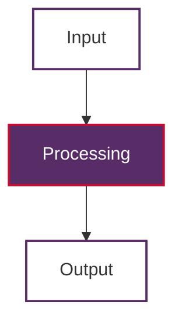

# Repository Conventions

This document outlines the conventions and standards used throughout the NLP Learning Journey repository to maintain consistency and quality across all documentation and code.

## Documentation Structure

### File Naming
- **Markdown files**: Use kebab-case with descriptive names (e.g., `part-of-speech.md`, `bag-of-words.md`)
- **Jupyter notebooks**: Use kebab-case with descriptive names (e.g., `text-generation.ipynb`, `sentiment-analysis.ipynb`)
- **Directories**: Use lowercase with hyphens for multi-word names

### Document Titles
- Follow pattern: `# Topic/Technology Name (Acronym if applicable) [in Context]`
- Examples:
  - `# Named Entity Recognition (NER)`
  - `# BERT: Bidirectional Encoder Representations from Transformers`
  - `# Part-of-Speech (POS) Tags in Natural Language Processing`

### Table of Contents
Include a numbered table of contents for documents with multiple sections:
```markdown
## Table of Contents

1. [Introduction](#introduction)
2. [Explanation](#explanation)
3. [The Algorithm](#the-algorithm)
4. [Use Cases](#use-cases)
5. [Example Code in Python](#example-code-in-python)
6. [Conclusion](#conclusion)
```

## Mathematical Notation

### LaTeX Standards
**Inline expressions** - Use single dollar signs for variables and short expressions:
```markdown
The hidden state `$h_t$` represents the memory at time step t.
```

**Block formulas** - Use double dollar signs for complex equations:
```markdown
The softmax function is defined as:

$$ \text{softmax}(x_i) = \frac{e^{x_i}}{\sum_{j=1}^{K} e^{x_j}} $$
```

### Best Practices
- Include explanatory text before and after formulas
- Use consistent mathematical notation throughout the repository
- Define variables clearly in surrounding text

## Visual Diagrams

### Mermaid Diagrams
**Always use Mermaid diagrams** instead of plaintext diagrams for visual representations.

#### Color Scheme
- **Purple**: `#582C67` (primary concept nodes)
- **White**: `#FFFFFF` (input/output nodes)
- **Red**: `#C60C30` (processing/transformation nodes)

#### Example Structure


## Jupyter Notebook Standards

### Environment Detection
Every notebook must include runtime environment detection as the first code cell:
```python
# Environment Detection and Setup
import sys
import subprocess

# Detect the runtime environment
IS_COLAB = "google.colab" in sys.modules
IS_KAGGLE = "kaggle_secrets" in sys.modules
IS_LOCAL = not (IS_COLAB or IS_KAGGLE)

print(f"Environment detected:")
print(f"  - Local: {IS_LOCAL}")
print(f"  - Google Colab: {IS_COLAB}")
print(f"  - Kaggle: {IS_KAGGLE}")
```

### Notebook Structure
1. **Title and badges** (Colab badge for accessibility)
2. **Overview and learning objectives**
3. **Environment setup and package installation**
4. **Code examples with explanations**
5. **Key takeaways and best practices**

### Error Handling
- Wrap model downloads in try-catch blocks
- Provide clear error messages for missing dependencies
- Handle network dependencies gracefully for offline environments

## Code Examples

### Python Code Standards
- Include comprehensive docstrings
- Follow PEP 8 style guidelines
- Provide working examples that can be executed
- Include performance benchmarks where relevant

### Code Block Format
```python
def example_function(parameter):
    """
    Brief description of function purpose.
    
    Args:
        parameter: Description of parameter
        
    Returns:
        Description of return value
    """
    # Implementation here
    return result
```

## File Organization

### Directory Structure
```
docs/                     # All documentation files
examples/                 # Jupyter notebooks with practical examples
scripts/                  # Utility scripts and data generation
data/                     # Datasets and examples
requirements.txt          # Python dependencies
```

### Documentation Categories
- **Core concepts**: Fundamental NLP techniques and algorithms
- **Architectures**: Neural network architectures (RNN, LSTM, Transformers)
- **Applications**: Specific NLP tasks (NER, sentiment analysis, etc.)
- **Libraries**: Tool-specific documentation

## Quality Standards

### Content Requirements
- **Educational focus**: Prioritize clear explanations over complex implementations
- **Practical examples**: Include working code that demonstrates concepts
- **Progressive complexity**: Build from basic to advanced concepts
- **Real-world relevance**: Connect concepts to practical applications

### Review Checklist
- [ ] Document follows naming conventions
- [ ] Mathematical expressions use proper LaTeX formatting
- [ ] Diagrams use Mermaid with consistent styling
- [ ] Code examples are complete and executable
- [ ] Content is appropriate for educational purposes
- [ ] Links and references are functional

## Maintenance

### Updates and Changes
- Maintain consistency when adding new documentation
- Update related documents when making significant changes
- Test code examples to ensure they remain functional
- Keep dependencies up to date in `requirements.txt`

### Cross-References
- Link between related concepts across documents
- Maintain the table of contents in README.md
- Update the repository structure documentation when adding new sections

---

*Follow these conventions to maintain the high quality and consistency that makes this repository an effective learning resource.*