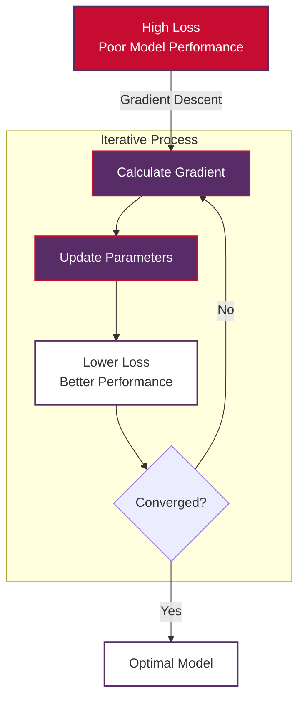
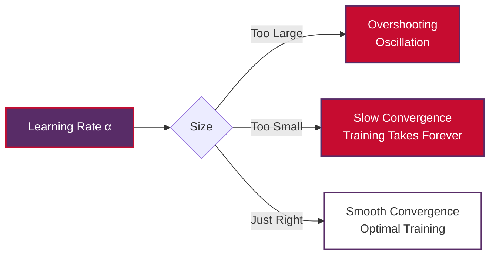
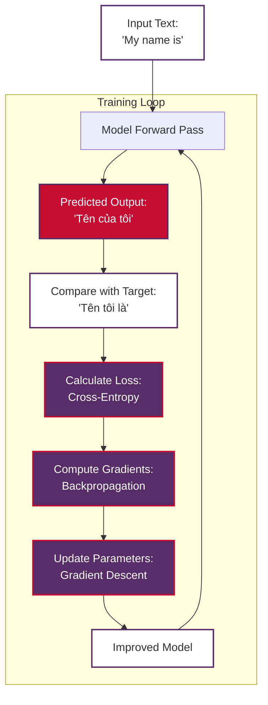

# Gradient Descent in Natural Language Processing

**Gradient Descent** is the cornerstone optimization algorithm that powers virtually all modern Natural Language Processing systems. From training word embeddings to fine-tuning massive transformer models like BERT and GPT, gradient descent is the engine that enables machines to learn language patterns from data.

> **Note on Examples**: This document prioritizes Vietnamese/English examples to demonstrate gradient descent applications in machine translation and cross-lingual NLP tasks, providing practical context for Southeast Asian language processing.

## Table of Contents

1. [What is Gradient Descent?](#what-is-gradient-descent)
2. [Mathematical Foundation](#mathematical-foundation)
3. [Why Gradient Descent Matters for NLP](#why-gradient-descent-matters-for-nlp)
4. [How Gradient Descent Works in NLP](#how-gradient-descent-works-in-nlp)
5. [Gradient Descent Variants](#gradient-descent-variants)
6. [NLP-Specific Applications](#nlp-specific-applications)
7. [Practical Examples](#practical-examples)
8. [Challenges in NLP](#challenges-in-nlp)
9. [Advanced Techniques](#advanced-techniques)
10. [Best Practices](#best-practices)
11. [Conclusion](#conclusion)

## What is Gradient Descent?

**Gradient Descent** is an iterative optimization algorithm used to find the minimum of a function. In the context of machine learning and NLP, this function is typically a **loss function** that measures how well our model performs on a given task.

### The Core Intuition

Imagine you're standing on a hill in the fog and want to reach the bottom (minimum point). Gradient descent is like feeling the slope of the ground beneath your feet and taking steps in the direction that goes downhill most steeply. Eventually, you'll reach a valley (local minimum) or the bottom of the hill (global minimum).



### Vietnamese/English Translation Example

Consider training a model to translate English "Hello" to Vietnamese "Xin chào":

- **Initial state**: Model might output "Tạm biệt" (goodbye) - high loss
- **Gradient descent process**: Algorithm adjusts model parameters to reduce translation error
- **Final state**: Model correctly outputs "Xin chào" - low loss

## Mathematical Foundation

### Basic Gradient Descent Formula

The fundamental update rule for gradient descent is:

$$ \theta_{t+1} = \theta_t - \alpha \nabla_\theta J(\theta_t) $$

Where:
- $\theta_t$: Model parameters at iteration $t$
- $\alpha$: Learning rate (step size)
- $\nabla_\theta J(\theta_t)$: Gradient of loss function $J$ with respect to parameters $\theta$
- $\theta_{t+1}$: Updated parameters

### Gradient Computation

The gradient represents the direction of steepest increase in the loss function. For a function $J(\theta)$, the gradient is:

$$ \nabla_\theta J(\theta) = \left[\frac{\partial J}{\partial \theta_1}, \frac{\partial J}{\partial \theta_2}, ..., \frac{\partial J}{\partial \theta_n}\right] $$

### Learning Rate Significance

The learning rate $\alpha$ controls how big steps we take:

- **Too large**: We might overshoot the minimum and oscillate
- **Too small**: Training will be very slow
- **Adaptive**: Modern optimizers adjust learning rate automatically



## Why Gradient Descent Matters for NLP

### 1. **Scale of Modern NLP Models**

Modern NLP models have millions or billions of parameters:
- **BERT-base**: 110 million parameters
- **GPT-3**: 175 billion parameters
- **PaLM**: 540 billion parameters

Gradient descent is the only practical way to optimize such massive parameter spaces.

### 2. **Non-Convex Optimization Landscape**

NLP loss functions are typically non-convex with:
- Multiple local minima
- Saddle points
- Complex parameter interactions

Gradient descent variants help navigate this complex landscape effectively.

### 3. **Sequential Data Challenges**

Language data is inherently sequential and contextual:
- **Dependencies**: Words depend on previous words
- **Long-range relationships**: Sentences have complex grammatical structures
- **Variable length**: Sentences have different lengths

Gradient descent handles these challenges through techniques like backpropagation through time.

### 4. **Transfer Learning**

Pre-trained models (BERT, GPT) are fine-tuned using gradient descent:
- Start with general language understanding
- Adapt to specific tasks (translation, sentiment analysis, etc.)
- Preserve learned representations while adapting to new domains

## How Gradient Descent Works in NLP

### Training Process Visualization



### Step-by-Step Process

1. **Forward Pass**: Input flows through the network
2. **Loss Calculation**: Compare predicted output with ground truth
3. **Backward Pass**: Compute gradients using backpropagation
4. **Parameter Update**: Apply gradient descent to adjust weights
5. **Repeat**: Continue until convergence

### Loss Functions in NLP

Different NLP tasks use different loss functions:

**Cross-Entropy Loss** (for classification tasks like sentiment analysis):
$$ J(\theta) = -\frac{1}{N} \sum_{i=1}^{N} \sum_{c=1}^{C} y_{i,c} \log(p_{i,c}) $$

**Sequence-to-Sequence Loss** (for translation):
$$ J(\theta) = -\frac{1}{T} \sum_{t=1}^{T} \log P(y_t | y_{<t}, x; \theta) $$

Where:
- $y_t$: Target word at position $t$
- $y_{<t}$: Previous target words
- $x$: Source sentence
- $\theta$: Model parameters

## Gradient Descent Variants

### 1. Batch Gradient Descent

Uses entire dataset for each update:

$$ \theta_{t+1} = \theta_t - \alpha \frac{1}{N} \sum_{i=1}^{N} \nabla_\theta J(\theta_t; x_i, y_i) $$

**Pros**: Stable convergence, true gradient direction
**Cons**: Slow for large datasets, memory intensive

### 2. Stochastic Gradient Descent (SGD)

Uses single sample for each update:

$$ \theta_{t+1} = \theta_t - \alpha \nabla_\theta J(\theta_t; x_i, y_i) $$

**Pros**: Fast updates, can escape local minima
**Cons**: Noisy convergence, might not find exact minimum

### 3. Mini-Batch Gradient Descent

Uses small batches of data:

$$ \theta_{t+1} = \theta_t - \alpha \frac{1}{|B|} \sum_{i \in B} \nabla_\theta J(\theta_t; x_i, y_i) $$

**Pros**: Balance between stability and speed
**Cons**: Requires tuning batch size

### 4. Advanced Optimizers

**Adam (Adaptive Moment Estimation)**:
$$ m_t = \beta_1 m_{t-1} + (1-\beta_1) g_t $$
$$ v_t = \beta_2 v_{t-1} + (1-\beta_2) g_t^2 $$
$$ \theta_{t+1} = \theta_t - \alpha \frac{\hat{m}_t}{\sqrt{\hat{v}_t} + \epsilon} $$

Where $\hat{m}_t = \frac{m_t}{1-\beta_1^t}$ and $\hat{v}_t = \frac{v_t}{1-\beta_2^t}$

**AdaGrad**: Adapts learning rate based on historical gradients
**RMSprop**: Addresses AdaGrad's aggressive learning rate decay

## NLP-Specific Applications

### 1. Machine Translation

Training English-Vietnamese translation models:

```python
# Example: Training a translation model
def train_translation_model():
    # Sample translation pairs
    training_pairs = [
        ("Hello", "Xin chào"),
        ("My name is", "Tên tôi là"),
        ("Thank you", "Cảm ơn"),
        ("How are you?", "Bạn khỏe không?"),
        ("I love programming", "Tôi yêu lập trình")
    ]
    
    for epoch in range(num_epochs):
        total_loss = 0
        
        for english, vietnamese in training_pairs:
            # Forward pass
            predicted_vietnamese = model(english)
            
            # Calculate loss
            loss = cross_entropy_loss(predicted_vietnamese, vietnamese)
            total_loss += loss
            
            # Backward pass (compute gradients)
            gradients = compute_gradients(loss, model.parameters)
            
            # Gradient descent update
            model.parameters -= learning_rate * gradients
        
        print(f"Epoch {epoch}, Average Loss: {total_loss / len(training_pairs)}")
```

### 2. Sentiment Analysis

Learning to classify Vietnamese text sentiment:

```python
def train_sentiment_classifier():
    # Vietnamese sentiment examples
    training_data = [
        ("Tôi yêu sản phẩm này!", "positive"),
        ("Điều này thật tệ.", "negative"),
        ("Sản phẩm tốt.", "positive"),
        ("Không hài lòng.", "negative")
    ]
    
    for text, sentiment in training_data:
        # Forward pass
        predicted_sentiment = sentiment_model(text)
        
        # Calculate loss
        loss = binary_cross_entropy(predicted_sentiment, sentiment)
        
        # Gradient descent step
        gradients = backpropagation(loss)
        update_parameters(gradients, learning_rate)
```

### 3. Word Embeddings

Training word vectors to capture semantic relationships:

```python
def train_word_embeddings():
    # Skip-gram model training
    vocabulary = ["tôi", "yêu", "lập", "trình", "I", "love", "programming"]
    
    for center_word in vocabulary:
        for context_word in get_context_words(center_word):
            # Forward pass: predict context from center word
            predicted_prob = word2vec_model(center_word, context_word)
            
            # Loss: negative log-likelihood
            loss = -log(predicted_prob)
            
            # Gradient descent update
            gradients = compute_gradients(loss)
            update_embeddings(gradients, learning_rate)
```

## Practical Examples

### Basic Gradient Descent Implementation

```python
import numpy as np
import matplotlib.pyplot as plt

class GradientDescentOptimizer:
    def __init__(self, learning_rate=0.01):
        self.learning_rate = learning_rate
        self.history = {'loss': [], 'parameters': []}
    
    def compute_loss(self, predictions, targets):
        """Compute mean squared error loss."""
        return np.mean((predictions - targets) ** 2)
    
    def compute_gradients(self, X, y, parameters):
        """Compute gradients for linear regression."""
        m = len(y)
        predictions = X.dot(parameters)
        
        # Gradient with respect to parameters
        gradients = (2/m) * X.T.dot(predictions - y)
        return gradients
    
    def update_parameters(self, parameters, gradients):
        """Apply gradient descent update."""
        return parameters - self.learning_rate * gradients
    
    def fit(self, X, y, initial_params, num_iterations=1000):
        """Train model using gradient descent."""
        parameters = initial_params.copy()
        
        for i in range(num_iterations):
            # Compute predictions and loss
            predictions = X.dot(parameters)
            loss = self.compute_loss(predictions, y)
            
            # Compute gradients
            gradients = self.compute_gradients(X, y, parameters)
            
            # Update parameters
            parameters = self.update_parameters(parameters, gradients)
            
            # Store history
            self.history['loss'].append(loss)
            self.history['parameters'].append(parameters.copy())
            
            if i % 100 == 0:
                print(f"Iteration {i}, Loss: {loss:.4f}")
        
        return parameters

# Example usage for Vietnamese/English word frequency prediction
def demonstrate_gradient_descent():
    # Sample data: predict Vietnamese word frequency from English frequency
    # Data: [English freq, bias], Vietnamese freq
    X = np.array([[0.1, 1], [0.3, 1], [0.5, 1], [0.8, 1], [1.0, 1]])  # English frequencies + bias
    y = np.array([0.15, 0.35, 0.45, 0.75, 0.95])  # Vietnamese frequencies
    
    # Initialize parameters (weight, bias)
    initial_params = np.array([0.0, 0.0])
    
    # Train model
    optimizer = GradientDescentOptimizer(learning_rate=0.1)
    final_params = optimizer.fit(X, y, initial_params, num_iterations=1000)
    
    print(f"Final parameters: {final_params}")
    print(f"Weight: {final_params[0]:.3f}, Bias: {final_params[1]:.3f}")
    
    # Plot training progress
    plt.figure(figsize=(12, 4))
    
    plt.subplot(1, 2, 1)
    plt.plot(optimizer.history['loss'])
    plt.title('Training Loss Over Time')
    plt.xlabel('Iteration')
    plt.ylabel('Loss')
    plt.grid(True)
    
    plt.subplot(1, 2, 2)
    plt.scatter(X[:, 0], y, color='blue', label='Actual')
    predictions = X.dot(final_params)
    plt.plot(X[:, 0], predictions, color='red', label='Predicted')
    plt.xlabel('English Word Frequency')
    plt.ylabel('Vietnamese Word Frequency')
    plt.title('English-Vietnamese Frequency Correlation')
    plt.legend()
    plt.grid(True)
    
    plt.tight_layout()
    plt.show()

# Run demonstration
demonstrate_gradient_descent()
```

### NLP-Specific Example: Training a Simple Language Model

```python
class SimpleLanguageModel:
    def __init__(self, vocab_size, embedding_dim=50):
        self.vocab_size = vocab_size
        self.embedding_dim = embedding_dim
        
        # Initialize parameters
        self.embeddings = np.random.randn(vocab_size, embedding_dim) * 0.1
        self.output_weights = np.random.randn(embedding_dim, vocab_size) * 0.1
        
    def forward(self, word_indices):
        """Forward pass through the model."""
        # Get word embeddings
        embedded = self.embeddings[word_indices]
        
        # Simple aggregation (mean)
        context_vector = np.mean(embedded, axis=0)
        
        # Output layer
        logits = context_vector.dot(self.output_weights)
        
        # Softmax for probabilities
        exp_logits = np.exp(logits - np.max(logits))
        probabilities = exp_logits / np.sum(exp_logits)
        
        return probabilities, context_vector, embedded
    
    def compute_loss(self, probabilities, target_word_idx):
        """Compute cross-entropy loss."""
        return -np.log(probabilities[target_word_idx] + 1e-10)
    
    def backward(self, probabilities, target_word_idx, context_vector, embedded, word_indices):
        """Compute gradients using backpropagation."""
        # Output layer gradients
        d_logits = probabilities.copy()
        d_logits[target_word_idx] -= 1
        
        d_output_weights = np.outer(context_vector, d_logits)
        d_context_vector = self.output_weights.dot(d_logits)
        
        # Embedding gradients
        d_embedded = np.tile(d_context_vector / len(word_indices), (len(word_indices), 1))
        d_embeddings = np.zeros_like(self.embeddings)
        
        for i, word_idx in enumerate(word_indices):
            d_embeddings[word_idx] += d_embedded[i]
        
        return d_output_weights, d_embeddings
    
    def train_step(self, context_words, target_word, learning_rate=0.01):
        """Single training step using gradient descent."""
        # Forward pass
        probabilities, context_vector, embedded = self.forward(context_words)
        
        # Compute loss
        loss = self.compute_loss(probabilities, target_word)
        
        # Backward pass
        d_output_weights, d_embeddings = self.backward(
            probabilities, target_word, context_vector, embedded, context_words
        )
        
        # Gradient descent update
        self.output_weights -= learning_rate * d_output_weights
        self.embeddings -= learning_rate * d_embeddings
        
        return loss

# Example: Training on Vietnamese/English text
def train_bilingual_language_model():
    # Create vocabulary (simplified)
    vocab = {
        "tôi": 0, "yêu": 1, "lập": 2, "trình": 3,
        "I": 4, "love": 5, "programming": 6,
        "<PAD>": 7
    }
    
    # Training data: context words -> target word
    training_data = [
        ([vocab["tôi"], vocab["yêu"]], vocab["lập"]),  # "tôi yêu" -> "lập"
        ([vocab["yêu"], vocab["lập"]], vocab["trình"]),  # "yêu lập" -> "trình"
        ([vocab["I"], vocab["love"]], vocab["programming"]),  # "I love" -> "programming"
    ]
    
    # Initialize model
    model = SimpleLanguageModel(len(vocab), embedding_dim=20)
    
    # Training loop
    num_epochs = 100
    for epoch in range(num_epochs):
        total_loss = 0
        
        for context_words, target_word in training_data:
            loss = model.train_step(context_words, target_word, learning_rate=0.1)
            total_loss += loss
        
        if epoch % 20 == 0:
            avg_loss = total_loss / len(training_data)
            print(f"Epoch {epoch}, Average Loss: {avg_loss:.4f}")
    
    return model

# Train the model
trained_model = train_bilingual_language_model()
```

## Challenges in NLP

### 1. Vanishing and Exploding Gradients

**Problem**: In deep networks, gradients can become very small (vanish) or very large (explode) as they propagate backward.

**Impact on NLP**:
- **RNNs**: Long sequences suffer from vanishing gradients
- **Deep networks**: Information from early layers doesn't reach output layers

**Solutions**:
- **Gradient clipping**: Limit gradient magnitude
- **LSTM/GRU**: Gating mechanisms to control information flow
- **Residual connections**: Skip connections in transformers
- **Layer normalization**: Normalize inputs to each layer

```python
def clip_gradients(gradients, max_norm=5.0):
    """Clip gradients to prevent exploding gradients."""
    total_norm = np.sqrt(sum(np.sum(grad**2) for grad in gradients))
    
    if total_norm > max_norm:
        clip_factor = max_norm / total_norm
        gradients = [grad * clip_factor for grad in gradients]
    
    return gradients
```

### 2. Local Minima and Saddle Points

**Problem**: Non-convex loss surfaces have multiple local minima and saddle points.

**NLP-specific challenges**:
- **Word ordering**: Multiple valid translations exist
- **Synonyms**: Different words can have similar meanings
- **Context sensitivity**: Same word has different meanings in different contexts

**Solutions**:
- **Random initialization**: Start from different points
- **Learning rate scheduling**: Adjust learning rate over time
- **Momentum**: Help escape shallow local minima
- **Ensemble methods**: Combine multiple models

### 3. Computational Complexity

**Problem**: Large vocabulary sizes and sequence lengths make NLP computationally expensive.

**Scaling challenges**:
- **Softmax computation**: $O(|V|)$ for vocabulary size $|V|$
- **Attention mechanisms**: $O(n^2)$ for sequence length $n$
- **Memory requirements**: Large models need significant GPU memory

**Solutions**:
- **Hierarchical softmax**: Reduce softmax complexity
- **Subword tokenization**: Smaller vocabulary
- **Sparse attention**: Reduce attention complexity
- **Gradient accumulation**: Handle large batches

## Advanced Techniques

### 1. Learning Rate Scheduling

Adjust learning rate during training:

```python
class LearningRateScheduler:
    def __init__(self, initial_lr=0.01):
        self.initial_lr = initial_lr
        self.current_lr = initial_lr
    
    def step_decay(self, epoch, drop_rate=0.5, epochs_drop=10):
        """Step decay: reduce LR every few epochs."""
        self.current_lr = self.initial_lr * (drop_rate ** (epoch // epochs_drop))
        return self.current_lr
    
    def exponential_decay(self, epoch, decay_rate=0.95):
        """Exponential decay."""
        self.current_lr = self.initial_lr * (decay_rate ** epoch)
        return self.current_lr
    
    def cosine_annealing(self, epoch, max_epochs):
        """Cosine annealing schedule."""
        self.current_lr = self.initial_lr * 0.5 * (1 + np.cos(np.pi * epoch / max_epochs))
        return self.current_lr
```

### 2. Gradient Accumulation

Handle large effective batch sizes:

```python
def gradient_accumulation_training():
    accumulation_steps = 4  # Accumulate gradients over 4 mini-batches
    
    for batch_idx, (data, targets) in enumerate(dataloader):
        # Forward pass
        outputs = model(data)
        loss = criterion(outputs, targets) / accumulation_steps  # Scale loss
        
        # Backward pass
        loss.backward()
        
        # Update parameters every accumulation_steps
        if (batch_idx + 1) % accumulation_steps == 0:
            optimizer.step()
            optimizer.zero_grad()
```

### 3. Warm-up Strategies

Gradually increase learning rate at the beginning:

```python
def warmup_schedule(step, warmup_steps, max_lr):
    """Linear warmup followed by cosine decay."""
    if step < warmup_steps:
        return max_lr * step / warmup_steps
    else:
        progress = (step - warmup_steps) / (total_steps - warmup_steps)
        return max_lr * 0.5 * (1 + np.cos(np.pi * progress))
```

## Best Practices

### 1. **Monitor Training Progress**

```python
def monitor_training():
    metrics = {
        'train_loss': [],
        'val_loss': [],
        'learning_rate': [],
        'gradient_norm': []
    }
    
    for epoch in range(num_epochs):
        # Training phase
        model.train()
        train_loss = 0
        gradient_norms = []
        
        for batch in train_loader:
            optimizer.zero_grad()
            loss = train_step(batch)
            loss.backward()
            
            # Monitor gradient norm
            grad_norm = compute_gradient_norm(model.parameters())
            gradient_norms.append(grad_norm)
            
            optimizer.step()
            train_loss += loss.item()
        
        # Validation phase
        model.eval()
        val_loss = validate(model, val_loader)
        
        # Log metrics
        metrics['train_loss'].append(train_loss / len(train_loader))
        metrics['val_loss'].append(val_loss)
        metrics['learning_rate'].append(optimizer.param_groups[0]['lr'])
        metrics['gradient_norm'].append(np.mean(gradient_norms))
        
        print(f"Epoch {epoch}: Train Loss={train_loss:.4f}, Val Loss={val_loss:.4f}")
```

### 2. **Early Stopping**

```python
class EarlyStopping:
    def __init__(self, patience=7, min_delta=0):
        self.patience = patience
        self.min_delta = min_delta
        self.counter = 0
        self.best_loss = None
    
    def __call__(self, val_loss):
        if self.best_loss is None:
            self.best_loss = val_loss
        elif val_loss < self.best_loss - self.min_delta:
            self.best_loss = val_loss
            self.counter = 0
        else:
            self.counter += 1
        
        return self.counter >= self.patience
```

### 3. **Hyperparameter Tuning**

Key hyperparameters to tune:
- **Learning rate**: Often the most important
- **Batch size**: Affects gradient noise and memory usage
- **Model architecture**: Hidden dimensions, number of layers
- **Regularization**: Dropout, weight decay

### 4. **Vietnamese/English Specific Considerations**

```python
# Special considerations for Vietnamese text processing
vietnamese_preprocessing = {
    'normalize_unicode': True,  # Handle Vietnamese diacritics
    'handle_tone_marks': True,  # Proper handling of tone marks
    'subword_tokenization': 'sentencepiece',  # Better for Vietnamese
    'max_sequence_length': 256,  # Vietnamese sentences can be longer
}

def preprocess_vietnamese_english_pair(en_text, vi_text):
    """Preprocess Vietnamese-English text pairs for training."""
    # Normalize Vietnamese unicode
    vi_text = unicodedata.normalize('NFC', vi_text)
    
    # Tokenize using appropriate tokenizers
    en_tokens = english_tokenizer.encode(en_text)
    vi_tokens = vietnamese_tokenizer.encode(vi_text)
    
    return en_tokens, vi_tokens
```

## Conclusion

Gradient descent is the fundamental optimization algorithm that makes modern NLP possible. From training simple word embeddings to fine-tuning massive transformer models, understanding gradient descent is crucial for anyone working in NLP.

### Key Takeaways

1. **Core Principle**: Gradient descent iteratively adjusts model parameters to minimize loss functions
2. **NLP Significance**: Enables training of large-scale language models with millions/billions of parameters
3. **Variants Matter**: Different variants (SGD, Adam, etc.) are suited for different NLP tasks
4. **Challenges**: Vanishing gradients, local minima, and computational complexity require careful handling
5. **Best Practices**: Proper monitoring, regularization, and hyperparameter tuning are essential

### Vietnamese/English NLP Applications

Gradient descent powers all major Vietnamese/English NLP applications:
- **Machine Translation**: "My name is" ↔ "Tên tôi là"
- **Cross-lingual Models**: Shared representations for both languages
- **Transfer Learning**: Adapt English models to Vietnamese tasks
- **Multilingual Understanding**: Models that work across languages

### Future Directions

As NLP continues to evolve, gradient descent remains central:
- **Larger Models**: Scaling to even bigger parameter counts
- **Efficiency**: Better optimization algorithms for faster training
- **Stability**: More robust training procedures
- **Generalization**: Better optimization for few-shot and zero-shot learning

Understanding gradient descent deeply will continue to be essential as we push the boundaries of what's possible in Natural Language Processing, especially for multilingual applications involving Vietnamese and English language processing.

## References and Further Reading

- **Deep Learning Book** by Ian Goodfellow, Yoshua Bengio, and Aaron Courville
- **Neural Machine Translation** papers on Vietnamese-English translation
- **Adam Optimizer** paper: "Adam: A Method for Stochastic Optimization"
- **Learning Rate Scheduling** techniques for NLP
- **Transformer Architecture** and its optimization challenges
- **Vietnamese NLP Resources** for language-specific considerations