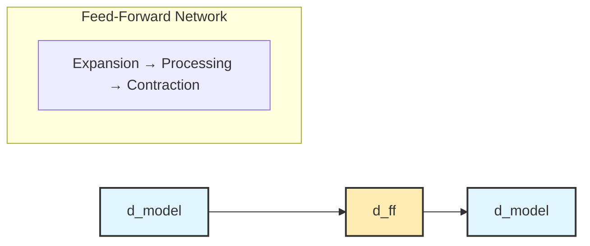

# Key Concepts in Natural Language Processing (NLP)

This document covers the fundamental concepts, techniques, and methodologies that form the foundation of Natural Language Processing. Understanding these concepts is essential for anyone working with text data, building language models, or developing AI systems that interact with human language.

## Table of Contents

1. [Text Preprocessing](#text-preprocessing)
2. [Tokenization](#tokenization)
3. [Text Representation](#text-representation)
4. [Language Models](#language-models)
5. [Embeddings](#embeddings)
6. [Attention Mechanisms](#attention-mechanisms)
7. [Transformer Architecture](#transformer-architecture)
8. [Transfer Learning](#transfer-learning)
9. [Evaluation Metrics](#evaluation-metrics)
10. [Common NLP Tasks](#common-nlp-tasks)

## Text Preprocessing

Text preprocessing is the crucial first step in any NLP pipeline, involving cleaning and preparing raw text data for analysis or modeling.

### Key Components:

**Text Cleaning**
- Removing special characters, HTML tags, and unwanted symbols
- Handling encoding issues and character normalization
- Dealing with noise in text data

**Case Normalization**
- Converting text to lowercase for consistency
- Preserving case when it carries semantic meaning (proper nouns, acronyms)

**Handling Whitespace**
- Normalizing spaces, tabs, and newlines
- Removing extra whitespace while preserving text structure

**Punctuation Treatment**
- Removing or standardizing punctuation marks
- Considering punctuation's role in sentence boundaries and meaning

### Example Pipeline:
```python
import re
import string

def preprocess_text(text):
    # Convert to lowercase
    text = text.lower()
    
    # Remove HTML tags
    text = re.sub(r'<[^>]+>', '', text)
    
    # Remove special characters but keep spaces
    text = re.sub(r'[^a-zA-Z0-9\s]', '', text)
    
    # Normalize whitespace
    text = re.sub(r'\s+', ' ', text).strip()
    
    return text
```

## Tokenization

Tokenization is the process of breaking down text into smaller, meaningful units called tokens. These tokens serve as the basic building blocks for further NLP processing.

### Types of Tokenization:

**Word-Level Tokenization**
- Splits text into individual words
- Simple but struggles with out-of-vocabulary (OOV) words
- Good for languages with clear word boundaries

**Subword Tokenization**
- Byte Pair Encoding (BPE): Iteratively merges most frequent character pairs
- WordPiece: Similar to BPE but uses likelihood-based merging
- SentencePiece: Language-agnostic subword tokenization

**Character-Level Tokenization**
- Treats each character as a token
- No OOV problem but loses word-level semantics
- Useful for character-level tasks or morphologically rich languages

### Modern Approaches:

**BERT Tokenization (WordPiece)**
```python
from transformers import BertTokenizer

tokenizer = BertTokenizer.from_pretrained('bert-base-uncased')
tokens = tokenizer.tokenize("Natural language processing")
# Output: ['natural', 'language', 'processing']

# Handling unknown words
tokens = tokenizer.tokenize("Supercalifragilisticexpialidocious")
# Output: ['super', '##cal', '##if', '##rag', '##ili', '##stic', '##ex', '##pi', '##ali', '##doc', '##ious']
```

## Text Representation

Converting text into numerical representations that machine learning models can process is fundamental to NLP.

### Traditional Approaches:

**Bag of Words (BoW)**
- Represents text as a collection of word frequencies
- Ignores word order and grammar
- Simple but effective for many classification tasks

**TF-IDF (Term Frequency-Inverse Document Frequency)**
- Weights words by their frequency in a document relative to their frequency across all documents
- Helps identify important words specific to a document
- Formula: `TF-IDF(t,d) = TF(t,d) × log(N/DF(t))`

**N-grams**
- Captures local word order by considering sequences of n words
- Unigrams (1-gram), bigrams (2-gram), trigrams (3-gram)
- Balances simplicity with some contextual information

### Modern Dense Representations:

**Word Embeddings**
- Dense vector representations of words
- Capture semantic relationships between words
- Examples: Word2Vec, GloVe, FastText

**Contextual Embeddings**
- Word representations that change based on context
- Same word can have different vectors in different sentences
- Examples: ELMo, BERT, GPT embeddings

## Language Models

Language models predict the probability of word sequences, forming the foundation for many NLP applications.

### Types of Language Models:

**N-gram Models**
- Predict next word based on previous n-1 words
- Markov assumption: future depends only on limited history
- Simple but limited by data sparsity

**Neural Language Models**
- Use neural networks to model word sequences
- Can capture longer dependencies
- Better generalization than n-gram models

**Autoregressive Models**
- Generate text one token at a time
- Condition on previously generated tokens
- Examples: GPT series, traditional RNNs

**Masked Language Models**
- Predict masked tokens using bidirectional context
- Can see both left and right context
- Examples: BERT, RoBERTa, ALBERT

**Autoencoder Models**
- Encode input into latent representation, then decode
- Good for understanding and representation learning
- Examples: T5 (Text-to-Text Transfer Transformer)

## Embeddings

Embeddings are dense vector representations that capture semantic meaning and relationships between linguistic units.

### Word Embeddings:

**Word2Vec**
- Skip-gram: Predict context words from target word
- CBOW (Continuous Bag of Words): Predict target word from context
- Captures semantic and syntactic relationships

**GloVe (Global Vectors)**
- Combines global statistical information with local context
- Factorizes word co-occurrence matrix
- Often performs well on word analogy tasks

**FastText**
- Extends Word2Vec to subword level
- Handles out-of-vocabulary words
- Especially good for morphologically rich languages

### Sentence and Document Embeddings:

**Doc2Vec**
- Extension of Word2Vec to documents
- Learns fixed-size representations for variable-length documents

**Universal Sentence Encoder**
- Pre-trained model for sentence-level embeddings
- Good for semantic similarity tasks

**BERT Embeddings**
- Contextual embeddings from transformer models
- Can be pooled or averaged for sentence representations

## Attention Mechanisms

Attention allows models to focus on relevant parts of the input when making predictions, addressing limitations of fixed-size representations.

### Key Concepts:

**Attention Weights**
- Normalized scores indicating relevance of each input position
- Sum to 1 across all positions
- Computed using query, key, and value vectors

**Self-Attention**
- Input elements attend to other elements in the same sequence
- Allows modeling of long-range dependencies
- Foundation of transformer architecture

**Multi-Head Attention**
- Parallel attention mechanisms with different learned projections
- Allows model to attend to different types of information
- Provides richer representations

### Attention Formula:
```
Attention(Q, K, V) = softmax(QK^T / √d_k)V
```

Where:
- Q: Query matrix
- K: Key matrix  
- V: Value matrix
- d_k: Dimension of key vectors

## Transformer Architecture

The transformer architecture has revolutionized NLP by providing a powerful, parallelizable framework for sequence modeling.

### Core Components:

**Encoder-Decoder Structure**
- Encoder: Processes input sequence into representations
- Decoder: Generates output sequence from encoded representations
- Not all models use both (BERT: encoder-only, GPT: decoder-only)

**Position Encoding**
- Adds positional information to input embeddings
- Sinusoidal encoding or learned positional embeddings
- Necessary because attention is permutation-invariant

**Layer Normalization**
- Normalizes inputs to each layer
- Stabilizes training and improves convergence
- Applied before or after attention/feed-forward layers

**Feed-Forward Networks**
- Point-wise fully connected layers
- Typically has expansion and contraction:



- Adds non-linearity and processing capacity

**Residual Connections**
- Skip connections around attention and feed-forward layers
- Helps with gradient flow in deep networks
- Combined with layer normalization

### Popular Transformer Models:

**BERT (Bidirectional Encoder Representations from Transformers)**
- Encoder-only architecture
- Bidirectional context through masked language modeling
- Pre-trained on large text corpora

**GPT (Generative Pre-trained Transformer)**
- Decoder-only architecture
- Autoregressive text generation
- Excellent for text completion and generation

**T5 (Text-to-Text Transfer Transformer)**
- Encoder-decoder architecture
- Treats all NLP tasks as text-to-text problems
- Unified framework for diverse tasks

## Transfer Learning

Transfer learning leverages knowledge from pre-trained models to improve performance on specific tasks with limited data.

### Pre-training Strategies:

**Masked Language Modeling (MLM)**
- Randomly mask tokens and predict them
- Used by BERT and similar models
- Learns bidirectional representations

**Causal Language Modeling**
- Predict next token given previous tokens
- Used by GPT models
- Good for generation tasks

**Denoising Autoencoding**
- Corrupt input text and reconstruct original
- Used by T5 and BART
- Good for text understanding and generation

### Fine-tuning Approaches:

**Full Model Fine-tuning**
- Update all model parameters for target task
- Requires significant computational resources
- Often achieves best performance

**Feature-based Transfer**
- Use pre-trained model as feature extractor
- Train only task-specific layers
- More efficient but potentially lower performance

**Parameter-Efficient Fine-tuning**
- LoRA (Low-Rank Adaptation): Add low-rank matrices
- Adapter layers: Insert small networks between layers
- Prefix tuning: Optimize continuous prompts

## Evaluation Metrics

Proper evaluation is crucial for assessing model performance and comparing different approaches.

### Classification Metrics:

**Accuracy**
- Proportion of correct predictions
- Good for balanced datasets
- Formula: `(TP + TN) / (TP + TN + FP + FN)`

**Precision and Recall**
- Precision: `TP / (TP + FP)` - Quality of positive predictions
- Recall: `TP / (TP + FN)` - Coverage of actual positives
- Important for imbalanced datasets

**F1-Score**
- Harmonic mean of precision and recall
- Balances both metrics
- Formula: `2 × (Precision × Recall) / (Precision + Recall)`

### Language Modeling Metrics:

**Perplexity**
- Measures how well a model predicts a text
- Lower perplexity indicates better performance
- Formula: `exp(-1/N × Σ log P(w_i))`

**BLEU Score**
- Measures overlap between generated and reference text
- Used for machine translation and text generation
- Based on n-gram precision with brevity penalty

### Semantic Similarity Metrics:

**Cosine Similarity**
- Measures angle between embedding vectors
- Range: -1 to 1 (1 = identical, 0 = orthogonal, -1 = opposite)

**Euclidean Distance**
- Measures straight-line distance between vectors
- Lower distance indicates higher similarity

## Common NLP Tasks

Understanding common NLP tasks helps in choosing appropriate models and evaluation strategies.

### Text Classification:

**Sentiment Analysis**
- Classify text by emotional tone (positive, negative, neutral)
- Applications: Product reviews, social media monitoring
- Can be binary or multi-class classification

**Topic Classification**
- Categorize documents by subject matter
- Applications: News categorization, content filtering
- Often hierarchical classification

**Spam Detection**
- Identify unwanted or malicious messages
- Binary classification problem
- Feature engineering crucial for performance

### Sequence Labeling:

**Named Entity Recognition (NER)**
- Identify and classify entities in text (person, location, organization)
- Token-level classification
- Uses BIO (Begin-Inside-Outside) tagging scheme

**Part-of-Speech (POS) Tagging**
- Assign grammatical categories to words
- Fundamental preprocessing step
- Helps with parsing and understanding

### Text Generation:

**Machine Translation**
- Convert text from one language to another
- Sequence-to-sequence problem
- Requires parallel corpora for training

**Text Summarization**
- Create shorter version while preserving key information
- Extractive: Select important sentences
- Abstractive: Generate new sentences

**Question Answering**
- Provide answers to questions based on context
- Extractive: Find answer spans in text
- Generative: Generate free-form answers

### Information Extraction:

**Relation Extraction**
- Identify relationships between entities
- Builds knowledge graphs from text
- Can be supervised or distant supervision

**Event Extraction**
- Identify events and their participants
- Complex structured prediction problem
- Important for timeline construction

### Advanced Tasks:

**Dialogue Systems**
- Maintain conversations with users
- Task-oriented or open-domain
- Requires context management and response generation

**Code Generation**
- Generate code from natural language descriptions
- Emerging application of language models
- Requires understanding of both natural and programming languages

## Best Practices and Considerations

### Data Quality:
- Clean and consistent preprocessing
- Balanced datasets when possible
- Proper train/validation/test splits

### Model Selection:
- Consider task requirements and constraints
- Balance performance with computational costs
- Understand model limitations and biases

### Evaluation:
- Use appropriate metrics for your task
- Consider multiple evaluation approaches
- Test on out-of-domain data when possible

### Ethical Considerations:
- Be aware of biases in training data
- Consider fairness across different groups
- Ensure responsible use of generated content

This comprehensive overview of key NLP concepts provides the foundation for understanding modern natural language processing systems and building effective solutions for various text-based problems.