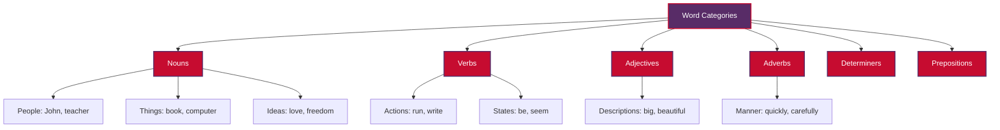
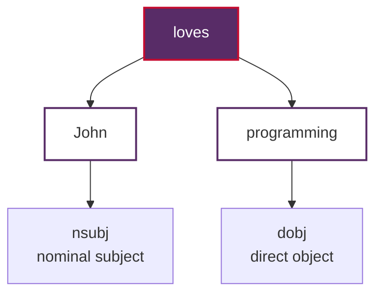
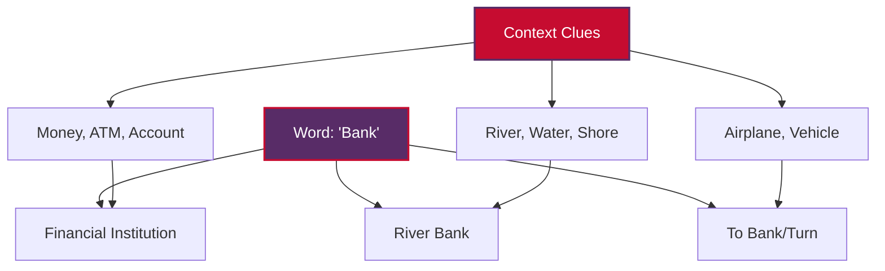
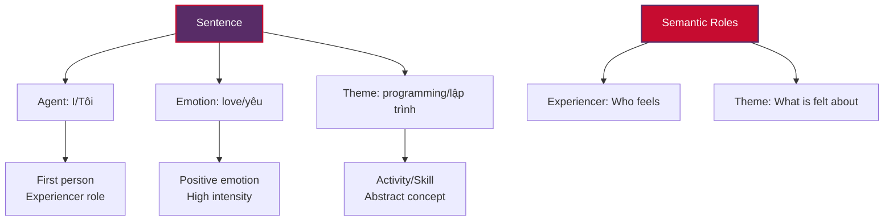
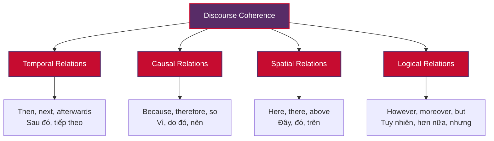
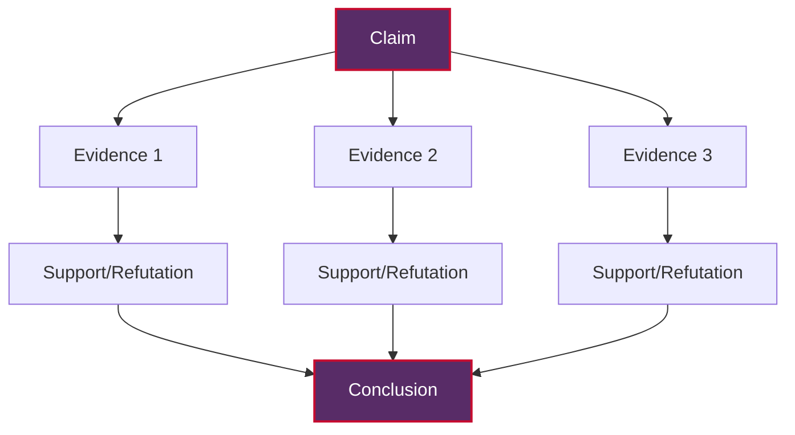
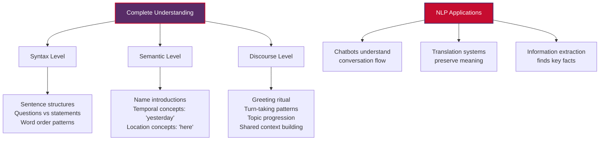

# Linguistic Concepts for Natural Language Processing

Understanding the fundamental concepts of linguistics is essential for mastering Natural Language Processing (NLP). Just as a musician needs to understand notes, scales, and harmony to create beautiful music, an NLP practitioner needs to understand how language works at its core. This guide will walk you through the three fundamental pillars of linguistics that power modern NLP systems: **Syntax**, **Semantics**, and **Discourse**.

## Table of Contents

1. [Why Linguistic Concepts Matter for NLP](#why-linguistic-concepts-matter-for-nlp)
2. [Syntax: The Grammar Blueprint](#syntax-the-grammar-blueprint)
3. [Semantics: The Meaning Maker](#semantics-the-meaning-maker)
4. [Discourse: The Context Connector](#discourse-the-context-connector)
5. [How They Work Together](#how-they-work-together)
6. [Practical Applications in NLP](#practical-applications-in-nlp)
7. [Getting Started: Your Learning Path](#getting-started-your-learning-path)

---

## Why Linguistic Concepts Matter for NLP

Think of language as a complex machine with multiple layers working together seamlessly. When you read "My name is John" and instantly understand its meaning, your brain processes:

- **Structure** (syntax): Subject + verb + object pattern
- **Meaning** (semantics): Introduction/identification concept  
- **Context** (discourse): This might be a greeting, self-introduction, or response to a question

Modern NLP systems need to replicate this multi-layered understanding to work effectively. Let's explore each layer!

---

## Syntax: The Grammar Blueprint

**Syntax** is the set of rules that governs how words combine to form phrases and sentences. Think of it as the architectural blueprint of language - it tells us how to arrange the building blocks (words) to create meaningful structures (sentences).

### 🏗️ The Building Blocks

#### Word Categories (Parts of Speech)
Every word belongs to a category that determines how it can be used:



#### Phrase Structure
Words combine into phrases, which combine into larger phrases, creating a hierarchical structure:

**English Example**: "My name is John"
```
    S (Sentence)
       /    \
      NP     VP
     /      /  \
    My    name  is   John
```

**Vietnamese Example**: "Tên tôi là John"
```
    S (Sentence)
       /    \
      NP     VP
     /      /  \
   Tên    tôi   là   John
```

### 🔧 Syntactic Phenomena

#### 1. Word Order Patterns
Different languages organize words differently:

| Language | Pattern | Example |
|----------|---------|---------|
| English | Subject-Verb-Object (SVO) | "I love programming" |
| Vietnamese | Subject-Verb-Object (SVO) | "Tôi yêu lập trình" |

#### 2. Dependencies
Words form relationships where one word (head) governs another (dependent):



### 💡 Fun Syntax Challenges

**Ambiguity**: The same sentence can have multiple interpretations!

> "I saw the man with the telescope"

- **Interpretation 1**: I used a telescope to see the man
- **Interpretation 2**: I saw a man who had a telescope

This is why syntax matters in NLP - computers need rules to resolve such ambiguities!

### 🛠️ Syntax in Action: Vietnamese vs English

**Complex Sentence Comparison**:

**English**: "The student who studies hard will succeed"
- Relative clause: "who studies hard" modifies "student"
- Structure: [The student [who studies hard]] [will succeed]

**Vietnamese**: "Học sinh nào chăm chỉ sẽ thành công"
- Similar structure but different word order for the relative clause
- Structure: [Học sinh nào chăm chỉ] [sẽ thành công]

---

## Semantics: The Meaning Maker

**Semantics** is the study of meaning in language. While syntax tells us how to arrange words, semantics tells us what those arrangements actually mean. It's the difference between a grammatically correct but meaningless sentence and one that conveys real information.

### 🎯 Levels of Meaning

#### 1. Lexical Semantics (Word Meaning)
Individual words carry meaning, but it's more complex than dictionary definitions:



#### 2. Compositional Semantics (Phrase/Sentence Meaning)
The meaning of larger units is built from smaller parts:

**Example**: "My name is John"
- **"My"**: Possessive, indicates ownership/association
- **"name"**: Identifier/label concept
- **"is"**: Copula, establishes equivalence
- **"John"**: Specific identifier

**Combined Meaning**: The speaker is providing their identifier/label as "John"

#### 3. Semantic Relations
Words relate to each other in meaningful ways:

| Relation | English Example | Vietnamese Example | Description |
|----------|----------------|-------------------|-------------|
| **Synonymy** | happy ↔ joyful | vui ↔ hạnh phúc | Similar meanings |
| **Antonymy** | hot ↔ cold | nóng ↔ lạnh | Opposite meanings |
| **Hyponymy** | dog → animal | chó → động vật | Specific → General |
| **Meronymy** | wheel → car | bánh xe → ô tô | Part → Whole |

### 🌟 Semantic Phenomena

#### 1. Polysemy (Multiple Related Meanings)
**English**: "Head" can mean:
- Body part: "My head hurts"
- Leader: "Head of department"  
- Top: "Head of the line"

**Vietnamese**: "Đầu" has similar polysemy:
- Body part: "Đầu tôi đau"
- Beginning: "Đầu năm"
- Leader: "Đầu đàn"

#### 2. Metaphor and Figurative Language
**English**: "Time is money"
- We understand time through the conceptual framework of money
- "Spend time", "save time", "waste time"

**Vietnamese**: "Thời gian là vàng"
- Similar metaphorical understanding using gold instead of money
- "Tiết kiệm thời gian", "lãng phí thời gian"

### 🔍 Semantic Analysis Example

Let's analyze: **"I love programming"** / **"Tôi yêu lập trình"**



### 🎭 Pragmatics: Context-Dependent Meaning

Sometimes meaning depends heavily on context:

**Example**: "Can you pass the salt?"
- **Literal meaning**: Asking about ability
- **Pragmatic meaning**: Polite request to pass salt
- **Context matters**: Dinner table vs. cooking class vs. chemistry lab

**Vietnamese parallel**: "Bạn có thể đưa muối được không?"
- Same pragmatic principle applies across languages

---

## Discourse: The Context Connector

**Discourse** is how language works beyond individual sentences. It's about how sentences, paragraphs, and entire conversations fit together to create coherent, meaningful communication. Think of it as the glue that holds language together across larger stretches of text.

### 🧩 Discourse Structure

#### 1. Cohesion: Surface-Level Connections
These are explicit linguistic devices that connect sentences:

**Pronoun Reference**:
```
English: "John loves programming. He practices every day."
Vietnamese: "John yêu lập trình. Anh ấy luyện tập mỗi ngày."
```

**Discourse Markers**:
```
English: "I love programming. However, it can be challenging."
Vietnamese: "Tôi yêu lập trình. Tuy nhiên, nó có thể khó khăn."
```

#### 2. Coherence: Deep-Level Connections
This is about logical relationships and shared understanding:



### 📖 Discourse Patterns

#### 1. Narrative Structure
Stories follow predictable patterns:

**English Narrative**:
> "Once upon a time, there was a programmer named Alice. She loved solving complex problems. One day, she discovered machine learning. This discovery changed her career forever."

**Vietnamese Narrative**:
> "Ngày xưa, có một lập trình viên tên Alice. Cô ấy thích giải quyết các vấn đề phức tạp. Một ngày nọ, cô ấy khám phá ra học máy. Khám phá này đã thay đổi sự nghiệp của cô ấy mãi mãi."

#### 2. Argumentative Structure
Arguments follow logical patterns:



### 💬 Conversational Discourse

#### Turn-Taking Patterns
Conversations have implicit rules:

**Example Conversation**:
```
Person A (English): "My name is Sarah. What's yours?"
Person B (English): "Nice to meet you, Sarah. I'm David."

Person A (Vietnamese): "Tên tôi là Sarah. Tên bạn là gì?"
Person B (Vietnamese): "Rất vui được gặp bạn, Sarah. Tôi là David."
```

**Discourse Analysis**:
- **Turn 1**: Introduction + Question (opens conversation)
- **Turn 2**: Acknowledgment + Reciprocal introduction (maintains social balance)

### 🔗 Reference and Coreference

One of the biggest challenges in discourse is tracking what refers to what:

**English Example**:
> "Alice started learning NLP last year. **She** found **it** challenging at first, but **the field** has become **her** passion."

**Reference chains**:
- Alice → She → her
- NLP → it → the field

**Vietnamese Example**:
> "Alice bắt đầu học NLP năm ngoái. **Cô ấy** thấy **nó** khó khăn lúc đầu, nhưng **lĩnh vực này** đã trở thành niềm đam mê của **cô ấy**."

**Reference chains**:
- Alice → Cô ấy → cô ấy (của cô ấy)
- NLP → nó → lĩnh vực này

---

## How They Work Together

The magic of language happens when syntax, semantics, and discourse work together seamlessly. Let's see how with a complete example:

### 🎪 The Language Orchestra

Consider this short dialogue:

**English Version**:
> A: "Hello! My name is John."  
> B: "Nice to meet you, John. I'm Sarah. Are you new here?"  
> A: "Yes, I just started working here yesterday."

**Vietnamese Version**:
> A: "Xin chào! Tên tôi là John."  
> B: "Rất vui được gặp bạn, John. Tôi là Sarah. Bạn có phải người mới ở đây không?"  
> A: "Đúng vậy, tôi mới bắt đầu làm việc ở đây hôm qua."

### 🔍 Multi-Level Analysis



### 🚀 Why This Matters for NLP

**For Machine Translation**:
- **Syntax**: Handles different word orders between languages
- **Semantics**: Preserves meaning across cultural contexts
- **Discourse**: Maintains conversation flow and reference chains

**For Chatbots**:
- **Syntax**: Parses user input correctly
- **Semantics**: Understands user intent and entities
- **Discourse**: Maintains conversation context and memory

**For Information Extraction**:
- **Syntax**: Identifies grammatical relationships
- **Semantics**: Determines what information is important
- **Discourse**: Connects information across sentences

---

## Practical Applications in NLP

### 🛠️ Real-World Examples

#### 1. Search and Information Retrieval

**Query**: "Companies founded by college dropouts"

**Linguistic Processing**:
- **Syntax**: Parse complex noun phrase structure
- **Semantics**: Understand relationship between "founded" and "college dropouts"
- **Discourse**: Connect across multiple documents to find relevant information

#### 2. Sentiment Analysis

**Review**: "I love this product! However, the shipping was slow."

**Analysis**:
- **Syntax**: Identify contrasting statements (positive + negative)
- **Semantics**: Understand "love" = positive, "slow" = negative
- **Discourse**: Balance overall sentiment considering both aspects

#### 3. Machine Translation Challenges

**English**: "I gave her her book."
**Challenge**: Multiple "her" with different roles
- First "her": Indirect object (recipient)
- Second "her": Possessive (ownership)

**Vietnamese Translation**: "Tôi đưa cuốn sách của cô ấy cho cô ấy."
- Must handle different word order and explicit possessive marking

### 🎯 Key Takeaways for NLP Practitioners

1. **Syntax** provides the structural foundation - without it, you can't parse input correctly
2. **Semantics** gives you meaning - without it, you're just manipulating symbols
3. **Discourse** provides context - without it, you miss the bigger picture

---

## Getting Started: Your Learning Path

### 🎓 Beginner Level (Weeks 1-4)

**Focus**: Basic Understanding
1. **Learn Parts of Speech**: Practice identifying nouns, verbs, adjectives in both English and Vietnamese
2. **Simple Parsing**: Use tools like spaCy to see parse trees
3. **Word Meanings**: Explore synonyms, antonyms, and word relationships
4. **Sentence Connections**: Notice pronouns and discourse markers

**Practical Exercise**:
```python
import spacy

# Load models for both languages
nlp_en = spacy.load("en_core_web_sm")
nlp_vi = spacy.load("vi_core_news_sm")  # If available

# Analyze a simple sentence
text_en = "My name is John"
text_vi = "Tên tôi là John"

doc_en = nlp_en(text_en)
for token in doc_en:
    print(f"{token.text}: {token.pos_} ({token.dep_})")
```

### 🚀 Intermediate Level (Weeks 5-8)

**Focus**: Deeper Analysis
1. **Dependency Parsing**: Understand grammatical relationships
2. **Semantic Roles**: Who did what to whom?
3. **Coreference Resolution**: Track references across sentences
4. **Discourse Markers**: Identify connection words and their functions

**Practical Exercise**:
```python
# Analyze discourse structure
text = """
Alice loves programming. She started learning Python last year. 
The language seemed difficult at first. However, Alice persevered. 
Now she builds amazing applications.
"""

# Practice identifying:
# - Who/what does "She" refer to?
# - What does "The language" refer to?
# - How does "However" change the discourse flow?
```

### 🏆 Advanced Level (Weeks 9-12)

**Focus**: Complex Applications
1. **Ambiguity Resolution**: Handle multiple interpretations
2. **Figurative Language**: Understand metaphors and idioms
3. **Cross-linguistic Comparison**: Compare structures across languages
4. **Real NLP Tasks**: Build systems that use all three levels

**Practical Project**:
Build a bilingual chatbot that can:
- Parse user input (syntax)
- Understand intent and entities (semantics)
- Maintain conversation context (discourse)

### 📚 Recommended Resources

**Books**:
- "Speech and Language Processing" by Jurafsky & Martin
- "Natural Language Understanding" by James Allen
- "Introduction to Information Retrieval" by Manning, Raghavan & Schütze

**Online Courses**:
- Stanford CS224N: Natural Language Processing with Deep Learning
- Coursera: Natural Language Processing Specialization
- edX: Introduction to Computational Linguistics

**Tools to Explore**:
- **spaCy**: Industrial-strength NLP library
- **NLTK**: Natural Language Toolkit for education
- **Stanza**: Stanford NLP toolkit with multilingual support

---

## Conclusion

Understanding linguistic concepts isn't just academic knowledge - it's the foundation that makes you a better NLP practitioner. When you understand how syntax, semantics, and discourse work together, you can:

- **Debug NLP systems** more effectively
- **Design better architectures** that respect linguistic principles
- **Handle edge cases** that pure machine learning approaches miss
- **Work across languages** by understanding universal patterns

Remember: every great NLP system, from Google Translate to ChatGPT, is built on these fundamental linguistic principles. Master these concepts, and you'll have the tools to build the next generation of language technology!

### 🌟 Your Next Steps

1. **Practice with examples**: Use the Vietnamese/English examples throughout this guide
2. **Explore the code**: Check out the notebooks in the `examples/` directory
3. **Build projects**: Start with simple parsing and work up to complex applications
4. **Join the community**: Engage with other NLP learners and practitioners

The journey of understanding language is endlessly fascinating. Every sentence you process, every conversation you analyze, reveals new insights into the incredible complexity and beauty of human communication.

**Happy learning, and may your NLP adventures be syntactically correct, semantically meaningful, and discursively coherent!** 🚀

---

*This document is part of the NLP Learning Journey repository. For more resources, check out the other documents in the `docs/` directory and the practical examples in `examples/`.*