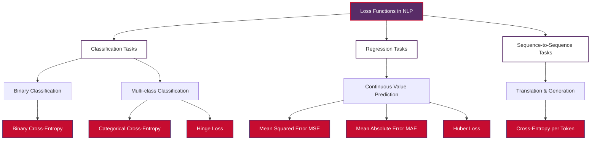
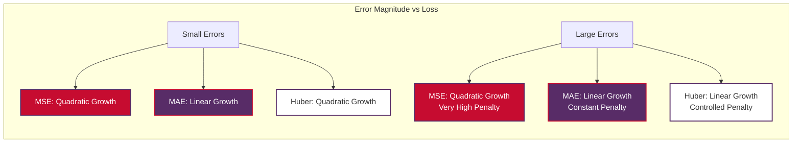
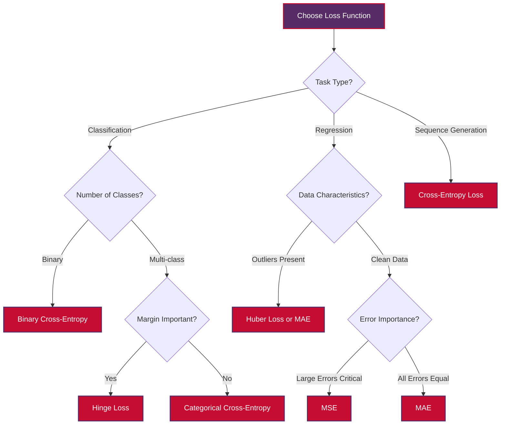

# Loss Functions in Natural Language Processing

Loss functions are mathematical functions that measure the difference between predicted outputs and actual target values during model training. They serve as the optimization objective that guides the learning process, helping models improve their predictions through gradient-based optimization.

In Natural Language Processing, choosing the right loss function is crucial for achieving optimal performance across different tasks. This document provides a comprehensive guide to the most commonly used loss functions in NLP, their mathematical definitions, and practical guidance on when to use each function.

> **Educational Focus**: This document includes practical examples using Vietnamese/English translation pairs to demonstrate loss function concepts in multilingual NLP contexts.

## Table of Contents

1. [Understanding Loss Functions](#understanding-loss-functions)
2. [Classification Tasks](#classification-tasks)
3. [Regression Tasks](#regression-tasks)
4. [Sequence-to-Sequence Tasks](#sequence-to-sequence-tasks)
5. [Choosing the Right Loss Function](#choosing-the-right-loss-function)
6. [Practical Examples](#practical-examples)
7. [Implementation Considerations](#implementation-considerations)
8. [Best Practices](#best-practices)

## Understanding Loss Functions

### Definition and Purpose

A **loss function** $L(y, \hat{y})$ quantifies the difference between the true target $y$ and the predicted output $\hat{y}$. During training, the model attempts to minimize this loss through gradient descent optimization:

$$ \theta_{t+1} = \theta_t - \alpha \nabla_\theta L(y, \hat{y}) $$

Where:
- $\theta$ represents model parameters
- $\alpha$ is the learning rate  
- $\nabla_\theta L$ is the gradient of the loss with respect to parameters

### Loss Function Categories by Task Type



## Classification Tasks

Classification tasks involve predicting discrete categories or labels. These are the most common tasks in NLP, including sentiment analysis, named entity recognition, and text classification.

### Cross-Entropy Loss

**Cross-Entropy Loss** is by far the most widely used and powerful loss function for classification tasks in NLP. It measures how far the predicted probability distribution is from the true distribution.

#### Binary Cross-Entropy

Used for binary classification tasks (two classes) such as spam detection or sentiment polarity.

**Mathematical Definition:**
$$ L_{\text{binary}} = -[y \log(p) + (1-y) \log(1-p)] $$

Where:
- $y \in \{0, 1\}$ is the true binary label
- $p \in [0, 1]$ is the predicted probability for class 1

**Properties:**
- **Range**: $[0, +\infty)$
- **Minimum**: $L = 0$ when prediction is perfect ($p = y$)
- **Penalty**: Heavily penalizes confident wrong predictions

**Example: Vietnamese Sentiment Analysis**
```python
# Binary sentiment classification
english_text = "I love this product!"      # Positive (y = 1)
vietnamese_text = "Tôi yêu sản phẩm này!"  # Positive (y = 1)

# If model predicts p = 0.9 (confident positive)
loss = -(1 * log(0.9) + 0 * log(0.1)) = -log(0.9) ≈ 0.105

# If model predicts p = 0.1 (confident negative, wrong!)
loss = -(1 * log(0.1) + 0 * log(0.9)) = -log(0.1) ≈ 2.303
```

#### Categorical Cross-Entropy

Used for multi-class classification tasks with mutually exclusive classes.

**Mathematical Definition:**
$$ L_{\text{categorical}} = -\sum_{i=1}^{C} y_i \log(p_i) $$

Where:
- $C$ is the number of classes
- $y_i \in \{0, 1\}$ is the one-hot encoded true label
- $p_i \in [0, 1]$ is the predicted probability for class $i$
- $\sum_{i=1}^{C} p_i = 1$ (probabilities sum to 1)

**Example: Language Identification**
```python
# Multi-class language classification
languages = ["English", "Vietnamese", "French"]
text = "Tên tôi là John"

# True label: Vietnamese (one-hot: [0, 1, 0])
# Predicted probabilities: [0.1, 0.8, 0.1]
loss = -(0*log(0.1) + 1*log(0.8) + 0*log(0.1)) = -log(0.8) ≈ 0.223
```

### Hinge Loss

**Hinge Loss** is primarily used for "maximum-margin" classification, particularly with Support Vector Machines, but can also be used with neural networks for binary classification.

**Mathematical Definition:**
$$ L_{\text{hinge}} = \max(0, 1 - y \cdot f(x)) $$

Where:
- $y \in \{-1, +1\}$ is the true label
- $f(x)$ is the model's raw output (not probability)

**Properties:**
- **Margin-based**: Penalizes predictions that are correct but not confident
- **Zero loss**: When $y \cdot f(x) \geq 1$ (confident correct prediction)
- **Linear penalty**: For incorrect or unconfident predictions

**When to Use Hinge Loss:**
- When you want the model to be very confident in its predictions
- For binary classification with clear decision boundaries
- When margin maximization is important

## Regression Tasks

Regression tasks involve predicting continuous numerical values, such as document ratings, similarity scores, or confidence measures.

### Mean Squared Error (MSE)

**Mean Squared Error** is the most common loss function for regression tasks. It calculates the average of squared differences between predicted and actual values.

**Mathematical Definition:**
$$ \text{MSE} = \frac{1}{n}\sum_{i=1}^{n}(y_i - \hat{y}_i)^2 $$

Where:
- $n$ is the number of samples
- $y_i$ is the true value for sample $i$
- $\hat{y}_i$ is the predicted value for sample $i$

**Properties:**
- **Quadratic penalty**: Heavily penalizes large errors
- **Smooth gradient**: Good for gradient-based optimization
- **Sensitive to outliers**: Large errors dominate the loss

**Example: Document Rating Prediction**
```python
# Predicting document ratings (1-5 scale)
documents = [
    "I love programming",          # True rating: 5.0
    "This is okay",               # True rating: 3.0
    "I hate this product"         # True rating: 1.0
]
vietnamese_docs = [
    "Tôi yêu lập trình",          # True rating: 5.0  
    "Điều này ổn",                # True rating: 3.0
    "Tôi ghét sản phẩm này"       # True rating: 1.0
]

# If predictions are [4.8, 2.9, 1.2]
mse = ((5.0-4.8)² + (3.0-2.9)² + (1.0-1.2)²) / 3
mse = (0.04 + 0.01 + 0.04) / 3 = 0.03
```

### Mean Absolute Error (MAE)

**Mean Absolute Error** calculates the average of absolute differences between predicted and actual values.

**Mathematical Definition:**
$$ \text{MAE} = \frac{1}{n}\sum_{i=1}^{n}|y_i - \hat{y}_i| $$

**Properties:**
- **Linear penalty**: Treats all errors equally regardless of size
- **Robust to outliers**: Less sensitive than MSE to extreme values
- **Non-differentiable**: At zero, but subgradients can be used

**When to Use MAE:**
- When your dataset contains outliers
- When all errors should be weighted equally
- For interpretable loss values (same units as target)

### Huber Loss

**Huber Loss** combines the best properties of MSE and MAE by being quadratic for small errors and linear for large errors.

**Mathematical Definition:**
$$ L_\delta(y,\hat{y}) = \begin{cases} 
\frac{1}{2}(y-\hat{y})^2 & \text{if } |y-\hat{y}| \leq \delta \\
\delta|y-\hat{y}| - \frac{1}{2}\delta^2 & \text{otherwise}
\end{cases} $$

Where $\delta$ is a hyperparameter that controls the transition point.

**Properties:**
- **Robust**: Less sensitive to outliers than MSE
- **Smooth**: Differentiable everywhere, unlike MAE
- **Tunable**: Parameter $\delta$ controls sensitivity

**Loss Function Comparison:**



## Sequence-to-Sequence Tasks

Sequence-to-sequence tasks involve generating output sequences from input sequences, such as machine translation, text summarization, and text generation.

### Cross-Entropy Loss for Sequences

For sequence generation tasks, **Cross-Entropy Loss** is applied at each time step, and the total loss is the sum (or average) of individual time step losses.

**Mathematical Definition:**
$$ L_{\text{seq}} = \frac{1}{T} \sum_{t=1}^{T} L_{\text{CE}}(y_t, \hat{y}_t) = -\frac{1}{T} \sum_{t=1}^{T} \sum_{i=1}^{V} y_{t,i} \log(\hat{y}_{t,i}) $$

Where:
- $T$ is the sequence length
- $V$ is the vocabulary size
- $y_{t,i}$ is the one-hot encoded true token at time $t$
- $\hat{y}_{t,i}$ is the predicted probability for token $i$ at time $t$

**Example: English-Vietnamese Translation**

```mermaid
graph TD
    A[English Input:<br/>'My name is John'] --> B[Encoder]
    B --> C[Context Vector]
    C --> D[Decoder]
    D --> E[Vietnamese Output:<br/>'Tên tôi là John']
    
    subgraph "Loss Calculation"
        F[Time step 1: 'Tên'] --> G[Cross-entropy loss₁]
        H[Time step 2: 'tôi'] --> I[Cross-entropy loss₂]
        J[Time step 3: 'là'] --> K[Cross-entropy loss₃]
        L[Time step 4: 'John'] --> M[Cross-entropy loss₄]
        N[Total Loss = Σ(loss₁ + loss₂ + loss₃ + loss₄)]
    end

    style A fill:#FFFFFF,stroke:#582C67,color:#333,stroke-width:2px
    style B fill:#582C67,stroke:#C60C30,color:#FFFFFF,stroke-width:2px
    style C fill:#C60C30,stroke:#582C67,color:#FFFFFF,stroke-width:2px
    style D fill:#582C67,stroke:#C60C30,color:#FFFFFF,stroke-width:2px
    style E fill:#FFFFFF,stroke:#582C67,color:#333,stroke-width:2px
    style N fill:#C60C30,stroke:#582C67,color:#FFFFFF,stroke-width:2px
```

**Implementation Details:**
```python
# Translation example: "My name is" → "Tên tôi là"
sequence_length = 3
vocabulary_size = 10000

# At each time step, calculate cross-entropy
# Time step 1: Predict "Tên"
true_token_1 = "Tên"  # One-hot encoded
predicted_probs_1 = model_output[0]  # Probability distribution
loss_1 = -log(predicted_probs_1[token_id("Tên")])

# Time step 2: Predict "tôi"  
true_token_2 = "tôi"
predicted_probs_2 = model_output[1]
loss_2 = -log(predicted_probs_2[token_id("tôi")])

# Time step 3: Predict "là"
true_token_3 = "là"
predicted_probs_3 = model_output[2]
loss_3 = -log(predicted_probs_3[token_id("là")])

# Total sequence loss
total_loss = (loss_1 + loss_2 + loss_3) / 3
```

## Choosing the Right Loss Function

### Decision Framework

The choice of loss function depends on several factors:



### Task-Specific Recommendations

**Classification Tasks:**
- **Sentiment Analysis**: Binary or Categorical Cross-Entropy
- **Named Entity Recognition**: Categorical Cross-Entropy
- **Text Classification**: Categorical Cross-Entropy
- **Question Answering**: Binary Cross-Entropy (for span selection)

**Regression Tasks:**
- **Document Rating Prediction**: MSE (if clean data) or Huber Loss (if noisy)
- **Similarity Scoring**: MSE or MAE
- **Confidence Estimation**: MSE

**Sequence Tasks:**
- **Machine Translation**: Cross-Entropy Loss per token
- **Text Summarization**: Cross-Entropy Loss per token
- **Text Generation**: Cross-Entropy Loss per token
- **Language Modeling**: Cross-Entropy Loss per token

## Practical Examples

### Example 1: Vietnamese-English Sentiment Classification

```python
import torch
import torch.nn as nn
import numpy as np

# Sample data: Vietnamese-English sentiment pairs
sentiment_data = [
    ("I love this product!", "Tôi yêu sản phẩm này!", 1),  # Positive
    ("This is terrible", "Điều này thật tệ", 0),          # Negative
    ("Great quality", "Chất lượng tuyệt vời", 1),         # Positive
    ("Poor service", "Dịch vụ kém", 0)                    # Negative
]

# Binary Cross-Entropy Loss
def binary_cross_entropy_example():
    """Demonstrate binary cross-entropy for sentiment analysis"""
    
    # True labels and predictions
    y_true = torch.tensor([1, 0, 1, 0], dtype=torch.float)
    y_pred = torch.tensor([0.9, 0.1, 0.8, 0.2], dtype=torch.float)
    
    # Manual calculation
    loss_manual = -(y_true * torch.log(y_pred) + (1 - y_true) * torch.log(1 - y_pred))
    print(f"Manual BCE Loss: {loss_manual}")
    print(f"Average Loss: {loss_manual.mean():.4f}")
    
    # PyTorch built-in
    criterion = nn.BCELoss()
    loss_pytorch = criterion(y_pred, y_true)
    print(f"PyTorch BCE Loss: {loss_pytorch:.4f}")

binary_cross_entropy_example()
```

### Example 2: Document Rating Prediction

```python
def regression_loss_comparison():
    """Compare MSE, MAE, and Huber loss for document rating prediction"""
    
    # Vietnamese document ratings (1-5 scale)
    documents = [
        "Tôi yêu lập trình",      # Expected: 5.0
        "Điều này ổn",            # Expected: 3.0  
        "Sản phẩm tệ"             # Expected: 1.0
    ]
    
    y_true = torch.tensor([5.0, 3.0, 1.0])
    y_pred = torch.tensor([4.8, 2.9, 1.5])  # Slightly off predictions
    
    # MSE Loss
    mse_loss = nn.MSELoss()(y_pred, y_true)
    print(f"MSE Loss: {mse_loss:.4f}")
    
    # MAE Loss  
    mae_loss = nn.L1Loss()(y_pred, y_true)
    print(f"MAE Loss: {mae_loss:.4f}")
    
    # Huber Loss
    huber_loss = nn.SmoothL1Loss()(y_pred, y_true)
    print(f"Huber Loss: {huber_loss:.4f}")
    
    # Manual calculations for understanding
    diff = y_true - y_pred
    print(f"Differences: {diff}")
    print(f"Squared differences: {diff**2}")
    print(f"Absolute differences: {torch.abs(diff)}")

regression_loss_comparison()
```

### Example 3: English-Vietnamese Translation Loss

```python
def sequence_loss_example():
    """Demonstrate sequence-to-sequence loss calculation"""
    
    # Translation pair: "Hello world" → "Xin chào thế giới"
    vocab_size = 10000
    sequence_length = 4  # Including <EOS> token
    
    # True sequence: ["Xin", "chào", "thế", "giới"]
    # Token IDs: [1234, 5678, 9012, 3456]
    true_tokens = torch.tensor([1234, 5678, 9012, 3456])
    
    # Predicted logits for each time step
    predicted_logits = torch.randn(sequence_length, vocab_size)
    
    # Calculate cross-entropy loss
    criterion = nn.CrossEntropyLoss()
    total_loss = 0
    
    for t in range(sequence_length):
        loss_t = criterion(predicted_logits[t].unsqueeze(0), true_tokens[t].unsqueeze(0))
        total_loss += loss_t
        print(f"Time step {t+1} loss: {loss_t:.4f}")
    
    avg_loss = total_loss / sequence_length
    print(f"Average sequence loss: {avg_loss:.4f}")
    
    # Alternative: batch calculation
    batch_loss = criterion(predicted_logits, true_tokens)
    print(f"Batch loss: {batch_loss:.4f}")

sequence_loss_example()
```

## Implementation Considerations

### Numerical Stability

When implementing loss functions, numerical stability is crucial:

**Log-Sum-Exp Trick for Categorical Cross-Entropy:**
```python
def stable_cross_entropy(logits, targets):
    """Numerically stable cross-entropy implementation"""
    # Subtract max for numerical stability
    logits_max = torch.max(logits, dim=-1, keepdim=True)[0]
    logits_stable = logits - logits_max
    
    # Log-softmax
    log_probs = logits_stable - torch.logsumexp(logits_stable, dim=-1, keepdim=True)
    
    # Cross-entropy
    loss = -torch.gather(log_probs, -1, targets.unsqueeze(-1)).squeeze(-1)
    return loss.mean()
```

### Label Smoothing

**Label smoothing** can improve generalization by preventing overconfident predictions:

$$ y_{\text{smooth}} = (1 - \epsilon) \cdot y_{\text{true}} + \frac{\epsilon}{C} $$

Where $\epsilon$ is the smoothing parameter and $C$ is the number of classes.

### Class Weighting

For imbalanced datasets, weighted loss functions can help:

```python
# Weighted cross-entropy for imbalanced sentiment data
class_weights = torch.tensor([0.3, 0.7])  # More weight on minority class
criterion = nn.CrossEntropyLoss(weight=class_weights)
```

## Best Practices

### 1. Start with Standard Choices
- **Classification**: Start with Cross-Entropy Loss
- **Regression**: Start with MSE, consider MAE for outliers
- **Sequences**: Use Cross-Entropy Loss per token

### 2. Monitor Loss Behavior
- **Decreasing trend**: Good sign of learning
- **Oscillations**: May need lower learning rate
- **Plateau**: Consider learning rate scheduling or different optimizer

### 3. Validate Loss Function Choice
- **Cross-validation**: Test different loss functions
- **Domain knowledge**: Consider task-specific requirements
- **Error analysis**: Understand what types of errors matter most

### 4. Consider Computational Efficiency
- **Batch processing**: Vectorize loss calculations
- **Memory usage**: Be mindful of sequence lengths
- **Gradient flow**: Ensure loss function supports backpropagation

### 5. Multilingual Considerations
When working with Vietnamese-English or other language pairs:
- **Vocabulary size**: Different languages may have different vocabulary sizes
- **Token frequency**: Consider class imbalance across languages
- **Character encoding**: Ensure proper UTF-8 handling

## Conclusion

Loss functions are fundamental to successful NLP model training. The choice of loss function significantly impacts model performance and should be carefully considered based on:

1. **Task type**: Classification, regression, or sequence generation
2. **Data characteristics**: Presence of outliers, class imbalance, noise
3. **Business requirements**: What types of errors are most costly
4. **Computational constraints**: Training time and memory limitations

**Key Takeaways:**
- **Cross-Entropy Loss** dominates classification and sequence tasks in NLP
- **MSE, MAE, and Huber Loss** serve different needs in regression tasks
- **Proper implementation** requires attention to numerical stability
- **Multilingual NLP** benefits from understanding loss function behavior across languages

By understanding these loss functions and their mathematical foundations, you can make informed decisions that lead to better-performing NLP models across diverse tasks and languages.

---

*This comprehensive guide provides the mathematical and practical foundations needed to effectively use loss functions in your NLP projects, with special attention to Vietnamese-English applications that reflect the multicultural nature of modern NLP systems.*