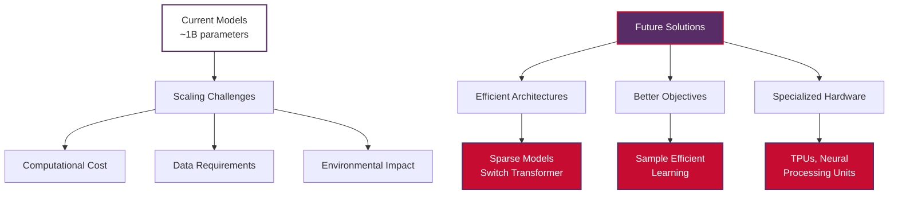

# Self-Supervised Learning in Natural Language Processing

Self-supervised learning represents one of the most revolutionary paradigms in modern Natural Language Processing, enabling models to learn rich language representations from vast amounts of unlabeled text data. By automatically generating training signals from the data itself, self-supervised learning has powered breakthrough models like BERT, GPT, and T5, fundamentally transforming how we approach NLP tasks.

> **Note on Examples**: Some code examples require internet connection to download pre-trained models from Hugging Face. These are clearly marked. For offline usage, you can download models locally first or use the provided implementation examples that work without internet connection.

## Table of Contents

1. [What is Self-Supervised Learning](#what-is-self-supervised-learning)
2. [How Self-Supervised Learning is Important to NLP](#how-self-supervised-learning-is-important-to-nlp)
3. [Common Self-Supervised Tasks in NLP](#common-self-supervised-tasks-in-nlp)
4. [Implementation Guidelines](#implementation-guidelines)
5. [Data Sources and Collection](#data-sources-and-collection)
6. [Practical Examples](#practical-examples)
7. [Real-World Applications](#real-world-applications)
8. [Best Practices](#best-practices)
9. [Future Directions](#future-directions)

## What is Self-Supervised Learning

**Self-supervised learning** is a machine learning paradigm where you automatically generate the labels from the data itself, then train a model on the resulting "labeled" dataset using supervised learning techniques. Since this approach requires no human labeling whatsoever, it is best classified as a form of unsupervised learning.

### Core Concept

Self-supervised learning bridges the gap between supervised and unsupervised learning by creating supervision signals directly from the input data structure. Rather than relying on manually annotated labels, the model learns to predict certain aspects of the data that are inherently available.

```mermaid
graph TD
    A[Unlabeled Text:<br>'My name is John'] --> B[Create Self-Supervised Task]
    B --> C[Masked Text:<br>'My [MASK] is John']
    C --> D[Training Target:<br>Predict 'name']
    D --> E[Model Learning:<br>Language Understanding]
    
    F[Vietnamese Example:<br>'Tên tôi là John'] --> G[Create Task:<br>'Tên [MASK] là John']
    G --> H[Target:<br>Predict 'tôi']
    H --> I[Model Learning:<br>Cross-lingual Understanding]

    style A fill:#FFFFFF,stroke:#582C67,color:#333,stroke-width:2px
    style B fill:#582C67,stroke:#C60C30,color:#FFFFFF,stroke-width:2px
    style C fill:#C60C30,stroke:#582C67,color:#FFFFFF,stroke-width:2px
    style D fill:#582C67,stroke:#C60C30,color:#FFFFFF,stroke-width:2px
    style E fill:#FFFFFF,stroke:#582C67,color:#333,stroke-width:2px
    style F fill:#FFFFFF,stroke:#582C67,color:#333,stroke-width:2px
    style G fill:#C60C30,stroke:#582C67,color:#FFFFFF,stroke-width:2px
    style H fill:#582C67,stroke:#C60C30,color:#FFFFFF,stroke-width:2px
    style I fill:#FFFFFF,stroke:#582C67,color:#333,stroke-width:2px
```

### Key Characteristics

**Automatic Label Generation**
- Labels are derived from the structure or properties of the input data
- No human annotation required
- Scalable to massive datasets

**Learning Rich Representations**
- Models learn to understand language patterns, syntax, and semantics
- Captures contextual relationships between words and concepts
- Develops general knowledge applicable to downstream tasks

**Transfer Learning Foundation**
- Pre-trained representations can be fine-tuned for specific tasks
- Reduces data requirements for specialized applications
- Enables few-shot and zero-shot learning capabilities

### Mathematical Foundation

Self-supervised learning can be formalized as learning a representation function $f_\theta$ that maps input text $X$ to a meaningful representation space:

$$ f_\theta: X \rightarrow Z $$

Where the training objective is to predict some aspect of the input $X$ from other parts:

$$ \mathcal{L} = \mathbb{E}_{x \sim X} \left[ -\log P(x_{\text{target}} | x_{\text{context}}, \theta) \right] $$

For example, in masked language modeling:
- $x_{\text{context}}$: The text with some tokens masked
- $x_{\text{target}}$: The original masked tokens
- $\theta$: Model parameters

## How Self-Supervised Learning is Important to NLP

Self-supervised learning has revolutionized NLP by addressing fundamental challenges that have limited the field for decades. Its importance stems from several key contributions:

### 1. Solving the Data Scarcity Problem

**Challenge**: Most NLP tasks require large amounts of labeled data, which is expensive and time-consuming to create.

**Solution**: Self-supervised learning leverages the vast amounts of unlabeled text available on the internet, books, and other sources.

```mermaid
graph TD
    subgraph "Traditional Supervised Learning"
        A1[Small Labeled Dataset<br>~10K examples] --> B1[Task-Specific Model]
        B1 --> C1[Limited Performance]
    end
    
    subgraph "Self-Supervised Learning"
        A2[Massive Unlabeled Text<br>Billions of tokens] --> B2[Pre-trained Model<br>BERT, GPT, T5]
        B2 --> C2[Fine-tune on Small<br>Labeled Dataset]
        C2 --> D2[State-of-the-art<br>Performance]
    end

    style A1 fill:#C60C30,stroke:#582C67,color:#FFFFFF,stroke-width:2px
    style B1 fill:#582C67,stroke:#C60C30,color:#FFFFFF,stroke-width:2px
    style C1 fill:#FFFFFF,stroke:#C60C30,color:#333,stroke-width:2px
    style A2 fill:#FFFFFF,stroke:#582C67,color:#333,stroke-width:2px
    style B2 fill:#582C67,stroke:#C60C30,color:#FFFFFF,stroke-width:2px
    style C2 fill:#C60C30,stroke:#582C67,color:#FFFFFF,stroke-width:2px
    style D2 fill:#FFFFFF,stroke:#582C67,color:#333,stroke-width:2px
```



### 2. Learning Universal Language Representations

Self-supervised models learn general language understanding that transfers across tasks:

**English Examples**:
- Understanding that "bank" has different meanings in "river bank" vs "money bank"
- Learning that "My name is John" and "I am called John" convey similar information
- Recognizing syntactic patterns and semantic relationships

**Vietnamese Examples**:
- Understanding "Tên tôi là John" (My name is John) structure
- Learning Vietnamese grammar patterns and word relationships
- Recognizing Vietnamese-English translation patterns

### 3. Enabling Few-Shot and Zero-Shot Learning

Pre-trained models can often perform new tasks with minimal or no task-specific training:

```python
# Example: Zero-shot sentiment analysis
# (Vietnamese-English bilingual example)
examples = [
    ("I love this product!", "English", "Positive"),
    ("Tôi yêu sản phẩm này!", "Vietnamese", "Positive"),
    ("This is terrible.", "English", "Negative"),
    ("Điều này thật tệ.", "Vietnamese", "Negative")
]
```

### 4. Democratizing NLP Research

- **Reduced Computational Requirements**: Fine-tuning is much cheaper than training from scratch
- **Accessible to Small Teams**: Researchers without massive computational resources can achieve state-of-the-art results
- **Rapid Prototyping**: New applications can be developed quickly using pre-trained models

### 5. Advancing Multilingual NLP

Self-supervised learning has enabled breakthrough multilingual models:

**Cross-lingual Transfer**: Models trained on English can perform well on Vietnamese and other languages
**Multilingual Pre-training**: Models like mBERT and XLM-R understand multiple languages simultaneously

## Common Self-Supervised Tasks in NLP

### 1. Masked Language Modeling (MLM)

**Concept**: Randomly mask tokens in a sentence and train the model to predict the masked tokens.

**Example**:
- **English**: "My name is [MASK]" → Predict "John"
- **Vietnamese**: "Tên tôi là [MASK]" → Predict "John"

**Mathematical Formulation**:

$$ \mathcal{L}_{\text{MLM}} = -\sum_{i \in \text{MASK}} \log P(x_i | x_{\setminus i}) $$

Where $x_{\setminus i}$ represents the sequence with position $i$ masked.

### 2. Next Sentence Prediction (NSP)

**Concept**: Given two sentences, predict whether the second sentence follows the first in the original document.

**Example**:
- **Positive Pair**: 
  - English: "My name is John." + "I live in Vietnam." → IsNext
  - Vietnamese: "Tên tôi là John." + "Tôi sống ở Việt Nam." → IsNext
- **Negative Pair**: 
  - English: "My name is John." + "The weather is nice." → NotNext

### 3. Causal Language Modeling (CLM)

**Concept**: Predict the next token in a sequence given all previous tokens.

**Mathematical Formulation**:

$$ \mathcal{L}_{\text{CLM}} = -\sum_{i=1}^{T} \log P(x_i | x_1, x_2, \ldots, x_{i-1}) $$

### 4. Denoising Objectives

**Concept**: Corrupt the input text and train the model to reconstruct the original.

**Examples**:
- **Token Masking**: Replace tokens with [MASK]
- **Token Deletion**: Remove random tokens
- **Text Infilling**: Replace spans with a single mask token
- **Sentence Permutation**: Shuffle sentence order

## Implementation Guidelines

### Basic Self-Supervised Learning Pipeline

Here's a step-by-step guide to implementing self-supervised learning for NLP:

#### Step 1: Data Preparation

```python
import torch
import torch.nn as nn
from torch.utils.data import Dataset, DataLoader
from transformers import AutoTokenizer, AutoModel
import random
import numpy as np

class SelfSupervisedDataset(Dataset):
    """
    Dataset for self-supervised learning with masked language modeling
    Supports both English and Vietnamese text
    """
    
    def __init__(self, texts, tokenizer, max_length=512, mlm_probability=0.15):
        self.texts = texts
        self.tokenizer = tokenizer
        self.max_length = max_length
        self.mlm_probability = mlm_probability
        
    def __len__(self):
        return len(self.texts)
    
    def __getitem__(self, idx):
        text = self.texts[idx]
        
        # Tokenize the text
        encoding = self.tokenizer(
            text,
            truncation=True,
            padding='max_length',
            max_length=self.max_length,
            return_tensors='pt'
        )
        
        # Create masked version for MLM
        input_ids = encoding['input_ids'].squeeze()
        labels = input_ids.clone()
        
        # Apply masking
        masked_input_ids, masked_labels = self.apply_masking(input_ids, labels)
        
        return {
            'input_ids': masked_input_ids,
            'attention_mask': encoding['attention_mask'].squeeze(),
            'labels': masked_labels
        }
    
    def apply_masking(self, input_ids, labels):
        """Apply MLM masking strategy"""
        # Don't mask special tokens
        special_tokens = [self.tokenizer.cls_token_id, self.tokenizer.sep_token_id, 
                         self.tokenizer.pad_token_id]
        
        # Create probability matrix
        probability_matrix = torch.full(input_ids.shape, self.mlm_probability)
        
        # Don't mask special tokens
        for token_id in special_tokens:
            probability_matrix[input_ids == token_id] = 0.0
        
        # Create masked positions
        masked_indices = torch.bernoulli(probability_matrix).bool()
        
        # Prepare labels (only compute loss on masked tokens)
        labels[~masked_indices] = -100
        
        # Apply masking strategy
        # 80% of the time: replace with [MASK] token
        # 10% of the time: replace with random token  
        # 10% of the time: keep original token
        
        indices_replaced = torch.bernoulli(torch.full(input_ids.shape, 0.8)).bool() & masked_indices
        input_ids[indices_replaced] = self.tokenizer.mask_token_id
        
        indices_random = torch.bernoulli(torch.full(input_ids.shape, 0.5)).bool() & masked_indices & ~indices_replaced
        random_words = torch.randint(len(self.tokenizer), input_ids.shape, dtype=torch.long)
        input_ids[indices_random] = random_words[indices_random]
        
        return input_ids, labels

# Example usage with Vietnamese-English data
sample_texts = [
    "My name is John and I love programming.",
    "Tên tôi là John và tôi yêu lập trình.",
    "Natural language processing is fascinating.",
    "Xử lý ngôn ngữ tự nhiên rất thú vị.",
    "Machine learning helps solve complex problems.",
    "Học máy giúp giải quyết các vấn đề phức tạp."
]

# Initialize tokenizer (works with multilingual models)
# tokenizer = AutoTokenizer.from_pretrained('bert-base-multilingual-cased')

# Create dataset
# dataset = SelfSupervisedDataset(sample_texts, tokenizer)
# dataloader = DataLoader(dataset, batch_size=2, shuffle=True)
```

#### Step 2: Model Architecture

```python
class SelfSupervisedLearningModel(nn.Module):
    """
    Self-supervised learning model for masked language modeling
    """
    
    def __init__(self, model_name='bert-base-multilingual-cased'):
        super().__init__()
        self.bert = AutoModel.from_pretrained(model_name)
        self.mlm_head = nn.Linear(self.bert.config.hidden_size, self.bert.config.vocab_size)
        self.dropout = nn.Dropout(self.bert.config.hidden_dropout_prob)
        
    def forward(self, input_ids, attention_mask=None, labels=None):
        # Get BERT outputs
        outputs = self.bert(input_ids=input_ids, attention_mask=attention_mask)
        sequence_output = outputs.last_hidden_state
        
        # Apply dropout and prediction head
        sequence_output = self.dropout(sequence_output)
        prediction_scores = self.mlm_head(sequence_output)
        
        loss = None
        if labels is not None:
            loss_fn = nn.CrossEntropyLoss()
            loss = loss_fn(prediction_scores.view(-1, self.bert.config.vocab_size), 
                          labels.view(-1))
        
        return {
            'loss': loss,
            'prediction_scores': prediction_scores,
            'hidden_states': sequence_output
        }
```

#### Step 3: Training Loop

```python
def train_self_supervised_model(model, dataloader, epochs=3, learning_rate=5e-5):
    """
    Training loop for self-supervised learning
    """
    
    optimizer = torch.optim.AdamW(model.parameters(), lr=learning_rate)
    model.train()
    
    for epoch in range(epochs):
        total_loss = 0
        
        for batch_idx, batch in enumerate(dataloader):
            # Forward pass
            outputs = model(
                input_ids=batch['input_ids'],
                attention_mask=batch['attention_mask'],
                labels=batch['labels']
            )
            
            loss = outputs['loss']
            
            # Backward pass
            optimizer.zero_grad()
            loss.backward()
            optimizer.step()
            
            total_loss += loss.item()
            
            if batch_idx % 10 == 0:
                print(f'Epoch {epoch}, Batch {batch_idx}, Loss: {loss.item():.4f}')
        
        avg_loss = total_loss / len(dataloader)
        print(f'Epoch {epoch} completed. Average Loss: {avg_loss:.4f}')

# Example training
# model = SelfSupervisedLearningModel()
# train_self_supervised_model(model, dataloader, epochs=2)
```

#### Step 4: Evaluation and Fine-tuning

```python
def evaluate_masked_predictions(model, tokenizer, text_samples):
    """
    Evaluate the model's ability to predict masked tokens
    """
    model.eval()
    
    examples = [
        "My name is [MASK] and I love programming.",
        "Tên tôi là [MASK] và tôi yêu lập trình.",
        "Natural language [MASK] is fascinating.",
        "Xử lý ngôn ngữ [MASK] rất thú vị."
    ]
    
    with torch.no_grad():
        for text in examples:
            # Tokenize input
            inputs = tokenizer(text, return_tensors='pt')
            
            # Get predictions
            outputs = model(inputs['input_ids'], inputs['attention_mask'])
            predictions = outputs['prediction_scores']
            
            # Find masked position
            mask_token_index = torch.where(inputs['input_ids'] == tokenizer.mask_token_id)[1]
            
            if len(mask_token_index) > 0:
                # Get top predictions for masked token
                mask_token_logits = predictions[0, mask_token_index, :]
                top_tokens = torch.topk(mask_token_logits, 5, dim=1).indices[0].tolist()
                
                print(f"\nText: {text}")
                print("Top predictions:")
                for token_id in top_tokens:
                    token = tokenizer.decode([token_id])
                    print(f"  {token}")

# Example evaluation
# evaluate_masked_predictions(model, tokenizer, sample_texts)
```

### Advanced Implementation Techniques

#### 1. Dynamic Masking

```python
def dynamic_masking(input_ids, tokenizer, masking_prob=0.15):
    """
    Apply dynamic masking where the masked positions change each epoch
    """
    masked_input = input_ids.clone()
    labels = input_ids.clone()
    
    # Create random masking for each example
    rand = torch.rand(input_ids.shape)
    mask_arr = (rand < masking_prob) * (input_ids != tokenizer.pad_token_id) * \
               (input_ids != tokenizer.cls_token_id) * (input_ids != tokenizer.sep_token_id)
    
    # Apply masking
    masked_input[mask_arr] = tokenizer.mask_token_id
    labels[~mask_arr] = -100  # Only compute loss on masked tokens
    
    return masked_input, labels
```

#### 2. Curriculum Learning

```python
def curriculum_learning_scheduler(epoch, max_epochs):
    """
    Gradually increase masking probability during training
    """
    initial_prob = 0.10
    final_prob = 0.15
    progress = epoch / max_epochs
    return initial_prob + (final_prob - initial_prob) * progress
```

#### 3. Multi-task Self-supervised Learning

```python
class MultiTaskSelfSupervisedModel(nn.Module):
    """
    Model that combines multiple self-supervised objectives
    """
    
    def __init__(self, model_name='bert-base-multilingual-cased'):
        super().__init__()
        self.bert = AutoModel.from_pretrained(model_name)
        
        # MLM head
        self.mlm_head = nn.Linear(self.bert.config.hidden_size, self.bert.config.vocab_size)
        
        # NSP head
        self.nsp_head = nn.Linear(self.bert.config.hidden_size, 2)
        
    def forward(self, input_ids, attention_mask, token_type_ids=None, 
                mlm_labels=None, nsp_labels=None):
        outputs = self.bert(input_ids=input_ids, attention_mask=attention_mask,
                           token_type_ids=token_type_ids)
        
        sequence_output = outputs.last_hidden_state
        pooled_output = outputs.pooler_output
        
        # MLM predictions
        mlm_scores = self.mlm_head(sequence_output)
        
        # NSP predictions
        nsp_scores = self.nsp_head(pooled_output)
        
        # Calculate losses
        total_loss = 0
        if mlm_labels is not None:
            mlm_loss = nn.CrossEntropyLoss()(mlm_scores.view(-1, self.bert.config.vocab_size),
                                           mlm_labels.view(-1))
            total_loss += mlm_loss
            
        if nsp_labels is not None:
            nsp_loss = nn.CrossEntropyLoss()(nsp_scores, nsp_labels)
            total_loss += nsp_loss
        
        return {
            'loss': total_loss,
            'mlm_scores': mlm_scores,
            'nsp_scores': nsp_scores
        }
```

## Data Sources and Collection

### 1. Large-Scale Text Corpora

**Common Crawl**
- **Description**: Web pages from across the internet
- **Size**: Hundreds of terabytes of text data
- **Languages**: Multilingual including Vietnamese and English
- **Access**: https://commoncrawl.org/
- **Preprocessing**: Requires extensive cleaning and filtering

**Wikipedia**
- **Description**: Encyclopedia articles in multiple languages
- **Size**: Several gigabytes per language
- **Languages**: 300+ languages including Vietnamese
- **Access**: Wikipedia dumps at https://dumps.wikimedia.org/
- **Quality**: High-quality, well-structured text

**BookCorpus**
- **Description**: Collection of over 11,000 books
- **Size**: ~74 million sentences, ~1 billion words
- **Language**: Primarily English
- **Access**: Research agreements required
- **Quality**: High-quality literary text

#### Example Data Collection Script

```python
import requests
import json
from pathlib import Path
import re

def collect_wikipedia_data(language='en', num_articles=1000):
    """
    Collect Wikipedia articles for self-supervised learning
    
    Args:
        language: Language code ('en' for English, 'vi' for Vietnamese)
        num_articles: Number of articles to collect
    """
    
    # Wikipedia API endpoint
    api_url = f"https://{language}.wikipedia.org/api/rest_v1/page/random/summary"
    
    collected_texts = []
    
    for i in range(num_articles):
        try:
            response = requests.get(api_url)
            if response.status_code == 200:
                data = response.json()
                title = data.get('title', '')
                extract = data.get('extract', '')
                
                if extract and len(extract) > 100:  # Filter short articles
                    # Clean the text
                    clean_text = clean_wikipedia_text(extract)
                    collected_texts.append({
                        'title': title,
                        'text': clean_text,
                        'language': language
                    })
                    
                if i % 100 == 0:
                    print(f"Collected {i} articles...")
                    
        except Exception as e:
            print(f"Error collecting article {i}: {e}")
            continue
    
    return collected_texts

def clean_wikipedia_text(text):
    """Clean Wikipedia text for self-supervised learning"""
    # Remove citations and references
    text = re.sub(r'\[\d+\]', '', text)
    
    # Remove extra whitespace
    text = re.sub(r'\s+', ' ', text)
    
    # Remove special characters but keep Vietnamese diacritics
    text = re.sub(r'[^\w\s\.,!?;:()\-\"\'àáãạảăắằẳẵặâấầẩẫậèéẹẻẽêếềểễệđìíĩỉịòóõọỏôốồổỗộơớờởỡợùúũụủưứừửữựýỳỹỷỵ]', '', text, flags=re.UNICODE)
    
    return text.strip()

# Example usage (requires internet connection)
# english_data = collect_wikipedia_data('en', 500)
# vietnamese_data = collect_wikipedia_data('vi', 500)
```

### 2. Domain-Specific Corpora

**News Articles**
- **Sources**: Reuters, BBC, CNN, VnExpress (Vietnamese)
- **Benefits**: Current events, formal language, diverse topics
- **Collection**: RSS feeds, news APIs, web scraping

**Social Media Data**
- **Sources**: Twitter, Reddit, Facebook
- **Benefits**: Informal language, current slang, conversational patterns
- **Considerations**: Privacy, terms of service, data quality

**Academic Papers**
- **Sources**: arXiv, PubMed, academic publishers
- **Benefits**: Technical language, formal writing, domain expertise
- **Access**: APIs, institutional access, open access papers

#### Multilingual Data Collection

```python
def create_multilingual_dataset():
    """
    Create a balanced multilingual dataset for self-supervised learning
    """
    
    # Vietnamese-English parallel examples for cross-lingual learning
    bilingual_examples = [
        {
            'english': "Artificial intelligence is transforming the world.",
            'vietnamese': "Trí tuệ nhân tạo đang thay đổi thế giới.",
            'domain': 'technology'
        },
        {
            'english': "Natural language processing helps computers understand human language.",
            'vietnamese': "Xử lý ngôn ngữ tự nhiên giúp máy tính hiểu ngôn ngữ con người.",
            'domain': 'technology'
        },
        {
            'english': "Machine learning requires large amounts of training data.",
            'vietnamese': "Học máy đòi hỏi lượng lớn dữ liệu huấn luyện.",
            'domain': 'technology'
        },
        {
            'english': "The weather is beautiful today in Vietnam.",
            'vietnamese': "Thời tiết hôm nay ở Việt Nam rất đẹp.",
            'domain': 'general'
        },
        {
            'english': "I love learning about new technologies.",
            'vietnamese': "Tôi yêu thích học hỏi về các công nghệ mới.",
            'domain': 'personal'
        }
    ]
    
    # Process for self-supervised learning
    processed_data = []
    
    for example in bilingual_examples:
        # Add individual language examples
        processed_data.append({
            'text': example['english'],
            'language': 'en',
            'domain': example['domain']
        })
        
        processed_data.append({
            'text': example['vietnamese'],
            'language': 'vi',
            'domain': example['domain']
        })
        
        # Add combined example for cross-lingual learning
        combined_text = f"{example['english']} [SEP] {example['vietnamese']}"
        processed_data.append({
            'text': combined_text,
            'language': 'multilingual',
            'domain': example['domain']
        })
    
    return processed_data

# Create the dataset
multilingual_data = create_multilingual_dataset()
```

### 3. Data Quality and Preprocessing

#### Text Cleaning Pipeline

```python
import unicodedata
import string

class TextPreprocessor:
    """
    Comprehensive text preprocessing for self-supervised learning
    """
    
    def __init__(self, language='multilingual'):
        self.language = language
        
    def preprocess_text(self, text):
        """
        Apply comprehensive text preprocessing
        """
        # Step 1: Unicode normalization
        text = unicodedata.normalize('NFKC', text)
        
        # Step 2: Remove extra whitespace
        text = ' '.join(text.split())
        
        # Step 3: Handle special characters based on language
        if self.language == 'vi' or self.language == 'multilingual':
            # Preserve Vietnamese diacritics
            text = self.preserve_vietnamese_chars(text)
        
        # Step 4: Filter by length and quality
        if self.is_valid_text(text):
            return text
        else:
            return None
    
    def preserve_vietnamese_chars(self, text):
        """Preserve Vietnamese diacritical marks"""
        vietnamese_chars = (
            'àáãạảăắằẳẵặâấầẩẫậèéẹẻẽêếềểễệđìíĩỉịòóõọỏôốồổỗộơớờởỡợùúũụủưứừửữựýỳỹỷỵ'
            'ÀÁÃẠẢĂẮẰẲẴẶÂẤẦẨẪẬÈÉẸẺẼÊẾỀỂỄỆĐÌÍĨỈỊÒÓÕỌỎÔỐỒỔỖỘƠỚỜỞỠỢÙÚŨỤỦƯỨỪỬỮỰÝỲỸỶỴ'
        )
        
        # Keep alphanumeric, Vietnamese chars, and basic punctuation
        allowed_chars = set(string.ascii_letters + string.digits + string.punctuation + 
                           vietnamese_chars + ' ')
        
        return ''.join(char for char in text if char in allowed_chars)
    
    def is_valid_text(self, text):
        """Check if text meets quality criteria"""
        if not text or len(text) < 10:
            return False
        
        # Check for reasonable word count
        words = text.split()
        if len(words) < 3 or len(words) > 500:
            return False
        
        # Check for reasonable character diversity
        unique_chars = set(text.lower())
        if len(unique_chars) < 5:
            return False
        
        return True

# Example usage
preprocessor = TextPreprocessor('multilingual')

sample_texts = [
    "My name is John and I love programming!",
    "Tên tôi là John và tôi yêu lập trình!",
    "This is a test sentence with proper length.",
    "Too short",  # Will be filtered out
    "A" * 1000,   # Will be filtered out
]

processed_texts = [preprocessor.preprocess_text(text) for text in sample_texts]
valid_texts = [text for text in processed_texts if text is not None]

print("Valid processed texts:")
for text in valid_texts:
    print(f"  {text}")
```

## Practical Examples

### Example 1: Simple Masked Language Model

```python
# Complete implementation of a simple MLM for educational purposes
def simple_mlm_example():
    """
    Simple masked language modeling example with Vietnamese-English text
    """
    
    # Sample bilingual corpus
    corpus = [
        "My name is John and I work in technology.",
        "Tên tôi là John và tôi làm việc trong lĩnh vực công nghệ.",
        "Natural language processing is part of artificial intelligence.",
        "Xử lý ngôn ngữ tự nhiên là một phần của trí tuệ nhân tạo.",
        "Machine learning helps solve complex problems.",
        "Học máy giúp giải quyết các vấn đề phức tạp.",
        "I love programming and learning new technologies.",
        "Tôi yêu lập trình và học các công nghệ mới."
    ]
    
    # Simple tokenization (word-level)
    def tokenize(text):
        return text.lower().split()
    
    # Build vocabulary
    vocab = set()
    for text in corpus:
        vocab.update(tokenize(text))
    
    vocab = list(vocab)
    vocab.append('[MASK]')
    vocab.append('[UNK]')
    
    word_to_id = {word: i for i, word in enumerate(vocab)}
    id_to_word = {i: word for word, i in word_to_id.items()}
    
    print(f"Vocabulary size: {len(vocab)}")
    print(f"Sample words: {vocab[:10]}")
    
    # Create masked examples
    def create_masked_example(text, mask_prob=0.15):
        tokens = tokenize(text)
        masked_tokens = tokens.copy()
        labels = [-1] * len(tokens)  # -1 means no prediction needed
        
        for i, token in enumerate(tokens):
            if random.random() < mask_prob:
                labels[i] = word_to_id.get(token, word_to_id['[UNK]'])
                masked_tokens[i] = '[MASK]'
        
        return masked_tokens, labels
    
    # Generate training examples
    print("\nMasked Language Modeling Examples:")
    print("=" * 50)
    
    for text in corpus[:4]:  # Show first 4 examples
        masked_tokens, labels = create_masked_example(text)
        
        print(f"\nOriginal: {text}")
        print(f"Masked:   {' '.join(masked_tokens)}")
        
        # Show which tokens to predict
        predictions_needed = []
        for i, (masked_token, label) in enumerate(zip(masked_tokens, labels)):
            if label != -1:
                original_word = id_to_word[label]
                predictions_needed.append(f"position {i}: predict '{original_word}'")
        
        if predictions_needed:
            print(f"Predict:  {', '.join(predictions_needed)}")

# Run the example
simple_mlm_example()
```

### Example 2: Next Sentence Prediction

```python
def next_sentence_prediction_example():
    """
    Demonstrate Next Sentence Prediction with Vietnamese-English examples
    """
    
    # Sample document (simulating a bilingual text)
    documents = [
        [
            "My name is John and I am a software engineer.",
            "I work for a technology company in Vietnam.",
            "We develop artificial intelligence applications.",
            "Our team focuses on natural language processing."
        ],
        [
            "Tên tôi là John và tôi là kỹ sư phần mềm.",
            "Tôi làm việc cho một công ty công nghệ ở Việt Nam.",
            "Chúng tôi phát triển các ứng dụng trí tuệ nhân tạo.",
            "Nhóm của chúng tôi tập trung vào xử lý ngôn ngữ tự nhiên."
        ]
    ]
    
    def create_sentence_pairs(documents):
        """Create positive and negative sentence pairs"""
        pairs = []
        
        for doc in documents:
            # Create positive pairs (consecutive sentences)
            for i in range(len(doc) - 1):
                pairs.append({
                    'sentence_a': doc[i],
                    'sentence_b': doc[i + 1],
                    'label': 1,  # IsNext
                    'type': 'positive'
                })
            
            # Create negative pairs (non-consecutive sentences)
            for i in range(len(doc)):
                for j in range(len(doc)):
                    if abs(i - j) > 1:  # Not consecutive
                        pairs.append({
                            'sentence_a': doc[i],
                            'sentence_b': doc[j],
                            'label': 0,  # NotNext
                            'type': 'negative'
                        })
        
        return pairs
    
    # Generate sentence pairs
    sentence_pairs = create_sentence_pairs(documents)
    
    print("Next Sentence Prediction Examples:")
    print("=" * 50)
    
    # Show examples of each type
    positive_examples = [p for p in sentence_pairs if p['label'] == 1]
    negative_examples = [p for p in sentence_pairs if p['label'] == 0]
    
    print("\nPositive Examples (IsNext):")
    for i, pair in enumerate(positive_examples[:3]):
        print(f"\n{i+1}. Sentence A: {pair['sentence_a']}")
        print(f"   Sentence B: {pair['sentence_b']}")
        print(f"   Label: {pair['label']} (IsNext)")
    
    print("\nNegative Examples (NotNext):")
    for i, pair in enumerate(negative_examples[:3]):
        print(f"\n{i+1}. Sentence A: {pair['sentence_a']}")
        print(f"   Sentence B: {pair['sentence_b']}")
        print(f"   Label: {pair['label']} (NotNext)")
    
    return sentence_pairs

# Run the example
nsp_pairs = next_sentence_prediction_example()
```

### Example 3: Text Infilling (T5-style)

```python
def text_infilling_example():
    """
    Demonstrate text infilling self-supervised task (T5-style)
    """
    
    texts = [
        "My name is John and I love programming in Python.",
        "Tên tôi là John và tôi yêu lập trình Python.",
        "Natural language processing requires understanding context.",
        "Xử lý ngôn ngữ tự nhiên đòi hỏi hiểu ngữ cảnh."
    ]
    
    def create_infilling_task(text, span_length=2):
        """Create text infilling task by masking spans"""
        words = text.split()
        
        if len(words) < span_length + 2:
            return None
        
        # Choose random starting position for span
        start_pos = random.randint(1, len(words) - span_length - 1)
        
        # Extract the span to be predicted
        target_span = words[start_pos:start_pos + span_length]
        
        # Create input with span marker
        input_words = (words[:start_pos] + 
                      ['<extra_id_0>'] + 
                      words[start_pos + span_length:])
        
        # Create target
        target = '<extra_id_0> ' + ' '.join(target_span) + ' <extra_id_1>'
        
        return {
            'input': ' '.join(input_words),
            'target': target,
            'original': text,
            'span': target_span
        }
    
    print("Text Infilling Examples (T5-style):")
    print("=" * 50)
    
    for i, text in enumerate(texts):
        task = create_infilling_task(text)
        if task:
            print(f"\n{i+1}. Original: {task['original']}")
            print(f"   Input:    {task['input']}")
            print(f"   Target:   {task['target']}")
            print(f"   Span:     {' '.join(task['span'])}")

# Run the example
text_infilling_example()
```

## Real-World Applications

### 1. Pre-training Language Models

Self-supervised learning is the foundation for training large language models:

```python
# Example: Using pre-trained self-supervised models for downstream tasks
def downstream_task_example():
    """
    Demonstrate how self-supervised pre-training enables downstream tasks
    """
    
    # Simulated pre-trained representations (in reality, these come from models like BERT)
    vietnamese_english_examples = [
        {
            'text': "My name is John",
            'language': 'en',
            'pretrained_embedding': [0.1, 0.2, 0.3, 0.4],  # Simulated
            'tasks': ['sentiment', 'ner', 'classification']
        },
        {
            'text': "Tên tôi là John", 
            'language': 'vi',
            'pretrained_embedding': [0.15, 0.25, 0.25, 0.35],  # Simulated
            'tasks': ['sentiment', 'ner', 'classification']
        }
    ]
    
    print("Downstream Task Applications:")
    print("=" * 40)
    
    for example in vietnamese_english_examples:
        print(f"\nText: {example['text']} ({example['language']})")
        print(f"Pre-trained embedding: {example['pretrained_embedding']}")
        print(f"Applicable tasks: {', '.join(example['tasks'])}")

downstream_task_example()
```

### 2. Domain Adaptation

```python
def domain_adaptation_example():
    """
    Show how self-supervised learning enables domain adaptation
    """
    
    domains = {
        'medical': [
            "The patient shows symptoms of viral infection.",
            "Bệnh nhân có triệu chứng nhiễm virus."
        ],
        'legal': [
            "The contract specifies the terms of agreement.",
            "Hợp đồng quy định các điều khoản thỏa thuận."
        ],
        'technology': [
            "Machine learning models require training data.",
            "Các mô hình học máy cần dữ liệu huấn luyện."
        ]
    }
    
    print("Domain Adaptation with Self-Supervised Learning:")
    print("=" * 55)
    
    for domain, examples in domains.items():
        print(f"\n{domain.title()} Domain:")
        for example in examples:
            print(f"  {example}")
        
        print(f"  → Can fine-tune general model for {domain}-specific tasks")

domain_adaptation_example()
```

### 3. Few-Shot Learning

```python
def few_shot_learning_example():
    """
    Demonstrate few-shot learning enabled by self-supervised pre-training
    """
    
    # Simulated scenario: sentiment analysis with very few examples
    few_shot_examples = [
        # English examples
        ("I love this product!", "positive", "en"),
        ("This is terrible quality.", "negative", "en"),
        
        # Vietnamese examples  
        ("Tôi yêu sản phẩm này!", "positive", "vi"),
        ("Chất lượng này thật tệ.", "negative", "vi"),
    ]
    
    # Test cases (what the model should predict)
    test_cases = [
        ("This is amazing!", "en"),
        ("Điều này thật tuyệt vời!", "vi"),
        ("Very disappointed.", "en"),
        ("Rất thất vọng.", "vi"),
    ]
    
    print("Few-Shot Learning Example:")
    print("=" * 30)
    
    print("\nTraining Examples (only 4 total!):")
    for text, label, lang in few_shot_examples:
        print(f"  {text} ({lang}) → {label}")
    
    print("\nTest Cases (model should predict sentiment):")
    for text, lang in test_cases:
        # In reality, pre-trained model would make these predictions
        predicted_sentiment = "positive" if any(word in text.lower() for word in 
                                              ['amazing', 'tuyệt', 'love', 'yêu']) else "negative"
        print(f"  {text} ({lang}) → predicted: {predicted_sentiment}")

few_shot_learning_example()
```

## Best Practices

### 1. Data Quality and Preprocessing

```python
def data_quality_best_practices():
    """
    Best practices for data quality in self-supervised learning
    """
    
    quality_guidelines = {
        'text_length': {
            'min_words': 10,
            'max_words': 512,
            'reason': 'Too short lacks context, too long is computationally expensive'
        },
        'language_detection': {
            'confidence_threshold': 0.8,
            'mixed_language_handling': 'separate or mark explicitly',
            'reason': 'Ensure consistent language modeling'
        },
        'deduplication': {
            'exact_matches': 'remove',
            'near_duplicates': 'use fuzzy matching (>90% similarity)',
            'reason': 'Prevent overfitting to repeated content'
        },
        'content_filtering': {
            'remove': ['spam', 'nonsensical text', 'excessive repetition'],
            'keep': ['diverse domains', 'natural language', 'multilingual content'],
            'reason': 'Maintain training data quality'
        }
    }
    
    print("Data Quality Best Practices:")
    print("=" * 35)
    
    for category, guidelines in quality_guidelines.items():
        print(f"\n{category.replace('_', ' ').title()}:")
        for key, value in guidelines.items():
            if key != 'reason':
                print(f"  {key}: {value}")
        print(f"  Reason: {guidelines['reason']}")

data_quality_best_practices()
```

### 2. Training Strategies

```python
def training_best_practices():
    """
    Best practices for self-supervised learning training
    """
    
    strategies = {
        'masking_strategy': {
            'mlm_probability': 0.15,
            'mask_token_prob': 0.8,
            'random_token_prob': 0.1,
            'keep_original_prob': 0.1,
            'note': 'BERT-style masking strategy'
        },
        'batch_composition': {
            'mixed_languages': 'Include both English and Vietnamese in same batch',
            'domain_mixing': 'Mix different domains for generalization',
            'sequence_lengths': 'Pack sequences efficiently',
            'note': 'Promotes cross-lingual learning'
        },
        'learning_schedule': {
            'warmup_steps': '10% of total steps',
            'peak_learning_rate': '1e-4 to 5e-4',
            'decay_strategy': 'Linear or cosine',
            'note': 'Stable training convergence'
        },
        'regularization': {
            'dropout': 0.1,
            'weight_decay': 0.01,
            'gradient_clipping': 1.0,
            'note': 'Prevent overfitting'
        }
    }
    
    print("Training Best Practices:")
    print("=" * 25)
    
    for strategy, details in strategies.items():
        print(f"\n{strategy.replace('_', ' ').title()}:")
        for key, value in details.items():
            print(f"  {key}: {value}")

training_best_practices()
```

### 3. Evaluation and Monitoring

```python
def evaluation_best_practices():
    """
    Best practices for evaluating self-supervised learning
    """
    
    evaluation_metrics = {
        'intrinsic_metrics': {
            'masked_lm_accuracy': 'Accuracy on masked token prediction',
            'perplexity': 'How well model predicts next tokens',
            'attention_patterns': 'Visualize what model attends to',
            'example': 'MLM accuracy on "My [MASK] is John" → "name"'
        },
        'downstream_evaluation': {
            'task_specific_metrics': 'F1, accuracy for classification tasks',
            'few_shot_performance': 'Performance with limited examples',
            'cross_lingual_transfer': 'English→Vietnamese task performance',
            'example': 'Fine-tune on sentiment analysis, measure F1'
        },
        'linguistic_probing': {
            'syntactic_knowledge': 'POS tagging, parsing accuracy',
            'semantic_knowledge': 'Word similarity, analogy tasks',
            'cross_lingual_alignment': 'Vietnamese-English word alignment',
            'example': 'Test if model knows "John" and "tôi" relations'
        }
    }
    
    print("Evaluation Best Practices:")
    print("=" * 28)
    
    for category, metrics in evaluation_metrics.items():
        print(f"\n{category.replace('_', ' ').title()}:")
        for metric, description in metrics.items():
            print(f"  {metric}: {description}")

evaluation_best_practices()
```

### 4. Computational Efficiency

```python
def efficiency_best_practices():
    """
    Best practices for computational efficiency
    """
    
    efficiency_tips = [
        {
            'technique': 'Mixed Precision Training',
            'description': 'Use FP16 to reduce memory usage',
            'implementation': 'torch.cuda.amp for PyTorch',
            'savings': '~50% memory reduction'
        },
        {
            'technique': 'Gradient Accumulation',
            'description': 'Simulate larger batch sizes',
            'implementation': 'Accumulate gradients over multiple mini-batches',
            'savings': 'Enables large effective batch sizes on limited hardware'
        },
        {
            'technique': 'Dynamic Padding',
            'description': 'Pad sequences to batch maximum, not global maximum',
            'implementation': 'Custom collate function in DataLoader',
            'savings': '~30% computational reduction'
        },
        {
            'technique': 'Checkpoint Resuming',
            'description': 'Save and resume training from checkpoints',
            'implementation': 'Regular model and optimizer state saving',
            'savings': 'Fault tolerance and iterative training'
        }
    ]
    
    print("Computational Efficiency Best Practices:")
    print("=" * 42)
    
    for tip in efficiency_tips:
        print(f"\n{tip['technique']}:")
        print(f"  Description: {tip['description']}")
        print(f"  Implementation: {tip['implementation']}")
        print(f"  Savings: {tip['savings']}")

efficiency_best_practices()
```

## Future Directions

### 1. Emerging Self-Supervised Techniques

**Contrastive Learning**
- Learning representations by contrasting positive and negative examples
- SimCLR, MoCo, and SwAV approaches adapted for NLP
- Applications in multilingual sentence embeddings

**Energy-Based Models**
- Learning probability distributions over text through energy functions
- Potential for more flexible generation and understanding
- Integration with traditional autoregressive models

**Multi-Modal Self-Supervision**
- Combining text with images, audio, and video
- Cross-modal understanding and generation
- Vietnamese-English multimodal datasets

### 2. Scaling and Efficiency



### 3. Vietnamese NLP Advancements

**Challenges and Opportunities**:
- Limited Vietnamese training data compared to English
- Unique linguistic features requiring specialized handling
- Cross-lingual transfer from English to Vietnamese
- Development of Vietnamese-specific self-supervised tasks

**Future Research Directions**:
- Vietnamese-English parallel self-supervised learning
- Incorporation of Vietnamese linguistic features
- Domain-specific Vietnamese models (legal, medical, technical)
- Improved Vietnamese tokenization and preprocessing

## Conclusion

Self-supervised learning represents a fundamental paradigm shift in Natural Language Processing, enabling models to learn rich language representations from vast amounts of unlabeled text. By automatically generating training signals from the data itself, this approach has made state-of-the-art NLP capabilities accessible to researchers and practitioners worldwide.

### Key Takeaways

**Revolutionary Impact**:
- Eliminates dependence on manually labeled data
- Enables learning from massive text corpora
- Powers breakthrough models like BERT, GPT, and T5
- Democratizes access to advanced NLP capabilities

**Technical Foundation**:
- Common tasks include Masked Language Modeling, Next Sentence Prediction, and Causal Language Modeling
- Implementation requires careful data preprocessing, efficient training strategies, and comprehensive evaluation
- Vietnamese-English examples demonstrate cross-lingual capabilities
- Best practices ensure quality and efficiency

**Future Potential**:
- Continued scaling to larger models and datasets
- Integration with multimodal learning
- Specialized applications for Vietnamese and other underrepresented languages
- More efficient and environmentally sustainable approaches

As the field continues to evolve, self-supervised learning remains at the forefront of NLP research and applications, driving innovations in language understanding, generation, and cross-lingual capabilities. The principles and techniques outlined in this document provide a comprehensive foundation for leveraging self-supervised learning in both research and practical applications.

The Vietnamese-English examples throughout this document highlight the global applicability of self-supervised learning, demonstrating how these techniques can bridge language barriers and enable truly multilingual AI systems. As we continue to develop these capabilities, self-supervised learning will play an increasingly important role in creating more inclusive and accessible NLP technologies.