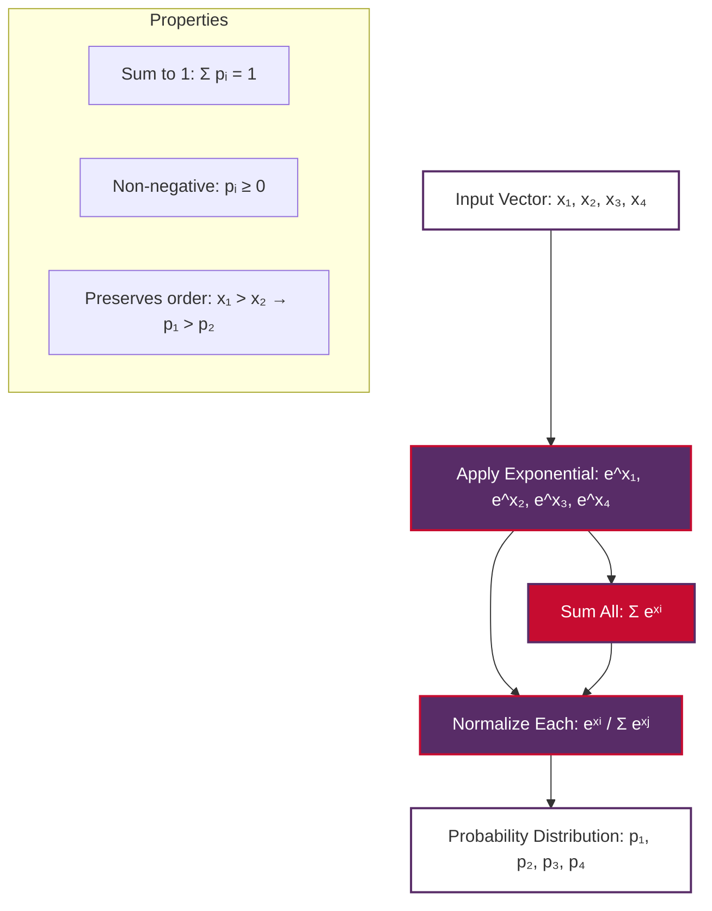
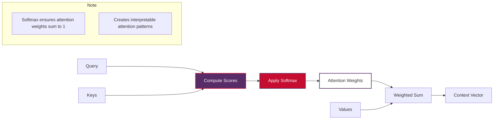

# Softmax Function in Natural Language Processing

The **softmax function** is one of the most fundamental mathematical concepts in modern NLP and deep learning. It transforms arbitrary real-valued vectors into probability distributions, making it essential for classification tasks, attention mechanisms, and language modeling.

> **Note on Examples**: Code examples in this document work offline and don't require internet connectivity or pre-trained models.

## Table of Contents

1. [What is Softmax?](#what-is-softmax)
2. [Mathematical Foundation](#mathematical-foundation)
3. [Why Softmax is Important in NLP](#why-softmax-is-important-in-nlp)
4. [Most Used Softmax Functions in NLP](#most-used-softmax-functions-in-nlp)
5. [Practical Implementation](#practical-implementation)
6. [Common Applications in NLP](#common-applications-in-nlp)
7. [Best Practices and Considerations](#best-practices-and-considerations)
8. [Conclusion](#conclusion)

## What is Softmax?

The **softmax function** is a mathematical function that converts a vector of real numbers into a probability distribution. It takes any real-valued vector and produces a vector of the same dimension where:

1. All output values are between 0 and 1
2. All output values sum to exactly 1
3. Larger input values get proportionally larger output probabilities

### Intuitive Understanding

Think of softmax as a "soft" version of the maximum function:
- The regular `max()` function gives all probability to the largest element (hard selection)
- Softmax gives higher probability to larger elements but still assigns some probability to smaller ones (soft selection)

### Real-World Analogy

Imagine choosing what to order at a restaurant:
- **Hard max**: Always order your favorite dish (100% probability to the best option)
- **Softmax**: Usually order your favorite, but sometimes try other dishes based on how much you like them

## Mathematical Foundation

### Basic Definition

For a vector $\mathbf{x} = [x_1, x_2, ..., x_n]$, the softmax function is defined as:

$$ \text{softmax}(x_i) = \frac{e^{x_i}}{\sum_{j=1}^{n} e^{x_j}} $$

Where:
- $x_i$ is the i-th element of the input vector
- $e$ is Euler's number (≈ 2.718)
- The denominator ensures all outputs sum to 1

### Key Properties

**Probability Distribution**
$$ \sum_{i=1}^{n} \text{softmax}(x_i) = 1 $$

**Non-negative Output**
$$ \text{softmax}(x_i) \geq 0 \quad \forall i $$

**Monotonic Preservation**
If $x_i > x_j$, then $\text{softmax}(x_i) > \text{softmax}(x_j)$

### Visual Representation



## Why Softmax is Important in NLP

### 1. Probability Interpretation

NLP tasks often require probabilistic outputs:
- **Word prediction**: "What's the next word?" → Probability over vocabulary
- **Classification**: "What's the sentiment?" → Probability over sentiment classes
- **Translation**: "What's the best translation?" → Probability over target words

### 2. Differentiability

Unlike hard selection functions, softmax is:
- **Smooth and differentiable**: Essential for gradient-based optimization
- **Continuous**: Small input changes lead to small output changes
- **Stable gradients**: Enables effective backpropagation

### 3. Attention Mechanisms

Softmax is crucial in attention mechanisms:



### 4. Multi-Class Classification

For problems with multiple categories:
- **Traditional approach**: One-hot encoding (hard assignment)
- **Softmax approach**: Probability distribution (soft assignment)

This provides:
- **Uncertainty quantification**: How confident is the model?
- **Calibrated probabilities**: Useful for decision-making
- **Smooth loss landscapes**: Better for optimization

## Most Used Softmax Functions in NLP

### 1. Standard Softmax

The basic form used in most classification tasks:

$$ \text{softmax}(x_i) = \frac{e^{x_i}}{\sum_{j=1}^{n} e^{x_j}} $$

**Applications:**
- Sentiment analysis
- Text classification
- Named entity recognition
- Part-of-speech tagging

### 2. Temperature-Scaled Softmax

Controls the "sharpness" of the probability distribution:

$$ \text{softmax}_T(x_i) = \frac{e^{x_i/T}}{\sum_{j=1}^{n} e^{x_j/T}} $$

**Temperature Effects:**
- $T = 1$: Standard softmax
- $T > 1$: Smoother distribution (more uniform)
- $T < 1$: Sharper distribution (more peaked)
- $T \to 0$: Approaches hard max (one-hot)
- $T \to \infty$: Approaches uniform distribution

**Applications:**
- **Text generation**: Control randomness in language models
- **Knowledge distillation**: Transfer learning between models
- **Calibration**: Improve probability estimates

### 3. Numerically Stable Softmax

Prevents numerical overflow in implementation:

$$ \text{softmax}(x_i) = \frac{e^{x_i - \max(\mathbf{x})}}{\sum_{j=1}^{n} e^{x_j - \max(\mathbf{x})}} $$

**Why needed:**
- Large input values can cause $e^{x_i}$ to overflow
- Subtracting the maximum keeps values in a reasonable range
- Mathematically equivalent to standard softmax

**Critical for:**
- **Large vocabulary models**: Millions of possible words
- **Deep networks**: Activations can become very large
- **Production systems**: Numerical stability is essential

### 4. Masked Softmax

Used when some positions should be ignored:

$$ \text{softmax}_{\text{masked}}(x_i) = \begin{cases} 
\frac{e^{x_i}}{\sum_{j \in \text{valid}} e^{x_j}} & \text{if position i is valid} \\
0 & \text{if position i is masked}
\end{cases} $$

**Applications:**
- **Attention with padding**: Ignore padded tokens
- **Causal attention**: Prevent looking at future tokens
- **Variable-length sequences**: Handle different sequence lengths

## Practical Implementation

### Basic Softmax Implementation

```python
import numpy as np

def softmax(x):
    """
    Compute softmax values for vector x.
    
    Args:
        x: Input vector or matrix (2D array)
    
    Returns:
        Softmax probabilities
    """
    # Handle both 1D and 2D inputs
    if x.ndim == 1:
        x = x.reshape(1, -1)
    
    # Numerical stability: subtract max
    x_shifted = x - np.max(x, axis=1, keepdims=True)
    
    # Compute exponentials
    exp_x = np.exp(x_shifted)
    
    # Normalize to get probabilities
    probabilities = exp_x / np.sum(exp_x, axis=1, keepdims=True)
    
    return probabilities.squeeze() if probabilities.shape[0] == 1 else probabilities

# Example usage
logits = np.array([2.0, 1.0, 0.1])
probs = softmax(logits)
print(f"Logits: {logits}")
print(f"Probabilities: {probs}")
print(f"Sum: {np.sum(probs):.6f}")
```

### Temperature-Scaled Softmax

```python
def temperature_softmax(x, temperature=1.0):
    """
    Compute temperature-scaled softmax.
    
    Args:
        x: Input vector
        temperature: Temperature parameter (T > 0)
    
    Returns:
        Temperature-scaled probabilities
    """
    return softmax(x / temperature)

# Demonstrate temperature effects
logits = np.array([3.0, 2.0, 1.0])

print("Temperature Effects:")
for temp in [0.5, 1.0, 2.0, 5.0]:
    probs = temperature_softmax(logits, temp)
    print(f"T={temp}: {probs}")
```

### Masked Softmax for NLP

```python
def masked_softmax(x, mask):
    """
    Compute softmax with masking for variable-length sequences.
    
    Args:
        x: Input logits [batch_size, seq_len]
        mask: Boolean mask [batch_size, seq_len] (True for valid positions)
    
    Returns:
        Masked softmax probabilities
    """
    # Set masked positions to very negative value
    x_masked = np.where(mask, x, -1e9)
    
    # Apply standard softmax
    return softmax(x_masked)

# Example: Attention over variable-length sequence
seq_len = 5
# Mask out last 2 positions
mask = np.array([True, True, True, False, False])
logits = np.random.randn(seq_len)

probs = masked_softmax(logits, mask)
print(f"Logits: {logits}")
print(f"Mask: {mask}")
print(f"Probabilities: {probs}")
print(f"Sum of valid positions: {np.sum(probs[mask]):.6f}")
```

## Common Applications in NLP

### 1. Language Modeling

```mermaid
graph TD
    A[Input Sequence: "The cat sat"] --> B[Neural Network]
    B --> C[Logits for Each Word in Vocabulary]
    C --> D[Apply Softmax]
    D --> E[Probability Distribution Over Next Word]
    E --> F[Sample Next Word: "on", "down", "quietly", ...]

    style B fill:#582C67,stroke:#C60C30,color:#FFFFFF,stroke-width:2px
    style D fill:#C60C30,stroke:#582C67,color:#FFFFFF,stroke-width:2px
    style E fill:#FFFFFF,stroke:#582C67,color:#333,stroke-width:2px

    subgraph Vocabulary
        v1[P(on) = 0.4]
        v2[P(down) = 0.3]
        v3[P(quietly) = 0.15]
        v4[P(other) = 0.15]
    end
```

### 2. Attention Mechanisms

In Transformer attention:

$$ \text{Attention}(Q,K,V) = \text{softmax}\left(\frac{QK^T}{\sqrt{d_k}}\right)V $$

The softmax ensures attention weights sum to 1, creating a weighted average of values.

### 3. Multi-Class Text Classification

```python
def text_classifier_example():
    """
    Example of softmax in text classification.
    """
    # Simulated final layer outputs (logits) for 3 classes
    # Classes: [Positive, Negative, Neutral]
    logits = np.array([
        [2.1, -1.2, 0.3],  # Document 1: Likely positive
        [-0.8, 2.5, -0.1], # Document 2: Likely negative
        [0.1, 0.2, 0.1]    # Document 3: Neutral/uncertain
    ])
    
    # Apply softmax to get class probabilities
    probs = softmax(logits)
    
    class_names = ['Positive', 'Negative', 'Neutral']
    
    for i, doc_probs in enumerate(probs):
        print(f"Document {i+1}:")
        for j, prob in enumerate(doc_probs):
            print(f"  {class_names[j]}: {prob:.3f}")
        predicted_class = class_names[np.argmax(doc_probs)]
        confidence = np.max(doc_probs)
        print(f"  → Predicted: {predicted_class} (confidence: {confidence:.3f})\n")

text_classifier_example()
```

### 4. Machine Translation

In sequence-to-sequence models:
- **Encoder-Decoder attention**: Focus on relevant source words
- **Output generation**: Select target words probabilistically

## Best Practices and Considerations

### 1. Numerical Stability

**Always subtract the maximum** before computing exponentials:

```python
# ❌ Potentially unstable
def unstable_softmax(x):
    exp_x = np.exp(x)
    return exp_x / np.sum(exp_x)

# ✅ Numerically stable
def stable_softmax(x):
    x_shifted = x - np.max(x)
    exp_x = np.exp(x_shifted)
    return exp_x / np.sum(exp_x)

# Demonstrate the difference
large_logits = np.array([1000, 1001, 1002])

try:
    unstable_result = unstable_softmax(large_logits)
    print(f"Unstable result: {unstable_result}")
except:
    print("Unstable version failed due to overflow!")

stable_result = stable_softmax(large_logits)
print(f"Stable result: {stable_result}")
```

### 2. Temperature Tuning

**Guidelines for temperature selection:**
- **T = 1.0**: Standard softmax (default)
- **T = 0.1-0.8**: Sharper distributions (more confident predictions)
- **T = 1.2-5.0**: Smoother distributions (more diverse outputs)
- **T → 0**: Approaches deterministic (argmax)
- **T → ∞**: Approaches uniform random

### 3. Computational Efficiency

**For large vocabularies:**
- Use specialized libraries (PyTorch, TensorFlow)
- Consider approximation methods for extremely large outputs
- Implement in vectorized form for batch processing

### 4. Gradient Flow

**Softmax has well-behaved gradients:**
- Derivative: $\frac{\partial \text{softmax}(x_i)}{\partial x_j} = \text{softmax}(x_i)(\delta_{ij} - \text{softmax}(x_j))$
- No vanishing gradient problems (unlike sigmoid for large inputs)
- Naturally works with cross-entropy loss

## Conclusion

The softmax function is a cornerstone of modern NLP, enabling:

1. **Probabilistic Interpretation**: Convert raw scores to meaningful probabilities
2. **Differentiable Optimization**: Enable gradient-based learning
3. **Attention Mechanisms**: Create weighted combinations of information
4. **Multi-Class Classification**: Handle complex categorization tasks

### Key Takeaways

- **Always use numerically stable implementations** in production code
- **Temperature scaling** provides control over output diversity
- **Masking** is essential for variable-length sequences
- **Understanding the mathematics** helps with debugging and optimization

### Further Reading

For deeper understanding, explore:
- **Information Theory**: Connection to cross-entropy and KL divergence
- **Transformer Architecture**: How softmax enables self-attention
- **Loss Functions**: Relationship with cross-entropy loss
- **Optimization**: Gradient computation and backpropagation

The softmax function may seem simple, but its elegant mathematical properties make it one of the most powerful tools in the NLP practitioner's toolkit.