# Transfer Learning in Natural Language Processing

Transfer Learning represents one of the most significant paradigm shifts in modern Natural Language Processing and artificial intelligence. Rather than training models from scratch for each new task, transfer learning leverages pre-trained models that have been trained on massive text datasets and fine-tunes them for specific applications. This approach has revolutionized NLP by making state-of-the-art language understanding accessible to researchers and practitioners with limited computational resources.

> **Note on Examples**: Some code examples require internet connection to download pre-trained models from Hugging Face. These are clearly marked. For offline usage, you can download models locally first or use the provided implementation examples.

## Table of Contents

1. [Basic Definition and Core Concepts](#basic-definition-and-core-concepts)
2. [The Transfer Learning Paradigm](#the-transfer-learning-paradigm)
3. [Pre-trained Models in NLP](#pre-trained-models-in-nlp)
4. [Fine-tuning Strategies](#fine-tuning-strategies)
5. [Popular Transfer Learning Approaches](#popular-transfer-learning-approaches)
6. [Practical Implementation Examples](#practical-implementation-examples)
7. [Benefits and Advantages](#benefits-and-advantages)
8. [Limitations and Challenges](#limitations-and-challenges)
9. [Real-World Applications](#real-world-applications)
10. [Best Practices](#best-practices)
11. [Future Directions](#future-directions)

## Basic Definition and Core Concepts

**Transfer Learning** is a machine learning technique where a model developed for one task is adapted and reused for a related task. In the context of NLP, this typically involves taking a model that has been pre-trained on a large corpus of text (like Wikipedia, Common Crawl, or BookCorpus) and then fine-tuning it on a smaller, task-specific dataset.

### Core Principles

**Knowledge Transfer**
- Pre-trained models learn general language representations from massive datasets
- These representations capture syntax, semantics, and world knowledge
- Task-specific fine-tuning adapts this general knowledge to specialized domains

**Computational Efficiency**
- Dramatically reduces training time from weeks/months to hours/days
- Requires significantly less computational resources
- Makes advanced NLP accessible to smaller teams and organizations

**Data Efficiency**
- Achieves excellent performance with relatively small task-specific datasets
- Particularly valuable when labeled data is scarce or expensive to obtain
- Enables few-shot and zero-shot learning capabilities

### Mathematical Foundation

The transfer learning process can be formalized as:

1. **Pre-training Phase**: Model θ is trained on large corpus D_pretrain
   ```
   θ* = argmin_θ L_pretrain(D_pretrain, θ)
   ```

2. **Fine-tuning Phase**: Pre-trained model θ* is adapted for task T
   ```
   θ_task = argmin_θ L_task(D_task, θ*) + λR(θ)
   ```

Where L represents loss functions, D represents datasets, and R represents regularization.

## The Transfer Learning Paradigm

### Traditional Approach vs. Transfer Learning

**Traditional Machine Learning**
- Train models from scratch for each new task
- Requires large amounts of task-specific labeled data
- High computational costs and long training times
- Limited by available data for each specific task
- Often results in overfitting on small datasets

**Transfer Learning Approach**
- Start with pre-trained model containing general language knowledge
- Fine-tune on smaller, task-specific datasets
- Leverages knowledge from massive pre-training corpora
- Achieves better performance with less data and computation
- Enables rapid prototyping and deployment

### Key Paradigm Shift

The move to transfer learning represents a fundamental change in how we approach NLP problems:

1. **From Task-Specific to General-Purpose**: Models learn general language understanding first, then specialize
2. **From Data-Hungry to Data-Efficient**: Excellent results achievable with hundreds rather than millions of examples
3. **From Scratch to Adaptation**: Building on existing knowledge rather than starting from zero
4. **From Domain Experts to Practitioners**: Advanced NLP becomes accessible to non-experts

## Pre-trained Models in NLP

### Foundation Models

**BERT (Bidirectional Encoder Representations from Transformers)**
- Pre-trained on masked language modeling and next sentence prediction
- Bidirectional context understanding
- Excellent for understanding tasks (classification, NER, QA)

**GPT (Generative Pre-trained Transformer)**
- Autoregressive language modeling
- Unidirectional (left-to-right) processing
- Excellent for generation tasks (text completion, dialogue)

**T5 (Text-to-Text Transfer Transformer)**
- Treats all NLP tasks as text-to-text problems
- Unified framework for understanding and generation
- Highly versatile across different task types

**RoBERTa (Robustly Optimized BERT Pretraining Approach)**
- Improved BERT training methodology
- Better performance through optimized training procedures
- More robust to hyperparameter choices

### Domain-Specific Models

**BioBERT, ClinicalBERT**
- Pre-trained on biomedical and clinical texts
- Better performance on healthcare-related tasks
- Domain-specific vocabulary and knowledge

**FinBERT**
- Specialized for financial domain
- Understands financial terminology and concepts
- Optimized for financial sentiment analysis and document classification

**Legal-BERT**
- Trained on legal documents and texts
- Understands legal terminology and concepts
- Effective for legal document analysis and classification

## Fine-tuning Strategies

### Full Fine-tuning

**Approach**: Update all model parameters during training
- Provides maximum flexibility and adaptation capability
- Requires more computational resources
- Risk of overfitting on small datasets
- Best for tasks with substantial training data

```python
# Example: Full fine-tuning with Transformers
from transformers import AutoTokenizer, AutoModelForSequenceClassification
from transformers import TrainingArguments, Trainer

# Load pre-trained model
model = AutoModelForSequenceClassification.from_pretrained(
    "bert-base-uncased", 
    num_labels=2
)

# All parameters will be updated during training
training_args = TrainingArguments(
    output_dir="./results",
    num_train_epochs=3,
    per_device_train_batch_size=16,
    learning_rate=2e-5,
    weight_decay=0.01,
)
```

### Parameter-Efficient Fine-tuning

**LoRA (Low-Rank Adaptation)**
- Adds trainable low-rank matrices to existing layers
- Significantly reduces number of trainable parameters
- Maintains model performance while improving efficiency

**Adapters**
- Insert small bottleneck layers between transformer layers
- Only adapter parameters are updated during fine-tuning
- Enables modular task-specific adaptations

**Prompt Tuning**
- Learn task-specific prompt embeddings
- Keep model parameters frozen
- Extremely parameter-efficient approach

### Layer-wise Fine-tuning Strategies

**Gradual Unfreezing**
- Start by fine-tuning top layers only
- Gradually unfreeze lower layers
- Prevents catastrophic forgetting of pre-trained knowledge

**Discriminative Learning Rates**
- Use different learning rates for different layers
- Lower rates for earlier layers (general features)
- Higher rates for later layers (task-specific features)

## Popular Transfer Learning Approaches

### 1. Feature Extraction

**Concept**: Use pre-trained model as fixed feature extractor
- Freeze pre-trained model parameters
- Train only the task-specific classification head
- Fast training and minimal computational requirements
- Good baseline approach for many tasks

```python
# Example: Feature extraction approach
import torch
from transformers import AutoModel, AutoTokenizer

class FeatureExtractorClassifier(torch.nn.Module):
    def __init__(self, model_name, num_classes):
        super().__init__()
        self.bert = AutoModel.from_pretrained(model_name)
        # Freeze BERT parameters
        for param in self.bert.parameters():
            param.requires_grad = False
        
        self.classifier = torch.nn.Linear(
            self.bert.config.hidden_size, 
            num_classes
        )
    
    def forward(self, input_ids, attention_mask):
        outputs = self.bert(input_ids=input_ids, attention_mask=attention_mask)
        pooled_output = outputs.pooler_output
        return self.classifier(pooled_output)
```

### 2. Fine-tuning with Task-specific Heads

**Concept**: Add task-specific layers on top of pre-trained model
- Replace or add new classification/regression heads
- Fine-tune entire model for specific task
- Balances adaptation capability with training efficiency

### 3. Multi-task Learning

**Concept**: Fine-tune single model on multiple related tasks simultaneously
- Shares representations across tasks
- Improves generalization through task diversity
- Enables knowledge transfer between related tasks

### 4. Few-shot and Zero-shot Learning

**In-Context Learning**
- Provide examples in the input prompt
- No parameter updates required
- Leverages model's pre-trained capabilities

**Prompt Engineering**
- Design prompts that guide model behavior
- Transform tasks into formats similar to pre-training
- Effective for instruction-following models

## Practical Implementation Examples

### Example 1: Sentiment Analysis with BERT

```python
# Requirements: transformers, torch, datasets
from transformers import AutoTokenizer, AutoModelForSequenceClassification
from transformers import TrainingArguments, Trainer
from datasets import Dataset
import torch

# Load pre-trained model and tokenizer
model_name = "bert-base-uncased"
tokenizer = AutoTokenizer.from_pretrained(model_name)
model = AutoModelForSequenceClassification.from_pretrained(model_name, num_labels=2)

# Sample data preparation
texts = [
    "I love this product! It's amazing.",
    "This is terrible quality.",
    "Great customer service and fast delivery.",
    "Worst purchase I've ever made."
]
labels = [1, 0, 1, 0]  # 1 = positive, 0 = negative

# Tokenize data
def tokenize_function(examples):
    return tokenizer(examples["text"], truncation=True, padding=True)

# Create dataset
dataset = Dataset.from_dict({"text": texts, "labels": labels})
tokenized_dataset = dataset.map(tokenize_function, batched=True)

# Training arguments
training_args = TrainingArguments(
    output_dir="./sentiment_model",
    num_train_epochs=3,
    per_device_train_batch_size=8,
    learning_rate=2e-5,
    warmup_steps=100,
    logging_steps=10,
)

# Create trainer
trainer = Trainer(
    model=model,
    args=training_args,
    train_dataset=tokenized_dataset,
    tokenizer=tokenizer,
)

# Fine-tune the model
# trainer.train()  # Uncomment to actually train

# Inference example
def predict_sentiment(text):
    inputs = tokenizer(text, return_tensors="pt", truncation=True, padding=True)
    with torch.no_grad():
        outputs = model(**inputs)
    
    predictions = torch.nn.functional.softmax(outputs.logits, dim=-1)
    sentiment = "Positive" if predictions[0][1] > predictions[0][0] else "Negative"
    confidence = max(predictions[0]).item()
    
    return sentiment, confidence

# Test the model
test_text = "This is an excellent product!"
sentiment, confidence = predict_sentiment(test_text)
print(f"Text: {test_text}")
print(f"Sentiment: {sentiment} (Confidence: {confidence:.2f})")
```

### Example 2: Named Entity Recognition with DistilBERT

```python
# Requirements: transformers, torch
from transformers import AutoTokenizer, AutoModelForTokenClassification
from transformers import pipeline

# Load pre-trained NER model
model_name = "distilbert-base-cased"
tokenizer = AutoTokenizer.from_pretrained(model_name)

# Create NER pipeline
ner_pipeline = pipeline(
    "ner",
    model="dbmdz/bert-large-cased-finetuned-conll03-english",
    tokenizer="dbmdz/bert-large-cased-finetuned-conll03-english",
    aggregation_strategy="simple"
)

# Example text
text = "Apple Inc. was founded by Steve Jobs in Cupertino, California."

# Extract entities
entities = ner_pipeline(text)

print("Named Entities:")
for entity in entities:
    print(f"- {entity['word']}: {entity['entity_group']} (confidence: {entity['score']:.2f})")
```

### Example 3: Text Generation with GPT-2

```python
# Requirements: transformers, torch
from transformers import GPT2LMHeadModel, GPT2Tokenizer, pipeline

# Load pre-trained GPT-2 model
generator = pipeline("text-generation", model="gpt2")

# Generate text
prompt = "The future of artificial intelligence will"
generated_texts = generator(
    prompt,
    max_length=100,
    num_return_sequences=2,
    temperature=0.7,
    pad_token_id=50256
)

print("Generated Texts:")
for i, text in enumerate(generated_texts, 1):
    print(f"\n{i}. {text['generated_text']}")
```

### Example 4: Transfer Learning with Keras

Keras provides an intuitive and high-level API for implementing transfer learning in NLP tasks. This section demonstrates how to implement transfer learning using Keras with TensorFlow backend, including proper environment detection and TensorBoard logging as required by this repository.

#### Environment Setup and Detection

```python
# Environment Detection and Setup (Required for all notebooks in this repository)
import sys
import subprocess
import os
import time

# Detect the runtime environment
IS_COLAB = "google.colab" in sys.modules
IS_KAGGLE = "kaggle_secrets" in sys.modules
IS_LOCAL = not (IS_COLAB or IS_KAGGLE)

print(f"Environment detected:")
print(f"  - Local: {IS_LOCAL}")
print(f"  - Google Colab: {IS_COLAB}")
print(f"  - Kaggle: {IS_KAGGLE}")

# Platform-specific system setup
if IS_COLAB:
    print("\nSetting up Google Colab environment...")
    !apt update -qq
    !apt install -y -qq libpq-dev
elif IS_KAGGLE:
    print("\nSetting up Kaggle environment...")
    # Kaggle usually has most packages pre-installed
else:
    print("\nSetting up local environment...")

# TensorFlow logging setup (MANDATORY for all TensorFlow/Keras training)
def setup_tensorflow_logging():
    """Setup platform-specific TensorFlow logging directories."""
    if IS_COLAB:
        root_logdir = "/content/tensorflow_logs"
    elif IS_KAGGLE:
        root_logdir = "./tensorflow_logs"
    else:
        root_logdir = os.path.join(os.getcwd(), "tensorflow_logs")
    
    os.makedirs(root_logdir, exist_ok=True)
    return root_logdir

def get_run_logdir(experiment_name="run"):
    """Generate unique run directory for TensorBoard logs."""
    root_logdir = setup_tensorflow_logging()
    run_id = time.strftime(f"{experiment_name}_%Y_%m_%d-%H_%M_%S")
    return os.path.join(root_logdir, run_id)

# Install required packages for this example
required_packages = [
    "tensorflow",
    "transformers", 
    "pandas",
    "numpy",
    "matplotlib",
    "seaborn"
]

print("\nInstalling required packages...")
for package in required_packages:
    if IS_COLAB or IS_KAGGLE:
        !pip install -q {package}
    else:
        subprocess.run([sys.executable, "-m", "pip", "install", "-q", package], 
                      capture_output=True)
    print(f"✓ {package}")
```

#### Feature Extraction Approach with Keras

This approach uses a pre-trained model as a fixed feature extractor and trains only the classification layers:

```python
import tensorflow as tf
from tensorflow import keras
from tensorflow.keras.models import Model
from tensorflow.keras.layers import Dense, Dropout, GlobalAveragePooling1D
from tensorflow.keras.optimizers import Adam
from tensorflow.keras.callbacks import TensorBoard, EarlyStopping, ReduceLROnPlateau
import numpy as np
import pandas as pd

# Disable excessive TensorFlow logging
import logging
tf.get_logger().setLevel(logging.ERROR)

class KerasFeatureExtractor:
    """Feature extraction approach using pre-trained embeddings with Keras."""
    
    def __init__(self, embedding_dim=128, max_length=100, vocab_size=10000):
        self.embedding_dim = embedding_dim
        self.max_length = max_length
        self.vocab_size = vocab_size
        self.model = None
        
    def create_model(self, num_classes=2):
        """Create a model using pre-trained embeddings (feature extraction)."""
        
        # Input layer
        inputs = keras.Input(shape=(self.max_length,), name="text_input")
        
        # Pre-trained embedding layer (frozen for feature extraction)
        embedding_layer = keras.layers.Embedding(
            input_dim=self.vocab_size,
            output_dim=self.embedding_dim,
            input_length=self.max_length,
            trainable=False,  # Freeze pre-trained embeddings
            name="frozen_embeddings"
        )(inputs)
        
        # Global average pooling to reduce dimensionality
        pooled = GlobalAveragePooling1D()(embedding_layer)
        
        # Classification head (only these layers will be trained)
        x = Dense(64, activation='relu', name="classification_dense1")(pooled)
        x = Dropout(0.5, name="classification_dropout1")(x)
        x = Dense(32, activation='relu', name="classification_dense2")(x)
        x = Dropout(0.3, name="classification_dropout2")(x)
        
        # Output layer
        outputs = Dense(num_classes, activation='softmax', name="output")(x)
        
        # Create model
        model = Model(inputs=inputs, outputs=outputs, name="feature_extraction_model")
        
        return model
    
    def compile_model(self, model, learning_rate=0.001):
        """Compile the model with appropriate settings."""
        model.compile(
            optimizer=Adam(learning_rate=learning_rate),
            loss='sparse_categorical_crossentropy',
            metrics=['accuracy', 'precision', 'recall']
        )
        return model

# Example usage with Vietnamese/English sentiment analysis
def keras_feature_extraction_example():
    """Demonstrate feature extraction approach with Vietnamese/English examples."""
    
    print("=== Keras Feature Extraction Transfer Learning ===\n")
    
    # Create sample Vietnamese/English sentiment data
    vietnamese_english_sentiment_data = [
        # English examples
        ("My name is John and I love programming", 1),
        ("This is terrible quality", 0),
        ("Hello, how are you today?", 1),
        ("Thank you for your excellent service", 1),
        ("This product is disappointing", 0),
        
        # Vietnamese examples  
        ("Tên tôi là John và tôi yêu lập trình", 1),
        ("Chất lượng này thật tệ", 0),
        ("Xin chào, bạn khỏe không?", 1),
        ("Cảm ơn bạn vì dịch vụ tuyệt vời", 1),
        ("Sản phẩm này thật đáng thất vọng", 0),
        
        # Mixed examples
        ("Machine learning và học máy are fascinating", 1),
        ("Natural language processing rất thú vị", 1),
        ("Artificial intelligence và trí tuệ nhân tạo", 1)
    ]
    
    # Prepare data
    texts = [item[0] for item in vietnamese_english_sentiment_data]
    labels = np.array([item[1] for item in vietnamese_english_sentiment_data])
    
    print(f"Training data: {len(texts)} examples")
    print("Sample Vietnamese/English examples:")
    for i, (text, label) in enumerate(vietnamese_english_sentiment_data[:5]):
        sentiment = "Positive" if label == 1 else "Negative"
        print(f"  {i+1}. '{text}' → {sentiment}")
    
    # Simple tokenization (in practice, use proper tokenizers)
    # Create a simple vocabulary and tokenize
    vocab = {}
    vocab_size = 1000
    max_length = 50
    
    # Build vocabulary from all words
    all_words = []
    for text in texts:
        words = text.lower().split()
        all_words.extend(words)
    
    unique_words = list(set(all_words))[:vocab_size-2]  # Reserve 0 for padding, 1 for unknown
    vocab = {word: i+2 for i, word in enumerate(unique_words)}
    vocab['<PAD>'] = 0
    vocab['<UNK>'] = 1
    
    def text_to_sequence(text, vocab, max_length):
        """Convert text to sequence of integers."""
        words = text.lower().split()
        sequence = [vocab.get(word, vocab['<UNK>']) for word in words]
        # Pad or truncate to max_length
        if len(sequence) < max_length:
            sequence.extend([vocab['<PAD>']] * (max_length - len(sequence)))
        else:
            sequence = sequence[:max_length]
        return sequence
    
    # Convert texts to sequences
    X = np.array([text_to_sequence(text, vocab, max_length) for text in texts])
    y = labels
    
    # Create and compile model
    extractor = KerasFeatureExtractor(
        embedding_dim=64, 
        max_length=max_length, 
        vocab_size=len(vocab)
    )
    
    model = extractor.create_model(num_classes=2)
    model = extractor.compile_model(model, learning_rate=0.001)
    
    # Display model architecture
    print(f"\nModel Architecture:")
    model.summary()
    
    # Setup TensorBoard logging (MANDATORY)
    run_logdir = get_run_logdir("keras_feature_extraction")
    
    # Define callbacks including TensorBoard
    callbacks = [
        # TensorBoard callback - REQUIRED for all training
        TensorBoard(
            log_dir=run_logdir,
            histogram_freq=1,           # Log weight histograms every epoch
            write_graph=True,           # Log model graph
            write_images=True,          # Log model weights as images
            update_freq='epoch',        # Log metrics every epoch
            profile_batch=0             # Disable profiling for performance
        ),
        # Standard callbacks for training optimization
        EarlyStopping(patience=5, restore_best_weights=True),
        ReduceLROnPlateau(factor=0.5, patience=3, min_lr=1e-6)
    ]
    
    print(f"\n📊 TensorBoard logs will be saved to: {run_logdir}")
    
    # Train the model (using small epoch count for demo)
    print("\nStarting training...")
    history = model.fit(
        X, y,
        epochs=10,
        batch_size=4,
        validation_split=0.2,
        callbacks=callbacks,
        verbose=1
    )
    
    # Test predictions with Vietnamese/English examples
    test_examples = [
        "My name is John",  # English: "Tên tôi là John"
        "Tên tôi là John",  # Vietnamese: "My name is John"
        "Hello world",      # English: "Xin chào thế giới"
        "Xin chào",         # Vietnamese: "Hello"
        "Thank you"         # English: "Cảm ơn"
    ]
    
    print("\n=== Predictions on Vietnamese/English Examples ===")
    for text in test_examples:
        sequence = np.array([text_to_sequence(text, vocab, max_length)])
        prediction = model.predict(sequence, verbose=0)
        confidence = np.max(prediction)
        predicted_class = np.argmax(prediction)
        sentiment = "Positive" if predicted_class == 1 else "Negative"
        
        print(f"Text: '{text}'")
        print(f"  Prediction: {sentiment} (confidence: {confidence:.3f})")
        print()
    
    # Display TensorBoard viewing instructions
    print("=" * 60)
    print("📊 TENSORBOARD VISUALIZATION")
    print("=" * 60)
    print(f"Log directory: {run_logdir}")
    print("\n🚀 To view TensorBoard:")
    
    if IS_COLAB:
        print("   In Google Colab:")
        print("   1. Run: %load_ext tensorboard")
        print(f"   2. Run: %tensorboard --logdir {run_logdir}")
        print("   3. TensorBoard will appear inline in the notebook")
    elif IS_KAGGLE:
        print("   In Kaggle:")
        print(f"   1. Download logs from: {run_logdir}")
        print("   2. Run locally: tensorboard --logdir ./tensorflow_logs")
        print("   3. Open http://localhost:6006 in browser")
    else:
        print("   Locally:")
        print(f"   1. Run: tensorboard --logdir {run_logdir}")
        print("   2. Open http://localhost:6006 in browser")
    
    print("\n📈 Available visualizations:")
    print("   • Scalars: Loss, accuracy, learning rate over time")
    print("   • Histograms: Weight and bias distributions")
    print("   • Graphs: Model architecture visualization")
    print("   • Images: Weight matrices as heatmaps")
    print("=" * 60)
    
    return model, history

# Run the example
# model, history = keras_feature_extraction_example()
```

#### Fine-tuning Approach with Keras

This approach fine-tunes pre-trained transformer models using Keras and Hugging Face Transformers:

```python
from transformers import TFAutoModel, AutoTokenizer
import tensorflow as tf
from tensorflow import keras

class KerasTransformerFineTuning:
    """Fine-tuning approach using pre-trained transformers with Keras."""
    
    def __init__(self, model_name="distilbert-base-uncased", max_length=128):
        self.model_name = model_name
        self.max_length = max_length
        self.tokenizer = None
        self.model = None
        
    def create_model(self, num_classes=2, learning_rate=2e-5):
        """Create a fine-tuning model using pre-trained transformers."""
        
        # Load tokenizer and pre-trained model
        self.tokenizer = AutoTokenizer.from_pretrained(self.model_name)
        
        # Create input layers
        input_ids = keras.Input(shape=(self.max_length,), name="input_ids", dtype="int32")
        attention_mask = keras.Input(shape=(self.max_length,), name="attention_mask", dtype="int32")
        
        # Load pre-trained transformer model
        transformer_model = TFAutoModel.from_pretrained(self.model_name)
        
        # Get transformer outputs
        transformer_outputs = transformer_model(input_ids, attention_mask=attention_mask)
        
        # Use the pooled output for classification
        pooled_output = transformer_outputs.last_hidden_state[:, 0, :]  # [CLS] token
        
        # Add classification head
        x = keras.layers.Dense(128, activation='relu', name="classification_dense")(pooled_output)
        x = keras.layers.Dropout(0.3, name="classification_dropout")(x)
        outputs = keras.layers.Dense(num_classes, activation='softmax', name="predictions")(x)
        
        # Create model
        model = keras.Model(inputs=[input_ids, attention_mask], outputs=outputs)
        
        # Compile model
        model.compile(
            optimizer=keras.optimizers.Adam(learning_rate=learning_rate),
            loss='sparse_categorical_crossentropy',
            metrics=['accuracy']
        )
        
        return model
    
    def tokenize_texts(self, texts):
        """Tokenize texts using the model's tokenizer."""
        return self.tokenizer(
            texts,
            max_length=self.max_length,
            truncation=True,
            padding='max_length',
            return_tensors='tf'
        )

def keras_fine_tuning_example():
    """Demonstrate fine-tuning approach with Vietnamese/English translation sentiment."""
    
    print("=== Keras Fine-tuning Transfer Learning ===\n")
    
    # Vietnamese/English translation pairs with sentiment
    translation_sentiment_data = [
        # Positive sentiment examples
        ("My name is", "Tên tôi là", 1),
        ("Hello", "Xin chào", 1), 
        ("Thank you", "Cảm ơn", 1),
        ("I love programming", "Tôi yêu lập trình", 1),
        ("Good morning", "Chào buổi sáng", 1),
        ("Nice to meet you", "Rất vui được gặp bạn", 1),
        
        # Neutral/Negative sentiment examples  
        ("This is okay", "Điều này bình thường", 0),
        ("Not good", "Không tốt", 0),
        ("This is terrible", "Điều này thật tệ", 0),
        ("Poor quality", "Chất lượng kém", 0),
    ]
    
    # Prepare data - we'll classify the sentiment of English texts
    english_texts = [item[0] for item in translation_sentiment_data]
    vietnamese_texts = [item[1] for item in translation_sentiment_data]  # For reference
    labels = np.array([item[2] for item in translation_sentiment_data])
    
    print(f"Training data: {len(english_texts)} English-Vietnamese pairs")
    print("\nSample translation pairs with sentiment:")
    for i, (en, vi, sentiment) in enumerate(translation_sentiment_data[:5]):
        sentiment_label = "Positive" if sentiment == 1 else "Negative/Neutral"
        print(f"  {i+1}. English: '{en}' → Vietnamese: '{vi}' (Sentiment: {sentiment_label})")
    
    # Create fine-tuning model
    fine_tuner = KerasTransformerFineTuning(
        model_name="distilbert-base-uncased",
        max_length=64
    )
    
    print(f"\nCreating fine-tuning model with {fine_tuner.model_name}...")
    
    # Note: This requires internet connection to download the model
    try:
        model = fine_tuner.create_model(num_classes=2, learning_rate=2e-5)
        
        # Tokenize the texts
        tokenized_inputs = fine_tuner.tokenize_texts(english_texts)
        
        # Prepare training data
        X = {
            'input_ids': tokenized_inputs['input_ids'],
            'attention_mask': tokenized_inputs['attention_mask']
        }
        y = labels
        
        print("\nModel created successfully!")
        print("Model summary:")
        model.summary(expand_nested=True)
        
        # Setup TensorBoard logging (MANDATORY)
        run_logdir = get_run_logdir("keras_fine_tuning")
        
        # Define callbacks including TensorBoard
        callbacks = [
            # TensorBoard callback - REQUIRED for all training
            TensorBoard(
                log_dir=run_logdir,
                histogram_freq=1,           # Log weight histograms every epoch
                write_graph=True,           # Log model graph
                write_images=True,          # Log model weights as images
                update_freq='epoch',        # Log metrics every epoch
                profile_batch=0             # Disable profiling for performance
            ),
            # Standard callbacks for training optimization
            EarlyStopping(patience=3, restore_best_weights=True),
            ReduceLROnPlateau(factor=0.5, patience=2, min_lr=1e-6)
        ]
        
        print(f"\n📊 TensorBoard logs will be saved to: {run_logdir}")
        
        # Train the model (small epochs for demo)
        print("\nStarting fine-tuning...")
        history = model.fit(
            X, y,
            epochs=5,
            batch_size=2,
            validation_split=0.2,
            callbacks=callbacks,
            verbose=1
        )
        
        # Test with new Vietnamese/English examples
        test_examples = [
            "How are you?",           # Should map to Vietnamese: "Bạn khỏe không?"
            "I am a student",         # Should map to Vietnamese: "Tôi là sinh viên" 
            "Where are you from?",    # Should map to Vietnamese: "Bạn đến từ đâu?"
            "This is not good",       # Should be negative sentiment
            "Excellent work"          # Should be positive sentiment
        ]
        
        print("\n=== Predictions on New Examples ===")
        for text in test_examples:
            # Tokenize single text
            inputs = fine_tuner.tokenize_texts([text])
            prediction = model.predict({
                'input_ids': inputs['input_ids'],
                'attention_mask': inputs['attention_mask']
            }, verbose=0)
            
            confidence = np.max(prediction)
            predicted_class = np.argmax(prediction)
            sentiment = "Positive" if predicted_class == 1 else "Negative/Neutral"
            
            print(f"Text: '{text}'")
            print(f"  Predicted sentiment: {sentiment} (confidence: {confidence:.3f})")
            print()
        
        # Display TensorBoard viewing instructions
        print("=" * 60)
        print("📊 TENSORBOARD VISUALIZATION")
        print("=" * 60)
        print(f"Log directory: {run_logdir}")
        print("\n🚀 To view TensorBoard:")
        
        if IS_COLAB:
            print("   In Google Colab:")
            print("   1. Run: %load_ext tensorboard")
            print(f"   2. Run: %tensorboard --logdir {run_logdir}")
            print("   3. TensorBoard will appear inline in the notebook")
        elif IS_KAGGLE:
            print("   In Kaggle:")
            print(f"   1. Download logs from: {run_logdir}")
            print("   2. Run locally: tensorboard --logdir ./tensorflow_logs")
            print("   3. Open http://localhost:6006 in browser")
        else:
            print("   Locally:")
            print(f"   1. Run: tensorboard --logdir {run_logdir}")
            print("   2. Open http://localhost:6006 in browser")
        
        print("\n📈 Available visualizations:")
        print("   • Scalars: Loss, accuracy, learning rate over time")
        print("   • Histograms: Weight and bias distributions")  
        print("   • Graphs: Model architecture visualization")
        print("   • Images: Weight matrices as heatmaps")
        print("=" * 60)
        
        return model, history
        
    except Exception as e:
        print(f"⚠️  Model creation failed (likely due to network connection): {e}")
        print("\n💡 Alternative: Use local pre-trained models or run in online environment")
        return None, None

# Run the example (uncomment when you have internet connection)
# model, history = keras_fine_tuning_example()
```

#### Mathematical Foundation of Keras Transfer Learning

The transfer learning process in Keras can be formalized mathematically. For a pre-trained model with parameters $\theta_{pretrained}$, the fine-tuning objective is:

$$\theta_{fine-tuned} = \arg\min_{\theta} \mathcal{L}_{task}(D_{task}, \theta_{pretrained} + \Delta\theta) + \lambda R(\Delta\theta)$$

Where:
- $\mathcal{L}_{task}$ is the task-specific loss function
- $D_{task}$ is the task-specific dataset  
- $\Delta\theta$ represents the parameter updates during fine-tuning
- $R(\Delta\theta)$ is a regularization term to prevent overfitting
- $\lambda$ controls the regularization strength

**Feature Extraction**: When $\Delta\theta$ is applied only to the classification head:
$$\theta_{head} = \arg\min_{\theta_{head}} \mathcal{L}_{task}(f_{frozen}(X), \theta_{head})$$

**Fine-tuning**: When $\Delta\theta$ is applied to all or selected layers:
$$\theta_{all} = \arg\min_{\theta} \mathcal{L}_{task}(f_{\theta_{pretrained} + \Delta\theta}(X), y)$$

#### Transfer Learning Architectural Patterns in Keras

```mermaid
graph TD
    A[Input Text:<br/>'My name is John'<br/>'Tên tôi là John'] --> B[Tokenization]
    B --> C[Pre-trained Embeddings<br/>Feature Extraction]
    C --> D[Frozen Weights<br/>θ_pretrained]
    D --> E[Global Average Pooling]
    E --> F[Dense Layer 1<br/>Trainable: θ_new]
    F --> G[Dropout]
    G --> H[Dense Layer 2<br/>Trainable: θ_new]
    H --> I[Output<br/>Sentiment: Positive/Negative]

    style A fill:#FFFFFF,stroke:#582C67,color:#333,stroke-width:2px
    style C fill:#582C67,stroke:#C60C30,color:#FFFFFF,stroke-width:2px
    style D fill:#C60C30,stroke:#582C67,color:#FFFFFF,stroke-width:2px
    style F fill:#582C67,stroke:#C60C30,color:#FFFFFF,stroke-width:2px
    style H fill:#582C67,stroke:#C60C30,color:#FFFFFF,stroke-width:2px
    style I fill:#FFFFFF,stroke:#582C67,color:#333,stroke-width:2px

    subgraph "Transfer Learning Strategy"
        sub1[Frozen Layers: Keep pre-trained knowledge]
        sub2[Trainable Layers: Learn task-specific patterns]
        sub3[Vietnamese/English: Cross-lingual understanding]
    end
```



#### Best Practices for Keras Transfer Learning

**1. Layer Freezing Strategy**
```python
# Freeze pre-trained layers
for layer in base_model.layers:
    layer.trainable = False

# Unfreeze top layers for fine-tuning
for layer in base_model.layers[-4:]:
    layer.trainable = True
```

**2. Learning Rate Scheduling**
```python
# Lower learning rates for pre-trained layers
initial_learning_rate = 2e-5
lr_schedule = keras.optimizers.schedules.ExponentialDecay(
    initial_learning_rate,
    decay_steps=100,
    decay_rate=0.96,
    staircase=True
)
```

**3. Data Augmentation for Text**
```python
# For Vietnamese/English text augmentation
def augment_translation_pairs(en_text, vi_text):
    """Simple augmentation for translation pairs."""
    augmented_pairs = []
    
    # Original pair
    augmented_pairs.append((en_text, vi_text))
    
    # Add punctuation variations
    augmented_pairs.append((en_text + ".", vi_text + "."))
    augmented_pairs.append((en_text + "!", vi_text + "!"))
    
    return augmented_pairs

# Example usage
original_en = "My name is"
original_vi = "Tên tôi là"
augmented = augment_translation_pairs(original_en, original_vi)
for en, vi in augmented:
    print(f"English: '{en}' → Vietnamese: '{vi}'")
```

This comprehensive Keras implementation demonstrates both feature extraction and fine-tuning approaches for transfer learning, with special emphasis on Vietnamese/English examples as prioritized by this repository. The examples include proper environment detection, mandatory TensorBoard logging, and follow all repository standards for documentation and code quality.

## Benefits and Advantages

### 1. Computational Efficiency

**Reduced Training Time**
- Pre-trained models reduce training time from weeks to hours
- Enables rapid prototyping and experimentation
- Faster time-to-market for NLP applications

**Lower Resource Requirements**
- Fine-tuning requires significantly less computational power
- Enables development on standard hardware
- Reduces cloud computing costs

### 2. Improved Performance

**Better Generalization**
- Pre-trained models provide robust baseline performance
- Often outperform models trained from scratch
- Especially effective on small datasets

**State-of-the-Art Results**
- Transfer learning achieves SOTA performance across many NLP tasks
- Consistent improvements over traditional approaches
- Enables competitive results with limited resources

### 3. Data Efficiency

**Few-Shot Learning**
- Excellent performance with minimal labeled data
- Particularly valuable for low-resource languages
- Enables rapid adaptation to new domains

**Handling Data Scarcity**
- Effective when collecting labeled data is expensive
- Reduces annotation requirements
- Enables NLP applications in specialized domains

### 4. Accessibility and Democratization

**Lowered Barriers to Entry**
- Makes advanced NLP accessible to smaller teams
- Reduces need for extensive ML expertise
- Enables rapid application development

**Open Source Ecosystem**
- Abundant pre-trained models available
- Active community and documentation
- Continuous model improvements and innovations

## Limitations and Challenges

### 1. Domain Mismatch

**Distribution Shift**
- Pre-trained models may not generalize well to very different domains
- Performance degradation when target domain differs significantly from pre-training data
- Requires careful evaluation and potential domain adaptation

**Language and Cultural Bias**
- Pre-trained models inherit biases from training data
- May not represent all linguistic varieties equally
- Limited coverage of low-resource languages

### 2. Computational Requirements

**Model Size**
- Large pre-trained models require significant memory
- Inference can be slow for resource-constrained applications
- Deployment challenges in edge computing scenarios

**Fine-tuning Costs**
- While cheaper than training from scratch, still requires substantial resources
- GPU/TPU requirements for efficient training
- Storage requirements for multiple fine-tuned models

### 3. Catastrophic Forgetting

**Knowledge Loss**
- Fine-tuning may override useful pre-trained knowledge
- Aggressive fine-tuning can degrade general language understanding
- Requires careful hyperparameter tuning

**Mitigation Strategies**
- Use lower learning rates for pre-trained layers
- Implement gradual unfreezing
- Apply regularization techniques

### 4. Evaluation Challenges

**Benchmark Limitations**
- Standard benchmarks may not reflect real-world performance
- Risk of overfitting to specific evaluation metrics
- Need for comprehensive evaluation across diverse tasks

**Generalization Assessment**
- Difficulty in assessing true generalization capability
- Performance may not transfer to unseen domains
- Requires robust validation strategies

## Real-World Applications

### 1. Customer Service Automation

**Implementation**: Fine-tune BERT for intent classification and sentiment analysis
- Automatically route customer inquiries to appropriate departments
- Identify urgent issues requiring immediate attention
- Provide sentiment-aware response recommendations

**Business Impact**:
- 80% reduction in manual ticket routing
- 24/7 automated customer support
- Improved customer satisfaction through faster response times

```python
# Example: Customer service intent classification
from transformers import pipeline

classifier = pipeline(
    "text-classification",
    model="microsoft/DialoGPT-medium"  # Example model
)

customer_message = "I want to return my order"
intent = classifier(customer_message)
print(f"Intent: {intent[0]['label']} (confidence: {intent[0]['score']:.2f})")
```

### 2. Content Moderation

**Implementation**: Fine-tune RoBERTa for toxic content detection
- Automatically identify harmful, abusive, or inappropriate content
- Support multiple languages and cultural contexts
- Provide confidence scores for human review

**Business Impact**:
- Reduced content moderation costs by 70%
- Improved platform safety and user experience
- Faster response to emerging forms of harmful content

### 3. Medical Document Analysis

**Implementation**: Fine-tune BioBERT for medical entity recognition and classification
- Extract medical conditions, treatments, and medications from clinical notes
- Classify medical documents by specialty or urgency
- Support clinical decision-making with relevant information extraction

**Business Impact**:
- Reduced document processing time by 90%
- Improved accuracy in medical coding
- Enhanced patient care through better information access

### 4. Legal Document Processing

**Implementation**: Fine-tune Legal-BERT for contract analysis and clause extraction
- Automatically identify key clauses in legal documents
- Extract important dates, parties, and obligations
- Flag potential issues or missing standard clauses

**Business Impact**:
- 85% reduction in document review time
- Improved consistency in legal document analysis
- Enhanced risk identification and management

### 5. Financial Sentiment Analysis

**Implementation**: Fine-tune FinBERT for financial news and report analysis
- Analyze sentiment in earnings calls and financial reports
- Monitor social media sentiment about stocks and companies
- Support investment decision-making with sentiment indicators

**Business Impact**:
- Real-time market sentiment monitoring
- Improved investment strategy performance
- Enhanced risk assessment capabilities

## Best Practices

### 1. Model Selection

**Choose Appropriate Base Models**
- Select models pre-trained on relevant domains when available
- Consider model size vs. performance trade-offs
- Evaluate computational requirements for your use case

**Domain-Specific Models**
- Use domain-specific models (BioBERT, FinBERT) when available
- Consider multilingual models for cross-language applications
- Evaluate specialized architectures for specific tasks

### 2. Data Preparation

**Quality over Quantity**
- Focus on high-quality, representative training data
- Ensure proper data cleaning and preprocessing
- Balance datasets to avoid bias

**Validation Strategy**
- Use proper train/validation/test splits
- Implement cross-validation for small datasets
- Evaluate on out-of-domain data when possible

### 3. Training Configuration

**Learning Rate Selection**
- Use lower learning rates (1e-5 to 5e-5) for fine-tuning
- Implement learning rate scheduling
- Consider different learning rates for different layers

**Regularization Techniques**
- Apply dropout to prevent overfitting
- Use weight decay for parameter regularization
- Implement early stopping based on validation performance

### 4. Evaluation and Monitoring

**Comprehensive Evaluation**
- Use multiple evaluation metrics
- Test on diverse datasets and domains
- Monitor for bias and fairness issues

**Performance Monitoring**
- Track model performance over time
- Monitor for distribution drift
- Implement automated retraining pipelines

### 5. Deployment Considerations

**Model Optimization**
- Use model distillation for faster inference
- Implement quantization for reduced memory usage
- Consider edge deployment optimizations

**Versioning and Rollback**
- Maintain model versioning systems
- Implement A/B testing for model updates
- Prepare rollback strategies for performance degradation

## Future Directions

### 1. More Efficient Transfer Learning

**Parameter-Efficient Methods**
- Advanced adapter architectures
- Improved prompt tuning techniques
- Better parameter sharing strategies

**Few-Shot and Zero-Shot Learning**
- Enhanced in-context learning capabilities
- Better prompt engineering methodologies
- Improved instruction-following models

### 2. Multimodal Transfer Learning

**Vision-Language Models**
- Transfer learning across text and image modalities
- Applications in document understanding and visual question answering
- Enhanced multimodal reasoning capabilities

**Audio-Text Integration**
- Speech recognition and synthesis transfer learning
- Multimodal conversation systems
- Enhanced accessibility applications

### 3. Continual Learning

**Lifelong Learning Systems**
- Models that continuously learn without forgetting
- Dynamic adaptation to new domains and tasks
- Efficient knowledge consolidation mechanisms

**Online Learning**
- Real-time model adaptation
- Streaming data processing capabilities
- Reduced retraining requirements

### 4. Specialized Architectures

**Task-Specific Optimizations**
- Architectures optimized for specific NLP tasks
- Better integration of linguistic knowledge
- Improved efficiency for common applications

**Edge Computing**
- Lightweight models for mobile and IoT devices
- Efficient inference on resource-constrained hardware
- Privacy-preserving on-device processing

## Conclusion

Transfer learning has fundamentally transformed the landscape of Natural Language Processing, making advanced language understanding capabilities accessible to a broader range of practitioners and applications. By leveraging pre-trained models and fine-tuning them for specific tasks, we can achieve state-of-the-art performance with significantly reduced computational requirements and training data.

The key to successful transfer learning lies in understanding the trade-offs between different approaches, selecting appropriate base models, and implementing proper training and evaluation strategies. As the field continues to evolve, we can expect even more efficient and effective transfer learning methods that will further democratize access to advanced NLP capabilities.

Whether you're building customer service chatbots, analyzing financial documents, or developing content moderation systems, transfer learning provides a powerful foundation for creating robust and effective NLP applications. The examples and best practices outlined in this document provide a starting point for implementing transfer learning in your own projects and contributing to the ongoing advancement of natural language processing.

---

*This document is part of the NLP Learning Journey repository. For more comprehensive information about transformers and other NLP concepts, see the related documentation in the `docs/` directory.*