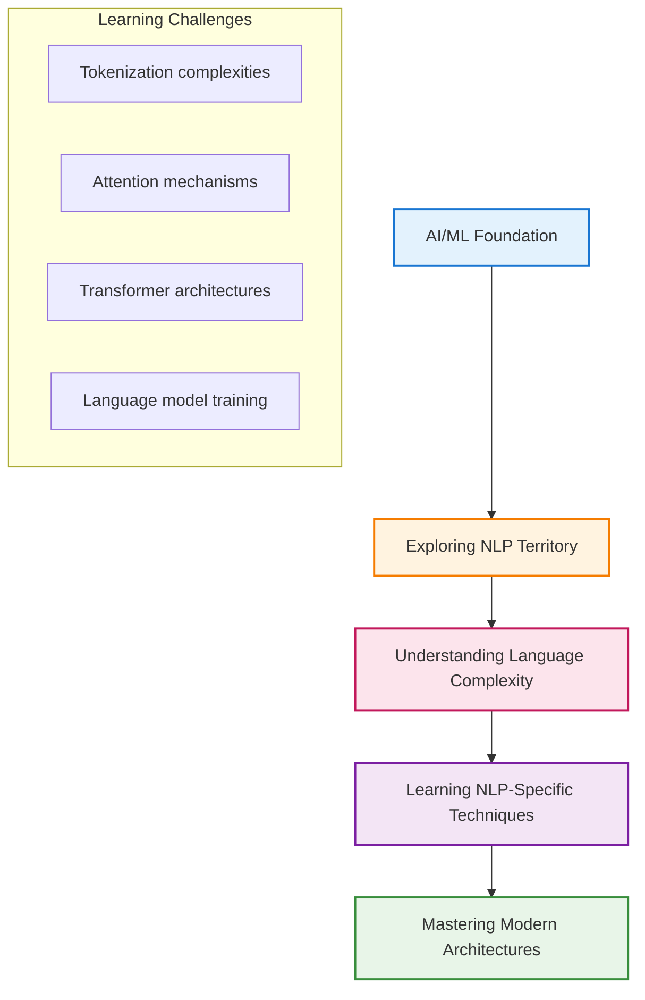

# Why This NLP Learning Journey?

This document explains the motivation and approach behind creating this comprehensive Natural Language Processing learning repository.

## Table of Contents

1. [My Background and Teaching Experience](#my-background-and-teaching-experience)
2. [Starting My NLP Learning Journey](#starting-my-nlp-learning-journey)
3. [The Challenge with Existing Resources](#the-challenge-with-existing-resources)
4. [A New Learning Approach with AI Agents](#a-new-learning-approach-with-ai-agents)
5. [This Repository as Personal Study Notes](#this-repository-as-personal-study-notes)
6. [Learning Philosophy and Methodology](#learning-philosophy-and-methodology)
7. [How This Repository is Different](#how-this-repository-is-different)
8. [My Hope for Fellow Learners](#my-hope-for-fellow-learners)
9. [Connect with Me](#connect-with-me)

## My Background and Teaching Experience

I am a lecturer at a university, specializing in Artificial Intelligence and Machine Learning education. My daily work involves:

- **Teaching AI/ML Fundamentals**: Helping students understand core concepts in artificial intelligence and machine learning
- **Curriculum Development**: Designing courses that bridge theoretical concepts with practical applications
- **Research Guidance**: Mentoring students in AI/ML research projects and applications
- **Industry Connections**: Staying current with AI/ML industry trends and bringing real-world insights to academia

This background has given me a deep appreciation for effective learning methodologies and the importance of clear, structured educational resources.

## Starting My NLP Learning Journey

Despite my expertise in AI/ML, Natural Language Processing represented a new frontier for me. Like many in the field, I found myself needing to:

The transition from general ML to NLP-specific challenges required a systematic approach to learning that matched my teaching methodology.

## The Challenge with Existing Resources

While there are many excellent NLP learning resources available, I encountered several challenges:

### Abundance Without Structure
- **Numerous Books**: Many comprehensive textbooks, but varying in depth and approach
- **YouTube Videos**: Countless tutorials, but inconsistent quality and progression
- **Online Courses**: Multiple platforms offering NLP courses with different methodologies
- **Research Papers**: Cutting-edge content, but often too advanced for systematic learning

### Mismatch with Learning Style
As an educator, I needed resources that:
- **Build Progressively**: Start from fundamentals and advance systematically
- **Include Practical Examples**: Combine theory with hands-on implementation
- **Provide Multiple Perspectives**: Explain concepts from different angles
- **Connect to Real Applications**: Link concepts to practical use cases

### The Academic Perspective Gap
Many resources are either:
- **Too Academic**: Heavy on theory without practical implementation
- **Too Practical**: Focus on tools without underlying mathematical foundations
- **Industry-Focused**: Assume extensive programming background without pedagogical structure

## A New Learning Approach with AI Agents

This is where my learning journey took an innovative turn. I decided to leverage AI agents as learning partners:

### Using Cursor AI
- **Code Generation**: Helping implement NLP algorithms from theoretical descriptions
- **Code Explanation**: Breaking down complex implementations into understandable components
- **Debugging Assistant**: Identifying and fixing issues in learning implementations
- **Alternative Approaches**: Suggesting different ways to implement the same concepts

### Collaborating with GitHub Copilot
- **Documentation Creation**: Assisting in writing clear, comprehensive explanations
- **Example Generation**: Creating relevant code examples for different concepts
- **Structure Organization**: Helping organize content in logical learning sequences
- **Best Practices**: Suggesting industry-standard approaches and patterns

### The AI-Assisted Learning Workflow

```mermaid
graph LR
    A[Concept Discovery] --> B[AI-Assisted Research]
    B --> C[Implementation with Cursor]
    C --> D[Documentation with Copilot]
    D --> E[Review and Refinement]
    E --> F[Integration into Repository]
    F --> A
    
    style A fill:#FFFFFF,stroke:#582C67,color:#333,stroke-width:2px
    style B fill:#582C67,stroke:#C60C30,color:#FFFFFF,stroke-width:2px
    style C fill:#C60C30,stroke:#582C67,color:#FFFFFF,stroke-width:2px
    style D fill:#582C67,stroke:#C60C30,color:#FFFFFF,stroke-width:2px
    style E fill:#C60C30,stroke:#582C67,color:#FFFFFF,stroke-width:2px
    style F fill:#FFFFFF,stroke:#582C67,color:#333,stroke-width:2px
```

This iterative approach ensures that:
- **Understanding is Deep**: AI helps explain complex concepts multiple ways until clear
- **Implementation is Correct**: Code examples are tested and verified
- **Documentation is Comprehensive**: Explanations are thorough and accessible
- **Learning is Efficient**: AI accelerates the research and implementation phases

## This Repository as Personal Study Notes

This repository represents my **personal NLP study notes** in digital form. Think of it as:

### A Digital Learning Journal
- **Progress Tracking**: Each commit represents a learning milestone
- **Concept Mapping**: Connections between different NLP concepts are explicitly documented
- **Implementation Archive**: All code examples are preserved for future reference
- **Reflection Space**: Documentation includes insights and "aha!" moments from the learning process

### Learning-by-Teaching Approach
As an educator, I learn best when I can teach others. This repository serves as:
- **Teaching Preparation**: Organizing concepts in a way that could be taught to students
- **Explanation Practice**: Articulating complex ideas in clear, accessible language
- **Example Development**: Creating practical examples that illustrate theoretical concepts
- **Assessment Creation**: Developing exercises and projects that test understanding

### Systematic Knowledge Building
Rather than scattered notes, this repository provides:
- **Structured Progression**: From basic text processing to advanced architectures
- **Cross-Referenced Content**: Links between related concepts across different topics
- **Comprehensive Coverage**: Both theoretical foundations and practical implementations
- **Continuous Updates**: Regular additions as learning progresses

## Learning Philosophy and Methodology

My approach to learning NLP is grounded in educational best practices:

### 1. **Progressive Complexity**
Start with fundamental concepts and build systematically toward advanced topics.

### 2. **Multi-Modal Learning**
Combine different learning approaches:
- **Mathematical Foundations**: Understanding the theoretical basis
- **Visual Representations**: Using diagrams and visualizations
- **Practical Implementation**: Hands-on coding and experimentation
- **Real-World Applications**: Connecting concepts to practical use cases

### 3. **Learning by Teaching**
Document everything as if teaching it to others, which deepens personal understanding.

### 4. **Iterative Refinement**
Continuously improve explanations and examples based on deeper understanding.

## How This Repository is Different

### 1. **Educator's Perspective**
- **Pedagogical Structure**: Content is organized for optimal learning progression
- **Clear Explanations**: Complex concepts are broken down into understandable components
- **Learning Objectives**: Each section has clear goals and outcomes
- **Assessment Integration**: Examples and exercises test understanding

### 2. **AI-Assisted Development**
- **Enhanced Explanations**: AI helps articulate concepts from multiple perspectives
- **Verified Implementations**: Code examples are AI-reviewed for correctness
- **Comprehensive Documentation**: AI assists in creating thorough documentation
- **Modern Approach**: Represents how learning happens in the AI era

### 3. **Practical Focus with Theoretical Grounding**
- **Mathematical Foundations**: Proper mathematical explanations for all concepts
- **Working Code**: All examples are functional and tested
- **Real-World Connections**: Links to practical applications and use cases
- **Progressive Complexity**: Builds from basics to advanced topics systematically

### 4. **Transparency in Learning Process**
- **Learning Journey Documentation**: Shows the progression of understanding
- **Mistake Learning**: Documents common pitfalls and how to avoid them
- **Resource Integration**: Combines insights from multiple sources
- **Continuous Evolution**: Regular updates as understanding deepens

## My Hope for Fellow Learners

While this repository began as my personal study notes, I hope others find it useful for several reasons:

### For Students
- **Structured Learning Path**: Clear progression from fundamentals to advanced topics
- **Practical Examples**: Working code that demonstrates theoretical concepts
- **Educational Perspective**: Content designed with learning principles in mind

### For Educators
- **Teaching Resources**: Materials that can be adapted for classroom use
- **Curriculum Ideas**: Structure that could inform course design
- **Assessment Examples**: Projects and exercises for student evaluation

### For Practitioners
- **Implementation Reference**: Practical code examples for common NLP tasks
- **Concept Refresher**: Clear explanations for foundational concepts
- **Modern Approaches**: Integration of latest techniques and best practices

### For Fellow AI Enthusiasts
- **Learning Methodology**: Example of how to approach learning complex technical topics
- **AI-Assisted Learning**: Demonstration of how AI tools can enhance education
- **Community Resource**: Shared knowledge that benefits the entire community

## Connect with Me

I believe learning is most effective when it's a collaborative journey. I'd love to connect with fellow learners, educators, and practitioners:

### Professional Connections
- **LinkedIn**: [https://www.linkedin.com/in/nguyenvuhung/](https://www.linkedin.com/in/nguyenvuhung/)
- **Personal Website**: [https://vuhung16au.github.io/](https://vuhung16au.github.io/)
- **This Repository**: [https://github.com/vuhung16au/nlp-learning-journey](https://github.com/vuhung16au/nlp-learning-journey)

### Why Connect?
- **Share Learning Experiences**: Exchange insights and learning strategies
- **Collaborate on Content**: Suggest improvements or additional topics
- **Discuss Applications**: Share real-world NLP use cases and challenges
- **Build Community**: Create a network of NLP learners and practitioners

### What I'd Love to Discuss
- **Teaching Methodologies**: How to effectively teach NLP concepts
- **Learning Strategies**: Different approaches to mastering complex topics
- **Practical Applications**: Real-world NLP implementations and challenges
- **AI-Assisted Learning**: How AI tools are changing education and learning

---

**Happy Learning!** 🎓

*This repository represents more than just study notes—it's a testament to the power of systematic learning, the value of AI-assisted education, and the importance of sharing knowledge with the community. Whether you're just starting your NLP journey or looking to deepen your understanding, I hope you find these resources valuable and inspiring.*

*Remember: Learning is a journey, not a destination. Every concept mastered, every implementation completed, and every connection made brings us closer to understanding the beautiful complexity of human language and how machines can learn to understand it too.*